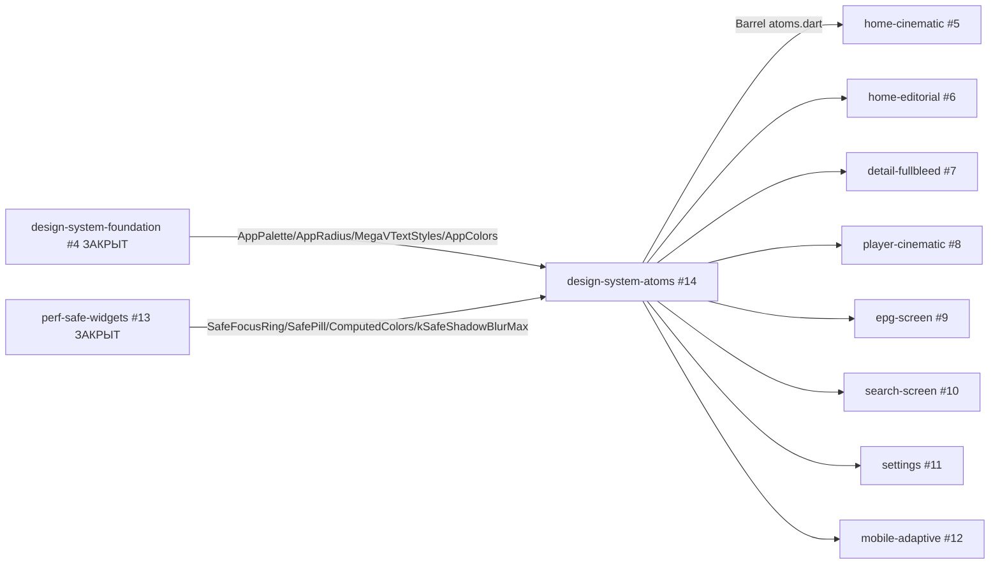

# Design Document — design-system-atoms

## Overview

`design-system-atoms` создаёт `lib/core/ui/atoms/` с 13 переиспользуемых widget'ов из design handoff. Атомы pure-presentation (без bizz logic), потребляют foundation (#4) + perf-safe primitives (#13). Также рефакторит 3 existing widgets в backward-compat alignment с новым API. Все 65 закрытых тестов продолжают зелёные. Пакет — **последний foundation спек**; Wave 3 screen redesigns (#5/#7/#8/#11) могут стартовать сразу после закрытия #14.

### Goals

- 13 atoms в leaf-package `lib/core/ui/atoms/` с barrel export.
- Backward-compat refactor 3 existing widgets (`glass_button`, `hero_badges`, `channel_quality_badge`) — closed specs продолжают работать без модификаций.
- Все atoms используют `SafeFocusRing`/`SafePill`/`ComputedColors` и т.д. вместо raw blur/blend.
- Tests: ≥1 widget test per atom + variants для multi-variant atoms.

### Non-Goals

- Screen-level layouts (#5-#12 owners).
- Theming infrastructure (#4 ЗАКРЫТ).
- Perf-safe primitives (#13 ЗАКРЫТ).
- `_card_poster.dart` refactor — closed spec ownership; skip per Req 15.3.
- Native player engines, providers, models, API, routing.
- Mobile-specific atom variants (#12 owner).
- Mandatory golden tests (Req 17.7 leaves them optional).

## Boundary Commitments

### This Spec Owns

- `lib/core/ui/atoms/` directory (NEW): 13 atom files + 1 barrel.
- Refactor: `lib/features/home/widgets/glass_button.dart` (proxy to `MvButton.ghost`).
- Refactor: `lib/features/home/widgets/hero_badges.dart` (compose `Chip` + `MMLogo`).
- Refactor: `lib/core/ui/channel_quality_badge.dart` (use `Chip` underneath).
- `test/core/ui/atoms/` directory — widget tests for each atom.

### Out of Boundary

- `lib/features/home/widgets/_card_poster.dart` — closed spec, NOT refactored.
- `lib/features/`, `lib/core/player/`, `lib/core/api/`, `lib/core/playlist/`, `lib/core/epg/` — read-only.
- `lib/core/theme/`, `lib/core/perf/` — read-only (foundation deps).
- `pubspec.yaml` — NO new packages.

### Allowed Dependencies

- Upstream: `lib/core/theme/*` (AppPalette, AppRadius, AppColors, MegaVTextStyles).
- Upstream: `lib/core/perf/perf_safe_widgets.dart` (SafePill, SafeFocusRing, etc.).
- Upstream: `lib/core/theme/computed_colors.dart` (ComputedColors).
- Flutter SDK only.

### Revalidation Triggers

- Any new token added/removed/renamed in `AppPalette` — atoms reading those tokens revalidate.
- Any new perf-safe primitive added in `lib/core/perf/` — atoms may want to compose it.
- Any new atom added later — must extend the barrel `atoms.dart`.

## Architecture

### Existing Architecture Analysis

The codebase has clear precedents for leaf-packages from closed specs:
- `lib/core/perf/perf_safe_widgets.dart` (#13) — single-file leaf, 4 widgets + helper + constant in 350 lines.
- `lib/core/theme/computed_colors.dart` (#13) — single-purpose data class with palette factory.
- `lib/features/home/widgets/_grid_tokens.dart` (closed `home-grid-optimization`) — pure-token leaf.

This spec adopts the same pattern: leaf-package + plain widgets + barrel export. No Riverpod, no async, no global state.

### Architecture Pattern & Boundary Map



**Pattern**: leaf-package presentation widgets, no global state.
**Domain boundary**: `lib/core/ui/atoms/` is the new leaf. `lib/features/home/widgets/{glass_button,hero_badges,channel_quality_badge}.dart` get internal-only refactor (public API preserved).

### Technology Stack

| Layer | Choice | Role | Notes |
|---|---|---|---|
| UI primitives | Flutter widgets | All 13 atoms | Pure SDK; no third-party. |
| Theming | `AppPalette` (#4) | Color sourcing | Read-only consumer. |
| Typography | `MegaVTextStyles` (#4) | Font + size + weight | Via `Theme.of(context).megavText`. |
| Animations | `AnimationController` + `AnimatedBuilder` (Chip.live pulse, GenreTabs underline, MvTrack progress) | Lightweight, RepaintBoundary-isolated | No new animation packages. |
| Asset bundle | None new | — | grain_overlay.png already shipped via #13. |

## File Structure Plan

### New files

```
megav_iptv/
├─ lib/
│  └─ core/
│     └─ ui/
│        └─ atoms/
│           ├─ atoms.dart                  [NEW] barrel export
│           ├─ brand.dart                  [NEW] Brand
│           ├─ status_bar.dart             [NEW] StatusBar
│           ├─ chip.dart                   [NEW] Chip + ChipVariant enum (live pulse animation lives here)
│           ├─ poster.dart                 [NEW] Poster + PosterOrientation enum
│           ├─ mm_logo.dart                [NEW] MMLogo
│           ├─ genre_tabs.dart             [NEW] GenreTabs (underline-on-active)
│           ├─ section_title.dart          [NEW] SectionTitle
│           ├─ remote_hint.dart            [NEW] RemoteHint (composes MvKey)
│           ├─ mv_button.dart              [NEW] MvButton + MvButtonSize enum (3 variants via named ctors)
│           ├─ mv_icon_button.dart         [NEW] MvIconButton
│           ├─ mv_track.dart               [NEW] MvTrack (progress bar)
│           ├─ mv_strip.dart               [NEW] MvStrip (filmstrip)
│           └─ mv_key.dart                 [NEW] MvKey (single keycap)
└─ test/
   └─ core/
      └─ ui/
         └─ atoms/
            ├─ chip_test.dart              [NEW] 5 variants
            ├─ poster_test.dart            [NEW] hideText / progress / orientation
            ├─ mv_button_test.dart         [NEW] 3 variants × 2 sizes
            ├─ mv_track_test.dart          [NEW] progress=0.5 fill check
            └─ atoms_smoke_test.dart       [NEW] 1 smoke test per atom (renders without crash)
```

Total: 14 new lib files + 5 new test files.

### Modified files

```
megav_iptv/
└─ lib/
   └─ features/
      └─ home/
         └─ widgets/
            ├─ glass_button.dart           [MODIFIED] Internal build → MvButton.ghost(...)
            ├─ hero_badges.dart            [MODIFIED] Internal build → Chip + MMLogo composition
            └─ channel_quality_badge.dart  [MODIFIED] Internal build → Chip atom
```

Total: 3 modified files.

NOT modified: `_card_poster.dart` (closed spec), `pubspec.yaml`, `app_palette.dart`, `app_radius.dart`, `app_colors.dart`, `megav_text_styles.dart`, `app_theme.dart`, `theme_provider.dart`, `app_palettes.dart`, `perf_safe_widgets.dart`, `computed_colors.dart`.

## Components and Interfaces

Each atom is documented with public API + key design decisions. Implementation details (full builds) deferred to implementer per task — atom shells follow the established pattern from `perf_safe_widgets.dart`.

### 1. `Brand` atom

```dart
class Brand extends StatelessWidget {
  const Brand({
    super.key,
    this.size = 32,
    this.showWordmark = true,
  });
  final double size;
  final bool showWordmark;
}
```
Renders gradient square mark + optional wordmark using `MegaVTextStyles.displayLarge` font. Gradient from `AppPalette.accent` → `AppPalette.accentGlow`. Maps to Req 2.

### 2. `StatusBar` atom

```dart
class StatusBar extends StatelessWidget {
  const StatusBar({super.key, this.flag, this.city, this.tempC, this.time});
  final String? flag;
  final String? city;
  final int? tempC;
  final String? time;
}
```
Pill-shaped row of provided fields, omits null ones. Background `AppPalette.surface2`, radius `AppRadius.brSm`. Maps to Req 3.

### 3. `Chip` atom (with `ChipVariant` enum)

```dart
enum ChipVariant { live, brand, gold, ghost, defaultVariant }

class Chip extends StatefulWidget {
  const Chip({
    super.key,
    required this.label,
    this.variant = ChipVariant.defaultVariant,
    this.icon,
  });
  final String label;
  final ChipVariant variant;
  final Widget? icon;

  @override
  State<Chip> createState() => _ChipState();
}
```

`live` variant uses `_ChipState` with `AnimationController` driving an opacity pulse on a 6-px dot. The pulse + dot together wrapped in `RepaintBoundary` to isolate (Req 4.3). All other variants are stateless-equivalent (still implemented as StatefulWidget for shape consistency, but skip controller init when variant != live).

Background mapping:
- `live` → `AppPalette.live` + animated dot
- `brand` → `AppPalette.accentSoft` + accent text
- `gold` → `AppPalette.goldSoft` + gold text
- `ghost` → transparent + `AppPalette.textDim`
- `defaultVariant` → `AppPalette.surface2` + `AppPalette.text`

Maps to Req 4.

### 4. `Poster` atom (with `PosterOrientation` enum)

```dart
enum PosterOrientation { landscape, portrait }

class Poster extends StatelessWidget {
  const Poster({
    super.key,
    required this.image,
    this.orientation = PosterOrientation.landscape,
    this.title,
    this.subtitle,
    this.hideText = false,
    this.badgeTL,
    this.badgeTR,
    this.progress,
    this.isFocused = false,
  });
  final ImageProvider image;
  final PosterOrientation orientation;
  final String? title;
  final String? subtitle;
  final bool hideText;
  final Widget? badgeTL;
  final Widget? badgeTR;
  final double? progress;
  final bool isFocused;
}
```

Build wraps content in `SafeFocusRing(isFocused: isFocused, child: ...)`. Progress bar at bottom uses `MvTrack` atom internally if progress != null. Aspect ratio via `AspectRatio(aspectRatio: orientation == landscape ? 16/9 : 2/3, ...)`. Maps to Req 5.

### 5. `MMLogo` atom

```dart
class MMLogo extends StatelessWidget {
  const MMLogo({super.key, this.size = 38, this.background});
  final double size;
  final Color? background;
}
```
Square colored container with «M» text centered. Maps to Req 6.

### 6. `GenreTabs` atom

```dart
class GenreTabs extends StatefulWidget {
  const GenreTabs({
    super.key,
    required this.labels,
    required this.activeIndex,
    this.onTabChanged,
  });
  final List<String> labels;
  final int activeIndex;
  final ValueChanged<int>? onTabChanged;
}
```

Horizontal `Row` of label widgets; underline is `AnimatedPositioned` on the active index, 150ms transition, `Curves.fastOutSlowIn`. Maps to Req 7.

### 7. `SectionTitle` atom

```dart
class SectionTitle extends StatelessWidget {
  const SectionTitle({
    super.key,
    required this.title,
    this.emphasis,
    this.count,
    this.onMore,
  });
  final String title;
  final String? emphasis;
  final int? count;
  final VoidCallback? onMore;
}
```
Maps to Req 8. Italic emphasis uses `MegaVTextStyles.displayItalic` style.

### 8. `RemoteHint` atom

```dart
class RemoteHint extends StatelessWidget {
  const RemoteHint({
    super.key,
    required this.hints,
    this.alignment = MainAxisAlignment.start,
  });
  final List<RemoteHintEntry> hints;
  final MainAxisAlignment alignment;
}

class RemoteHintEntry {
  const RemoteHintEntry({required this.glyph, required this.label});
  final String glyph; // or Widget if needed; spec uses String for emoji/text keycaps
  final String label;
}
```

Composes `MvKey` for each entry. Maps to Req 9.

### 9. `MvButton` atom (3 variants + sizes)

```dart
enum MvButtonSize { small, medium }

class MvButton extends StatelessWidget {
  const MvButton.primary({
    super.key,
    required this.label,
    required this.onPressed,
    this.icon,
    this.size = MvButtonSize.medium,
    this.isFocused = false,
  }) : _variant = _MvButtonVariant.primary;

  const MvButton.ghost({
    super.key,
    required this.label,
    required this.onPressed,
    this.icon,
    this.size = MvButtonSize.medium,
    this.isFocused = false,
  }) : _variant = _MvButtonVariant.ghost;

  const MvButton.accent({
    super.key,
    required this.label,
    required this.onPressed,
    this.icon,
    this.size = MvButtonSize.medium,
    this.isFocused = false,
  }) : _variant = _MvButtonVariant.accent;

  final String label;
  final VoidCallback? onPressed;
  final Widget? icon;
  final MvButtonSize size;
  final bool isFocused;
  final _MvButtonVariant _variant;
}
```

Wraps content in `SafeFocusRing` when `isFocused`. Hover/pressed colors come from `ComputedColors.from(palette).textTintAccent` (Req 10.8) — pre-computed, no `Color.lerp` in build. Sizes: small (height 32 px), medium (height 44 px).

Maps to Req 10.

### 10. `MvIconButton` atom

```dart
class MvIconButton extends StatelessWidget {
  const MvIconButton({
    super.key,
    required this.icon,
    required this.onPressed,
    this.size = 38,
    this.isFocused = false,
  });
  final Widget icon;
  final VoidCallback onPressed;
  final double size;
  final bool isFocused;
}
```
Square with rounded corners (`AppRadius.brSm`) + center icon + `SafeFocusRing` when focused. Maps to Req 11.

### 11. `MvTrack` atom

```dart
class MvTrack extends StatelessWidget {
  const MvTrack({
    super.key,
    required this.progress,
    this.showKnob = false,
    this.height = 4,
  });
  final double progress; // 0.0..1.0, clamped on build
  final bool showKnob;
  final double height;
}
```

Build:
```dart
final clamped = progress.clamp(0.0, 1.0);
return SizedBox(
  height: height,
  child: Stack(children: [
    // Background track
    Positioned.fill(child: ColoredBox(color: AppColors.surface)),
    // Animated fill
    AnimatedFractionallySizedBox(
      duration: const Duration(milliseconds: 250),
      curve: Curves.fastOutSlowIn,
      alignment: Alignment.centerLeft,
      widthFactor: clamped,
      child: ColoredBox(color: AppColors.primary),
    ),
    // Optional knob
    if (showKnob) ...[/* small filled circle at end */],
  ]),
);
```

Animation is paint-only — `AnimatedFractionallySizedBox` updates child width via `widthFactor`, no relayout of siblings. Maps to Req 12.

### 12. `MvStrip` atom

```dart
class MvStrip extends StatelessWidget {
  const MvStrip({
    super.key,
    this.frameCount = 7,
    this.tileWidth = 80,
  });
  final int frameCount;
  final double tileWidth;
}
```
Decorative `Row` of frame-shaped `Container`s with sprocket-hole notches (drawn via `BoxDecoration` border + small dark dots top/bottom). No interaction. Maps to Req 13.

### 13. `MvKey` atom

```dart
class MvKey extends StatelessWidget {
  const MvKey({super.key, required this.glyph});
  final String glyph;
}
```
Compact rounded pill (height ~26 px) with `AppPalette.surface2` background, `AppRadius.brXs` rounding, `MegaVTextStyles.metaMono` text. Maps to Req 14.

### 14. Refactored existing widgets (backward-compat proxies)

#### `glass_button.dart` (refactored)

Verified actual public API (do NOT alter): `GlassButton({Key? key, required IconData icon, required VoidCallback onTap})` — это **icon-only** button с `Material + InkWell + 48×48 SizedBox`.

Refactor delegates internally to `MvIconButton` (the icon-only atom), NOT `MvButton.ghost`:

```dart
// Existing public API preserved verbatim.
import 'package:megav_iptv/core/ui/atoms/atoms.dart';

class GlassButton extends StatelessWidget {
  const GlassButton({super.key, required this.icon, required this.onTap});
  final IconData icon;
  final VoidCallback onTap;

  @override
  Widget build(BuildContext context) {
    return MvIconButton(
      icon: Icon(icon, size: 20, color: Colors.white.withValues(alpha: 0.50)),
      onPressed: onTap,
      size: 48,
    );
  }
}
```

`MvIconButton` provides `SafeFocusRing` + `AppRadius.brSm` rounding; visual parity is approximated. All call-sites passing `GlassButton(icon: Icons.X, onTap: () => ...)` continue to compile.

#### `hero_badges.dart` (refactored)

Verified actual public API (do NOT alter): `HeroBadge({Key? key, required String text, required Color color, Color? textColor, Color? borderColor, bool showPulse = false, IconData? icon})` — это **single configurable badge** widget с optional pulse и optional leading icon, НЕ row of badges.

Refactor maps:
- `showPulse: true` → `Chip(variant: ChipVariant.live, label: text, icon: icon != null ? Icon(icon) : null)`
- `showPulse: false` → `Chip(variant: ChipVariant.brand, label: text, icon: icon != null ? Icon(icon) : null)` (or `defaultVariant` depending on visual fit)

The legacy `color` / `textColor` / `borderColor` parameters become decorative no-ops in the refactored version since `Chip` derives all colors from the active palette per variant. **This is a deliberate visual drift** allowed under Req 2.2 carry-over from foundation #4 («negligible color drift introduced by the new design palette»). If callers depend on those exact colors, the refactor needs revisiting in a follow-up issue.

Public API preserved (constructor signature unchanged); colors derive from atom variant. Note: MMLogo is NOT involved in HeroBadge refactor.

#### `channel_quality_badge.dart` (refactored)

Verified actual public API (do NOT alter): `ChannelQualityBadge({Key? key, required ChannelStreamQuality quality, bool compact = false})` — резолвит quality enum в bg/fg/border colors via switch.

Replace internal build with `Chip(label: quality.label / 'UHD' / 'HD' / 'SD', variant: ChipVariant.brand)` (or `defaultVariant` per visual fit). The compact-mode size variation may need a `compact` parameter on `Chip` itself, OR the refactor preserves the compact branch using `Chip` with smaller padding via local `Container.padding` wrapper. Public API preserved.

#### `_card_poster.dart` (NOT refactored)

Closed spec ownership; out of boundary. Skip.

### 15. Barrel export

`lib/core/ui/atoms/atoms.dart`:
```dart
export 'brand.dart';
export 'chip.dart';
export 'genre_tabs.dart';
export 'mm_logo.dart';
export 'mv_button.dart';
export 'mv_icon_button.dart';
export 'mv_key.dart';
export 'mv_strip.dart';
export 'mv_track.dart';
export 'poster.dart';
export 'remote_hint.dart';
export 'section_title.dart';
export 'status_bar.dart';
```

Downstream consumer: `import 'package:megav_iptv/core/ui/atoms/atoms.dart';`. Maps to Req 1.

## Data Models

This spec is presentation-only — no data models beyond:
- `ChipVariant` enum (5 values).
- `PosterOrientation` enum (2 values).
- `MvButtonSize` enum (2 values).
- `RemoteHintEntry` immutable value class (2 fields).
- Internal: `_MvButtonVariant` private enum.

## Error Handling

| Failure mode | Component | Behavior |
|---|---|---|
| `Poster.image` fails to load | `Poster` | Image.asset/Network with errorBuilder fallback to `AppPalette.surface1` solid fill, no crash. |
| `Poster.progress` outside `[0, 1]` | `Poster` | Clamped via `MvTrack` internal clamping. |
| `MvTrack.progress` outside `[0, 1]` | `MvTrack` | Clamped on build via `progress.clamp(0.0, 1.0)`. |
| `Chip.icon` null | `Chip` | Icon slot omitted, label-only render. |
| `RemoteHint.hints` empty | `RemoteHint` | Renders empty Row, no crash. |
| Palette becomes null (impossible per types) | All | Compile error. |

## Testing Strategy

Per Req 17, derive tests from acceptance criteria:

### Widget tests

| ID  | Test | Maps to Req |
|-----|------|-------------|
| T-1..T-13 | Smoke test per atom: pumps with minimal required params, expects `find.byType(<Atom>)` finds 1, `tester.takeException()` is null | 17.1 |
| T-Chip-1..5 | Each `ChipVariant` renders with distinct background color (sample 5 variants, verify decoration.color differs) | 17.2 |
| T-MvButton-1..3 | Each `MvButton` variant renders with distinct fg/bg colors (sample 3 variants × 1 size) | 17.3 |
| T-Poster-1 | `hideText: true` → no Text widget in tree | 17.4 |
| T-Poster-2 | `progress: 0.6` → `MvTrack` widget present with widthFactor approximately 0.6 | 17.4 |
| T-MvTrack-1 | `progress: 0.5` → `AnimatedFractionallySizedBox.widthFactor` is 0.5 (within tolerance after pump) | 17.5 |

### Regression test

| Check | Method |
|---|---|
| All 65 existing tests pass | `flutter test` |
| `flutter analyze` returns 0 errors | mechanical |
| Refactored existing widgets still produce same call-site behavior | visual via existing widget tests (e.g., `cinema_row_fade_edge_test.dart`) |

### Out of scope (optional, recommended for Wave 3)

- Golden tests per atom (Req 17.7 marks optional).
- Performance bench on rtd2851a TV-box (operator-time).

## Requirements Traceability Matrix

| Requirement | Component / File covering it |
|---|---|
| 1.1, 1.2, 1.3 | `lib/core/ui/atoms/atoms.dart` barrel + 13 atom files |
| 2.1, 2.2, 2.3, 2.4 | `Brand` in `brand.dart` |
| 3.1, 3.2, 3.3, 3.4 | `StatusBar` in `status_bar.dart` |
| 4.1-4.8 | `Chip` + `ChipVariant` in `chip.dart` |
| 5.1-5.7 | `Poster` + `PosterOrientation` in `poster.dart` |
| 6.1-6.3 | `MMLogo` in `mm_logo.dart` |
| 7.1-7.4 | `GenreTabs` in `genre_tabs.dart` |
| 8.1-8.4 | `SectionTitle` in `section_title.dart` |
| 9.1-9.4 | `RemoteHint` + `RemoteHintEntry` in `remote_hint.dart` |
| 10.1-10.8 | `MvButton` + `MvButtonSize` in `mv_button.dart` |
| 11.1-11.4 | `MvIconButton` in `mv_icon_button.dart` |
| 12.1-12.4 | `MvTrack` in `mv_track.dart` |
| 13.1-13.3 | `MvStrip` in `mv_strip.dart` |
| 14.1-14.3 | `MvKey` in `mv_key.dart` |
| 15.1, 15.2, 15.4 | Refactored `glass_button.dart`, `hero_badges.dart`, `channel_quality_badge.dart` |
| 15.3 | Skipped per design decision (closed spec ownership) |
| 15.5 | Regression test in tasks.md (Req 17.6) |
| 16.1-16.6 | All atoms compose `SafeFocusRing` / `SafePill` / `ComputedColors`; pulse animations wrap in `RepaintBoundary`; MvTrack uses widthFactor not layout |
| 17.1-17.6 | Test files in `test/core/ui/atoms/` |
| 17.7 | Documented as optional; not enforced |
| 18.1, 18.2 | `pubspec.yaml` not modified; only built-in `flutter_test` used |

All 18 requirements covered.

## Risks and Mitigations

| Risk | Impact | Mitigation |
|---|---|---|
| `Chip.live` pulse runs forever even off-screen | CPU cycles wasted | RepaintBoundary isolation + steering note «do not place > 5 live Chips per screen» |
| Refactor of existing widgets changes pixel-output by 1-2 px | Regression test fails | Existing widget tests catch drift; fix atom to match (don't modify test) |
| `MvButton` size doesn't match design exactly | Visual inconsistency with mockup | Document sizes in atom doc; downstream specs request adjustments via follow-up issue |
| Atom barrel grows over time | Bloat / discoverability decay | Keep barrel alphabetical; deprecate-then-remove unused atoms via separate spec |
| 13 atoms × 1+ test = 14+ new test files | Suite bloat | Tests are cheap; current 65 → ~80-90 after; still <5s runtime |

## Supporting References

- Brief: `.kiro/specs/design-system-atoms/brief.md`
- Research log: `.kiro/specs/design-system-atoms/research.md`
- Foundation: `.kiro/specs/design-system-foundation/`
- Perf primitives: `.kiro/specs/perf-safe-widgets/`
- Steering: `.kiro/steering/flutter-tv-perf.md`
- GitHub issue: https://github.com/Romaxa55/MegaV-IPTV/issues/14
- Handoff source: `.kiro/design/megav-iptv-handoff/project/atoms.jsx`, `styles.css`
