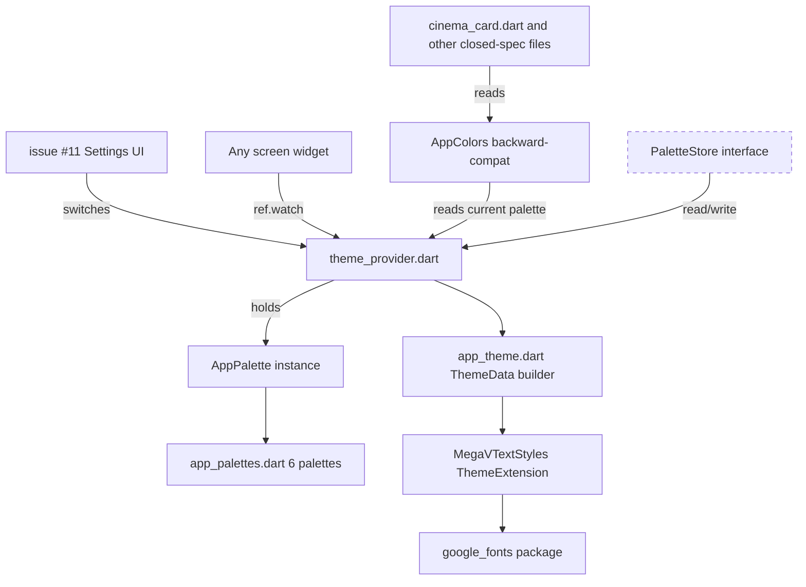
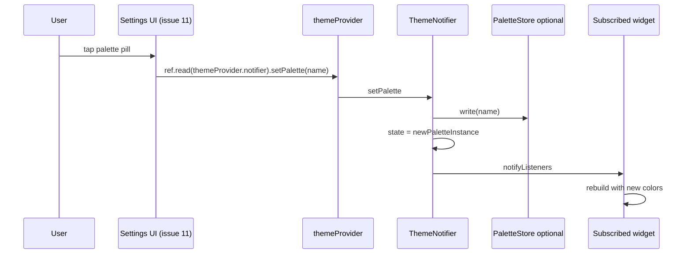

# Design Document — design-system-foundation

## Overview

**Purpose**: Заменить single-palette `static const AppColors` на runtime-swappable `AppPalette` instance + Riverpod-провайдер. Добавить `AppRadius` token-класс. Подключить шрифтовую пару `font-cinema` (Cormorant Garamond + Golos Text + JetBrains Mono) через `google_fonts` (уже в pubspec). Все changes infrastructure-only — никакой visible UI работы.

**Users**: Внутренний потребитель — все остальные screen-redesign спеки (issues #5-#12). Конечный пользователь не видит изменений до момента когда screen-spec применит новый theming.

**Impact**: Меняется `lib/core/theme/`. Существующие call-sites `AppColors.primary`/`background`/etc. продолжают работать через aliases. Все 30 текущих тестов проходят без модификаций. Нет изменений в `pubspec.yaml`.

### Goals
- Один источник истины для color tokens — `AppPalette` instance class.
- 6 готовых палитр с identical token surface: Plum, Ivory, **Noir Cobalt** (default), Pitch, Crimson Reel, Modern.
- Riverpod-провайдер `themeProvider` (StateNotifier-style) с публичным API для switching.
- `AppRadius` с 5 константами и helper-методами.
- Шрифтовая пара `font-cinema` для RU локали через `google_fonts`.
- Backward-compatible aliases в `app_colors.dart` для существующих call-sites.
- Optional persistence adapter (interface only — реальная impl отдельный спек).
- Тестовое покрытие ≥ 5 новых тестов.

### Non-Goals
- Применение нового theming в screen-widgets (это работа отдельных redesign-спеков).
- User-visible UI для смены палитры (issue #11 — Settings).
- Реальная persistence через `shared_preferences` (interface-only stub).
- Native player engines / providers / models / API.
- Mobile-specific theming (issue #12).
- Изменения в `_grid_tokens.dart` (закрыт `home-grid-optimization`).

## Boundary Commitments

### This Spec Owns
- `lib/core/theme/app_palette.dart` (NEW) — instance class `AppPalette` со всеми color tokens.
- `lib/core/theme/app_palettes.dart` (NEW) — 6 готовых палитр + `AppPaletteName` enum.
- `lib/core/theme/app_radius.dart` (NEW) — radius scale + helper methods.
- `lib/core/theme/theme_provider.dart` (NEW) — Riverpod provider + persistence adapter interface.
- `lib/core/theme/megav_text_styles.dart` (NEW) — `ThemeExtension` для шрифтов (display/italic/body/mono).
- `lib/core/theme/app_colors.dart` (REFACTOR) — backward-compat aliases поверх активной палитры.
- `lib/core/theme/app_theme.dart` (REFACTOR) — использовать активную палитру + `MegaVTextStyles` extension.
- `test/core/theme/app_palette_test.dart`, `app_radius_test.dart`, `theme_provider_test.dart` (NEW).

### Out of Boundary
- `lib/features/*` — никаких изменений.
- `lib/core/playlist/*`, `lib/core/api/*`, `lib/core/player/*` — read-only.
- `lib/features/home/widgets/_grid_tokens.dart` — закрыт `home-grid-optimization`, не трогаем (`gapDp`/`horizontalPaddingDp`/`focusBorderWidth` остаются как есть; design-bundle совпадает с этими values).
- Real `shared_preferences` integration — stub interface only.
- Settings UI для switching — issue #11.

### Allowed Dependencies
- Flutter SDK material/widgets/foundation.
- `flutter_riverpod` (уже подключён).
- `google_fonts` (уже подключён) — для Cormorant Garamond, Golos Text, JetBrains Mono.
- Никаких новых пакетов.

### Revalidation Triggers
- Changes к `AppPalette` token surface (добавление / удаление поля) — затрагивает все 6 палитр и все consumers.
- Changes к `AppPaletteName` enum — затрагивает Settings UI (issue #11).
- Changes к `AppRadius` constants — затрагивает screen-redesigns (#5-#12).
- Removal любого backward-compat alias в `app_colors.dart` — может сломать closed specs.
- Замена `font-cinema` на другую пару — потребует переэкспорт через `MegaVTextStyles`.

## Architecture

### Existing Architecture Analysis

Текущее `lib/core/theme/`:
- `app_colors.dart` — `class AppColors` с `static const Color` полями. ~30 fields. Один palette, hardcoded.
- `app_theme.dart` — `ThemeData` builder, `GoogleFonts.inter()` для всего, использует `AppColors.X` напрямую.

Существующие call-sites:
- `cinema_card.dart` — `AppColors.primary`, `AppColors.error`, `AppColors.cardBg`, `AppColors.textHint`.
- `cinema_row.dart` — `AppColors.background`, `AppColors.chipBg`, `AppColors.chipBorder`.
- `_card_poster.dart` — несколько ссылок.
- `home_screen.dart`, `player_screen.dart`, etc.

После рефакторинга все эти ссылки **продолжают работать** — `app_colors.dart` становится thin proxy, читающий активную палитру.

### Architecture Pattern & Boundary Map



**Architecture Integration**:
- Selected pattern: Riverpod StateNotifier для палитры + ThemeExtension для text styles + thin static-class proxy для backward-compat.
- Domain boundaries: `lib/core/theme/` владеет всем theming. `lib/features/*` только потребляет через provider или legacy aliases.
- Existing patterns preserved: Riverpod уже используется (`playerManagerProvider`, `currentChannelProvider`). `google_fonts` уже подключён.
- New components rationale:
  - `AppPalette` — instance class даёт runtime swap без code-gen.
  - `AppRadius` — single source of truth для радиусов всех screens.
  - `MegaVTextStyles ThemeExtension` — стандартный Flutter pattern для расширения `ThemeData`.
  - `PaletteStore` — interface-only stub, реальная impl откладывается.
- Steering compliance: `flutter-tv-perf.md` — никаких новых perf-violations. Theme switch — Riverpod rebuild только subscribed widgets.

### Technology Stack

| Layer | Choice / Version | Role | Notes |
|-------|------------------|------|-------|
| Flutter | SDK (текущая в проекте) | `ThemeData`, `ThemeExtension`, `BorderRadius` | без изменений |
| State management | `flutter_riverpod` (текущая) | `StateNotifierProvider<ThemeNotifier, AppPaletteName>` | без изменений |
| Fonts | `google_fonts` (текущая) | Cormorant Garamond + Golos Text + JetBrains Mono | без изменений |
| Persistence | (interface only) | `PaletteStore` abstract class | реальная impl follow-up |

## File Structure Plan

### Directory Structure

```
lib/core/theme/
├── app_palette.dart          # NEW: AppPalette instance class with all token fields
├── app_palettes.dart         # NEW: 6 named palettes + AppPaletteName enum
├── app_radius.dart           # NEW: AppRadius constants + BorderRadius helpers
├── theme_provider.dart       # NEW: ThemeNotifier + themeProvider + PaletteStore interface
├── megav_text_styles.dart    # NEW: MegaVTextStyles ThemeExtension
├── app_colors.dart           # REFACTOR: thin proxy → активная палитра
└── app_theme.dart            # REFACTOR: использует активную палитру + extension

test/core/theme/
├── app_palette_test.dart            # NEW: token surface invariant
├── app_palettes_test.dart           # NEW: 6 palettes complete + unique
├── app_radius_test.dart             # NEW: exact radius values
├── theme_provider_test.dart         # NEW: switch palette → state changes
└── app_colors_compat_test.dart      # NEW: legacy aliases not null
```

### Modified Files

- `lib/core/theme/app_colors.dart` — превращается в thin proxy: каждое `static const Color` field становится `static Color get fieldName => _activePalette.fieldName`. Активная палитра берётся из `themeProvider.read` (один раз, до первого build) или fallback Noir Cobalt при cold-start. **Сохраняет всю существующую публичную поверхность (30+ fields).**
- `lib/core/theme/app_theme.dart` — `ThemeData.appTheme()` принимает `WidgetRef` или `BuildContext`, читает активную палитру, регистрирует `MegaVTextStyles` ThemeExtension. Backward-compat: zero-arg version продолжает работать (использует Noir Cobalt fallback).

### New Files

Все NEW файлы перечислены выше; ниже описаны Public API в § Components.

## System Flows

### Theme switch flow



**Ключевые решения**:
- `ThemeNotifier` хранит `AppPaletteName` enum (легче serialize чем `AppPalette` instance).
- `state` в `Riverpod` — это `AppPaletteName`. Consumers через `ref.watch(themeProvider).resolve()` получают `AppPalette` instance.
- При cold-start `ThemeNotifier.build()` читает `PaletteStore.read()` (если адаптер передан), иначе Noir Cobalt.

## Requirements Traceability

| Requirement | Summary | Components | Interfaces |
|-------------|---------|------------|------------|
| 1.1, 1.2, 1.3 | Single source — `AppPalette` + provider + 6 palettes | `app_palette.dart`, `app_palettes.dart`, `theme_provider.dart` | `AppPalette` class, `themeProvider` |
| 1.4, 1.5 | Live switch + Noir Cobalt default | `theme_provider.dart` | `ThemeNotifier.setPalette()` |
| 2.1, 2.2, 2.3 | Backward compat | `app_colors.dart` (refactor) | static getters proxy to active palette |
| 3.1, 3.2, 3.3 | `AppRadius` scale | `app_radius.dart` | `AppRadius.xs/sm/md/lg/xl` + `brXxx` helpers |
| 4.1, 4.2, 4.3, 4.4, 4.5, 4.6 | Font-cinema | `megav_text_styles.dart`, `app_theme.dart` | `MegaVTextStyles ThemeExtension`, accessor on `Theme.of(context)` |
| 5.1, 5.2, 5.3, 5.4 | Switching API | `theme_provider.dart` | `ThemeNotifier.setPalette(AppPaletteName)`, `AppPaletteName.values` |
| 6.1, 6.2, 6.3, 6.4 | Persistence stub | `theme_provider.dart` | `abstract class PaletteStore { Future<AppPaletteName?> read(); Future<void> write(AppPaletteName); }` |
| 7.1, 7.2, 7.3 | Performance | All | `ref.watch` granular; aliases non-reactive; no perf-violations |
| 8.1, 8.2, 8.3, 8.4, 8.5 | Tests | `test/core/theme/` | unit + widget tests |

## Components and Interfaces

### `AppPalette` (instance class)

```dart
class AppPalette {
  final Color background;
  final Color backgroundWarm;
  final Color surface1;
  final Color surface2;
  final Color line;
  final Color lineStrong;
  final Color text;          // warm cream #F4F1E9 in Noir Cobalt
  final Color textDim;
  final Color textMute;
  final Color accent;
  final Color accentGlow;
  final Color accentSoft;
  final Color gold;
  final Color goldSoft;
  final Color live;
  final Color liveSoft;
  final Color good;
  // Backward-compat aliases (computed properties for compatibility)
  Color get primary => accent;
  Color get error => live;
  Color get textPrimary => text;
  Color get textSecondary => textDim;
  Color get textHint => textMute;
  Color get cardBg => surface1;
  Color get surface => surface2;
  // ... остальные legacy fields

  const AppPalette({
    required this.background,
    required this.backgroundWarm,
    // ... все required fields
  });
}
```

### `AppPaletteName` enum + `app_palettes.dart`

```dart
enum AppPaletteName {
  plum,
  ivory,
  noirCobalt,
  pitch,
  crimsonReel,
  modern,
}

extension AppPaletteResolver on AppPaletteName {
  AppPalette resolve() {
    switch (this) {
      case AppPaletteName.noirCobalt: return _noirCobalt;
      case AppPaletteName.crimsonReel: return _crimsonReel;
      // ... остальные
    }
  }
}

const AppPalette _noirCobalt = AppPalette(
  background: Color(0xFF06060A),
  backgroundWarm: Color(0xFF0A0809),
  surface1: Color(0xFF0F0F14),
  surface2: Color(0xFF15151C),
  line: Color(0x14FFF0DC),         // rgba(255,240,220,0.08)
  lineStrong: Color(0x29FFF0DC),
  text: Color(0xFFF4F1E9),
  textDim: Color(0x9EF4F1E9),      // 0.62 alpha
  textMute: Color(0x61F4F1E9),     // 0.38 alpha
  accent: Color(0xFF6E56F7),
  accentGlow: Color(0x736E56F7),   // 0.45 alpha
  accentSoft: Color(0x296E56F7),   // 0.16 alpha
  gold: Color(0xFFE8B96A),
  goldSoft: Color(0x29E8B96A),
  live: Color(0xFFFF3B5C),
  liveSoft: Color(0x2EFF3B5C),     // 0.18 alpha
  good: Color(0xFF22D3A8),
);

// _crimsonReel, _plum, _ivory, _pitch, _modern определяются согласно themes.css
```

### `AppRadius`

```dart
abstract class AppRadius {
  static const double xs = 6;
  static const double sm = 10;
  static const double md = 14;
  static const double lg = 20;
  static const double xl = 28;

  static const BorderRadius brXs = BorderRadius.all(Radius.circular(xs));
  static const BorderRadius brSm = BorderRadius.all(Radius.circular(sm));
  static const BorderRadius brMd = BorderRadius.all(Radius.circular(md));
  static const BorderRadius brLg = BorderRadius.all(Radius.circular(lg));
  static const BorderRadius brXl = BorderRadius.all(Radius.circular(xl));
}
```

### `ThemeNotifier` + `themeProvider`

```dart
abstract class PaletteStore {
  Future<AppPaletteName?> read();
  Future<void> write(AppPaletteName name);
}

class ThemeNotifier extends Notifier<AppPaletteName> {
  PaletteStore? _store;

  ThemeNotifier({PaletteStore? store}) : _store = store;

  @override
  AppPaletteName build() {
    // Cold-start: read from store, fallback to noirCobalt
    if (_store != null) {
      _store!.read().then((value) {
        if (value != null) state = value;
      });
    }
    return AppPaletteName.noirCobalt;
  }

  Future<void> setPalette(AppPaletteName name) async {
    state = name;
    await _store?.write(name);
  }
}

final themeProvider = NotifierProvider<ThemeNotifier, AppPaletteName>(
  () => ThemeNotifier(),
);

extension ThemeProviderResolve on AppPaletteName {
  AppPalette get palette => resolve();
}
```

### `MegaVTextStyles` ThemeExtension

```dart
class MegaVTextStyles extends ThemeExtension<MegaVTextStyles> {
  final TextStyle displayItalic;     // Cormorant Garamond, italic, 96px
  final TextStyle displayLarge;      // Cormorant Garamond, regular, 56px
  final TextStyle bodyDefault;       // Golos Text, 14-16px
  final TextStyle bodyDim;           // Golos Text, 14-16px, dim color
  final TextStyle metaMono;          // JetBrains Mono, 10-12px, uppercase, letter-spacing

  const MegaVTextStyles({
    required this.displayItalic,
    required this.displayLarge,
    required this.bodyDefault,
    required this.bodyDim,
    required this.metaMono,
  });

  factory MegaVTextStyles.cinema(AppPalette palette) {
    return MegaVTextStyles(
      displayItalic: GoogleFonts.cormorantGaramond(
        fontStyle: FontStyle.italic, fontWeight: FontWeight.w400,
        color: palette.text, fontSize: 96,
      ),
      // ... остальные
    );
  }

  @override
  ThemeExtension<MegaVTextStyles> copyWith({...}) { ... }

  @override
  ThemeExtension<MegaVTextStyles> lerp(...) { ... }
}

extension MegaVThemeAccess on ThemeData {
  MegaVTextStyles get megavText => extension<MegaVTextStyles>()!;
}
```

### `AppColors` (refactored — backward compat)

```dart
class AppColors {
  AppColors._();

  // Active palette source — read once at first access, fallback noirCobalt.
  static AppPalette _resolveActive() {
    // If Riverpod container is ready, read; else fallback.
    // Since `AppColors` static getters can be called outside widget context
    // (e.g., from utility code), we keep a thin static reference.
    return _activePalette ?? AppPaletteName.noirCobalt.resolve();
  }

  static AppPalette? _activePalette;
  static void setActivePalette(AppPalette p) => _activePalette = p;

  static Color get primary => _resolveActive().accent;
  static Color get background => _resolveActive().background;
  static Color get error => _resolveActive().live;
  static Color get textPrimary => _resolveActive().text;
  static Color get textSecondary => _resolveActive().textDim;
  static Color get textHint => _resolveActive().textMute;
  static Color get cardBg => _resolveActive().surface1;
  static Color get surface => _resolveActive().surface2;
  static Color get chipBg => _resolveActive().surface2;
  static Color get chipBorder => _resolveActive().line;
  // ... все остальные ~25 legacy aliases
}
```

**Sync mechanism**: `MaterialApp.builder` (или равнозначный hook в `app_theme.dart`) вызывает `AppColors.setActivePalette(...)` при каждом ребилде theme. Так `AppColors.X` всегда возвращает текущую палитру даже если consumer не использует Riverpod.

## Data Models

`AppPalette`, `AppPaletteName`, `MegaVTextStyles` — все pure data, no behavior. См. § Components above.

## Error Handling

- `PaletteStore.read()` returns `null` если saved name отсутствует или is invalid — fallback noirCobalt.
- `PaletteStore.read()` throws — caught silently, fallback noirCobalt.
- Unknown `AppPaletteName` value (impossible если enum) — fallback noirCobalt.

## Testing Strategy

### Unit Tests

- **`app_palette_test.dart`**: assert `AppPalette` const constructor compiles with all required fields.
- **`app_palettes_test.dart`**: for each of 6 `AppPaletteName.values`, assert `resolve()` returns non-null `AppPalette` with non-null token fields.
- **`app_radius_test.dart`**: assert `xs/sm/md/lg/xl == 6/10/14/20/28`. Assert `brXs.topLeft.x == 6`, etc.

### Widget Tests

- **`theme_provider_test.dart`**: pump `Consumer<themeProvider>`, assert default state is `noirCobalt`. Switch via `setPalette(crimsonReel)`, assert next pump shows new palette colors.
- **`app_colors_compat_test.dart`**: assert `AppColors.primary != null`, `AppColors.background != null`, etc. for all legacy aliases.

### Regression Tests

Все 30 существующих тестов должны проходить без модификаций.

## Performance & Scalability

- Theme switch — single Riverpod `state =` assignment + `notifyListeners`. О(N consumers). На typical screen ~5-10 consumers.
- `AppColors` static getter overhead — один conditional + field access. Pico-second.
- No `BackdropFilter`, no `BoxShadow.blurRadius > 12`, no `ShaderMask` (steering compliance).
- `font-cinema` через `google_fonts`: первая загрузка fetches шрифт async, subsequent — cached. Network cost only on first launch. Locally bundled assets — отдельный спек follow-up.

## Migration Strategy

1. Wave 1 commit (atomic): new files + refactor `app_colors.dart` + refactor `app_theme.dart` + tests.
2. Дальнейшие screen-redesign спеки (Wave 2-6) импортируют новые abstractions через `ref.watch(themeProvider).palette` или `Theme.of(context).megavText`.
3. Closed specs (`home-grid-*`, `player-overlay-state-machine`) **не переписываются** — продолжают использовать `AppColors.X` aliases.

Rollback strategy: один git revert.
