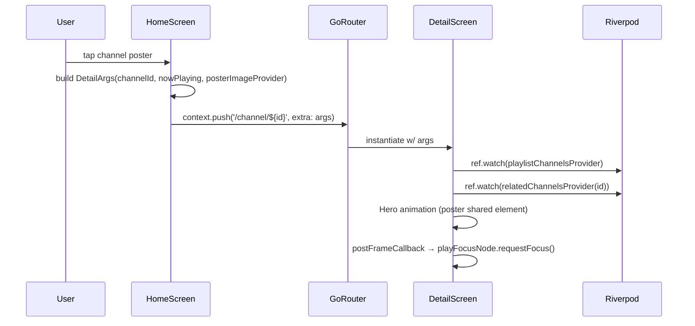
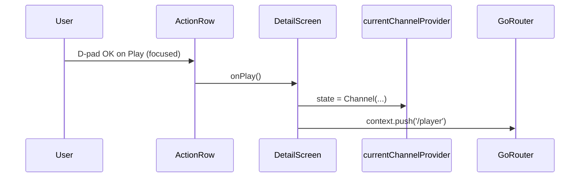
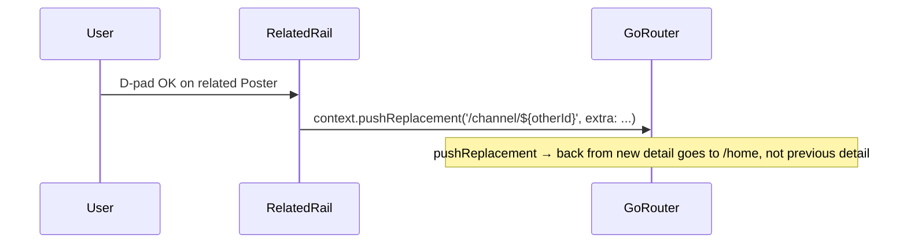

# Design Document — detail-screen-fullbleed

## Overview

`detail-screen-fullbleed` создаёт **новый промежуточный TV-экран** между home и player, реализующий design-handoff Variant A (Full-bleed). Экран — pure presentation поверх существующих провайдеров (`Channel`, `NowPlayingItem`, EPG), без новых API-вызовов и без модификаций data-layer. Композируется из atoms (`Poster`, `MvButton`, `Chip`, `SectionTitle`, `MvIconButton`, `MvTrack`) и perf-safe primitives (`SafeBackdrop`, `SafeFocusRing`, `combinedHeroGradient`). Все правила `flutter-tv-perf.md` соблюдаются: 0 `BackdropFilter`, 0 `ShaderMask`, ≤1 stacked gradient над hero, `Transform.scale` для focus, `RepaintBoundary` вокруг любого `StreamBuilder`. Hero shared-element transition — стандартный `Hero` widget Flutter без custom transitions.

### Goals

- Один новый экран `lib/features/detail/detail_screen.dart` + 5 widget-композитов в `lib/features/detail/widgets/`.
- Один новый route `/channel/:id` в `lib/app.dart` (3-5 строк изменений).
- Минимальный patch в `home_screen.dart`: заменить 2 call-site `context.push('/player')` на `context.push('/channel/${id}')` + обернуть постер в `Hero`.
- Hero shared-element home → detail работает без визуального jank.
- D-pad focus: initial на Play, arrowDown в related rail, Back возвращает на home.
- Все atoms используются через barrel; ноль reimplementations.
- 4 widget-теста + 1 static-audit + regression ≥65 тестов.

### Non-Goals

- Variants B (Split) и C (Minimal) — пользователь отверг.
- Новые fetches данных — detail только потребляет то, что home уже загрузил.
- Trailer player, full EPG screen, search-by-cast, share dialog — visual-only stubs.
- Mobile layout — issue #12 ownership.
- Custom `PageRouteBuilder` transition — стандартный go_router transition + `Hero` достаточно.
- Modify closed specs (`home-grid-*`, `player-overlay-state-machine`) — read-only зависимости.
- Avatar photo loading — gradient fallback по индексу единственный режим.
- Add new packages в `pubspec.yaml`.

## Boundary Commitments

### This Spec Owns

- `lib/features/detail/` directory (NEW):
  - `detail_screen.dart` — root widget, layout-only Stack.
  - `widgets/hero_meta.dart` — title + meta row + synopsis.
  - `widgets/action_row.dart` — Play/Favorite/Trailer/Share/EPG buttons row.
  - `widgets/cast_avatars.dart` — gradient-fallback avatars + names.
  - `widgets/related_rail.dart` — horizontal Poster ListView.
  - `widgets/detail_breadcrumb.dart` — back button + breadcrumb trail.
  - `providers/detail_arguments.dart` — `DetailArgs` data class.
  - `providers/detail_data_provider.dart` — derived providers (cast list stub, related siblings) reading from existing home providers.
- `test/features/detail/` directory (NEW): 4 widget tests + 1 static-audit test.
- One route entry в `lib/app.dart` (`GoRoute('/channel/:id', ...)`), inserted между `/home` и `/player`.
- Two call-site replacements в `lib/features/home/home_screen.dart` (lines 237, 249).
- One `Hero` wrapper в `_card_poster.dart` (или эквивалент), preserving visuals.

### Out of Boundary

- Closed specs: `home-grid-optimization`, `home-grid-visual-polish`, `player-overlay-state-machine` — read-only.
- `lib/features/player/`, `lib/features/settings/` — untouched.
- `lib/core/api/`, `lib/core/playlist/`, `lib/core/epg/`, `lib/core/player/` — read-only.
- `lib/core/theme/`, `lib/core/perf/`, `lib/core/ui/atoms/` — read-only consumer.
- `pubspec.yaml` — no changes.

### Allowed Dependencies

- Upstream: `package:megav_iptv/core/ui/atoms/atoms.dart` (barrel — `Poster`, `MvButton`, `Chip`, `SectionTitle`, `MvIconButton`, `MvTrack`).
- **Import discipline**: Files importing both `package:flutter/material.dart` and the atoms barrel MUST use `import 'package:flutter/material.dart' hide Chip;` to avoid shadow with Material's `Chip` widget.
- Upstream: `package:megav_iptv/core/perf/perf_safe_widgets.dart` (`SafeBackdrop`, `SafeFocusRing`, `SafePill`, `combinedHeroGradient`, `kSafeShadowBlurMax`).
- Upstream: `package:megav_iptv/core/theme/...` (`AppPalette`, `AppColors`, `AppRadius`, `MegaVTextStyles`).
- Upstream: existing home providers (`currentChannelProvider`, `currentChannelIndexProvider`, `featuredNowPlayingProvider`).
- `flutter_riverpod`, `go_router`, `flutter_screenutil` (existing deps).

### Revalidation Triggers

- New atom added in `design-system-atoms` that supersedes a custom widget here → revisit composition.
- New perf-safe primitive in `perf-safe-widgets` → consider replacement.
- Player route signature changes (issue #8) → revisit `onPlay` callback in `action_row.dart`.
- Home grid replaces `_card_poster.dart` (issue #5) → ensure `Hero` tag wrapping survives.

## Architecture

### Existing Architecture Analysis

The codebase has clear precedents:
- `lib/features/home/home_screen.dart` — Riverpod-driven, GoRouter-navigated, uses atoms via barrel.
- `lib/features/player/player_screen.dart` — sealed `PlayerUiState` (closed spec, untouched).
- `lib/features/settings/settings_screen.dart` — leaf screen, similar shape to what detail will become.
- Routing pattern: single `GoRouter` instance в `app.dart`, all routes under one `ShellRoute` с `PopScope` для back-handling.

This spec adopts the **same screen pattern**: `ConsumerStatefulWidget` root with `Stack` layout, child widgets focused, providers consumed at the root level only.

### Architecture Pattern & Boundary Map

```mermaid
graph TB
  subgraph Foundation["Foundation (closed)"]
    Theme[design-system-foundation #4]
    Perf[perf-safe-widgets #13]
    Atoms[design-system-atoms #14]
  end

  subgraph Closed["Closed screens (read-only)"]
    HomeGrid[home-grid-optimization]
    PlayerOSM[player-overlay-state-machine]
  end

  subgraph DetailSpec["detail-screen-fullbleed (this spec)"]
    Route[GoRoute /channel/:id]
    Screen[DetailScreen]
    Hero[Hero meta]
    Actions[Action row]
    Cast[Cast avatars]
    Related[Related rail]
    Breadcrumb[Breadcrumb]
    Args[DetailArgs]
  end

  Theme --> Atoms
  Perf --> Atoms
  Atoms -->|barrel| Screen
  Perf -->|SafeBackdrop, SafeFocusRing| Screen

  Screen --> Hero
  Screen --> Actions
  Screen --> Cast
  Screen --> Related
  Screen --> Breadcrumb
  Screen --> Args

  HomeScreen[home_screen.dart] -.context.push('/channel/:id').-> Route
  Route --> Screen
  Screen -.context.push('/player').-> PlayerOSM

  HomeGrid -.read-only.- Screen
```

**Pattern**: feature-folder screen + composed widgets, Riverpod for shared state, GoRouter for navigation.
**Domain boundary**: `lib/features/detail/` is the new leaf; only `lib/app.dart` and `lib/features/home/home_screen.dart` get minimal patches.

### Technology Stack

| Layer | Choice | Role | Notes |
|---|---|---|---|
| UI primitives | Flutter widgets + atoms barrel | Layout + interactive elements | No third-party UI deps. |
| Theming | `AppPalette`, `MegaVTextStyles` (#4) | Colors + typography | Consumed via `Theme.of(context)`. |
| Perf primitives | `SafeBackdrop`, `SafeFocusRing` (#13) | Hero artwork + focus ring | No runtime blur. |
| State | `flutter_riverpod` | Channel + EPG + related | Existing providers; one new derived `relatedChannelsProvider`. |
| Navigation | `go_router` | Route + Hero transition | One new `GoRoute` entry. |
| Hero transition | `flutter` `Hero` widget | Shared element home → detail | No custom `PageRouteBuilder`. |
| Adaptive sizing | `flutter_screenutil` (`.w`, `.h`, `.sp`) | Logical pixel scaling | Existing convention. |
| Animations | None custom — atoms own internal animations | — | `MvTrack` progress + `Chip.live` pulse via atoms. |

## File Structure Plan

### New files

```
megav_iptv/
├─ lib/
│  └─ features/
│     └─ detail/
│        ├─ detail_screen.dart                    [NEW] root ConsumerStatefulWidget, Stack layout
│        ├─ providers/
│        │  ├─ detail_arguments.dart              [NEW] DetailArgs data class
│        │  └─ detail_data_provider.dart          [NEW] relatedChannelsProvider, castListProvider stubs
│        └─ widgets/
│           ├─ hero_meta.dart                     [NEW] title 96px italic + meta row + synopsis
│           ├─ action_row.dart                    [NEW] Play/Favorite/Trailer/Share/EPG buttons
│           ├─ cast_avatars.dart                  [NEW] gradient-fallback 36×36 circles + names
│           ├─ related_rail.dart                  [NEW] horizontal ListView<Poster>
│           └─ detail_breadcrumb.dart             [NEW] back-icon button + mono caps trail
└─ test/
   └─ features/
      └─ detail/
         ├─ detail_screen_test.dart               [NEW] initial focus + smoke
         ├─ hero_tag_test.dart                    [NEW] Hero tag contract
         ├─ graceful_degradation_test.dart        [NEW] empty cast/related → no SectionTitle
         ├─ play_action_test.dart                 [NEW] Play → context.push('/player') called once
         └─ static_audit_test.dart                [NEW] grep BackdropFilter / ShaderMask / blurRadius>12
```

Total: **8 new lib files + 5 new test files**.

### Modified files

```
megav_iptv/
└─ lib/
   ├─ app.dart                                    [MODIFIED] +1 GoRoute entry
   └─ features/
      └─ home/
         ├─ home_screen.dart                      [MODIFIED] 2 call-sites context.push → /channel/:id
         └─ widgets/
            └─ _card_poster.dart                  [MODIFIED] wrap inner Image in Hero(tag: 'channel-poster-${id}')
```

Total: **3 modified files** (visible-API surface preserved in `_card_poster.dart`).

NOT modified: `pubspec.yaml`, `app_palette.dart`, `app_radius.dart`, `app_colors.dart`, `megav_text_styles.dart`, `app_theme.dart`, `theme_provider.dart`, `app_palettes.dart`, `perf_safe_widgets.dart`, `computed_colors.dart`, atoms barrel, all closed-spec files.

## Components and Interfaces

Each component documented с public API + key design decisions. Implementation deferred to implementer per task.

### 1. `DetailArgs` data class

```dart
class DetailArgs {
  const DetailArgs({
    required this.channelId,
    this.preloadedNowPlaying,
    this.posterImageProvider,
  });
  final String channelId;
  final NowPlayingItem? preloadedNowPlaying;
  final ImageProvider? posterImageProvider;
}
```

Passed via `GoRouterState.extra`. Optional fields allow home screen to hand-off image cache + already-resolved EPG entry, avoiding re-fetch. Maps to Req 1.2, 1.3, 11.6.

### 2. `DetailScreen` (root)

```dart
class DetailScreen extends ConsumerStatefulWidget {
  const DetailScreen({super.key, required this.channelId, this.args});
  final String channelId;
  final DetailArgs? args;
}
```

`Stack` layout:
1. `Positioned.fill` → `RepaintBoundary` → `SafeBackdrop` (hero artwork).
2. `Positioned.fill` → `combinedHeroGradient(palette)` overlay (single gradient).
3. `SafeArea` → `CustomScrollView` с slivers:
   - SliverToBoxAdapter: `DetailBreadcrumb`
   - SliverToBoxAdapter: portrait poster (Hero) + HeroMeta side-by-side `Row`
   - SliverToBoxAdapter: `MvTrack` progress (если live EPG данные есть)
   - SliverToBoxAdapter: `ActionRow`
   - SliverToBoxAdapter: `CastAvatars` (омитнут если empty)
   - SliverToBoxAdapter: `RelatedRail` (омитнут если empty)

`initState` → schedule `_playFocusNode.requestFocus()` через `WidgetsBinding.instance.addPostFrameCallback`.

Maps to Req 1, 2, 8, 9, 11.

### 3. `HeroMeta` widget

```dart
class HeroMeta extends StatelessWidget {
  const HeroMeta({
    super.key,
    required this.title,
    required this.metaItems,
    this.synopsis,
    this.chips = const [],
  });
  final String title;
  final List<HeroMetaItem> metaItems;  // (label, isAccent, isGold)
  final String? synopsis;
  final List<Widget> chips;  // optional Chip atoms (Live / 4K / 16+ etc.)
}
```

Renders:
- Optional `Wrap` of Chip atoms на top.
- `Text(title, style: ...italic 96px ...)` с `Shadow(blurRadius: 8)` (≤ kSafeShadowBlurMax).
- `Wrap` of meta items via `metaMono`.
- Optional `Text(synopsis, style: body, ...)` с `maxWidth: 720.w`.

Maps to Req 3.

### 4. `ActionRow` widget

```dart
class ActionRow extends StatelessWidget {
  const ActionRow({
    super.key,
    required this.playFocusNode,
    required this.onPlay,
    this.onFavorite,
    this.onTrailer,
    this.onShare,
    this.onEpg,
  });
  final FocusNode playFocusNode;
  final VoidCallback onPlay;
  final VoidCallback? onFavorite;
  final VoidCallback? onTrailer;
  final VoidCallback? onShare;
  final VoidCallback? onEpg;
}
```

Composes `MvButton.primary` (Play, with `playFocusNode`) + up to 4 `MvButton.ghost` (Favorite/Trailer/Share/EPG). Null callbacks → button омитнут (Req 4.6). `Row(spacing: 12.w, ...)`.

Action row не зовёт `context.push` напрямую — только callbacks (Req 4.7); screen-level `_handlePlay()` делает state-mutation + `context.push('/player')`.

Maps to Req 4.

### 5. `CastAvatars` widget

```dart
class CastAvatars extends StatelessWidget {
  const CastAvatars({super.key, required this.cast});
  final List<String> cast;  // names only; gradients derived from index
}
```

Если `cast.isEmpty` → `SizedBox.shrink()` (Req 6.4, 11.2). Иначе:
- `SectionTitle("В ролях")`.
- `Wrap(spacing: 18.w, runSpacing: 12.h, children: [...])` где каждый ребёнок — `Row(children: [_GradientAvatar(index: i, size: 36), Text(name)])`.

`_GradientAvatar` — local private widget с `Container(decoration: BoxDecoration(gradient: LinearGradient(colors: _palette[i % len]), shape: BoxShape.circle))`. Палитра — статическая `const List<List<Color>>` в файле (5-6 пар цветов).

Non-focusable: оборачиваем в `ExcludeFocus` (Req 6.5).

Maps to Req 6.

### 6. `RelatedRail` widget

```dart
class RelatedRail extends ConsumerWidget {
  const RelatedRail({super.key, required this.currentChannelId});
  final String currentChannelId;
}
```

Читает `relatedChannelsProvider(currentChannelId)` → `List<Channel>` (siblings same `groupTitle`, exclude self, take 8). Если empty → `SizedBox.shrink()` (Req 7.6, 11.3).

`SectionTitle("Похожие", italic: "по настроению", count: list.length)` + `SizedBox(height: 290.h, child: ListView.builder(scrollDirection: Axis.horizontal, cacheExtent: 1500, ...))`.

Каждый item: `Focus` + `Builder` → `Transform.scale(scale: hasFocus ? 1.08 : 1.0, child: Poster(...))`. Tap (`Actions/Shortcuts(SelectIntent)` или `GestureDetector` для тач) → `context.pushReplacement('/channel/${other.id}', extra: ...)` (Req 7.5).

Maps to Req 7.

### 7. `DetailBreadcrumb` widget

```dart
class DetailBreadcrumb extends StatelessWidget {
  const DetailBreadcrumb({super.key, required this.trail});
  final String trail;  // "Главная / Кино / Title"
}
```

`Row(children: [MvIconButton(icon: Icons.arrow_back_ios_new, onPressed: () => context.pop()), Text(trail, style: metaMono)])`. Декоративная meta — focus optional.

Maps to Req 8 (Back via context.pop, не custom Shortcut).

### 8. Providers

```dart
// detail_data_provider.dart
final relatedChannelsProvider = Provider.family<List<Channel>, String>((ref, currentId) {
  final allChannels = ref.watch(playlistChannelsProvider).valueOrNull ?? const [];
  if (allChannels.isEmpty) return const [];
  final current = allChannels.firstWhereOrNull((c) => c.id == currentId);
  if (current == null || current.groupTitle == null) return const [];
  return allChannels
      .where((c) => c.groupTitle == current.groupTitle && c.id != currentId)
      .take(8)
      .toList(growable: false);
});

// Optional cast stub — returns empty list if no metadata.
final castListProvider = Provider.family<List<String>, String>((ref, channelId) {
  // No real source in current data layer; return empty so cast section is omitted (Req 6.4).
  // Future: extend EPG/metadata layer to surface cast strings (out of scope this spec).
  return const [];
});
```

Both `Provider.family` — pure derivations, no `FutureProvider`, no async work in `initState`. Maps to Req 8.6, 11.

## Data Flow

### Home → Detail navigation



### Play action



### Related rail switch



## Performance Considerations

Все правила `flutter-tv-perf.md` соблюдаются:

1. **No BackdropFilter / ShaderMask / mix-blend-mode**. Hero — `SafeBackdrop` (pre-rendered cached blur). Single `combinedHeroGradient` overlay.
2. **BoxShadow.blurRadius ≤ 12** везде. Title shadow blur=8.
3. **Transform.scale для focus** в related rail (1.08), не `AnimatedContainer.width`.
4. **RepaintBoundary** вокруг hero layer и любого `MvTrack` (если будет live progress в UI).
5. **ListView.builder** в related rail c `cacheExtent: 1500`, `addAutomaticKeepAlives: true`, `addRepaintBoundaries: true`, `clipBehavior: Clip.none`.
6. **Atoms через barrel** — без reimplementations.
7. **Stream subscriptions**: detail НЕ подписывается на player stream напрямую; live progress данные read-only из `featuredNowPlayingProvider` (если будет live block, его обернём в `RepaintBoundary`).
8. **No async work в initState**: первый кадр рендерится из синхронных provider-читаний; новые данные не fetch'атся.

Static audit (grep) — gating; getVMTimeline measure — recommended (не gating, см. Req 9.6).

## Error Handling

| Сценарий | Поведение |
|---|---|
| `extra` не `DetailArgs` (deep-link или back-restore) | Resolve канал по `state.pathParameters['id']`; если канал не найден в playlist — render minimal screen с placeholder title + Play disabled. |
| Poster image fetch failure | `Poster` atom уже имеет fallback (design-system-atoms Req 5.2) — solid `surface1`. SafeBackdrop тоже имеет fallback. |
| Empty cast | Cast section omitted entirely (Req 6.4, 11.2). |
| Empty related | Related rail omitted entirely (Req 7.6, 11.3). |
| Playlist provider in loading state | Detail рендерится с тем что есть (Channel name из args или fallback "Канал"); related rail и cast пустые до завершения load. |
| Player route push fails | go_router сам ловит — detail не делает try/catch вокруг push. |
| Hero tag collision (одинаковый id виден в обоих экранах) | Возможно только во время transition (by design); вне transition — не происходит т.к. home постер anchor'ом является single карточка. |

## Testing Strategy

### Unit / widget tests (новые)

| Test file | Что проверяет |
|---|---|
| `detail_screen_test.dart` | Pump `DetailScreen` с stub args → находит `MvButton.primary` с label "Smotret"; `playFocusNode.hasFocus == true` после `pumpAndSettle()`. |
| `hero_tag_test.dart` | `find.byWidgetPredicate((w) => w is Hero && w.tag == 'channel-poster-test-id')` присутствует. |
| `graceful_degradation_test.dart` | Pump со stub-провайдерами (cast=[], related=[]) → `find.byType(SectionTitle)` returns 0. |
| `play_action_test.dart` | Mock `GoRouter`, tap Play, assert `push('/player')` called exactly once. |
| `static_audit_test.dart` | Reads all `.dart` files под `lib/features/detail/`, asserts regex `BackdropFilter\|ShaderMask\|ImageFilter\.blur` not found, и `blurRadius:\s*([2-9][0-9]+|1[3-9])` not found. |

### Regression

`flutter test` — все 65+ существующих + 4 new widget + 1 static audit = ≥70 tests. Все green.

### Manual on rtd2851a (recommended, не gating per Req 9.6)

- Open detail from home → Hero transition smooth, no jank.
- D-pad arrowDown from Play → focus moves to related rail first poster (если есть).
- D-pad Back → return to home, not chain.
- Press Play → `/player` opens с правильным каналом.
- `getVMTimeline` 5 sec scroll detail → avg `GPURasterizer::Draw` ≤ 16.7 ms.

## Migration / Rollout

Не требуется migration — это purely additive feature. Deploy безопасен:
- Старые билды (без detail) продолжают работать; роут `/channel/:id` просто появляется.
- Deep-links на `/channel/...` ранее не существовали — backward-compat не нужен.
- Если detail screen имеет crash — откат это revert одного PR (10-12 файлов).

## Risk Register

| Риск | Вероятность | Импакт | Mitigation |
|---|---|---|---|
| Hero transition flicker между home Poster и detail Poster (разные aspect ratios) | M | M | Использовать тот же `Poster` atom в обоих местах; в крайнем случае — кастомный `flightShuttleBuilder` per Req 5.6. |
| `_card_poster.dart` модификация ломает home-grid тесты | L | H | Тесты home-grid — closed spec; обернуть в `Hero` — purely additive. Грегрессия маловероятна. |
| `relatedChannelsProvider` returns 0 channels (нет groupTitle) | M | L | Req 7.6 — section omitted. UX trade-off acceptable. |
| Focus initialization race c Hero animation | M | M | `addPostFrameCallback` гарантирует focus после first frame; Hero animation параллельно (focus visual может flash после appearance). |
| `getVMTimeline` measurement reveals jank | L | M | Static audit — gating. Manual measure — recommended only. Если jank — добавить дополнительные `RepaintBoundary` perimeter. |
