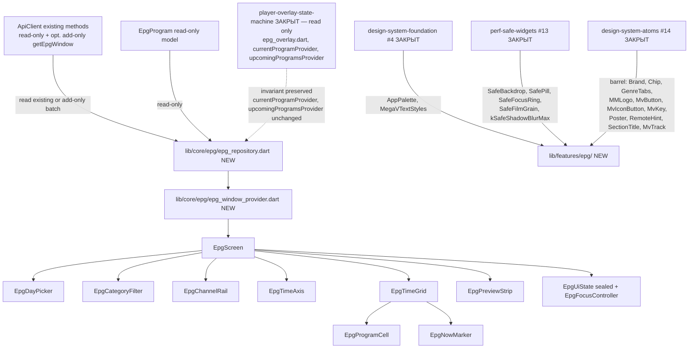
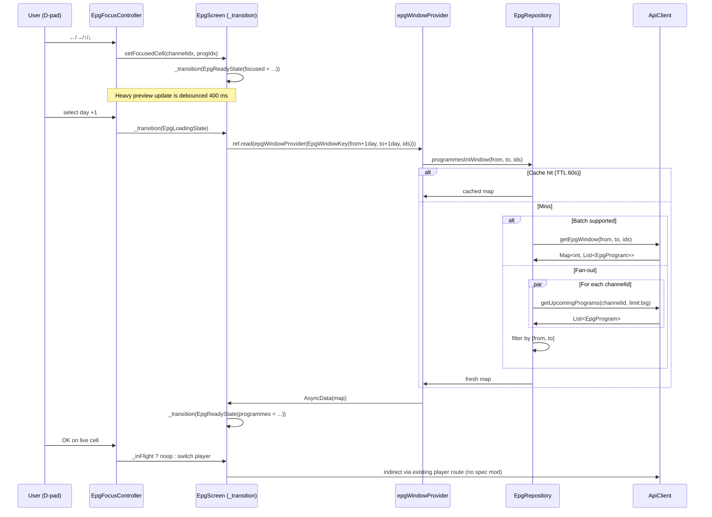

# Design Document — epg-screen

## Overview

`epg-screen` собирает полноэкранный электронный программный гид (2D «каналы × время» grid) из foundation-блоков (`design-system-foundation` #4, `perf-safe-widgets` #13, `design-system-atoms` #14) **и** добавляет ограниченное расширение data-layer (`lib/core/epg/`) для batch-запроса передач по N каналам в окне `[from..to]`. Все новые UI-файлы живут в новом пакете `lib/features/epg/`, не пересекаясь с закрытым `lib/features/player/widgets/epg_overlay.dart` (player-overlay EPG, owned by `player-overlay-state-machine`).

Существующий **player-overlay EPG** продолжает использовать `currentProgramProvider` + `upcomingProgramsProvider` из `lib/core/providers/providers.dart` (per-channel API через `ApiClient.getCurrentProgram` / `ApiClient.getUpcomingPrograms`) — мы **не модифицируем** эти провайдеры, не меняем `EpgProgram` модель, не трогаем существующие методы `ApiClient`. Единственное допустимое расширение — добавление новых файлов `lib/core/epg/epg_repository.dart` + `lib/core/epg/epg_window_provider.dart` и опционально одного нового метода в `ApiClient` (если backend поддерживает batch).

UI следует эталону `.kiro/design/megav-iptv-handoff/project/screens/epg-v2.jsx` (549 строк): header italic display 56 px, DayPicker (-2..+4), category pills через `GenreTabs`, channel rail `CH_W = 240` px, time-grid `SLOT_W = 180` × `ROW_H = 88`, NOW marker в **начале** окна, sticky preview-strip снизу (132×76 + meta + actions). Все glass / blur / shadow эффекты заменяются safe-primitives из `perf-safe-widgets`.

### Goals

- Полноэкранный 2D EPG live + 0 регрессий closed-spec тестов.
- Virtualised 2-axis grid 100×50+ ячеек без «фриза» на rtd2851a.
- D-pad навигация со snap-to-live на row change + 80 px viewport-padding.
- Sealed `EpgUiState` + единый `_transition` (паттерн из `player-overlay-state-machine`).
- Расширение data-layer бoundaried: NEW `EpgRepository` + `epgWindowProvider` + опц. NEW `ApiClient.getEpgWindow`. Existing per-channel EPG API не меняется.
- 0 hits на `BackdropFilter|ShaderMask|ImageFilter\.blur` в новых файлах.
- 0 `BoxShadow.blurRadius > kSafeShadowBlurMax`.

### Non-Goals

- Модифицировать `lib/features/player/widgets/epg_overlay.dart` (closed `player-overlay-state-machine`).
- Модифицировать `currentProgramProvider` / `upcomingProgramsProvider` / `EpgProgram` (read-only data layer baseline).
- Модифицировать существующие методы `ApiClient` (только опц. add-only `getEpgWindow`).
- Editorial Bento layout (#6).
- Mobile (#12).
- Native player engines.
- Возврат `BoxShadow.blurRadius=50`, `ShaderMask`, `BackdropFilter`.

## Boundary Commitments

### This Spec Owns

- `lib/features/epg/` (NEW directory).
  - `lib/features/epg/epg_screen.dart` (NEW — root widget).
  - `lib/features/epg/widgets/epg_day_picker.dart` (NEW).
  - `lib/features/epg/widgets/epg_category_filter.dart` (NEW).
  - `lib/features/epg/widgets/epg_channel_rail.dart` (NEW).
  - `lib/features/epg/widgets/epg_time_axis.dart` (NEW).
  - `lib/features/epg/widgets/epg_time_grid.dart` (NEW).
  - `lib/features/epg/widgets/epg_program_cell.dart` (NEW).
  - `lib/features/epg/widgets/epg_now_marker.dart` (NEW).
  - `lib/features/epg/widgets/epg_preview_strip.dart` (NEW).
  - `lib/features/epg/state/epg_screen_state.dart` (NEW — sealed state).
  - `lib/features/epg/state/epg_focus_controller.dart` (NEW — D-pad logic).
- `lib/core/epg/epg_repository.dart` (NEW — data-layer extension).
- `lib/core/epg/epg_window_provider.dart` (NEW — Riverpod provider).
- Optional: ONE new method `ApiClient.getEpgWindow(...)` appended to `lib/core/api/api_client.dart` (no existing-method modification).
- ONE new route entry `/epg` appended to existing router (one-line touch; existing routes unmodified).
- `test/features/epg/` (NEW directory with widget + smoke + regression tests).
- `test/core/epg/` (NEW directory with repository + provider tests).

### Out of Boundary

- `lib/features/player/widgets/epg_overlay.dart` — read-only (closed `player-overlay-state-machine`).
- `lib/features/home/widgets/*`, `lib/features/home/home_screen.dart`, `cinema_row.dart`, `cinema_card.dart`, `_grid_tokens.dart` — read-only (closed home specs).
- `lib/core/providers/providers.dart` existing providers (`currentProgramProvider`, `upcomingProgramsProvider`, `nowPlayingProvider`, etc.) — read-only.
- `lib/core/playlist/models/epg_program.dart` — read-only (model unchanged).
- `lib/core/api/api_client.dart` existing methods — read-only (only add-only allowed).
- `lib/core/theme/*`, `lib/core/perf/*`, `lib/core/ui/atoms/*` — read-only foundation deps.
- `lib/core/player/*` — read-only.
- `pubspec.yaml` — NO new packages (Req 14.5).

### Allowed Dependencies

- Upstream: `package:flutter/material.dart`, `package:flutter_riverpod/flutter_riverpod.dart`, `package:flutter_screenutil/flutter_screenutil.dart`, `package:go_router/go_router.dart`.
- Upstream: `package:megav_iptv/core/theme/...` (`AppPalette`, `AppRadius`, `AppColors` proxy, `MegaVTextStyles`, `themeProvider`).
- Upstream: `package:megav_iptv/core/perf/perf_safe_widgets.dart` (`SafePill`, `SafeFocusRing`, `SafeFilmGrain`, `SafeBackdrop`, `combinedHeroGradient`, `ComputedColors`, `kSafeShadowBlurMax`).
- Upstream: `package:megav_iptv/core/ui/atoms/atoms.dart` (barrel: `Brand`, `Chip`, `GenreTabs`, `MMLogo`, `MvButton`, `MvIconButton`, `MvKey`, `Poster`, `RemoteHint`, `SectionTitle`, `MvTrack`).
- **Import discipline**: Files importing both `package:flutter/material.dart` and the atoms barrel MUST use `import 'package:flutter/material.dart' hide Chip;` to avoid shadow with Material's `Chip` widget. EPG uses `Chip(variant: ChipVariant.live)` for current-programme highlighting.
- Upstream: `package:megav_iptv/core/playlist/models/{channel,epg_program}.dart` (read-only models).
- Upstream: `package:megav_iptv/core/providers/providers.dart` (`apiClientProvider`, `featuredChannelsProvider`, `categoryNotifierProvider`).
- Upstream (NEW within this spec): `package:megav_iptv/core/epg/{epg_repository,epg_window_provider}.dart`.

### Revalidation Triggers

- Any palette token rename in `AppPalette` — EPG widgets reading those revalidate.
- Any new safe-primitive in `perf-safe-widgets` — EPG screen may compose it.
- Any new atom added in `design-system-atoms` — EPG may switch over.
- Any change to `EpgProgram` shape — would break `EpgRepository`. Must re-open this spec.
- Any change to `currentProgramProvider` / `upcomingProgramsProvider` signatures — would break Req 11.8 invariant.

## Architecture

### Existing Architecture Analysis

The codebase has clear precedents:

- `lib/features/player/widgets/epg_overlay.dart` (closed) — 1D timeline overlay inside player; loads via `apiClientProvider.getCurrentProgram` + `getUpcomingPrograms` for a single channel.
- `lib/features/home/widgets/cinema_row.dart` (closed) — horizontal `ListView.builder` with `cacheExtent: 1500`, `addAutomaticKeepAlives`, `addRepaintBoundaries`, `clipBehavior: Clip.none`, debounced focus 400 ms.
- `lib/features/home/widgets/cinema_card.dart` (closed) — `Transform.scale(1.08)` focus, no shadow blur.
- `lib/core/providers/providers.dart` — Riverpod-only state (`apiClientProvider`, `currentProgramProvider`, `upcomingProgramsProvider`, `nowPlayingProvider`, etc.) — must remain unchanged.
- `lib/core/api/api_client.dart` — `http`-based client with per-channel EPG endpoints `/api/channels/<id>/epg?limit=...` plus `/api/epg/now` and `/api/epg/upcoming` aggregate endpoints.
- `EpgProgram` (`lib/core/playlist/models/epg_program.dart`) provides `isNow`, `progress`, `duration`, `category` — sufficient for cell rendering without modification.

This spec adopts the same idioms: Riverpod-aware top widget, virtualised lists with the same perf flags, 150 ms / 400 ms Leanback timings, sealed state-machine + single `_transition`, single `_inFlight` re-entry guard.

### Architecture Pattern & Boundary Map



**Pattern**: leaf-feature package + bounded data-layer extension. UI consumes via Riverpod; data layer presents a single new repository class without disturbing existing per-channel providers.
**Domain boundary**: `lib/features/epg/` (new leaf) + `lib/core/epg/` (data-layer addition only). Closed widgets and existing providers are read-only imports.

### Technology Stack

| Layer | Choice | Role | Notes |
|---|---|---|---|
| UI primitives | Flutter widgets via atoms barrel | All EPG widgets | No third-party. |
| Theming | `AppPalette`, `MegaVTextStyles` (#4) | Color / typography | Read via `Theme.of(context)` and `AppColors.X`. |
| Perf primitives | `SafePill`, `SafeFocusRing`, `SafeFilmGrain`, `SafeBackdrop`, `combinedHeroGradient` (#13) | Glass / focus / grain visuals | No raw blur in hot-path. |
| State management | Riverpod (`flutter_riverpod`) + sealed `EpgUiState` | Async data + UI state | Same pattern as `player-overlay-state-machine`. |
| Network | Existing `ApiClient` + opt. new batch method | EPG fetching | No new packages. |
| Routing | Existing `go_router` | New `/epg` route | One-line addition, no other route modified. |
| Sizing | `flutter_screenutil` `.w/.h/.sp/.r` for dynamic sizing; `CH_W/SLOT_W/ROW_H` constants for grid math | Layout | Same convention as `_grid_tokens.dart`. |

## Components

### 1. `EpgRepository` (data-layer extension, `lib/core/epg/epg_repository.dart`)

```dart
class EpgRepository {
  final ApiClient _api;
  final Map<String, _CacheEntry> _cache = {};

  EpgRepository(this._api);

  /// Returns map: channelId -> programmes whose [start, end] intersects [from, to].
  Future<Map<int, List<EpgProgram>>> programmesInWindow(
    DateTime from,
    DateTime to,
    List<int> channelIds,
  ) async {
    final key = _cacheKey(from, to, channelIds);
    final hit = _cache[key];
    if (hit != null && !hit.isExpired) return hit.value;

    // Prefer batch endpoint if API supports it; else N-fan-out.
    final result = await _fetch(from, to, channelIds);
    _cache[key] = _CacheEntry(result, DateTime.now().add(const Duration(seconds: 60)));
    return result;
  }

  Future<Map<int, List<EpgProgram>>> _fetch(DateTime from, DateTime to, List<int> ids) async {
    // try _api.getEpgWindow(from, to, ids) if exposed; otherwise:
    // N-fan-out via _api.getUpcomingPrograms(channelId, limit:big-enough),
    // then filter by [from, to] window. In-flight de-dup via Map<int, Future>.
  }
}
```

Properties:
- TTL cache 60 s (Req 11.4).
- Fan-out de-dup via `Map<int, Future<List<EpgProgram>>>` (Req 11.5).
- No mutation of `EpgProgram` (Req 11.7).

### 2. `epgWindowProvider` (`lib/core/epg/epg_window_provider.dart`)

```dart
final epgRepositoryProvider = Provider<EpgRepository>((ref) {
  final api = ref.watch(apiClientProvider);
  return EpgRepository(api);
});

class EpgWindowKey {
  final DateTime from;
  final DateTime to;
  final List<int> channelIds; // sorted, hashed
  const EpgWindowKey({required this.from, required this.to, required this.channelIds});
  // ==/hashCode by (from, to, sortedJoin(channelIds))
}

final epgWindowProvider =
    FutureProvider.family<Map<int, List<EpgProgram>>, EpgWindowKey>((ref, key) async {
  final repo = ref.watch(epgRepositoryProvider);
  return repo.programmesInWindow(key.from, key.to, key.channelIds);
});
```

### 3. `EpgScreen` (`lib/features/epg/epg_screen.dart`)

`ConsumerStatefulWidget`. Tree (top→bottom):

```
Scaffold(
  body: SafeArea(child: Column([
    HeaderRow(displayItalic 'Программа передач' + EpgDayPicker),
    EpgCategoryFilter,
    Expanded(child: Stack([
      Row([
        Column([
          SizedBox(height: timeAxisH),                  // gutter for sticky axis
          Expanded(child: EpgChannelRail),               // shared vertical scrollCtl
        ]),
        Expanded(child: Column([
          EpgTimeAxis,                                   // shared horizontal scrollCtl
          Expanded(child: EpgTimeGrid),                  // owns both ScrollCtls
        ])),
      ]),
      EpgNowMarker,                                      // positioned absolute over grid
    ])),
    EpgPreviewStrip,                                     // sticky bottom
  ]))
)
```

State:

```dart
sealed class EpgUiState { const EpgUiState(); }
final class EpgLoadingState extends EpgUiState { const EpgLoadingState(); }
final class EpgReadyState extends EpgUiState {
  final List<Channel> channels;
  final Map<int, List<EpgProgram>> programmes;
  final DateTime windowFrom;
  final DateTime windowTo;
  final String? selectedCategory;
  final int? focusedChannelIndex;
  final int? focusedProgrammeId;
  // ...
  const EpgReadyState({...});
}
final class EpgErrorState extends EpgUiState {
  final Object error;
  final StackTrace stackTrace;
  const EpgErrorState({required this.error, required this.stackTrace});
}
```

Transitions: single `_transition(EpgUiState newState)` cancels pending timers & `setState`. `_inFlight` guards async OK / channel-switch (Req 12.2, 12.3, 9.6).

### 4. `EpgChannelRail` (`widgets/epg_channel_rail.dart`)

`ConsumerStatefulWidget`. Vertical `ListView.builder` with shared `ScrollController` (Req 2.4). Each cell:

```
SizedBox(width: 240.w, height: 88.h, child:
  Focus(child: AnimatedScale(scale: focused ? 1.05 : 1.0, ...,
    child: SafeFocusRing(focused: focused, child:
      Row([Brand(badge38), Column([name, groupTitle])])
    )
  ))
)
```

Perf flags: `cacheExtent: 1500, addAutomaticKeepAlives, addRepaintBoundaries, clipBehavior: Clip.none`.

### 5. `EpgTimeAxis` (`widgets/epg_time_axis.dart`)

Sticky horizontal label strip (e.g., `SliverPersistentHeader` with `pinned: true`, or a `Positioned` row with `IgnorePointer`). Shares horizontal `ScrollController` with grid (Req 5.2). Labels every 30 min via `MegaVTextStyles.metaMono`. No blur effects.

### 6. `EpgTimeGrid` (`widgets/epg_time_grid.dart`)

The 2-axis virtualisation core. Outer: vertical `ListView.builder` (shared vertical ctl with channel rail). Each row: inner horizontal `ListView.builder` (own horizontal ctl, but commands forwarded to a shared `ScrollControllerGroup`-equivalent — implemented manually via a single `LinkedScrollControllerGroup` lite class or by using a single `controller` instance with `keepScrollOffset: false` and replicating offset on jump). Each grid cell built via `EpgProgramCell`.

Critical: both axes use perf flags from Req 13.5.

### 7. `EpgProgramCell` (`widgets/epg_program_cell.dart`)

Static (cell-content-only `StatelessWidget`) with `Focus` + `AnimatedScale(1.05)`:

```
Focus(child: AnimatedScale(...,
  child: AnimatedContainer(duration: 140 ms,
    decoration: BoxDecoration(color: focused ? accent : surface,
                              borderRadius: AppRadius.md,
                              boxShadow: focused ? [SafeFocusRing.shadow] : null),
    child: Row([
      Text(formatTime(start), style: metaMono),
      Expanded(child: Column([Text(title, style: titleMedium /* not italic */),
                              if (program.isNow) MvTrack(progress: program.progress)])),
      if (program.isNow) Chip(variant: ChipVariant.live, label: 'LIVE'),
    ])
  )
))
```

`fontStyle: FontStyle.normal` (Req 4.1). Title shadow capped at `kSafeShadowBlurMax`.

### 8. `EpgNowMarker` (`widgets/epg_now_marker.dart`)

```
Positioned(
  left: nowOffsetX(currentTime, gridStart, slotW),
  top: 0, bottom: 0, width: 2.w,
  child: const _NowMarkerLine(),  // const ctor → no rebuild on parent
)

class _NowMarkerLine extends ConsumerWidget {
  const _NowMarkerLine();
  @override Widget build(...) {
    return RepaintBoundary(child: Stream/timer-driven update once per minute);
  }
}
```

`BoxShadow.blurRadius ≤ kSafeShadowBlurMax`. Update via `Timer.periodic(Duration(seconds: 30), ...)` inside the leaf `_NowMarkerLine` (Req 6.4, 13.4).

### 9. `EpgDayPicker` (`widgets/epg_day_picker.dart`)

Horizontal row of 7 `MvKey` / `MvButton` cells (today − 2 … today + 4). Active day uses `SafePill` accent; focus uses `SafeFocusRing`. On select → `_transition(EpgReadyState(...))` re-fetches via new `epgWindowProvider`.

### 10. `EpgCategoryFilter` (`widgets/epg_category_filter.dart`)

Wraps `GenreTabs` atom; edge-fade overlays via `Stack + Positioned + DecoratedBox(LinearGradient)` (Req 8.3). Client-side filter on `EpgProgram.category` — no re-fetch (Req 8.2).

### 11. `EpgPreviewStrip` (`widgets/epg_preview_strip.dart`)

Sticky bottom row: `Poster` 132×76 + meta column (title / channel / time range) + actions (`MvButton.primary 'Смотреть'` if live; else `MvButton.secondary 'Подробнее'`). Updates only on stabilised focus (debounce 400 ms, Req 9.5, 10.3). Image wrapped in `RepaintBoundary` (Req 10.2).

### 12. `EpgFocusController` (`state/epg_focus_controller.dart`)

Pure logic class (no widgets). Owns:
- `FocusNode`s map (channel × programme).
- D-pad handler: `onArrowKey(KeyEvent)` → returns next focused cell-id.
- Snap-to-live: on row change picks `live` programme of new row, else temporally-nearest.
- `_inFlight` re-entry guard (Req 9.6).
- 80 px viewport-padding auto-scroll: invokes the appropriate `ScrollController.animateTo(...)` when the focused cell would otherwise leave the viewport (Req 9.4).
- 400 ms debounce timer for heavy preview-strip update (Req 9.5).

## Data Flow



## File Structure Plan

NEW directories / files (all under `megav_iptv/`):

```
megav_iptv/
├── lib/
│   ├── core/
│   │   └── epg/                                  # NEW data-layer extension
│   │       ├── epg_repository.dart               # NEW (Req 11.2)
│   │       └── epg_window_provider.dart          # NEW (Req 11.3)
│   ├── core/api/
│   │   └── api_client.dart                       # OPT one-method add `getEpgWindow` (Req 11.6)
│   └── features/
│       └── epg/                                  # NEW feature leaf
│           ├── epg_screen.dart                   # NEW (Req 1)
│           ├── state/
│           │   ├── epg_screen_state.dart         # NEW sealed state (Req 12)
│           │   └── epg_focus_controller.dart     # NEW (Req 9)
│           └── widgets/
│               ├── epg_day_picker.dart           # NEW (Req 7)
│               ├── epg_category_filter.dart      # NEW (Req 8)
│               ├── epg_channel_rail.dart         # NEW (Req 3)
│               ├── epg_time_axis.dart            # NEW (Req 5)
│               ├── epg_time_grid.dart            # NEW (Req 2)
│               ├── epg_program_cell.dart         # NEW (Req 4)
│               ├── epg_now_marker.dart           # NEW (Req 6)
│               └── epg_preview_strip.dart        # NEW (Req 10)
└── test/
    ├── core/
    │   └── epg/
    │       ├── epg_repository_test.dart          # NEW
    │       └── epg_window_provider_test.dart     # NEW
    └── features/
        └── epg/
            ├── epg_screen_smoke_test.dart        # NEW (Req 14.3)
            ├── epg_channel_rail_test.dart        # NEW
            ├── epg_time_grid_test.dart           # NEW
            ├── epg_program_cell_test.dart        # NEW
            ├── epg_now_marker_test.dart          # NEW
            ├── epg_day_picker_test.dart          # NEW
            ├── epg_category_filter_test.dart     # NEW
            ├── epg_preview_strip_test.dart       # NEW
            └── epg_player_overlay_invariant_test.dart  # NEW (Req 14.4)
```

ONE-LINE touches (no other modification):

- Existing router file (e.g., `lib/main.dart` or `lib/app/app_router.dart`): add ONE `GoRoute(path: '/epg', builder: (_, __) => const EpgScreen())` entry.
- Existing `lib/core/api/api_client.dart`: optionally append ONE method `getEpgWindow(...)` if backend supports batch — no existing-method modification.

## Traceability Matrix

| Req | Component | Test |
|---|---|---|
| 1 — scaffold + entry | `EpgScreen` + router one-line | `epg_screen_smoke_test.dart` |
| 2 — 2D virtualised grid | `EpgTimeGrid` | `epg_time_grid_test.dart` |
| 3 — channel rail | `EpgChannelRail` | `epg_channel_rail_test.dart` |
| 4 — programme cell | `EpgProgramCell` | `epg_program_cell_test.dart` |
| 5 — time axis | `EpgTimeAxis` | covered in `epg_time_grid_test.dart` |
| 6 — NOW marker | `EpgNowMarker` | `epg_now_marker_test.dart` |
| 7 — day picker | `EpgDayPicker` | `epg_day_picker_test.dart` |
| 8 — category filter | `EpgCategoryFilter` | `epg_category_filter_test.dart` |
| 9 — D-pad focus | `EpgFocusController` | logic test in `epg_screen_smoke_test.dart` + cell test |
| 10 — preview strip | `EpgPreviewStrip` | `epg_preview_strip_test.dart` |
| 11 — data extension | `EpgRepository` + `epgWindowProvider` + opt. `ApiClient.getEpgWindow` | `epg_repository_test.dart`, `epg_window_provider_test.dart` |
| 12 — sealed state | `EpgUiState` + `_transition` | covered in smoke test (state transitions) |
| 13 — perf compliance | All widgets | grep-gates in every widget test |
| 14 — backward compat & testability | Regression tests + lint | `epg_player_overlay_invariant_test.dart`, `flutter analyze` gate |

## Risks & Mitigations

| Risk | Likelihood | Mitigation |
|---|---|---|
| Backend has no batch endpoint → N-fan-out hits 100 channels | High | Spec falls back to N-fan-out with in-flight de-dup + 60s TTL cache. Fan-out runs only on day-switch / cold load, not on every scroll. |
| Player-overlay EPG regression from data-layer extension | Medium | Hard invariant in Req 11.1 + dedicated regression test (Req 14.4). |
| 2-axis ListView.builder vertical reuse becomes flaky | Medium | Use a single shared `ScrollControllerGroup` lite class; verify via widget test that `cacheExtent` is propagated. |
| NOW marker rebuilds whole grid on minute tick | Medium | Marker is a private `const _NowMarkerLine` widget under `RepaintBoundary` — parent does not rebuild (Req 13.4). |
| Focus debounce competing with day-switch state transition | Medium | Single `_transition` cancels pending timers before mutating state (Req 12.2). |
| Adding new package to `pubspec.yaml` | Low | Hard prohibited (Req 14.5). |
| Touching closed `epg_overlay.dart` | Low | Hard prohibited (Out of Boundary). Lint via `git diff` gate in final regression. |

## Performance Budget

Per `flutter-tv-perf.md`:

- Avg `GPURasterizer::Draw ≤ 16.7 ms` during scroll along both axes (Req 13.6).
- Idle `BUILD` events ≤ 5 / 30 sec (Req 13.6).
- All Leanback timings (150 ms focus, 250 ms scroll, 400 ms select-debounce) respected.
- `cacheExtent: 1500` on both `ListView.builder` instances (Req 13.5).
- 0 `BackdropFilter|ShaderMask|ImageFilter\.blur` (Req 13.1).
- 0 `BoxShadow.blurRadius > kSafeShadowBlurMax` (Req 13.2).
