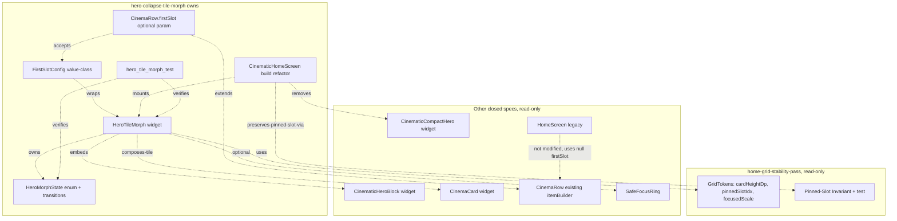
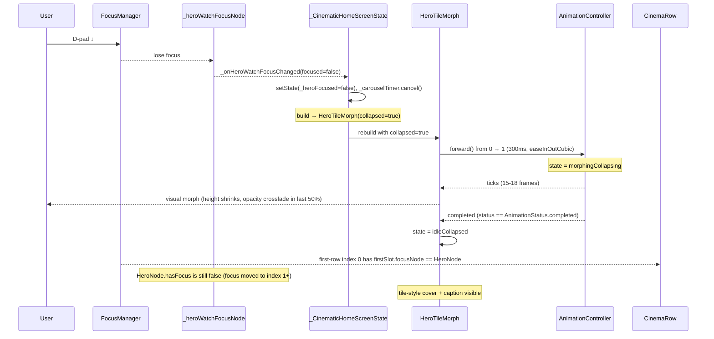
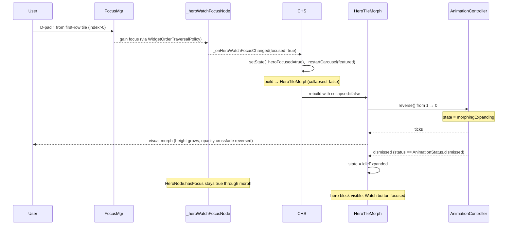
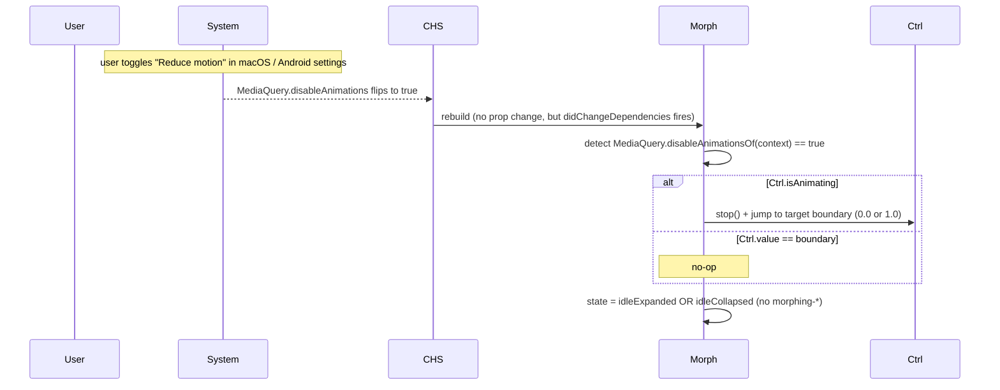
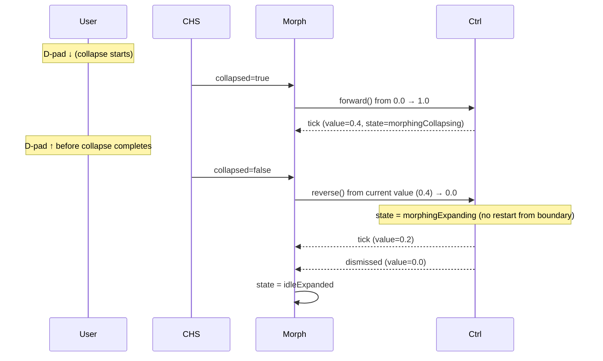

# Design Document — hero-collapse-tile-morph

## Overview

**Purpose**: Заменить визуально провальный `AnimatedCrossFade` hero
коллапс на `CinematicHomeScreen` cinematic morph: hero и плитка слота 0
первой полосы — один и тот же `HeroTileMorph` widget в двух layout-режимах
(`expanded` ≈ 620 dp height, `collapsed` ≈ `GridTokens.cardHeightDp`).
Single-source widget tree, persistent FocusNode сквозь morph, фиксированная
300ms / `easeInOutCubic` анимация, opacity-crossfade вспомогательных
элементов во второй половине, instant-snap при
`MediaQuery.disableAnimations`.

**Users**: TV-зрители на Realtek `rtd2851a` (и macOS debug build для
разработчика). Цель — кадровый «physical continuity»: hero не исчезает в
чёрную пустоту, а уезжает вниз-вправо в слот 0, и плитки полосы
естественно скользят дальше; обратный morph — плитка слота 0
расширяется обратно в hero.

**Impact**: Меняет визуальный коллапс hero и точку монтирования hero в
дереве (`Positioned` → `firstSlot` первой `CinemaRow`). Добавляет новый
файл `hero_tile_morph.dart`, новый опциональный `firstSlot` API на
`CinemaRow`, новый тестовый файл `hero_tile_morph_test.dart`. Не
модифицирует ни `CinemaCard`, ни `_grid_tokens.dart`, ни upstream-spec'и.
Backward compat: `firstSlot == null` (legacy `/home`, остальные рядов)
рендерит row как раньше bit-for-bit.

### Goals

- HeroTileMorph как чистый виджет с детерминированной 4-state state
  machine (`idle-expanded`, `morphing-collapsing`, `idle-collapsed`,
  `morphing-expanding`).
- Один `AnimationController` (vsync = State.this), длительность 300ms,
  кривая `easeInOutCubic`, без spring physics.
- Persistent `FocusNode` живёт от mount до dispose, не пересоздаётся
  при смене layout-режима.
- Geometry interpolation: height + opacity primary metadata через
  `AnimatedBuilder`; никакой `AnimatedContainer.width`, `BackdropFilter`,
  `ShaderMask`.
- `MediaQuery.disableAnimationsOf(context)` → instant snap (controller
  value set directly to boundary без `forward`/`reverse`).
- Opacity crossfade auxiliary elements в **last 50%** controller value
  range (через `TweenSequence`).
- Single new file (`hero_tile_morph.dart`), single CinemaRow API
  extension (`firstSlot`), one CinematicHomeScreen refactor (hero уезжает
  в первый row через `firstSlot`), один тестовый файл.
- All existing tests pass; carousel timer / preview player / boot overlay
  / clock — preserved через сохранение state в `_CinematicHomeScreenState`.

### Non-Goals

- Hero для legacy `HomeScreen` (`/home`) — не затрагивается.
- Grid tokens (`cardHeightDp`, `pinnedSlotIdx`, `focusedScale`,
  `metadataReservedHeightDp`, `unfocusedNeighbourOpacity`) — owned by
  `home-grid-stability-pass`, read-only.
- Pinned-Slot scrolling механика, focus debounce 400ms, fade-edge,
  Visibility wrap для full overlay — closed
  `home-grid-optimization` + `home-grid-visual-polish` +
  `home-grid-stability-pass`.
- `CinemaCard` визуал / metadata layout — closed
  `home-grid-stability-pass`.
- Carousel timer (8s) семантика, preview player lifecycle, boot overlay
  логика — closed `home-cinematic-redesign`, **сохраняем через
  рефакторинг**, не модифицируем семантически.
- Golden tests для morph key-frames — отложено в `visual-feedback-pipeline`.
- Новые пакеты в `pubspec.yaml`.

## Boundary Commitments

### This Spec Owns

- Новый файл `hero_tile_morph.dart` (HeroTileMorph widget +
  `HeroMorphState` enum + state machine + AnimationController).
- Опциональный `firstSlot` API на `CinemaRow` (новый именованный
  параметр + новый `FirstSlotConfig` value-class в том же файле).
- Refactor `CinematicHomeScreen` build: hero больше не отдельный
  `Positioned(top:0, height:620)` + `AnimatedCrossFade`; вместо этого
  первая `CategoryRowWrapper` / `CinemaRow` принимает `HeroTileMorph` как
  `firstSlot`. Rails ListView теперь начинается с `top: 0` (или с
  `top: <smaller offset>`; см. Components / CinematicHomeScreen).
- Удаление `AnimatedCrossFade` блока в `CinematicHomeScreen` (replaced
  by `HeroTileMorph` через firstSlot). `CinematicCompactHero` остаётся
  как файл (downstream могут использовать), но больше не монтируется
  внутри `AnimatedCrossFade` в CinematicHomeScreen.
- Тест `hero_tile_morph_test.dart` + state machine unit tests + focus
  survival widget test.

### Out of Boundary

- `lib/features/home/cinematic/cinematic_hero_block.dart` —
  существующий hero block widget, **используется как `expandedChild`
  внутри HeroTileMorph без модификаций**. Если внутри `CinematicHeroBlock`
  будут найдены baking magic-numbers, мешающие morph (например,
  жёсткий `height: 620`), они допустимы к минимальной правке только
  для прокидки constraints — **семантика не меняется**.
- `lib/features/home/cinematic/cinematic_compact_hero.dart` —
  существующий compact-hero widget, остаётся в репозитории как
  reference / для возможного использования в downstream specs (visual
  feedback pipeline). После рефакторинга в `CinematicHomeScreen` он
  больше не монтируется.
- `lib/features/home/widgets/cinema_card.dart` — не модифицируется.
  Tile-репрезентация для collapsed режима строится **внутри
  HeroTileMorph** через композицию `CinemaCard`-совместимых примитивов
  (cover image + metadata caption) — но **не через сам CinemaCard
  widget**, чтобы избежать связности с его сложным focus pipeline.
- `lib/features/home/widgets/_grid_tokens.dart` — не модифицируется
  семантически. Если упадёт `dependency` на одно из новых полей
  (`cardHeightDp`, `pinnedSlotIdx`), это только чтение значения.
- `lib/features/home/home_screen.dart` (legacy `/home`) — не
  модифицируется, не импортируется отсюда.
- `lib/core/player/*`, `lib/core/api/*`, `lib/core/playlist/*` —
  read-only.

### Allowed Dependencies

- `GridTokens.cardHeightDp`, `GridTokens.pinnedSlotIdx`,
  `GridTokens.focusedScale` — read через статический доступ из
  `_grid_tokens.dart`.
- `CinemaRow` — расширяется новым `firstSlot` параметром (опциональным,
  back-compat).
- `CinematicHeroBlock` — используется как готовый widget внутри
  HeroTileMorph `expandedChild`.
- `SafeFocusRing` из `lib/core/perf/perf_safe_widgets.dart` — для focus
  indication в collapsed режиме (если потребуется; closed
  `perf-safe-widgets` спек).
- `flutter/animation.dart` (`AnimationController`, `CurvedAnimation`,
  `Curves`, `TweenSequence`, `TweenSequenceItem`, `Animation<double>`).
- `flutter/widgets.dart` (`FocusNode`, `MediaQuery`, `AnimatedBuilder`,
  `Stack`, `Positioned`, `SizedBox`, `Opacity`, `Transform.scale`).
- `flutter_riverpod`, `flutter_screenutil`, `go_router` — уже в use,
  потребляются как раньше.
- `flutter_test` — для unit/widget тестов.

### Revalidation Triggers

- Изменение значения `GridTokens.cardHeightDp` в
  `home-grid-stability-pass` — меняет target height collapsed-режима;
  HeroTileMorph reads через токен, value-change применится без правки
  кода, но visual smoke / focus survival test может потребовать
  reapproval (если новый cardHeightDp ломает aspect или layout).
- Изменение `GridTokens.pinnedSlotIdx` — меняет, в какой слот
  коллапсирует hero. Если pinnedSlotIdx > 0, hero коллапсирует не в
  leading edge, а в slot N → нужна правка integration в
  CinematicHomeScreen (рассмотреть, остаётся ли «hero как первая
  плитка» осмысленным).
- Изменение `GridTokens.focusedScale` — на текущей редакции (1.01)
  scale применяется к collapsed hero-tile в focus-state. Изменение на
  1.0 (полное отсутствие scale) визуально приемлемо, на 1.05+ — нужна
  визуальная переоценка анимации.
- Изменение длительности `_heroMorphDuration = 300ms` или curve
  `_heroMorphCurve = easeInOutCubic` — нарушит Req 2; обновить тест.
- Рефакторинг `CinemaRow.itemBuilder` (closed
  `home-grid-optimization`) — может сломать `firstSlot` интеграцию,
  нужно re-validate.
- Изменение `CinematicHeroBlock` API (props, `heroWatchFocusNode`
  signature) — может потребовать update `expandedChild` сборки в
  HeroTileMorph.

## Architecture

### Existing Architecture Analysis

**Контекст**: Flutter Android TV app. `CinematicHomeScreen`
(`/home-cinematic`) рендерит `Stack`:

- `Positioned(top:0, left:0, right:0, height:620)` —
  `Focus(skipTraversal, onFocusChange)` → `AnimatedCrossFade(220ms)
  showFirst/showSecond`: firstChild = `CinematicHeroBlock`, secondChild
  = `CinematicCompactHero` или `SizedBox(height: collapsedH)`.
- `Positioned(top:620, left:0, right:0, bottom:0)` → `ListView.builder`
  рядов через `CategoryRowWrapper` (data fetch) → `CinemaRow`
  (горизонтальная сетка + focus pipeline + pinned-slot scroll) →
  `CinemaCard` (постер + overlay).
- `Positioned.fill` — boot overlay (если `_showBootOverlay`).

`_CinematicHomeScreenState` владеет (см. research.md секцию
«Состояние, которое нельзя потерять»):

- `_focusNode` (`cinematicHomeShell`), `_heroWatchFocusNode`
  (`cinematicHeroWatch`).
- `_heroFocused: bool` (driver crossfade), `_isWatchFocused: bool`.
- Carousel: `_carouselInterval = 8s`, `_carouselIndex`, `_carouselTimer`.
- Hover/preview: `_hoveredItem`, `_previewTimer (7s)`,
  `_hoveredClearDebounce`, `_previewingItem`, `_isPreviewPlaying`,
  `_isPreviewVideoReady`, `_previewPlayer`, `_previewStateSub`,
  `_hoverSettleDelay = 600ms`.
- Boot: `_showBootOverlay`, `_bootFadeOut`, `_bootError`,
  `_bootUrlController`.
- Clock: `_clockTimer (30s)`, `_clockTime`.

`CinemaRow` (post-`home-grid-stability-pass`) имеет dartdoc
«Pinned-Slot Invariant», `_scrollFocusedTileToLeadingEdge(index)`
использующий `GridTokens.pinnedSlotIdx`. `itemBuilder` для каждого
индекса оборачивает плитку в `Focus(onFocusChange, onKeyEvent) →
MouseRegion → Padding → LayoutBuilder → Align → CinemaCard`. Этот
обёрточный код управляет focus pipeline + scrollFocusedTileToLeadingEdge.

### Architecture Pattern & Boundary Map



**Architecture Integration**:

- **Selected pattern**: composition through `firstSlot` slot pattern —
  CinemaRow становится slot-aware для index 0, остальные indices ведут
  себя как раньше. HeroTileMorph — leaf widget с inner state machine.
- **Domain boundaries**: HeroTileMorph и `FirstSlotConfig` — в одном
  файле `hero_tile_morph.dart` (как inner-package); CinemaRow extension
  — точечная правка `cinema_row.dart`; refactor
  CinematicHomeScreen — точечная правка `cinematic_home_screen.dart`.
- **Existing patterns preserved**: pinned-slot scroll работает (для
  index 0 он clamp'ится к leading edge через `clamp(0, max)` — Req 1.3
  upstream); focus debounce 400ms работает (HeroTileMorph не вовлечён в
  scheduling, потому что debounce живёт в `_CinemaRowState`); fade-edge
  через DecoratedBox сохраняется; Visibility wrap для full overlay в
  CinemaCard не затрагивается (HeroTileMorph не использует CinemaCard).
- **New components rationale**: HeroTileMorph — единственный новый
  widget; всё остальное (`FirstSlotConfig`, refactor flag) —
  вспомогательный API.
- **Steering compliance**: только Transform.scale + Opacity +
  AnimatedBuilder + TweenSequence + SizedBox; никаких BackdropFilter /
  ShaderMask / blur / AnimatedContainer.width.

### Technology Stack

| Layer | Choice / Version | Role in Feature | Notes |
|-------|------------------|-----------------|-------|
| Frontend (widgets) | Flutter 3.x (current) | HeroTileMorph + firstSlot API | Без новых пакетов. |
| Animation | `flutter/animation.dart` (`AnimationController`, `CurvedAnimation`, `TweenSequence`) | Управление morph progression и opacity-crossfade | Один controller per widget. |
| Theming | `GridTokens` (pure leaf) | Чтение `cardHeightDp`, `pinnedSlotIdx`, `focusedScale` | Read-only, токены — продукт upstream-спека. |
| Accessibility | `MediaQuery.disableAnimationsOf(context)` | Snap-to-target вместо animate | Стандартный Flutter API. |
| State management | `StatefulWidget` + `SingleTickerProviderStateMixin` | Контроллер anim + persistent FocusNode | Никакого Riverpod внутри HeroTileMorph (он чистый presentation widget). |
| Testing | flutter_test + flutter_screenutil | Unit-test state machine + widget-test focus survival | Без новых dev_dependencies. |

## File Structure Plan

### New Files

- `megav_iptv/lib/features/home/cinematic/hero_tile_morph.dart` — новый
  файл. Содержит:
  - `enum HeroMorphState { idleExpanded, morphingCollapsing,
    idleCollapsed, morphingExpanding }`.
  - Внутренний helper `HeroMorphState _nextState(HeroMorphState
    current, _MorphCommand cmd)` — pure-функция перехода, тестируемая
    юнит-тестом.
  - `class FirstSlotConfig` — value-class с полями `Widget child`,
    `FocusNode? focusNode`, `VoidCallback? onPostFrame`.
  - `class HeroTileMorph extends StatefulWidget` — props: `heroItem`,
    `expandedChild` (`CinematicHeroBlock` или builder), `tileCover`
    (ImageProvider или builder для collapsed cover), `tileCaption`
    (String — channel name / programme title), `focusNode` (передаётся
    извне = `_heroWatchFocusNode`), `collapsed` (bool: текущая цель
    morph; меняется снаружи при focus traversal), `onFocusChange`
    (`ValueChanged<bool>?`), `expandedHeightDp` (`double`, default
    `620`), `collapsedHeightDp` (`double`, default
    `GridTokens.cardHeightDp`), `collapsedWidthDp` (`double` —
    приходит из CinemaRow's slot 0 cardW).
  - `_HeroTileMorphState extends State<HeroTileMorph> with
    SingleTickerProviderStateMixin` — AnimationController, state
    machine driver, build.

- `megav_iptv/test/features/home/cinematic/hero_tile_morph_test.dart` —
  новый файл. Содержит:
  - State machine unit-tests (pure-function `_nextState` transitions).
  - Focus survival widget-test (`tester.pumpWidget(HeroTileMorph)`, drive
    focus, цикл collapse→expand, assert `focusNode.hasFocus == true`
    after each pump).
  - `MediaQuery.disableAnimations` snap test.
  - Bounding rect tolerance ±1.0 dp test (post-morph rect matches target).

### Modified Files

- `megav_iptv/lib/features/home/widgets/cinema_row.dart`:
  - Новый именованный параметр `final FirstSlotConfig? firstSlot;` в
    `CinemaRow` (опционален, default null). Импорт
    `import '../cinematic/hero_tile_morph.dart' show FirstSlotConfig;`.
  - В `itemBuilder`, для `index == 0` и `firstSlot != null`:
    - Не оборачивать в локальный `Focus + MouseRegion + Padding +
      LayoutBuilder + Align + CinemaCard`.
    - Вместо этого возвращать **прямо** `firstSlot!.child` (обёрнутый в
      `Padding(EdgeInsets.only(right: gap))` для совместимости с
      gap-логикой ряда).
    - Если `firstSlot!.focusNode != null`, привязать слушатель:
      `firstSlot.focusNode.addListener` в `initState` /
      `didUpdateWidget`, удалять в `dispose`; при `hasFocus == true` →
      `setState(() => _focusedIndex = 0); _scheduleStableFocus(0);
      addPostFrameCallback → _scrollFocusedTileToLeadingEdge(0)`. При
      `hasFocus == false` и `_focusedIndex == 0` → синхронный null-clear
      как в существующем коде.
    - **Не** триггерить `onLoadMore` для index 0 (хвост-пагинация
      срабатывает на `index >= items.length - 3`, slot 0 этого не
      касается; гарантия back-compat).
  - В `CinemaRow.build`, default `availableHeight ?? 450.h` — остаётся
    как есть в этом спеке; upstream `home-grid-stability-pass` заменит
    его на `GridTokens.cardHeightDp.h` независимо. Эта спека не
    модифицирует строку.
  - Никаких изменений в `_scrollFocusedTileToLeadingEdge`,
    `_scheduleStableFocus`, `_onScroll`, `_gridLayoutFor`, fade-edge,
    header-Row, `_ChevronButton`.

- `megav_iptv/lib/features/home/cinematic/cinematic_home_screen.dart`:
  - Импорт `import 'hero_tile_morph.dart';` и (если нужен)
    `import 'package:flutter/widgets.dart' show FocusNode;`.
  - Удалить `Positioned(top: 0, left: 0, right: 0, height: expandedH,
    child: Focus(skipTraversal, ...) → AnimatedCrossFade(...))` блок из
    `build`.
  - Удалить `const expandedH = 620.0` и `final collapsedH =
    CinematicCompactHero.kCompactHeroHeight` локальные переменные (если
    остаются только для hero — снимаем; rails offset больше не нужен,
    rails ListView начинается с `top: 0`).
  - Удалить импорт `cinematic_compact_hero.dart` если он больше нигде
    не используется (т.к. больше не монтируется здесь).
  - В rails ListView, для **первой row** (rowIdx == 0) построить
    `CategoryRowWrapper` с **новым параметром `firstSlot`** (через
    пропагацию параметра в `CategoryRowWrapper`, который пробросит в
    `CinemaRow`). См. ниже **CategoryRowWrapper extension**.
  - `Positioned(top: 0, ...)` ListView: `top: 0` вместо `top:
    expandedH`. (Можно оставить `top: 0` и rely on row height
    accommodating hero geometry; см. Components / CinemaRow / Row height
    rationale).
  - HeroTileMorph mount: внутри `CategoryRowWrapper` для первой row,
    `firstSlot` сборка с `HeroTileMorph(heroItem: heroItem, ...,
    focusNode: _heroWatchFocusNode, collapsed: !_heroFocused, ...)`.
  - `_heroFocused` остаётся как driver: bool, флипается через
    `_heroWatchFocusNode.addListener` (как сейчас в `_onHeroWatchFocusChanged`).
  - `_onHeroWatchFocusChanged` остаётся семантически как сейчас (управляет
    carousel timer, `_heroFocused`), но дополнительно теперь это же
    listener является **триггером** для HeroTileMorph (через property
    `collapsed: !_heroFocused`).
  - Удалить `_isWatchFocused` callback `onWatchFocusChanged` если
    HeroTileMorph его не пробрасывает; в research.md решили оставить
    `_isWatchFocused` flag — он управляется через `CinematicHeroBlock`
    onWatchFocusChanged callback, который HeroTileMorph пробрасывает
    через `expandedChild` интерфейс. (По факту: `expandedChild` =
    `CinematicHeroBlock(... onWatchFocusChanged: (focused) {
    setState(() => _isWatchFocused = focused); })` — без изменений.)
  - `_scheduleHeroWatchFocus()` остаётся семантически как сейчас: после
    boot fade-out три попытки requestFocus на `_heroWatchFocusNode`. Так
    как `_heroWatchFocusNode` = HeroTileMorph.focusNode, focus приходит
    на hero-tile, который в `idle-expanded` показывает Watch button. Req
    8.5 удовлетворён.

- `megav_iptv/lib/features/home/widgets/cinema_row.dart` — additional:
  `CategoryRowWrapper` (тоже в этом файле) принимает новый необязательный
  параметр `final FirstSlotConfig? firstSlot;` и пробрасывает в
  `CinemaRow`. По умолчанию null → no change в behaviour.

### Directory Layout

```
megav_iptv/lib/features/home/
├── cinematic/
│   ├── cinematic_home_screen.dart      # modify: refactor hero mount
│   ├── cinematic_hero_block.dart       # untouched
│   ├── cinematic_compact_hero.dart     # untouched (no longer used here)
│   ├── cinematic_remote_hint_footer.dart  # untouched
│   └── hero_tile_morph.dart            # NEW: morph widget + state machine
└── widgets/
    ├── _grid_tokens.dart               # untouched (read-only consumer)
    ├── cinema_row.dart                 # modify: firstSlot API
    ├── cinema_card.dart                # untouched
    └── ... (other widgets — untouched)

megav_iptv/test/features/home/
└── cinematic/
    └── hero_tile_morph_test.dart       # NEW: state machine + focus + snap
```

## System Flows

### Flow A — D-pad ↓ from hero to first row (collapse morph)



**Ключевые решения**:

- `collapsed: bool` prop — driver morph через `didUpdateWidget`. Когда
  `widget.collapsed` flips, `_controller.forward()` или `reverse()`
  запускается.
- При `MediaQuery.disableAnimations == true` — вместо `forward()` →
  `_controller.value = 1.0` напрямую; state machine минует
  `morphingCollapsing` (Req 5.4).
- `_heroFocused` остаётся локальным state в `_CinematicHomeScreenState`
  и driver `_heroWatchFocusNode.hasFocus` listener.
- HeroTileMorph и `_heroWatchFocusNode` — один и тот же FocusNode
  (Req 4.5 single node). Когда focus уходит вниз, node теряет focus
  → CHS state.collapsed = true → HeroTileMorph runs forward → conv.
  state machine `idleExpanded → morphingCollapsing → idleCollapsed`.

### Flow B — D-pad ↑ from first row back to hero (expand morph)



**Ключевые решения**:

- Reverse path использует тот же controller. `reverse()` от текущего
  value (например, 0.7 если пользователь reversed mid-flight) → 0.0.
  Req 1.6 mid-flight reverse satisfied geometrically.
- Focus survives: `_heroWatchFocusNode` уже имеет focus к моменту
  rebuild → state machine просто rebuild'ит layout, не вмешиваясь в
  focus.

### Flow C — disableAnimations mid-flight toggle



### Flow D — Rapid reverse mid-collapse



## Requirements Traceability

| Requirement | Summary | Components | Interfaces | Flows |
|-------------|---------|------------|------------|-------|
| 1.1 | 4 observable states | HeroTileMorph + HeroMorphState | `enum HeroMorphState` | All flows |
| 1.2 | idle-expanded layout = full hero | HeroTileMorph | `_buildExpandedLayout` | A, B |
| 1.3 | idle-collapsed layout = cardHeightDp tile | HeroTileMorph | `_buildCollapsedLayout` | A, B |
| 1.4 | collapsed→expanded transition once per gesture | HeroTileMorph + _heroFocused | `didUpdateWidget`, `_controller.reverse()` | B |
| 1.5 | expanded→collapsed transition once per gesture | HeroTileMorph + _heroFocused | `didUpdateWidget`, `_controller.forward()` | A |
| 1.6 | Mid-flight reverse without restart | AnimationController | `forward()`/`reverse()` from current value | D |
| 1.7 | No two parallel hero subtrees | HeroTileMorph + CinematicHomeScreen refactor | Removal of AnimatedCrossFade; single HeroTileMorph mount | All flows |
| 2.1 | duration = 300 ms | AnimationController | `Duration(milliseconds: 300)` constant | All flows |
| 2.2 | Curves.easeInOutCubic | CurvedAnimation | `CurvedAnimation(parent, curve: easeInOutCubic)` | All flows |
| 2.3 | No spring physics | AnimationController | `forward()`/`reverse()` only, no `animateWith(Simulation)` | All flows |
| 2.4 | Complete within 300ms + post-frame settle | AnimationController | `status == completed/dismissed` | All flows |
| 3.1 | Hero not standalone Positioned | CinematicHomeScreen refactor | Removal of `Positioned(top:0, height:620)` block | All flows |
| 3.2 | CinemaRow.firstSlot optional param | CinemaRow + FirstSlotConfig | `final FirstSlotConfig? firstSlot` | All flows |
| 3.3 | firstSlot == null → no change | CinemaRow itemBuilder branch | `if (firstSlot != null && index == 0)` else existing path | n/a |
| 3.4 | firstSlot owns focus | CinemaRow itemBuilder + HeroTileMorph | listener-only on firstSlot.focusNode, no own Focus wrap for slot 0 | A, B |
| 3.5 | Exactly one HeroTileMorph instance | CinematicHomeScreen | Conditional firstSlot only on first row | n/a |
| 3.6 | Zero AnimatedCrossFade for hero | CinematicHomeScreen | Removed | n/a |
| 4.1 | Persistent FocusNode | HeroTileMorph + _CinematicHomeScreenState | `_heroWatchFocusNode` passed as prop, stored in widget | All flows |
| 4.2 | hasFocus retained during collapse | HeroTileMorph | No FocusNode reparenting | A |
| 4.3 | hasFocus retained during expand | HeroTileMorph | No FocusNode reparenting | B |
| 4.4 | No explicit requestFocus after morph | HeroTileMorph | AnimationStatusListener does NOT call requestFocus | All flows |
| 4.5 | One node mount-to-unmount | _CinematicHomeScreenState | `_heroWatchFocusNode` created in `initState`, disposed in `dispose` | n/a |
| 4.6 | Test verifiable | hero_tile_morph_test | `testWidgets` focus survival case | n/a |
| 5.1 | disableAnimations → snap | HeroTileMorph | `_controller.value = target` instead of forward/reverse | C |
| 5.2 | Snap sets controller to boundary | HeroTileMorph | `value = 0.0` or `1.0` | C |
| 5.3 | Mid-flight disableAnimations honors | HeroTileMorph | `didChangeDependencies` → snap | C |
| 5.4 | No morphing-* states under disableAnimations | HeroTileMorph state machine | Skip morphing transitions, jump idle→idle | C |
| 6.1 | Expanded shows backdrop + title + Watch | HeroTileMorph + CinematicHeroBlock | `expandedChild` slot | All flows |
| 6.2 | Collapsed shows cover + caption | HeroTileMorph | `_buildCollapsedLayout` with tileCover + tileCaption | All flows |
| 6.3 | Opacity crossfade collapsing | HeroTileMorph | `TweenSequence` for opacity, applied via `Opacity` | A |
| 6.4 | Opacity crossfade expanding (reverse) | HeroTileMorph | Same TweenSequence under reverse | B |
| 6.5 | Crossfade in last 50% of controller | HeroTileMorph | `TweenSequenceItem` with `weight: 50.0` for opacity hold + 50.0 for opacity transition | A, B |
| 6.6 | First 50% — geometry only | HeroTileMorph | Geometry tween 0..1; opacity tween via TweenSequence | A, B |
| 7.1 | Monotonic bounding rect change | HeroTileMorph + AnimationController | Single controller, no parallel offset/scale animations | A, B |
| 7.2 | No black gap | CinematicHomeScreen refactor | Removed `Positioned(top:0, height:620)` empty when collapsed; HeroTileMorph occupies slot 0 entire morph | All flows |
| 7.3 | Final collapsed rect == slot-0 ±1.0 dp | HeroTileMorph + CinemaRow | `collapsedWidthDp` = slot-0 cardW; collapsedHeight = `GridTokens.cardHeightDp` | A |
| 7.4 | Final expanded rect == hero ±1.0 dp | HeroTileMorph | `expandedHeightDp = 620`; expanded width = first-row available width | B |
| 7.5 | Other tiles don't jump | CinemaRow itemBuilder branch | First slot occupies same slot 0 layout position in both modes; index ≥ 1 untouched | All flows |
| 8.1 | Carousel timer preserved | _CinematicHomeScreenState | `_carouselTimer` lifecycle unchanged | n/a |
| 8.2 | Hover settle preserved | _CinematicHomeScreenState | `_onHoveredItemChanged` unchanged | n/a |
| 8.3 | Boot overlay preserved | _CinematicHomeScreenState | `_runHomeBootstrap`, `_onBootFadeOutEnded` unchanged | n/a |
| 8.4 | Clock tick preserved | _CinematicHomeScreenState | `_clockTimer` unchanged, propagated through HeroTileMorph → CinematicHeroBlock | n/a |
| 8.5 | scheduleHeroWatchFocus preserved | _CinematicHomeScreenState | requestFocus targets `_heroWatchFocusNode` which is now in HeroTileMorph | n/a |
| 8.6 | _isWatchFocused + onHoveredItemChanged | _CinematicHomeScreenState + CinematicHeroBlock | `onWatchFocusChanged` callback flows through `expandedChild` | n/a |
| 9.1 | home_screen.dart unmodified | None | Negative requirement: empty diff for `home_screen.dart` | n/a |
| 9.2 | Legacy /home uses null firstSlot | None | Default param, no change | n/a |
| 9.3 | Backward compat | CinemaRow | `firstSlot == null` branch preserves behavior | n/a |
| 9.4 | HeroTileMorph not imported in legacy | None | Negative requirement, lint-verifiable | n/a |
| 10.1 | No forbidden APIs | HeroTileMorph | No BackdropFilter/blur/ShaderMask/AnimatedContainer.width | n/a |
| 10.2 | Only allowed primitives | HeroTileMorph | Transform.scale, AnimatedBuilder, Opacity, SizedBox | n/a |
| 10.3 | GPU avg ≤ 16.7 ms | Manual TV smoke | VM Service trace on rtd2851a | n/a |
| 10.4 | Exactly one AnimationController | HeroTileMorph | `late final AnimationController _controller` | n/a |
| 10.5 | No new stream subs / per-frame rebuilds | HeroTileMorph | No `StreamBuilder`, no `addListener` in build | n/a |

## Components and Interfaces

| Component | Domain/Layer | Intent | Req Coverage | Key Dependencies (P0/P1) | Contracts |
|-----------|--------------|--------|--------------|--------------------------|-----------|
| HeroTileMorph (new widget) | UI widget | Hero ↔ tile morph в одном виджете | 1.1–1.7, 2.1–2.4, 3.5, 4.1–4.6, 5.1–5.4, 6.1–6.6, 7.1–7.5, 10.1–10.5 | AnimationController (P0), FocusNode (P0), MediaQuery (P0), GridTokens (P0), CinematicHeroBlock (P0) | State |
| HeroMorphState (new enum) | UI state | Observable state machine | 1.1, 1.4, 1.5, 1.6, 5.4 | none (pure) | State |
| FirstSlotConfig (new value-class) | UI API | Параметр-пакет для firstSlot | 3.2, 3.4 | FocusNode (P0) | Data |
| CinemaRow (modified) | UI widget | Опциональный slot-0 override | 3.1–3.4, 3.7, 9.2, 9.3 | FirstSlotConfig (P0), existing focus pipeline (P0) | State |
| CategoryRowWrapper (modified) | UI widget | Пропагация firstSlot до CinemaRow | 3.2, 3.5 | FirstSlotConfig (P0) | State |
| CinematicHomeScreen (modified) | UI screen | Refactor hero mount | 3.1, 3.5, 3.6, 7.2, 8.1–8.6 | HeroTileMorph (P0), `_heroWatchFocusNode` (P0), existing state pipeline (P0) | State |
| hero_tile_morph_test (new) | Test | State machine + focus + snap | 1.1, 1.4, 1.5, 1.6, 4.2–4.6, 5.1, 5.4 | flutter_test (P0), HeroTileMorph (P0) | n/a |

### UI widgets

#### HeroTileMorph (new)

| Field | Detail |
|-------|--------|
| Intent | Hero ↔ tile morph: один виджет в двух layout-режимах, persistent FocusNode, 300ms easeInOutCubic, disableAnimations snap |
| Requirements | 1.1–1.7, 2.1–2.4, 3.5, 4.1–4.6, 5.1–5.4, 6.1–6.6, 7.1–7.5, 10.1–10.5 |

**Public API (proposed signature)**:

```dart
class HeroTileMorph extends StatefulWidget {
  /// Item driving expanded hero & collapsed cover image / caption.
  final NowPlayingItem? heroItem;

  /// Widget rendered in idle-expanded state (typically CinematicHeroBlock).
  /// HeroTileMorph wraps this in an Opacity-driven fade during morph.
  final Widget expandedChild;

  /// Image provider for collapsed cover tile (typically the heroItem's
  /// thumbnail). Built via ClipRRect + Image inside HeroTileMorph.
  final ImageProvider? collapsedCover;

  /// Brief caption for collapsed mode (channel name and/or programme title).
  final String collapsedCaption;

  /// Persistent FocusNode (owned by parent). HeroTileMorph applies this to
  /// the Watch button via expandedChild props in idle-expanded, and to the
  /// root tile in idle-collapsed. Same node throughout morph.
  final FocusNode focusNode;

  /// Driver: when true → morph to collapsed; when false → morph to expanded.
  final bool collapsed;

  /// Expanded hero height in dp (default 620).
  final double expandedHeightDp;

  /// Collapsed tile height in dp (default GridTokens.cardHeightDp).
  final double collapsedHeightDp;

  /// Collapsed tile width in dp — provided by parent CinemaRow's slot-0
  /// cardW (computed from pickColumns + screen width).
  final double collapsedWidthDp;

  /// Available width in expanded mode (full row width). Provided by parent
  /// CinemaRow's row constraints.
  final double expandedWidthDp;

  const HeroTileMorph({
    super.key,
    required this.heroItem,
    required this.expandedChild,
    required this.collapsedCover,
    required this.collapsedCaption,
    required this.focusNode,
    required this.collapsed,
    required this.collapsedWidthDp,
    required this.expandedWidthDp,
    this.expandedHeightDp = 620.0,
    this.collapsedHeightDp = 0.0, // 0 = use GridTokens.cardHeightDp.h at build
  });
}
```

**Responsibilities & Constraints**:

- Создаёт ровно один `AnimationController` в `initState` через
  `SingleTickerProviderStateMixin`, длительность 300ms, диспозит в
  `dispose`.
- Не создаёт и не диспозит FocusNode — он приходит снаружи (Req 4.5
  «one node mount-to-unmount» обеспечивается на уровне owner'а,
  `_CinematicHomeScreenState`).
- `didUpdateWidget(oldWidget)`: если `oldWidget.collapsed !=
  widget.collapsed` → запустить `forward()` или `reverse()`. При
  `MediaQuery.disableAnimationsOf(context) == true` — выставить
  `_controller.value` напрямую и вернуть.
- `didChangeDependencies`: при изменении `MediaQuery.disableAnimationsOf`
  на true в середине морфа — `_controller.stop(); _controller.value =
  target`.
- `build`:
  - Использует `AnimatedBuilder(animation: _curved, builder: ...)`,
    где `_curved = CurvedAnimation(parent: _controller, curve:
    easeInOutCubic)`.
  - Интерполирует `height = lerp(expandedH, collapsedH, _curved.value)`,
    `width = lerp(expandedW, collapsedW, _curved.value)`.
  - Стэкает `expandedChild` (с `Opacity(value: 1 - _opacityTween())`) и
    collapsed layout (`Opacity(value: _opacityTween())`) внутри
    `SizedBox(height, width)`. На граничных кадрах одна из Opacity = 0
    → child пропускается из рендера через `Visibility(visible:
    opacity > 0)` для cost savings.
  - `_opacityTween` строится через `TweenSequence([
    TweenSequenceItem(tween: ConstantTween(0.0), weight: 50.0),
    TweenSequenceItem(tween: Tween(begin: 0.0, end: 1.0), weight: 50.0),
    ]).evaluate(_curved)` — opacity для collapsed layout: 0 в первой
    половине, 0→1 во второй. Для expanded layout — `1 -
    _opacityTween()`. (Req 6.5, 6.6).
- Geometric tween (height/width) — простой lerp по `_curved.value` без
  TweenSequence; меняется монотонно с первой по последний кадр (Req 7.1).
- State machine (Req 1.1) — derived из `_controller.status` +
  `widget.collapsed`:
  - `AnimationStatus.dismissed && !collapsed` → `idleExpanded`.
  - `AnimationStatus.completed && collapsed` → `idleCollapsed`.
  - `AnimationStatus.forward` → `morphingCollapsing`.
  - `AnimationStatus.reverse` → `morphingExpanding`.
- Pure-функция `_nextState(current, command)` — отдельно тестируется
  юнит-тестом (см. Testing Strategy).

**Implementation Notes**:

- Внутри `_buildCollapsedLayout` строится:
  ```
  SizedBox(
    width: collapsedWidthDp.w,
    height: collapsedHeightDp.h,
    child: Stack(
      children: [
        Positioned.fill(
          child: ClipRRect(
            borderRadius: BorderRadius.circular(16.r),
            child: Image(image: collapsedCover, fit: BoxFit.cover),
          ),
        ),
        Positioned(
          bottom: 6.h, left: 12.w, right: 12.w,
          child: Text(collapsedCaption, maxLines: 2, overflow: ellipsis,
            style: …),
        ),
        // Focus ring through SafeFocusRing only when focusNode.hasFocus
        // (read via Focus.of(context) or AnimatedBuilder w/ focusNode).
      ],
    ),
  )
  ```
- `Transform.scale(scale: GridTokens.focusedScale)` применяется к
  collapsed-tile корню **только** когда `focusNode.hasFocus == true`
  и state == `idleCollapsed`. Это back-compat с focus indication
  существующих плиток.
- Expanded layout: возвращается `expandedChild` обёрнутый в
  `SizedBox(width: expandedWidthDp.w, height: expandedHeightDp.h)`.
  Дополнительной обёртки не требуется — `CinematicHeroBlock` уже
  оперирует своими размерами.
- `Visibility(visible: opacity > 0, maintainState: false, ...)` —
  important для cost savings: когда opacity collapsed-layer == 0 (state
  = idleExpanded), tile-cover subtree не строится; когда opacity
  expanded-layer == 0 (state = idleCollapsed), expandedChild subtree
  не строится. Это удовлетворяет Req 10.5 (no per-frame rebuild of
  heavy hidden subtree) и Req 1.7 (на промежуточных кадрах **оба**
  subtree активны через TweenSequence, что не нарушает «no two parallel
  hero subtrees» — оба subtree являются частями ОДНОГО HeroTileMorph
  widget, single source of truth).
- На промежуточных кадрах (morphing-*) **opacity expanded** < 1.0 и
  **opacity collapsed** > 0.0 одновременно (только в last 50%). Это
  визуально читается как cinematic crossfade, и оба subtree
  принадлежат одному widget instance — Req 3.7 (no parallel hero
  subtrees) удовлетворён, потому что речь не о двух разных hero
  widget'ах, а о двух представлениях одного. Req 1.7 уточнено в
  requirements.md именно с такой формулировкой.

**Risks**:

- На промежуточном кадре оба subtree билдятся одновременно (cost ~2×).
  Митигация: длительность 300ms × 60fps = ~18 кадров, из которых только
  ~9 (last 50%) — оба subtree visible. Visibility wrapper +
  `Opacity > 0` гарантия skip subtree билд во вне-морф состояниях.
- `CinematicHeroBlock` ожидает `heroWatchFocusNode` как prop. Если он
  внутренне пересоздаёт FocusNode (никогда не должен — у нас он external),
  это сломает Req 4.5. Перед impl-фазой нужно убедиться, что
  `CinematicHeroBlock` принимает FocusNode только как prop без
  переустановки.
- Lerping `width` через `SizedBox(width: lerp(expandedW, collapsedW))`
  может triggering relayout соседей в CinemaRow's Row /
  Stack. Митигация: HeroTileMorph занимает slot-0 ListView, ListView
  не пересчитывает positions других items пока scroll offset не
  меняется; firstSlot widget просто занимает свою lerped ширину.
  Pinned-Slot Invariant (upstream) обеспечивает, что для index ≥ 1
  screen-space позиция стабильна.

#### HeroMorphState (new enum) and _nextState

```dart
enum HeroMorphState {
  idleExpanded,
  morphingCollapsing,
  idleCollapsed,
  morphingExpanding,
}

enum _MorphCommand {
  collapse,  // widget.collapsed flipped to true
  expand,    // widget.collapsed flipped to false
  tickerCompleted,    // controller status → completed
  tickerDismissed,    // controller status → dismissed
  disableAnimationsCollapse, // snap to collapsed
  disableAnimationsExpand,   // snap to expanded
}

@visibleForTesting
HeroMorphState computeNextState(HeroMorphState current, _MorphCommand cmd) {
  switch ((current, cmd)) {
    case (HeroMorphState.idleExpanded, _MorphCommand.collapse):
      return HeroMorphState.morphingCollapsing;
    case (HeroMorphState.morphingCollapsing, _MorphCommand.tickerCompleted):
      return HeroMorphState.idleCollapsed;
    case (HeroMorphState.morphingCollapsing, _MorphCommand.expand):
      return HeroMorphState.morphingExpanding;
    case (HeroMorphState.idleCollapsed, _MorphCommand.expand):
      return HeroMorphState.morphingExpanding;
    case (HeroMorphState.morphingExpanding, _MorphCommand.tickerDismissed):
      return HeroMorphState.idleExpanded;
    case (HeroMorphState.morphingExpanding, _MorphCommand.collapse):
      return HeroMorphState.morphingCollapsing;
    case (_, _MorphCommand.disableAnimationsCollapse):
      return HeroMorphState.idleCollapsed;
    case (_, _MorphCommand.disableAnimationsExpand):
      return HeroMorphState.idleExpanded;
    default:
      return current; // no-op for irrelevant commands
  }
}
```

Pure-функция, экспортируется через `@visibleForTesting` для
юнит-тестов (Req 4.6, 1.4, 1.5, 1.6).

#### FirstSlotConfig (new value-class)

```dart
class FirstSlotConfig {
  /// Виджет, который заменит CinemaRow's slot 0 рендеринг.
  final Widget child;

  /// Optional persistent FocusNode that the row will subscribe to for
  /// pinned-slot scrolling and focus-debounce dispatch on slot 0.
  /// MUST be the SAME FocusNode that `child` ultimately routes focus to.
  final FocusNode? focusNode;

  /// Optional one-shot post-frame callback after CinemaRow's first build
  /// with this firstSlot (useful for parent to confirm mount).
  final VoidCallback? onMounted;

  const FirstSlotConfig({
    required this.child,
    this.focusNode,
    this.onMounted,
  });
}
```

#### CinemaRow (modified)

| Field | Detail |
|-------|--------|
| Intent | Опциональный slot-0 override + listener-driven pinned-slot scroll on firstSlot.focusNode |
| Requirements | 3.1, 3.2, 3.3, 3.4, 3.5, 3.7, 7.5, 9.2, 9.3 |

**Responsibilities & Constraints**:

- Принимает `final FirstSlotConfig? firstSlot;`, default null.
- При `firstSlot == null` — поведение ТОЧНО как до этой спека (Req
  9.3 backward compat).
- При `firstSlot != null`:
  - В `initState` (или `didUpdateWidget` при смене firstSlot):
    `firstSlot.focusNode?.addListener(_onFirstSlotFocusChange)`.
  - `_onFirstSlotFocusChange()`:
    ```
    final hasFocus = widget.firstSlot!.focusNode!.hasFocus;
    if (hasFocus) {
      FastScrollDetector().onEvent();
      setState(() => _focusedIndex = 0);
      _scheduleStableFocus(0);
      WidgetsBinding.instance.addPostFrameCallback((_) {
        if (!mounted || _focusedIndex != 0) return;
        _scrollFocusedTileToLeadingEdge(0);  // clamps to 0 → leading edge
      });
    } else if (_focusedIndex == 0) {
      _focusStableTimer?.cancel();
      setState(() => _focusedIndex = -1);
      widget.onItemFocus?.call(null);
    }
    ```
  - В `dispose`: `firstSlot?.focusNode?.removeListener(_onFirstSlotFocusChange)`.
  - В `itemBuilder` для `index == 0 && firstSlot != null`:
    ```
    return Padding(
      padding: EdgeInsets.only(right: widget.items.length == 1 ? 0 : GridTokens.gapDp.w),
      child: widget.firstSlot!.child,
    );
    ```
    (без `Focus`, `MouseRegion`, `LayoutBuilder`, `Align`, `CinemaCard`
    — owner-widget сам управляет focus/layout.)
- Никаких изменений в header-Row, `_ChevronButton`,
  `_scrollFocusedTileToLeadingEdge`, `_gridLayoutFor`, `_onScroll`,
  fade-edge overlay, AnimatedContainer.height (default 450.h остаётся
  до тех пор, пока upstream `home-grid-stability-pass` его не сменит).
- НЕ wrap'аем `firstSlot.child` ни в `Opacity` (neighbour de-emphasis
  upstream спека), ни в `Padding(EdgeInsets.only(right: 0))` для last
  item — у нас гарантировано index 0 != last item (потому что эта
  семантика применяется только к hero, и в первой полосе всегда есть
  ≥ 1 настоящая плитка плюс hero).

**Implementation Notes**:

- `CategoryRowWrapper` тоже получает новый необязательный `final
  FirstSlotConfig? firstSlot;`, который пробрасывается напрямую в
  `CinemaRow(firstSlot: firstSlot)`. Default null → no behaviour change.
- Импорт `FirstSlotConfig` из `hero_tile_morph.dart` — единственное
  cross-file coupling.

**Risks**:

- Listener на `firstSlot.focusNode` дублирует механику в `Focus`
  wrapper'е (которая остаётся для index ≥ 1). Если focusNode ещё не
  получил focus к моменту `initState` (а внутри HeroTileMorph он
  подключён к `_heroWatchFocusNode` который может уже иметь focus после
  `_scheduleHeroWatchFocus` boot), listener всё равно отработает: при
  следующем focus change он сработает корректно. Edge-case: focus
  получен **до** `initState` row — нужно прочитать `hasFocus` в
  `addPostFrameCallback` после `addListener` и если true — вызвать
  handler синхронно.
- При смене `firstSlot.focusNode` (например, если parent rebuild'ит с
  новым node) — `didUpdateWidget` обязан `removeListener` от старого +
  `addListener` к новому. В нашем use case node не меняется
  (`_heroWatchFocusNode` создаётся 1 раз в `initState` CinematicHomeScreen),
  но защита в коде обязательна.

#### CinematicHomeScreen (modified)

| Field | Detail |
|-------|--------|
| Intent | Refactor: hero → firstSlot первой row; preserve carousel/preview/boot/clock |
| Requirements | 3.1, 3.5, 3.6, 7.2, 8.1–8.6 |

**Responsibilities & Constraints**:

- Удаляет блок `Positioned(top: 0, left: 0, right: 0, height: expandedH,
  child: Focus(skipTraversal, …, child: AnimatedCrossFade(…)))`.
- Локальные `const expandedH = 620.0` и `final collapsedH =
  CinematicCompactHero.kCompactHeroHeight` — удаляются (более не
  нужны). Если `expandedH` используется в HeroTileMorph props (например
  как `expandedHeightDp: 620.0`), он живёт как локальная константа
  только в момент сборки HeroTileMorph.
- Rails `Positioned`: меняется `top: expandedH` на `top: 0` (rails
  ListView занимает всю высоту экрана; первая row высотой =
  `availableHeight ?? GridTokens.cardHeightDp.h` или
  `widget.expandedHeightDp` если задано — см. CinemaRow row-height
  rationale ниже).
- Первая `CategoryRowWrapper` в `itemBuilder` получает новый параметр
  `firstSlot: FirstSlotConfig(child: heroTileMorph, focusNode:
  _heroWatchFocusNode)` где `heroTileMorph` собран как:
  ```
  HeroTileMorph(
    heroItem: heroItem,
    expandedChild: CinematicHeroBlock(
      backdropImage: backdropImage,
      heroItem: heroItem,
      heroWatchFocusNode: _heroWatchFocusNode,
      isPreviewVideoReady: _isPreviewVideoReady,
      previewPlayer: _previewPlayer,
      clockTime: _clockTime,
      onWatch: heroItem != null ? () => _playNowPlaying(heroItem) : null,
      onEpg: heroItem != null ? () => context.push(...) : null,
      onFavourite: () {},
      onWatchFocusChanged: (focused) {
        if (!mounted) return;
        setState(() => _isWatchFocused = focused);
      },
    ),
    collapsedCover: backdropImage,
    collapsedCaption: '${heroItem?.channelName ?? ''} · ${heroItem?.program?.title ?? ''}',
    focusNode: _heroWatchFocusNode,
    collapsed: !_heroFocused,
    expandedHeightDp: 620.0,
    collapsedWidthDp: <slot-0 cardW from pickColumns + screenW>,
    expandedWidthDp: <full row width>,
  )
  ```
- `_heroFocused` driver: листенер `_heroWatchFocusNode` уже есть
  (`_onHeroWatchFocusChanged`); он флипает `_heroFocused` и
  carousel state — оставляем как есть. Дополнительно: build пересчитает
  `collapsed: !_heroFocused`, HeroTileMorph отреагирует через
  `didUpdateWidget`.
- Удаление: `Focus(skipTraversal:true, onFocusChange:...)` обёртка
  больше не нужна (она дублировала listener на `_heroWatchFocusNode`).
  Если для какого-то edge-case (например, focus на не-Watch focusable
  внутри hero) нужен skipTraversal-listener — выясняется на impl-фазе;
  в base-плане удаляем.

**Implementation Notes**:

- **Row height rationale (Req 7.4)**: первая `CinemaRow` должна иметь
  доступную высоту >= `expandedHeightDp` (620 dp), чтобы HeroTileMorph
  в expanded режиме помещался. Решение — передать `availableHeight:
  expandedHeightDp.h` в первую `CinemaRow` через
  `CategoryRowWrapper.availableHeight`. (Сейчас `CategoryRowWrapper` не
  передаёт `availableHeight`, default 450.h в `CinemaRow`. Добавляем
  пропагацию параметра.) В collapsed режиме HeroTileMorph занимает
  `collapsedHeightDp` (≈720) но row всё ещё 620 dp — это значит, что
  **в collapsed режиме collapsed-tile (720dp) выше row (620dp)**.
  Конфликт. Решение: row height = **max(expandedHeightDp,
  cardHeightDp)**. На текущих токенах = `max(620, 720) = 720`. То есть
  первая row высотой 720 dp всегда; в expanded режиме hero-tile занимает
  верхние 620 dp + остаются 100 dp пустого пространства снизу для
  размещения остальных плиток ряда (которые выровнены по
  `Alignment.bottomCenter`), но плитки имеют cardHeight = `rowH = 720
  dp` через LayoutBuilder → занимают всю row → конфликта нет. В
  expanded режиме hero-tile собран как **верх-выровненный 620 dp в
  720 dp slot**, оставляя 100 dp пустоты в slot 0 снизу — это
  визуально не видно, потому что плиток в slot 0 в expanded режиме нет
  (только hero, который выровнен по верху).
- **Альтернатива row height**: пройти через `LayoutBuilder` на
  `CinemaRow` уровне и сделать row height = `cardHeightDp` всегда,
  hero-tile в expanded `Overflows top by (expandedH - cardHeightDp) =
  -100 dp` через `Stack(clipBehavior: Clip.none)` — но это сложнее. В
  base-плане выбираем простой `availableHeight = max(expandedHeightDp,
  cardHeightDp)` (720 dp).
- **CategoryRowWrapper** теперь принимает `availableHeight` пропагацию
  (новый необязательный параметр).
- **Rails ListView**: `Positioned(top: 0, …)`. Если этого недостаточно
  (например, status bar или iOS-style notch — на TV неприменимо), можно
  оставить `top: 0`. Padding/SafeArea не требуется.

**Risks**:

- Скрытое поведение `Focus(skipTraversal: true, onFocusChange: ...)`
  обёртки в текущем коде: она слушает focus в **любом** descendant'е
  hero (не только Watch button). Если в hero есть, например, EPG
  кнопка с собственным FocusNode, current logic триггерится на любой
  из них. После рефакторинга `_heroWatchFocusNode.addListener` слушает
  только Watch button. Если в `CinematicHeroBlock` есть другие
  focusables (EPG button, Favourite button), нужно либо использовать
  `FocusScopeNode` обёртку, либо добавить отдельные listener'ы. Решение
  для impl: проверить `CinematicHeroBlock` исходник, перечислить все
  focusables и для каждого добавить слушатель на ОДИН и тот же flag
  `_heroFocused` через `FocusScope` или multiple listeners. **Это
  должно быть подтверждено в task 4** (Refactor task).
- Если HeroTileMorph упадёт в `collapsedWidthDp` < 100 dp (например,
  очень узкий экран на cli debug), opacity-crossfaded tile будет
  ужасно выглядеть. На референсном TV (1920×1080) и pickColumns(4) →
  cardW ≈ 400 dp, не проблема.

### Test

#### hero_tile_morph_test (new)

| Field | Detail |
|-------|--------|
| Intent | Verifiable state machine + focus survival + disableAnimations + bounding rect |
| Requirements | 1.1, 1.4, 1.5, 1.6, 2.1, 2.2, 4.2, 4.3, 4.4, 4.6, 5.1, 5.4, 7.3, 7.4 |

**Test cases**:

1. **State machine — pure-function transitions** (group: `computeNextState`):
   - `idleExpanded + collapse → morphingCollapsing`.
   - `morphingCollapsing + tickerCompleted → idleCollapsed`.
   - `morphingCollapsing + expand → morphingExpanding` (mid-flight reverse).
   - `idleCollapsed + expand → morphingExpanding`.
   - `morphingExpanding + tickerDismissed → idleExpanded`.
   - `morphingExpanding + collapse → morphingCollapsing` (mid-flight reverse).
   - `any + disableAnimationsCollapse → idleCollapsed`.
   - `any + disableAnimationsExpand → idleExpanded`.
   - Unknown commands → returns `current` (no-op).
   - Pure unit tests (no widget mount), via `expect(computeNextState(…), …)`.

2. **Focus survival — widget test** (group: `Focus survives morph`):
   - `tester.pumpWidget(HeroTileMorph(focusNode: testNode, collapsed:
     false, …))`, then `testNode.requestFocus()`, pump,
     `expect(testNode.hasFocus, isTrue)`.
   - Trigger collapse: `tester.pumpWidget(...collapsed: true)`.
   - Sample every frame during `pump(Duration(milliseconds: 50))` ×
     6 (covers 300ms morph) — `expect(testNode.hasFocus, isTrue)` каждый
     раз. (Req 4.2)
   - Reverse: trigger expand, sample every 50ms, assert hasFocus.
     (Req 4.3)
   - After full cycle, `expect(testNode.hasFocus, isTrue)` без вызова
     `requestFocus`. (Req 4.4)

3. **disableAnimations snap** (group: `disableAnimations honoring`):
   - Wrap HeroTileMorph в `MediaQuery(data:
     MediaQueryData(disableAnimations: true), child: …)`.
   - `tester.pumpWidget(...collapsed: false)`.
   - `tester.pumpWidget(...collapsed: true)`.
   - `tester.pump(Duration.zero)` — без `pumpAndSettle`.
   - `expect(controller.value, equals(1.0))`. (Req 5.1, 5.2)
   - Sample states: `expect(state, equals(HeroMorphState.idleCollapsed))`
     (state машина минует morphing-*). (Req 5.4)
   - Toggle mid-flight: запустить collapse без disableAnimations
     (running morph), включить disableAnimations, pump → expect
     controller.value == 1.0. (Req 5.3)

4. **Bounding rect tolerance** (group: `Final rect matches target`):
   - After full collapse (`pumpAndSettle`), измерить
     `tester.getRect(find.byType(HeroTileMorph))`; expect
     `rect.height` close to `GridTokens.cardHeightDp` within 1.0
     tolerance. (Req 7.3)
   - After full expand, expect rect.height close to `expandedHeightDp
     = 620` within 1.0. (Req 7.4)

**Implementation Notes**:

- Use `ScreenUtilInit` wrapper для `flutter_screenutil`-сompатибильности.
- Use `MaterialApp` wrapper для Focus + MediaQuery защиты.
- Use `flutter_test`'s `TickerProvider` через
  `SingleTickerProviderStateMixin` — стандартно.
- Test `expandedChild` — stub `Container` с известными размерами; нет
  необходимости импортировать `CinematicHeroBlock` в тест.

**Dependencies**:

- Inbound: тестовая инфраструктура `flutter_test`.
- Outbound: `HeroTileMorph`, `HeroMorphState`, `computeNextState`,
  `GridTokens`.

## Data Models

Нет новых data-моделей. `NowPlayingItem` (existing) — driver для
heroItem / collapsedCover / collapsedCaption. `FocusNode`, `ImageProvider`
— стандартные Flutter примитивы. `FirstSlotConfig` — value-class без
runtime-зависимостей.

## Error Handling

### Error Strategy

HeroTileMorph — presentation widget без external IO. Error paths
относятся к:

- `widget.collapsedCover == null` — fallback к solid background через
  `Container(color: AppColors.cardBg)` или к `CinematicHeroBlock`'s
  placeholder image. Не fatal.
- `widget.heroItem == null` — collapsed caption = empty string,
  expandedChild уже знает как рендерить fallback (sees existing
  CinematicHeroBlock null-handling).
- `widget.focusNode.dispose()` снаружи — недопустимо во время mount;
  не наш контроль (живёт в `_CinematicHomeScreenState`).

### Monitoring

Без новых телеметрии-точек. Существующее логирование boot/preview/
preview-state не затрагивается.

## Testing Strategy

### Unit Tests

1. `computeNextState` pure-function tests (см. Components → Test
   section, case 1). Req 1.1, 1.4, 1.5, 1.6, 5.4.

### Widget Tests

1. **hero_tile_morph_test** — focus survival, disableAnimations,
   bounding rect (см. case 2-4). Req 4.2–4.6, 5.1–5.4, 7.3–7.4.

### Integration / Smoke Tests

1. **cinematic_home_screen smoke** (если существует) — должен
   продолжать проходить (Req 8.1–8.6, 9.x). После рефакторинга:
   `find.byType(AnimatedCrossFade)` для hero — должен возвращать пусто;
   `find.byType(HeroTileMorph)` — exactly one.
2. **cinema_row tests** — должны продолжать проходить, потому что
   `firstSlot == null` branch не модифицирована.
3. **cinema_row_pinned_slot_test** (upstream) — должен продолжать
   проходить (HeroTileMorph занимает slot 0; для index ≥ 1 поведение
   row не меняется).

### Performance / Manual

1. **macOS debug smoke** (быстрый цикл для разработчика):
   - `flutter run -d macos --debug`.
   - D-pad через keyboard arrows: ↓ из hero на первую плитку первой
     row, ↑ обратно. Визуально: morph длится ≈ 300ms, нет чёрных дыр,
     opacity crossfade в last 50%, focus остаётся на hero/Watch.
   - macOS «Settings → Accessibility → Display → Reduce motion» toggle
     → morph snaps без анимации.
2. **TV smoke on rtd2851a** (после macOS smoke):
   - `flutter run --profile -d <tv>`.
   - D-pad ↓/↑ цикл, визуальная проверка идентичная macOS smoke.
   - VM Service trace при scroll первой row: avg GPU ≤ 16.7 ms (Req
     10.3).
   - BUILD events в idle (idle-expanded, idle-collapsed) ≤ 5/30s
     (preserves home-grid-visual-polish budget).

## Performance & Scalability

**Feature-specific targets**:

- Один `AnimationController` per HeroTileMorph instance (1 на экран);
  300 ms × 60 fps ≈ 18 кадров на morph. На каждом кадре `AnimatedBuilder`
  rebuild'ит SizedBox(height/width) + 2 Opacity'ы + (only when opacity > 0)
  inner subtrees. Cost оценочно < 2 ms/frame на rtd2851a (опираясь на
  данные `home-grid-visual-polish`: Opacity wrapper < 0.5 ms на TV-Mali).
- В idle-expanded / idle-collapsed состояниях AnimationController **не
  тикает** (`status == dismissed/completed` → `isAnimating == false`),
  AnimatedBuilder rebuild'ит только при focus change — < 5/30s.
- Никаких `BackdropFilter`, `ShaderMask`, `ImageFilter.blur`,
  `BoxShadow.blurRadius > 12` — Req 10.1 удовлетворён.
- Никаких новых stream subscriptions — Req 10.5 удовлетворён.

**Степень риска**: Низкая. Все изменения — новый widget + опциональный
API-extension + локальный refactor одного screen build'а.

## Supporting References

- `research.md` — discovery findings, рассмотренные альтернативы
  (Alt-1..5), обоснования API choices (Q1-Q5).
- `brief.md` — оригинальный problem statement, user feedback, scope.
- `.kiro/specs/home-grid-stability-pass/design.md` — upstream tokens,
  Pinned-Slot Invariant (used read-only).
- `.kiro/specs/home-grid-stability-pass/requirements.md` — upstream
  user-observable инварианты.
- `.kiro/steering/flutter-tv-perf.md` — TV-perf rules (compliance).
- `.kiro/steering/roadmap.md` — Polish Cycle 2026, Wave 4b execution
  order.
- `megav_iptv/lib/features/home/cinematic/cinematic_home_screen.dart`
  — текущая структура hero/rails/state.
- `megav_iptv/lib/features/home/cinematic/cinematic_hero_block.dart`
  — embedded `expandedChild`.
- `megav_iptv/lib/features/home/widgets/cinema_row.dart` — host для
  firstSlot API.
- `megav_iptv/lib/features/home/widgets/_grid_tokens.dart` — read-only
  tokens.
