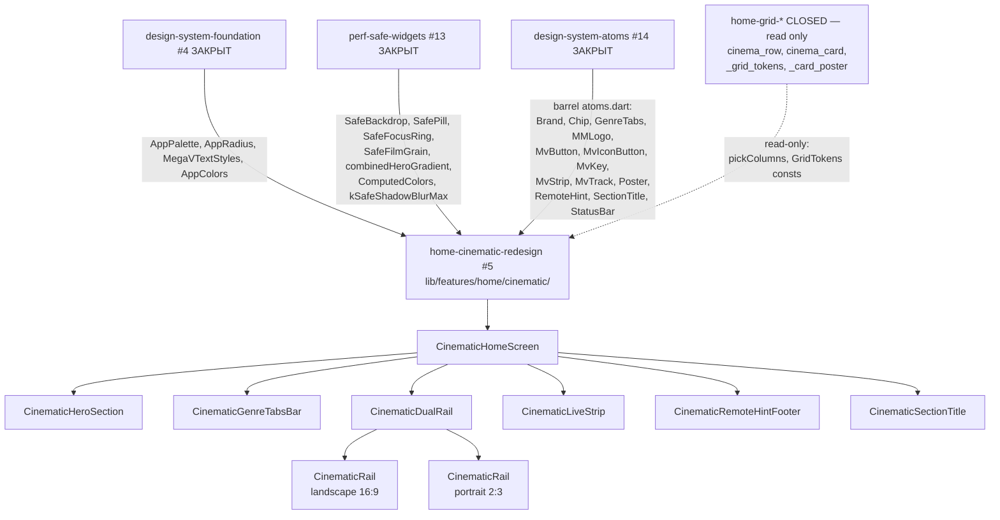

# Design Document — home-cinematic-redesign

## Overview

`home-cinematic-redesign` собирает Cinematic A раскладку главного экрана из foundation-блоков (`design-system-foundation` #4, `perf-safe-widgets` #13, `design-system-atoms` #14). Все новые файлы живут в **новом** пакете `lib/features/home/cinematic/`, не пересекаясь с закрытыми `home-grid-optimization` и `home-grid-visual-polish`. Существующий `lib/features/home/home_screen.dart` остаётся нетронутым; переключение между legacy и cinematic — через single Riverpod-flag `useCinematicHomeProvider` (Req 11).

Спек **не** перепиывает `cinema_row.dart` / `cinema_card.dart`. Для контентных рядов с landscape vs portrait aspect мы **не** правим closed widgets, а строим параллельные тонкие rail-обёртки на атомах `Poster` + горизонтальном `ListView` с теми же perf-настройками (`cacheExtent: 1500`, `addAutomaticKeepAlives`, `addRepaintBoundaries`, `clipBehavior: Clip.none`). Где возможно (live эфир / movies row с уже-привычным aspect), допустимо инстанцировать существующий `CategoryRowWrapper` без модификации — но это не source of truth для poster-aspect; новые rail-обёртки обязательны для landscape/portrait dual-rail (Req 4).

### Goals

- Cinematic A экран live + не ломает 94/94 существующих теста.
- Hero / GenreTabs / Dual-rail / Live эфир / RemoteHint footer — все из atoms + perf-safe primitives.
- Italic display titles через `MegaVTextStyles.displayLarge` / `displayMedium`.
- Single Riverpod-flag для безопасного отката.
- 0 hits на `BackdropFilter|ShaderMask|ImageFilter\.blur` в `lib/features/home/cinematic/` (Req 13.3).
- 0 `BoxShadow.blurRadius > kSafeShadowBlurMax` в новом коде (Req 9.2).

### Non-Goals

- Переписать `cinema_row.dart` / `cinema_card.dart` (closed).
- Менять `pickColumns 3/4/5` (closed).
- Editorial Bento (#6 — отдельный спек).
- Mobile (#12 — отдельный спек).
- Менять sealed `PlayerUiState` (#8).
- Возвращать `BoxShadow.blurRadius=50`, `ShaderMask`, `BackdropFilter`.
- Native player engines, API/data layer, routing-как-сущность.

## Boundary Commitments

### This Spec Owns

- `lib/features/home/cinematic/` (NEW directory).
- `lib/features/home/cinematic/cinematic_home_screen.dart` (NEW — top widget).
- `lib/features/home/cinematic/cinematic_hero_section.dart` (NEW).
- `lib/features/home/cinematic/cinematic_genre_tabs_bar.dart` (NEW).
- `lib/features/home/cinematic/cinematic_dual_rail.dart` (NEW).
- `lib/features/home/cinematic/cinematic_rail.dart` (NEW — landscape / portrait rail builder).
- `lib/features/home/cinematic/cinematic_live_strip.dart` (NEW).
- `lib/features/home/cinematic/cinematic_section_title.dart` (NEW).
- `lib/features/home/cinematic/cinematic_remote_hint_footer.dart` (NEW).
- `lib/features/home/cinematic/use_cinematic_home_provider.dart` (NEW — single source-of-truth Riverpod flag).
- `test/features/home/cinematic/` (NEW directory with widget + smoke + regression tests).
- Single mounting hook (one of):
  - **Option A**: new file `lib/features/home/cinematic/cinematic_home_router.dart` exporting a `Widget homeRootBuilder()` that switches based on `useCinematicHomeProvider`. Existing route registration in `app_router.dart` (or equivalent) gets ONE-LINE swap from `HomeScreen()` → `homeRootBuilder()`. The one-line touch in router file is acceptable only if it doesn't otherwise modify route structure; alternatively:
  - **Option B**: register a parallel route `/home-cinematic` and leave `/home` pointing to legacy `HomeScreen`. QA flips the default initial location via the same provider. **Option B is preferred** — zero modifications to existing route entries.

### Out of Boundary

- `lib/features/home/widgets/*` — read-only (closed specs).
- `lib/features/home/home_screen.dart` — read-only.
- `lib/features/home/providers/*` — read-only (existing weather provider untouched).
- `lib/core/theme/*`, `lib/core/perf/*`, `lib/core/ui/atoms/*` — read-only foundation deps.
- `lib/core/player/*`, `lib/core/api/*`, `lib/core/playlist/*`, `lib/core/epg/*`, `lib/core/providers/*` — read-only data layer.
- `pubspec.yaml` — NO new packages (Req 13.4).

### Allowed Dependencies

- Upstream: `package:flutter/material.dart`, `package:flutter_riverpod/flutter_riverpod.dart`, `package:flutter_screenutil/flutter_screenutil.dart`.
- Upstream: `package:megav_iptv/core/theme/...` (AppPalette, AppRadius, AppColors proxy, MegaVTextStyles, themeProvider).
- Upstream: `package:megav_iptv/core/perf/perf_safe_widgets.dart` (SafePill, SafeFocusRing, SafeFilmGrain, SafeBackdrop, combinedHeroGradient, ComputedColors, kSafeShadowBlurMax).
- Upstream: `package:megav_iptv/core/ui/atoms/atoms.dart` (Brand, Chip, GenreTabs, MMLogo, MvButton, MvIconButton, MvKey, MvStrip, MvTrack, Poster, RemoteHint, SectionTitle, StatusBar).
- **Import discipline**: Files that import both `package:flutter/material.dart` and the atoms barrel MUST use `import 'package:flutter/material.dart' hide Chip;` because Material exports its own `Chip` widget that shadows our atom (lesson recorded in design-system-atoms Implementation Notes).
- Upstream: existing data providers (`categoryNotifierProvider`, `moviesNotifierProvider`, others under `lib/core/providers/providers.dart`).
- Upstream (READ-ONLY import for column constants): `lib/features/home/widgets/_grid_tokens.dart`'s public `pickColumns` and `GridTokens` constants.

### Revalidation Triggers

- Any palette token rename in `AppPalette` — cinematic widgets reading those revalidate.
- Any new safe-primitive in `perf-safe-widgets` — cinematic may want to compose it.
- Any new atom added in `design-system-atoms` — cinematic may want to switch over.
- Any change to `pickColumns` thresholds (would only land via re-opening closed spec) — regression test in Req 12.3 fires.

## Architecture

### Existing Architecture Analysis

The codebase has clear precedents:
- `lib/features/home/home_screen.dart` (legacy, 404 lines) — Riverpod `ConsumerStatefulWidget`, hero + ListView of `CategoryRowWrapper`, boot overlay, preview-видео.
- `lib/features/home/widgets/cinema_row.dart` (closed) — `CategoryRowWrapper` fetches paginated data; renders `CinemaRow` with debounced focus, fade-edge, precache.
- `lib/features/home/widgets/cinema_card.dart` (closed) — `Transform.scale(1.08)` focus, no shadow blur.
- `lib/core/ui/atoms/atoms.dart` — barrel of 13 atoms.

This spec adopts the same idioms: Riverpod-aware top widget, horizontal ListView with the same perf flags, 150 ms / 400 ms Leanback timings — but composes everything from atoms + perf-safe primitives.

### Architecture Pattern & Boundary Map



**Pattern**: leaf-feature package, pure Riverpod consumers, no global state beyond a single `useCinematicHomeProvider` flag.
**Domain boundary**: `lib/features/home/cinematic/` is the new leaf; closed widgets are read-only imports.

### Technology Stack

| Layer | Choice | Role | Notes |
|---|---|---|---|
| UI primitives | Flutter widgets via atoms barrel | All cinematic widgets | No third-party. |
| Theming | `AppPalette`, `MegaVTextStyles` (#4) | Color / typography | Read via `Theme.of(context)` and `AppColors.X`. |
| Perf primitives | `SafeBackdrop`, `SafePill`, `SafeFocusRing`, `SafeFilmGrain`, `combinedHeroGradient` (#13) | Glassy / focus / grain visuals | No raw blur in hot-path. |
| Atoms | `Poster`, `Chip`, `MvTrack`, `MvButton`, `GenreTabs`, `RemoteHint`, `SectionTitle`, `MMLogo` (#14) | Composition | All via barrel. |
| Riverpod | `flutter_riverpod` | Flag (`useCinematicHomeProvider`), data providers reuse | No new providers beyond flag. |
| Routing | `go_router` (existing) | Optional `/home-cinematic` route OR builder swap | Per Req 1.2 (Option B preferred). |
| Animations | `Transform.scale`, `AnimationController` inside atoms | Focus emphasis | Atoms own animations; cinematic widgets do not animate widths. |
| Testing | `flutter_test`, `WidgetTester` | Widget + smoke + regression | No new test packages. |

## File Structure Plan

### New files

```
megav_iptv/
├─ lib/
│  └─ features/
│     └─ home/
│        └─ cinematic/                                 [NEW DIR]
│           ├─ cinematic_home_screen.dart              [NEW] CinematicHomeScreen (Req 1, 8, 9, 13)
│           ├─ cinematic_hero_section.dart             [NEW] CinematicHeroSection (Req 2)
│           ├─ cinematic_genre_tabs_bar.dart           [NEW] CinematicGenreTabsBar (Req 3)
│           ├─ cinematic_dual_rail.dart                [NEW] CinematicDualRail (Req 4)
│           ├─ cinematic_rail.dart                     [NEW] CinematicRail builder (Req 4, 9)
│           ├─ cinematic_live_strip.dart               [NEW] CinematicLiveStrip (Req 6)
│           ├─ cinematic_section_title.dart            [NEW] CinematicSectionTitle (Req 5)
│           ├─ cinematic_remote_hint_footer.dart       [NEW] CinematicRemoteHintFooter (Req 7)
│           └─ use_cinematic_home_provider.dart        [NEW] useCinematicHomeProvider (Req 11)
└─ test/
   └─ features/
      └─ home/
         └─ cinematic/                                  [NEW DIR]
            ├─ cinematic_home_screen_smoke_test.dart    [NEW] Req 12.2
            ├─ cinematic_hero_section_test.dart        [NEW] Req 12.1, 2
            ├─ cinematic_genre_tabs_bar_test.dart      [NEW] Req 12.1, 3
            ├─ cinematic_dual_rail_test.dart           [NEW] Req 12.1, 4
            ├─ cinematic_live_strip_test.dart          [NEW] Req 12.1, 6
            ├─ cinematic_remote_hint_footer_test.dart  [NEW] Req 12.1, 7
            ├─ cinematic_section_title_test.dart       [NEW] Req 12.1, 5
            └─ pick_columns_regression_test.dart       [NEW] Req 12.3
```

Total: 9 new lib files + 8 new test files.

### Modified files

```
megav_iptv/
└─ lib/
   └─ <one of>:
      └─ app_router.dart  OR  main.dart                [MODIFIED — ONE LINE]
         only registers parallel /home-cinematic route OR adds builder switch
         (Option B from §Boundary Commitments — preferred).
```

If Option A is chosen instead, the same one-line swap lives wherever `HomeScreen()` is currently mounted as the root home content. **Implementer chooses one option in task 1.2; the chosen file is the only modified file outside the cinematic/ directory.**

NOT modified: `home_screen.dart`, `cinema_row.dart`, `cinema_card.dart`, `_card_poster.dart`, `_grid_tokens.dart`, `pubspec.yaml`, any file under `lib/core/`, any test under closed-spec ownership.

## Components and Interfaces

Each component is a `StatelessWidget` or `ConsumerWidget` unless explicitly stated. Public APIs are documented at the design level; full builds are deferred to implementer per task.

### 1. `CinematicHomeScreen` (root)

```dart
class CinematicHomeScreen extends ConsumerStatefulWidget {
  const CinematicHomeScreen({super.key});
  @override
  ConsumerState<CinematicHomeScreen> createState() => _CinematicHomeScreenState();
}
```

- Owns `FocusNode` for hero primary action (focus on mount).
- Composes vertically (top to bottom):
  1. Status / brand bar row (atoms `Brand` + `StatusBar`).
  2. `CinematicGenreTabsBar` (Req 3).
  3. `CinematicHeroSection` (Req 2) — full-width.
  4. `CinematicSectionTitle('Сейчас в эфире', countProvider)` + `CinematicDualRail.landscape(...)` (Req 4, 5).
  5. `CinematicLiveStrip` (Req 6).
  6. `CinematicSectionTitle('Фильмы', moviesCountProvider)` + `CinematicDualRail.portrait(...)` (Req 4).
  7. `CinematicRemoteHintFooter` (Req 7).
- Wraps the scrollable body in a single `CustomScrollView` / `ListView` with the perf flags from Req 9.4.
- Mounts root `Key('cinematic-home-root')` (Req 13.1).

### 2. `CinematicHeroSection`

```dart
class CinematicHeroSection extends ConsumerWidget {
  const CinematicHeroSection({super.key, required this.item, required this.onPlay});
  final NowPlayingItem item;
  final VoidCallback onPlay;
}
```

- Renders `Stack(children: [SafeBackdrop(image), DecoratedBox(combinedHeroGradient(palette)), SafeFilmGrain(), Positioned(content)])`.
- Content column: italic title via `Theme.of(context).megavText.displayLarge.copyWith(fontStyle: FontStyle.italic)`, meta row (`Chip(variant: live)` + `MMLogo` + `MegaVTextStyles.metaMono`), `MvButton.primary('Смотреть')` with FocusNode.
- Single `Shadow(blurRadius: kSafeShadowBlurMax)` on title text — never higher (Req 9.2).
- Wraps the time-driven progress (if any) in a child `RepaintBoundary` consumer (Req 9.6, 6.3).
- Key: `Key('cinematic-hero')`.

### 3. `CinematicGenreTabsBar`

```dart
class CinematicGenreTabsBar extends ConsumerWidget {
  const CinematicGenreTabsBar({super.key});
}
```

- Reads selected-genre + counts from existing providers (or a new tiny provider in `use_cinematic_home_provider.dart` if necessary; design defers to task).
- Composes `GenreTabs` atom + two edge-fade `Positioned + IgnorePointer + DecoratedBox(LinearGradient)` overlays (Req 3.4).
- Key: `Key('cinematic-genre-tabs')`.

### 4. `CinematicDualRail` + `CinematicRail`

```dart
class CinematicDualRail extends StatelessWidget {
  const CinematicDualRail.landscape({super.key, required this.items, required this.onItemTap, this.onItemFocus});
  const CinematicDualRail.portrait({super.key, required this.items, required this.onItemTap, this.onItemFocus});
  final List<NowPlayingItem> items;
  final void Function(NowPlayingItem) onItemTap;
  final void Function(NowPlayingItem?)? onItemFocus;
}

class CinematicRail extends StatefulWidget {
  const CinematicRail({super.key, required this.orientation, required this.items, required this.onItemTap, this.onItemFocus});
  final PosterOrientation orientation;
  final List<NowPlayingItem> items;
  final void Function(NowPlayingItem) onItemTap;
  final void Function(NowPlayingItem?)? onItemFocus;
}
```

- `CinematicDualRail` is a thin façade — landscape/portrait named ctors construct one or two `CinematicRail` instances.
- `CinematicRail` builds a horizontal `ListView.builder` with Req 9.4 flags. Each item is a `Poster(orientation:..., hideText: true, isFocused: idx == _focusedIndex, onFocusChange:...)` wrapped in a `Focus` + `Transform.scale(focused ? 1.08 : 1.0)`.
- Focus debounce 400 ms for `onItemFocus` heavy callback (Req 9.5).
- Reads `pickColumns(MediaQuery.of(context).size.width)` from `_grid_tokens.dart` (READ-ONLY import) to size the visible window — does **not** modify the function (Req 10.3).
- Keys: `Key('cinematic-dual-rail-landscape')`, `Key('cinematic-dual-rail-portrait')`.

### 5. `CinematicLiveStrip`

```dart
class CinematicLiveStrip extends ConsumerWidget {
  const CinematicLiveStrip({super.key});
}
```

- Renders `Row([Chip(variant: ChipVariant.live, label: 'LIVE'), MMLogo, Column([title via headline, next via metaMono]), MvTrack(progress)])`.
- Time-driven progress consumer is a private nested `class _LiveProgress extends ConsumerWidget` wrapped in `RepaintBoundary` with a `const _LiveProgress()` constructor (Req 6.3, 9.6).
- Key: `Key('cinematic-live-strip')`.

### 6. `CinematicSectionTitle`

```dart
class CinematicSectionTitle extends StatelessWidget {
  const CinematicSectionTitle({super.key, required this.label, required this.emphasis, this.count, this.onMoreTap});
  final String label;
  final String emphasis;
  final int? count;
  final VoidCallback? onMoreTap;
}
```

- Thin wrapper around the `SectionTitle` atom — passes label + italic em + count + optional more action.
- Key: `Key('cinematic-section-title-${label}')` (deterministic-by-label so tests can locate specific titles; allowed to override with explicit key).

### 7. `CinematicRemoteHintFooter`

```dart
class CinematicRemoteHintFooter extends StatelessWidget {
  const CinematicRemoteHintFooter({super.key});
}
```

- Renders `RemoteHint` atom inside `IgnorePointer + ExcludeFocus + RepaintBoundary` with `const` ctor.
- Key: `Key('cinematic-remote-hint')`.

### 8. `useCinematicHomeProvider` (Riverpod flag)

```dart
final useCinematicHomeProvider = StateProvider<bool>((ref) => kCinematicHomeDefault);

const bool kCinematicHomeDefault = true; // single source of truth (Req 11.4)
```

- Single file: `lib/features/home/cinematic/use_cinematic_home_provider.dart`.
- Default is configurable in one constant (`kCinematicHomeDefault`) per Req 11.4.
- Consumed by router (Option A) or by initial-location resolver (Option B).

## Data Models

No new data models. The cinematic module reuses:
- `NowPlayingItem` from `lib/core/playlist/models/now_playing.dart`.
- `Channel` from `lib/core/playlist/models/channel.dart`.
- `CinemaCategory` from `lib/features/home/widgets/cinema_row.dart` (READ-ONLY type import — no extension, no modification).

## Error Handling

- Hero rendering: if `item == null` or `backdrop` URL fails, fall back to solid `AppPalette.surface1` background — no crash.
- Rails: if `items.isEmpty && asyncData.hasError`, render a single-line muted error (matching legacy `_CinemaRowLoadingPlaceholder` aesthetic, but composed from `Text` + atom; do **not** import the closed widget's private placeholder).
- Live strip: if `currentProgramme == null`, render only `Chip(variant: live)` + channel name; omit progress + title rows.
- GenreTabs: if `categories.isEmpty`, render an empty 56-px-tall placeholder pill row; do not crash.

## Performance Considerations

- **Hero**: single `combinedHeroGradient` instead of stacked gradients (saves 2-4 ms/frame per `flutter-tv-perf.md`).
- **Hero**: `SafeBackdrop` pre-rendered cache, NO runtime `BackdropFilter` (saves 6+ ms/frame on Mali).
- **Hero**: text shadow capped at `kSafeShadowBlurMax = 12.0`.
- **GenreTabs**: edge-fade is `DecoratedBox(LinearGradient)` overlay (proven 78% improvement vs `ShaderMask` per `flutter-tv-perf.md`).
- **Rails**: `ListView.builder` with `cacheExtent: 1500`, `addAutomaticKeepAlives: true`, `addRepaintBoundaries: true`, `clipBehavior: Clip.none`.
- **Rails**: focus emphasis = `Transform.scale(1.08)` (GPU-only, no relayout).
- **Rails**: focus-stable timer 400 ms before invoking heavy `onItemFocus` (Leanback `lb_card_selected_animation_delay`).
- **Live strip**: progress consumer in nested `_LiveProgress` `ConsumerWidget` wrapped in `RepaintBoundary`; parent `const` ctor — stream tick does NOT bubble.
- **Footer**: `const RemoteHint()` inside `RepaintBoundary` + `IgnorePointer` + `ExcludeFocus` — never rebuilds on focus change elsewhere.
- **No `BackdropFilter`, no `ShaderMask`, no `BoxShadow.blurRadius > 12`** anywhere in the new code (Req 9.1, 9.2 — verifiable via grep, Req 13.3).
- **Steady-state target**: avg `GPURasterizer::Draw ≤ 16.7 ms` on rtd2851a during scroll across the new screen (parity with closed `home-grid-*` baseline).

## Testing Strategy

| Layer | Tool | Scope |
|---|---|---|
| Widget tests | `flutter_test` `WidgetTester` | Each new widget pumped with mock providers; asserts Key presence + atom usage + no exceptions. |
| Smoke test | `flutter_test` | `CinematicHomeScreen` pumped with full mock provider scope; two frames; asserts no exception, asserts presence of all 6 Keys (Req 13.1). |
| Regression | `flutter_test` | Imports `pickColumns` from `_grid_tokens.dart` and asserts return values for 1280 / 2560 / 3840 — i.e., `3 / 4 / 5` (Req 12.3). |
| Static check | `flutter analyze` | Cinematic dir clean (Req 13.2). |
| Grep check | shell / CI | `grep -rE "BackdropFilter|ShaderMask|ImageFilter\.blur" lib/features/home/cinematic/` returns 0 (Req 13.3). |
| Grep check | shell / CI | `grep -rE "blurRadius:\s*([2-9][0-9]+\|1[3-9])" lib/features/home/cinematic/` returns 0 (Req 9.2 enforcement). |
| Full suite | `flutter test` | 94 baseline + new cinematic tests all green (Req 12.4). |

## Migration / Rollout

- **Stage 0**: scaffold + provider flag + skeleton CinematicHomeScreen with Keys (no real content). Verify smoke test green. Existing `HomeScreen` route unchanged. `kCinematicHomeDefault = false` initially.
- **Stage 1**: implement Hero + GenreTabs. Smoke + widget tests for each.
- **Stage 2**: implement DualRail (landscape + portrait) + SectionTitle. Smoke + widget tests.
- **Stage 3**: implement LiveStrip + RemoteHintFooter. Final smoke test renders full screen.
- **Stage 4**: regression test for `pickColumns`. Run full `flutter test` — must be 94 + new green.
- **Stage 5 (rollout)**: flip `kCinematicHomeDefault = true`. Manual VM Service smoke pass on rtd2851a with avg `GPURasterizer::Draw ≤ 16.7 ms` confirmation.

## Traceability — Requirement → Component

| Req # | Requirement summary | Owning component(s) | Notes |
|---|---|---|---|
| 1 | Screen scaffold + entry | `CinematicHomeScreen`, `useCinematicHomeProvider`, router/builder swap | Option B preferred. |
| 2 | Hero w/ SafeBackdrop + grain + combined gradient | `CinematicHeroSection` | Italic display via `MegaVTextStyles.displayLarge`. |
| 3 | GenreTabs + edge-fade | `CinematicGenreTabsBar` | DecoratedBox-only fade. |
| 4 | Dual-rail landscape + portrait | `CinematicDualRail`, `CinematicRail` | Closed widgets untouched. |
| 5 | Section title with italic em | `CinematicSectionTitle` (wraps atom `SectionTitle`). | |
| 6 | Live эфир with pulse Chip | `CinematicLiveStrip` (+ private `_LiveProgress`) | RepaintBoundary on stream consumer. |
| 7 | Remote hint footer | `CinematicRemoteHintFooter` | const + IgnorePointer + ExcludeFocus. |
| 8 | Focus visuals via SafeFocusRing | All cinematic widgets that wrap focusables | No shadow blur > 12. |
| 9 | Perf compliance | Cross-cutting | Enforced via grep + ListView flags + Leanback timings + RepaintBoundary. |
| 10 | Backward compat with closed specs | Cross-cutting | NO writes outside `lib/features/home/cinematic/` + 1-line router swap. |
| 11 | Feature-flag rollout | `useCinematicHomeProvider`, `kCinematicHomeDefault` | Single source of truth. |
| 12 | Test coverage + regression | All `test/features/home/cinematic/*` | 94/94 baseline preserved. |
| 13 | Testability + observable hooks | Keys on every component + grep checks + analyze clean | CI-checkable. |

## Open Decisions Deferred to Implementation

- **Option A vs B for entry**: implementer picks in task 1.2. Recommend Option B (parallel route) for minimal touch outside cinematic dir.
- **Initial value of `kCinematicHomeDefault`**: starts `false`; flipped to `true` in Stage 5 after VM Service GO.
- **`CinematicGenreTabsBar` data source**: either reuse an existing categories provider or expose a tiny derived provider inside `use_cinematic_home_provider.dart`. Implementer chooses based on the simplest non-modifying read of existing providers.
- **`CinematicLiveStrip` time source**: either polls `DateTime.now()` via a private 1-Hz `Ticker`-backed `StateNotifier` inside the cinematic dir OR consumes an existing time provider if one is exposed. Implementer chooses; ticker-backed is acceptable as long as it lives inside the `_LiveProgress` `ConsumerWidget` (Req 9.6).
