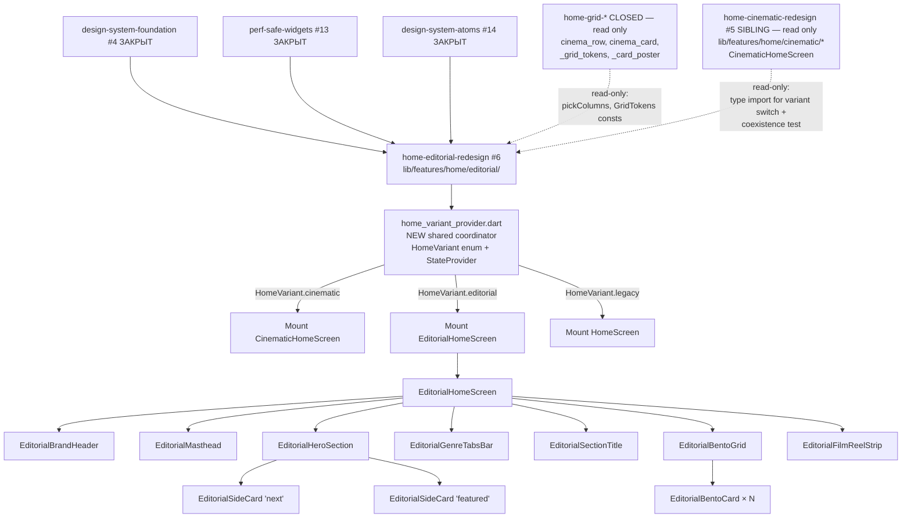

# Design Document — home-editorial-redesign

## Overview

`home-editorial-redesign` собирает Editorial B раскладку главного экрана из foundation-блоков (`design-system-foundation` #4, `perf-safe-widgets` #13, `design-system-atoms` #14). Все новые widget-файлы живут в **новом** пакете `lib/features/home/editorial/`, не пересекаясь ни с закрытыми `home-grid-optimization` / `home-grid-visual-polish`, ни с sibling-spec `home-cinematic-redesign` (#5).

Editorial существует **параллельно** с Cinematic — оба варианта переключаются через единственный shared Riverpod-flag `homeVariantProvider` (enum `HomeVariant { cinematic, editorial, legacy }`), персистируемый per-user. Это даёт QA / пользователю возможность мгновенного переключения без code revert и оставляет cinematic-spec нетронутым (его внутренний `useCinematicHomeProvider` либо становится derived view, либо живёт независимо — implementer выбирает в task 1.1 без модификации cinematic-кода).

Editorial layout эмулирует газетный разворот: italic display masthead → hero-row из портретного 420×620 poster + meta-колонки → editorial section title → 6-колоночная бенто-grid с карточками 1×1, 1×2, 2×1, 2×2 → film-reel strip каналов внизу. Все «glassy» эффекты дизайна (e.g., `backdrop-filter: blur(12px)` на side-cards в HTML-прототипе) **не реплицируются runtime'ом** — заменяются на flat semi-opaque palette surface + `Border.all(palette.line)` (Req 4.2), что даёт визуально близкий результат без GPU-затрат.

### Goals

- Editorial B экран live + не ломает 94/94 baseline тестов и не ломает sibling cinematic-spec тесты.
- Masthead / Hero+SideCards / Bento Grid / Film-reel strip / Editorial GenreTabs — все из atoms + perf-safe primitives.
- Italic display titles через `MegaVTextStyles.displayLarge` / `displayMedium`, mono meta через `MegaVTextStyles.metaMono`.
- Single shared Riverpod-flag `homeVariantProvider` для координации Cinematic ↔ Editorial; персистентность per-user.
- 0 hits на `BackdropFilter|ShaderMask|ImageFilter\.blur` в `lib/features/home/editorial/` (Req 13.3).
- 0 `BoxShadow.blurRadius > kSafeShadowBlurMax` в новом коде (Req 9.2, 13.5).
- 0 модификаций cinematic-spec файлов.

### Non-Goals

- Переписать `cinema_row.dart` / `cinema_card.dart` (closed).
- Менять `pickColumns 3/4/5` (closed).
- Переписать или модифицировать любой файл из `lib/features/home/cinematic/*` (sibling spec).
- Cinematic A (#5 — отдельный спек, остаётся unchanged).
- Mobile (#12 — отдельный спек).
- Менять sealed `PlayerUiState` (#8).
- Возвращать `BoxShadow.blurRadius=50`, `ShaderMask`, `BackdropFilter`.
- Native player engines, API/data layer, routing-как-сущность.
- Добавлять `cached_network_image` или другие пакеты в `pubspec.yaml`.

## Boundary Commitments

### This Spec Owns

- `lib/features/home/editorial/` (NEW directory).
- `lib/features/home/editorial/editorial_home_screen.dart` (NEW — top widget).
- `lib/features/home/editorial/editorial_masthead.dart` (NEW).
- `lib/features/home/editorial/editorial_hero_section.dart` (NEW).
- `lib/features/home/editorial/editorial_side_card.dart` (NEW).
- `lib/features/home/editorial/editorial_bento_grid.dart` (NEW).
- `lib/features/home/editorial/editorial_bento_card.dart` (NEW).
- `lib/features/home/editorial/editorial_film_reel_strip.dart` (NEW).
- `lib/features/home/editorial/editorial_section_title.dart` (NEW).
- `lib/features/home/editorial/editorial_genre_tabs_bar.dart` (NEW).
- `lib/features/home/editorial/editorial_brand_header.dart` (NEW).
- `lib/features/home/home_variant_provider.dart` (NEW — shared coordinator, single file outside `editorial/` dir).
- `test/features/home/editorial/` (NEW directory with widget + smoke + regression + coexistence tests).
- Single mounting hook (one of):
  - **Option A**: extend whatever entry-switch was added by `home-cinematic-redesign` (e.g., a `homeRootBuilder()` that currently switches on `useCinematicHomeProvider`) to read `homeVariantProvider` instead — ONE-LINE change. Preferred only if the cinematic-spec landed Option A entry; otherwise switch automatically.
  - **Option B (preferred)**: register a parallel route `/home-editorial` and leave `/home` and `/home-cinematic` (if registered by cinematic-spec) pointing to their existing screens. Initial location resolver reads `homeVariantProvider`. **Option B is preferred** — zero modifications to existing route entries.

### Out of Boundary

- `lib/features/home/widgets/*` — read-only (closed specs).
- `lib/features/home/cinematic/*` — read-only (sibling `home-cinematic-redesign` #5).
- `lib/features/home/home_screen.dart` — read-only.
- `lib/features/home/providers/*` — read-only (existing weather provider untouched).
- `lib/core/theme/*`, `lib/core/perf/*`, `lib/core/ui/atoms/*` — read-only foundation deps.
- `lib/core/player/*`, `lib/core/api/*`, `lib/core/playlist/*`, `lib/core/epg/*`, `lib/core/providers/*` — read-only data layer.
- `pubspec.yaml` — NO new packages (Req 13.4).

### Allowed Dependencies

- Upstream: `package:flutter/material.dart`, `package:flutter_riverpod/flutter_riverpod.dart`, `package:flutter_screenutil/flutter_screenutil.dart`, `package:shared_preferences/shared_preferences.dart` (already in pubspec — no new package added).
- Upstream: `package:megav_iptv/core/theme/...` (AppPalette, AppRadius, AppColors proxy, MegaVTextStyles, themeProvider).
- Upstream: `package:megav_iptv/core/perf/perf_safe_widgets.dart` (SafePill, SafeFocusRing, SafeFilmGrain, SafeBackdrop, combinedHeroGradient, ComputedColors, kSafeShadowBlurMax).
- Upstream: `package:megav_iptv/core/ui/atoms/atoms.dart` (Brand, Chip, GenreTabs, MMLogo, MvButton, MvIconButton, MvKey, MvStrip, MvTrack, Poster, RemoteHint, SectionTitle, StatusBar).
- **Import discipline**: Files importing both `package:flutter/material.dart` and the atoms barrel MUST use `import 'package:flutter/material.dart' hide Chip;` to avoid shadow with Material's `Chip` widget.
- Upstream: existing data providers (`categoryNotifierProvider`, `moviesNotifierProvider`, others under `lib/core/providers/providers.dart`).
- Upstream (READ-ONLY type import): `package:megav_iptv/features/home/cinematic/cinematic_home_screen.dart` — used only in coexistence test and in the entry-switch to mount the cinematic widget. NO modification.
- Upstream (READ-ONLY import for column constants): `lib/features/home/widgets/_grid_tokens.dart`'s public `pickColumns` and `GridTokens` constants.

### Revalidation Triggers

- Any palette token rename in `AppPalette` — editorial widgets reading those revalidate.
- Any new safe-primitive in `perf-safe-widgets` — editorial may want to compose it.
- Any new atom added in `design-system-atoms` — editorial may want to switch over.
- Any change to `pickColumns` thresholds (would only land via re-opening closed spec) — regression test in Req 12.3 fires.
- Any change to `CinematicHomeScreen` public API — editorial coexistence test (Req 12.4) revalidates.

## Architecture

### Existing Architecture Analysis

The codebase has clear precedents:
- `lib/features/home/home_screen.dart` (legacy, 404 lines) — Riverpod `ConsumerStatefulWidget`, hero + ListView of `CategoryRowWrapper`, boot overlay, preview-видео.
- `lib/features/home/cinematic/cinematic_home_screen.dart` (sibling, just-generated) — Cinematic A variant; this spec mirrors its conventions but in a new directory.
- `lib/features/home/widgets/cinema_row.dart` (closed) — `CategoryRowWrapper` fetches paginated data.
- `lib/core/ui/atoms/atoms.dart` — barrel of 13 atoms.

This spec adopts the same idioms: Riverpod-aware top widget, horizontal/vertical layouts with the same perf flags, 150 ms / 400 ms Leanback timings — but composes Editorial layout from atoms + perf-safe primitives.

### Architecture Pattern & Boundary Map — Cinematic vs Editorial dual-route



**Pattern**: leaf-feature package, pure Riverpod consumers. Editorial and Cinematic are siblings; the shared `homeVariantProvider` is the only coordination point. Both screens compose from the same foundation/atoms barrel.
**Domain boundary**: `lib/features/home/editorial/` is the new leaf. Closed widgets and the cinematic-spec are read-only imports (cinematic only for type-reference in entry-switch and coexistence test).

### Technology Stack

| Layer | Choice | Role | Notes |
|---|---|---|---|
| UI primitives | Flutter widgets via atoms barrel | All editorial widgets | No third-party. |
| Theming | `AppPalette`, `MegaVTextStyles` (#4) | Color / typography | Read via `Theme.of(context)` and `AppColors.X`. |
| Perf primitives | `SafeBackdrop`, `SafePill`, `SafeFocusRing`, `SafeFilmGrain`, `combinedHeroGradient` (#13) | Glassy / focus / grain visuals | No raw blur in hot-path. |
| Atoms | `Poster`, `Chip`, `MvTrack`, `MvButton`, `MvStrip`, `Brand`, `GenreTabs`, `RemoteHint`, `SectionTitle`, `MMLogo`, `StatusBar` (#14) | Composition | All via barrel. |
| Riverpod | `flutter_riverpod` | Shared `homeVariantProvider`; data providers reuse | One new provider (variant flag). |
| Persistence | `shared_preferences` (existing in pubspec) | Persist HomeVariant per-user | NO new package; reuse existing dependency. |
| Routing | `go_router` (existing) | Optional `/home-editorial` route OR builder swap | Per Req 1.2 (Option B preferred). |
| Animations | `Transform.scale`, `AnimationController` inside atoms | Focus emphasis | Atoms own animations; editorial widgets do not animate widths. |
| Testing | `flutter_test`, `WidgetTester` | Widget + smoke + regression + coexistence | No new test packages. |

## File Structure Plan

### New files

```
megav_iptv/
├─ lib/
│  └─ features/
│     └─ home/
│        ├─ home_variant_provider.dart                 [NEW] HomeVariant enum + provider (Req 11)
│        └─ editorial/                                  [NEW DIR]
│           ├─ editorial_home_screen.dart              [NEW] EditorialHomeScreen (Req 1, 9, 13)
│           ├─ editorial_brand_header.dart             [NEW] EditorialBrandHeader (Req 13.1)
│           ├─ editorial_masthead.dart                 [NEW] EditorialMasthead (Req 2)
│           ├─ editorial_hero_section.dart             [NEW] EditorialHeroSection (Req 3)
│           ├─ editorial_side_card.dart                [NEW] EditorialSideCard (Req 4)
│           ├─ editorial_bento_grid.dart               [NEW] EditorialBentoGrid (Req 5)
│           ├─ editorial_bento_card.dart               [NEW] EditorialBentoCard (Req 6)
│           ├─ editorial_film_reel_strip.dart          [NEW] EditorialFilmReelStrip (Req 7)
│           ├─ editorial_section_title.dart            [NEW] EditorialSectionTitle (Req 8.1-8.3)
│           └─ editorial_genre_tabs_bar.dart           [NEW] EditorialGenreTabsBar (Req 8.4)
└─ test/
   └─ features/
      └─ home/
         └─ editorial/                                  [NEW DIR]
            ├─ editorial_home_screen_smoke_test.dart    [NEW] Req 12.2
            ├─ editorial_masthead_test.dart            [NEW] Req 12.1, 2
            ├─ editorial_hero_section_test.dart        [NEW] Req 12.1, 3
            ├─ editorial_side_card_test.dart           [NEW] Req 12.1, 4
            ├─ editorial_bento_grid_test.dart          [NEW] Req 12.1, 5
            ├─ editorial_bento_card_test.dart          [NEW] Req 12.1, 6
            ├─ editorial_film_reel_strip_test.dart     [NEW] Req 12.1, 7
            ├─ editorial_section_title_test.dart       [NEW] Req 12.1, 8
            ├─ editorial_genre_tabs_bar_test.dart      [NEW] Req 12.1, 8
            ├─ editorial_brand_header_test.dart        [NEW] Req 12.1, 13.1
            ├─ home_variant_coexistence_test.dart      [NEW] Req 11, 12.4
            └─ pick_columns_regression_test.dart       [NEW] Req 12.3 (or shared with cinematic if collision avoided via different filename)
```

Total: 11 new lib files + 12 new test files.

### Modified files

```
megav_iptv/
└─ lib/
   └─ <one of>:
      └─ app_router.dart  OR  main.dart                [MODIFIED — ONE LINE]
         only registers parallel /home-editorial route OR adds builder switch reading homeVariantProvider
         (Option B from §Boundary Commitments — preferred).
```

If Option A is chosen instead, the same one-line swap lives wherever the cinematic-spec's entry-switch was placed. **Implementer chooses one option in task 1.2; the chosen file is the only modified file outside the editorial/ directory and `home_variant_provider.dart`.**

NOT modified: `home_screen.dart`, `cinema_row.dart`, `cinema_card.dart`, `_card_poster.dart`, `_grid_tokens.dart`, **any file under `lib/features/home/cinematic/`**, `pubspec.yaml`, any file under `lib/core/`, any test under closed-spec ownership, any test under cinematic-spec ownership.

## Components and Interfaces

Each component is a `StatelessWidget` or `ConsumerWidget` unless explicitly stated. Public APIs are documented at the design level; full builds are deferred to implementer per task.

### 1. `EditorialHomeScreen` (root)

```dart
class EditorialHomeScreen extends ConsumerStatefulWidget {
  const EditorialHomeScreen({super.key});
  @override
  ConsumerState<EditorialHomeScreen> createState() => _EditorialHomeScreenState();
}
```

- Owns `FocusNode` for hero primary action (focus on mount).
- Composes vertically (top to bottom):
  1. `EditorialBrandHeader` — large `Brand` atom + StatusBar row.
  2. `EditorialMasthead` (Req 2).
  3. `EditorialHeroSection` (Req 3) — full-width with two side-cards inside meta column.
  4. `EditorialGenreTabsBar` (Req 8.4).
  5. `EditorialSectionTitle('Кино', emphasis: 'без расписания', count: ...)` (Req 8.1).
  6. `EditorialBentoGrid(cells: [...])` (Req 5) with ≥ 8 `EditorialBentoCard` instances.
  7. `EditorialFilmReelStrip(channelCount: 124, activeIndex: 4)` (Req 7).
- Wraps the scrollable body in a single `CustomScrollView` (slivers preferred for bento) with the perf flags from Req 9.4.
- Mounts root `Key('editorial-home-root')` (Req 13.1).

### 2. `EditorialMasthead`

```dart
class EditorialMasthead extends StatelessWidget {
  const EditorialMasthead({super.key, required this.label, required this.emphasis, required this.dateLine, required this.issueNumber});
  final String label;          // «Главная»
  final String emphasis;       // «сегодня»
  final String dateLine;       // «9 МАЯ 2026»
  final int issueNumber;       // 127
}
```

- Renders `Container(decoration: BoxDecoration(border: Border(bottom: BorderSide(color: palette.line))))` with internal `Row(crossAxisAlignment: baseline)` containing `[RichText(label + italic em via TextSpan), Text('${dateLine} · ВЫПУСК №${issueNumber}', style: metaMono)]`.
- Italic em fragment uses `TextSpan(text: ' $emphasis', style: TextStyle(fontStyle: FontStyle.italic, color: palette.textDim))`.
- Single `Shadow(blurRadius: kSafeShadowBlurMax)` on title text — never higher (Req 9.2).
- Key: `Key('editorial-masthead')`.

### 3. `EditorialHeroSection`

```dart
class EditorialHeroSection extends ConsumerWidget {
  const EditorialHeroSection({super.key, required this.item, required this.onPlay, required this.onFavoriteToggle, required this.onEpgOpen, required this.nextItem, required this.featuredItem});
  final NowPlayingItem item;
  final NowPlayingItem nextItem;
  final NowPlayingItem featuredItem;
  final VoidCallback onPlay;
  final VoidCallback onFavoriteToggle;
  final VoidCallback onEpgOpen;
}
```

- Renders `Stack(children: [Positioned.fill(SafeBackdrop(image: item.backdrop, opacity: 0.35)), Positioned.fill(DecoratedBox(decoration: BoxDecoration(gradient: combinedHeroGradient(palette)))), Padding(child: Row(crossAxisAlignment: start, children: [Stack(children: [SizedBox(width: 420, height: 620, child: Poster.portrait(image: item.poster, hideText: true)), if (showEditorsPickBadge) Positioned(left: -10, top: 20, child: Transform.rotate(angle: -math.pi / 2, child: _EditorsPickBadge(index: item.index)))]), const SizedBox(width: 36), Expanded(child: _MetaColumn(...))]))])`.
- `_MetaColumn` private widget composes (top to bottom):
  - `Wrap(spacing: 8, children: [Chip(variant: live, label: 'В эфире'), Chip(variant: brand, leading: MMLogo(), label: item.channelName), Chip(variant: gold, label: 'Premiere')])`
  - Italic display title via `Theme.of(context).megavText.displayLarge.copyWith(fontStyle: FontStyle.italic, fontSize: 84)`
  - Mono meta-line: `Row(children: [Text('★ ${item.rating}', style: metaMono.copyWith(color: palette.gold)), Text(item.year, style: metaMono), Text(item.genre, style: metaMono), Text(item.duration, style: metaMono)])`
  - Summary `Text(item.summary, style: theme.megavText.body, maxLines: 4, overflow: ellipsis)` constrained to `maxWidth: 540`
  - Progress block: `MvTrack(progress: item.progress)` + mono ticks row
  - Action row: `Row(children: [MvButton.primary(label: 'Смотреть', focusNode: _heroFocus, onTap: onPlay), MvButton.ghost(label: '+ В избранное', onTap: onFavoriteToggle), MvButton.ghost(label: 'EPG', onTap: onEpgOpen)])`
  - Side-cards row: `Row(children: [Expanded(child: EditorialSideCard.next(item: nextItem)), const SizedBox(width: 14), Expanded(child: EditorialSideCard.featured(item: featuredItem))])`
- Single `Shadow(blurRadius: kSafeShadowBlurMax)` on hero title.
- Time-driven progress consumer (if any) wrapped in private `class _HeroProgress extends ConsumerWidget` under `RepaintBoundary` with `const _HeroProgress()` parent ctor (Req 9.6).
- Key: `Key('editorial-hero')`.

### 4. `EditorialSideCard`

```dart
class EditorialSideCard extends StatelessWidget {
  const EditorialSideCard.next({super.key, required this.item, required this.remaining});
  const EditorialSideCard.featured({super.key, required this.item, required this.remaining});
  final NowPlayingItem item;
  final String remaining;       // «через 55 мин»
}
```

- Renders `Focus(child: SafeFocusRing(focused: focused, child: DecoratedBox(decoration: BoxDecoration(color: palette.surface2.withOpacity(0.55), border: Border.all(color: palette.line), borderRadius: BorderRadius.circular(AppRadius.md)), child: Padding(padding: EdgeInsets.all(14), child: Row(children: [Poster.portrait(width: 84, height: 112, image: item.poster, hideText: true), const SizedBox(width: 14), Expanded(child: Column(crossAxisAlignment: start, children: [Text(label, style: metaMono.copyWith(color: palette.textMute)), Text(item.title, style: displaySmallItalic), Text('${item.year} · ${item.genre}', style: metaSmall), Text(remaining, style: metaMono.copyWith(color: palette.accent))]))]))))`.
- `label` from named ctor: `next` → 'ДАЛЕЕ В ЭФИРЕ', `featured` → 'РЕКОМЕНДУЕМ'.
- **Crucially**: NO `BackdropFilter` — flat semi-opaque palette colour replaces the design's `backdrop-filter: blur(12px)` (Req 4.2).
- Key: `Key('editorial-side-card-${slot}')` where `slot ∈ {'next','featured'}`.

### 5. `EditorialBentoGrid` + `EditorialBentoCard`

```dart
class EditorialBentoCell {
  const EditorialBentoCell({required this.item, required this.cols, required this.rows, this.live = false});
  final NowPlayingItem item;
  final int cols;       // 1..6
  final int rows;       // 1..4
  final bool live;
}

class EditorialBentoGrid extends StatelessWidget {
  const EditorialBentoGrid({super.key, required this.cells, required this.onItemTap, this.onItemFocus});
  final List<EditorialBentoCell> cells;
  final void Function(NowPlayingItem) onItemTap;
  final void Function(NowPlayingItem?)? onItemFocus;
}

class EditorialBentoCard extends StatefulWidget {
  const EditorialBentoCard({super.key, required this.cell, required this.onTap, this.onFocusChange});
  final EditorialBentoCell cell;
  final VoidCallback onTap;
  final ValueChanged<bool>? onFocusChange;
}
```

- `EditorialBentoGrid` uses Flutter's built-in sliver staggered grid pattern (e.g., `SliverGrid.builder` with a `SliverGridDelegateWithFixedCrossAxisCount` of 6 columns + per-cell `cols/rows` spans, OR the implementer adopts `flutter_staggered_grid_view` ONLY IF already present in pubspec; otherwise implementer hand-rolls a `CustomMultiChildLayout` delegate). **No new package.**
- Row height fixed at 220 lp; gap 16 lp.
- Each cell renders an `EditorialBentoCard(cell: cell, onTap: () => onItemTap(cell.item), onFocusChange: ...)`.
- `EditorialBentoCard.build`: `Stack(children: [Positioned.fill(child: Image(image: provider, fit: BoxFit.cover)), Positioned.fill(child: DecoratedBox(decoration: BoxDecoration(gradient: LinearGradient(begin: topCenter, end: bottomCenter, colors: [Color(0x0D000000), Color(0xD9000000)])))), if (cell.live) Positioned(top: 12, left: 12, child: Chip(variant: live, label: 'Live')), Positioned(left: 16, right: 16, bottom: 14, child: Column(crossAxisAlignment: start, children: [Text(item.title, style: titleStyle), const SizedBox(height: 6), Text('${item.year} · ${item.genre} · ${item.duration}', style: metaMono)]))])`.
- `titleStyle` selection: `(cell.cols >= 2 && cell.rows >= 2) ? displayMedium.copyWith(italic, size: 36) : displaySmall.copyWith(italic, size: 20)` (Req 6.2).
- Focus emphasis: `Transform.scale(focused ? 1.04 : 1.0)` + `SafeFocusRing(focused: focused)` + at most one `BoxShadow(blurRadius: kSafeShadowBlurMax, color: palette.accentGlow)` when focused (Req 6.4, 6.5).
- Focus-debounce 400 ms via `Timer` for heavy `onItemFocus` (Req 9.5).
- READ-ONLY import `pickColumns` only if needed for responsive break behaviour (Req 12.3 regression test still applies).
- Keys: `Key('editorial-bento-grid')`, `Key('editorial-bento-card-${index}')`.

### 6. `EditorialFilmReelStrip`

```dart
class EditorialFilmReelStrip extends StatelessWidget {
  const EditorialFilmReelStrip({super.key, required this.channelCount, required this.activeIndex, this.frameCount = 18});
  final int channelCount;
  final int activeIndex;
  final int frameCount;
}
```

- Renders `Row(children: [Text('КАНАЛЫ ↓', style: metaMono.copyWith(color: palette.textMute)), const SizedBox(width: 18), Expanded(child: MvStrip(frameCount: frameCount, activeIndex: activeIndex, frameImageBuilder: ...)), Text('${(activeIndex + 1).toString().padLeft(2, '0')} / ${channelCount.toString().padLeft(3, '0')}', style: metaMono.copyWith(color: palette.textMute))])`.
- All animation / scroll inside `MvStrip` atom — closed by #14, this widget is pure composition.
- Key: `Key('editorial-film-reel-strip')`.

### 7. `EditorialSectionTitle` and `EditorialGenreTabsBar`

```dart
class EditorialSectionTitle extends StatelessWidget {
  const EditorialSectionTitle({super.key, required this.label, required this.emphasis, this.count, this.onMoreTap});
  final String label;
  final String emphasis;
  final int? count;
  final VoidCallback? onMoreTap;
}

class EditorialGenreTabsBar extends ConsumerWidget {
  const EditorialGenreTabsBar({super.key});
}
```

- `EditorialSectionTitle` is a thin wrapper around the `SectionTitle` atom — passes label + italic em + count + optional more action.
- `EditorialGenreTabsBar` composes `GenreTabs` atom + two edge-fade `Positioned + IgnorePointer + DecoratedBox(LinearGradient)` overlays (Req 8.4).
- Keys: `Key('editorial-section-title-${label}')`, `Key('editorial-genre-tabs')`.

### 8. `EditorialBrandHeader`

```dart
class EditorialBrandHeader extends StatelessWidget {
  const EditorialBrandHeader({super.key, this.scale = 1.4});
  final double scale;
}
```

- Renders `Row(children: [Transform.scale(scale: scale, alignment: Alignment.centerLeft, child: const Brand()), const Spacer(), const StatusBar()])`.
- Larger `Brand` than cinematic for editorial-tone visual emphasis.
- Key: `Key('editorial-brand-header')`.

### 9. `home_variant_provider.dart` — shared coordinator

```dart
enum HomeVariant { cinematic, editorial, legacy }

const HomeVariant kHomeVariantDefault = HomeVariant.cinematic;
const String _kHomeVariantPrefsKey = 'home_variant';

class HomeVariantNotifier extends StateNotifier<HomeVariant> {
  HomeVariantNotifier(this._prefs) : super(_load(_prefs));

  final SharedPreferences _prefs;

  static HomeVariant _load(SharedPreferences prefs) {
    final raw = prefs.getString(_kHomeVariantPrefsKey);
    return HomeVariant.values.firstWhere(
      (v) => v.name == raw,
      orElse: () => kHomeVariantDefault,
    );
  }

  Future<void> set(HomeVariant variant) async {
    state = variant;
    await _prefs.setString(_kHomeVariantPrefsKey, variant.name);
  }
}

final sharedPreferencesProvider = Provider<SharedPreferences>((ref) {
  throw UnimplementedError('Override in main() with SharedPreferences.getInstance()');
});

final homeVariantProvider = StateNotifierProvider<HomeVariantNotifier, HomeVariant>((ref) {
  return HomeVariantNotifier(ref.watch(sharedPreferencesProvider));
});
```

- Single file: `lib/features/home/home_variant_provider.dart`.
- Default is configurable in one constant (`kHomeVariantDefault`) per Req 11.6.
- Persists per-user via existing `SharedPreferences` (no new package — `shared_preferences` is already in pubspec).
- Consumed by router (Option A) or by initial-location resolver (Option B).
- Coexistence with cinematic-spec's `useCinematicHomeProvider` (if it exists): `homeVariantProvider` is the source of truth; the cinematic-spec's flag — if it persists — becomes derived (`useCinematicHomeProvider` reads `homeVariantProvider == HomeVariant.cinematic`). Implementer reconciles in task 1.1 **without modifying the cinematic-spec file**: derivation lives in this new file as a separate `final useCinematicHomeProvider = Provider<bool>((ref) => ref.watch(homeVariantProvider) == HomeVariant.cinematic);` ONLY if the cinematic-spec's symbol allows shadowing — otherwise the new provider gets a different name and the entry-switch reads `homeVariantProvider` directly.

## Data Models

No new data models. The editorial module reuses:
- `NowPlayingItem` from `lib/core/playlist/models/now_playing.dart`.
- `Channel` from `lib/core/playlist/models/channel.dart`.
- `EditorialBentoCell` is a small in-spec value-type, not a domain model.

## Error Handling

- Hero rendering: if `item == null` or `backdrop` URL fails, fall back to solid `AppPalette.surface1` background — no crash.
- Bento grid: if `cells.isEmpty && asyncData.hasError`, render a single-line muted error (matching legacy aesthetic, but composed from `Text` + atom; do **not** import the closed widget's private placeholder).
- Side card: if `item == null`, render a 84×112 placeholder shimmer (`Container` with `palette.surface2`).
- Film-reel strip: if `frameCount == 0`, render only the leading label + counter `00 / 000` — no empty `MvStrip`.
- GenreTabs: if `categories.isEmpty`, render an empty 56-px-tall placeholder pill row; do not crash.
- HomeVariant load: if `SharedPreferences` raw value is unknown / corrupted, fall back to `kHomeVariantDefault`.

## Performance Considerations

- **Hero**: single `combinedHeroGradient` over `SafeBackdrop` — no stacked gradients (Req 9.3).
- **Hero**: `SafeBackdrop` pre-rendered cache, NO runtime `BackdropFilter` (saves 6+ ms/frame on Mali).
- **Hero**: text shadow capped at `kSafeShadowBlurMax = 12.0`.
- **Side cards**: flat semi-opaque surface replaces design's `backdrop-filter: blur(12px)` (Req 4.2 — proven savings vs runtime blur).
- **Bento grid**: max 12 simultaneously-visible cards in initial viewport (Req 9.7); subsequent cells lazy-loaded via sliver lazy build.
- **Bento card**: focus emphasis `Transform.scale(1.04)` (GPU-only, no relayout).
- **Bento card**: focus-stable timer 400 ms before invoking heavy `onItemFocus` (Leanback `lb_card_selected_animation_delay`).
- **Bento card**: single bottom-overlay gradient + at most one `BoxShadow(blurRadius: kSafeShadowBlurMax)` in focused state — never more.
- **GenreTabs**: edge-fade is `DecoratedBox(LinearGradient)` overlay (proven 78% improvement vs `ShaderMask` per `flutter-tv-perf.md`).
- **Film-reel strip**: `MvStrip` atom owns lazy frame loading + scroll virtualization (closed by #14).
- **No `BackdropFilter`, no `ShaderMask`, no `BoxShadow.blurRadius > 12`** anywhere in the new code (Req 9.1, 9.2 — verifiable via grep, Req 13.3, 13.5).
- **Steady-state target**: avg `GPURasterizer::Draw ≤ 16.7 ms` on rtd2851a during scroll across the new screen (parity with closed `home-grid-*` baseline and cinematic-spec target).

## Testing Strategy

| Layer | Tool | Scope |
|---|---|---|
| Widget tests | `flutter_test` `WidgetTester` | Each new widget pumped with mock providers; asserts Key presence + atom usage + no exceptions (≥10 widgets). |
| Smoke test | `flutter_test` | `EditorialHomeScreen` pumped with full mock provider scope; two frames; asserts no exception, asserts presence of all major Keys (Req 13.1). |
| Regression | `flutter_test` | Imports `pickColumns` from `_grid_tokens.dart` and asserts return values for 1280 / 2560 / 3840 — i.e., `3 / 4 / 5` (Req 12.3). |
| Coexistence | `flutter_test` | Pumps app with `homeVariantProvider` overridden — `HomeVariant.cinematic` mounts `CinematicHomeScreen`, `HomeVariant.editorial` mounts `EditorialHomeScreen`, `HomeVariant.legacy` mounts `HomeScreen` (Req 12.4). |
| Static check | `flutter analyze` | Editorial dir + shared variant file clean (Req 13.2). |
| Grep check | shell / CI | `grep -rE "BackdropFilter\|ShaderMask\|ImageFilter\.blur" lib/features/home/editorial/ lib/features/home/home_variant_provider.dart` returns 0 (Req 13.3). |
| Grep check | shell / CI | `grep -rE "blurRadius:\s*([2-9][0-9]+\|1[3-9])" lib/features/home/editorial/` returns 0 (Req 9.2 / 13.5 enforcement). |
| Full suite | `flutter test` | All previously-green tests still green + new editorial tests (Req 12.5). |

## Migration / Rollout

- **Stage 0**: scaffold + `home_variant_provider.dart` + skeleton EditorialHomeScreen with Keys (no real content). Verify smoke test green. Existing `HomeScreen` and `CinematicHomeScreen` routes unchanged. `kHomeVariantDefault = HomeVariant.cinematic` initially (cinematic remains the default).
- **Stage 1**: implement `EditorialBrandHeader` + `EditorialMasthead`. Smoke + widget tests for each.
- **Stage 2**: implement `EditorialHeroSection` + `EditorialSideCard`. Smoke + widget tests.
- **Stage 3**: implement `EditorialBentoGrid` + `EditorialBentoCard`. Smoke + widget tests.
- **Stage 4**: implement `EditorialFilmReelStrip` + `EditorialSectionTitle` + `EditorialGenreTabsBar`. Smoke + widget tests.
- **Stage 5**: integration in `EditorialHomeScreen` + coexistence test + regression test for `pickColumns`. Run full `flutter test` — all baseline + cinematic + editorial green.
- **Stage 6 (rollout)**: do NOT flip `kHomeVariantDefault` automatically. Editorial reachable opt-in via Settings toggle (out of scope — handled by `settings-redesign` #11) OR via `/home-editorial` route OR via `homeVariantProvider.set(HomeVariant.editorial)`. Manual VM Service smoke pass on rtd2851a with avg `GPURasterizer::Draw ≤ 16.7 ms` confirmation **before** any default flip.

## Traceability — Requirement → Component

| Req # | Requirement summary | Owning component(s) | Notes |
|---|---|---|---|
| 1 | Screen scaffold + entry | `EditorialHomeScreen`, `home_variant_provider.dart`, router/builder swap | Option B preferred. |
| 2 | Editorial masthead | `EditorialMasthead` | Italic em via TextSpan, mono via metaMono. |
| 3 | Hero row portrait poster + meta | `EditorialHeroSection`, `Poster` atom (portrait) | Replaces backdrop-filter with combinedHeroGradient. |
| 4 | Editorial side card | `EditorialSideCard` (.next, .featured) | Flat semi-opaque surface, no BackdropFilter. |
| 5 | Editorial bento grid | `EditorialBentoGrid` | 6-col staggered, row 220 lp, gap 16 lp. |
| 6 | Editorial bento card | `EditorialBentoCard` | Title size by cols/rows, single gradient overlay, blur ≤ 12. |
| 7 | Film-reel strip | `EditorialFilmReelStrip`, `MvStrip` atom | Mono caption + counter; atom owns scroll. |
| 8 | Editorial section title + genre tabs | `EditorialSectionTitle`, `EditorialGenreTabsBar` | DecoratedBox-only fade. |
| 9 | Perf compliance | Cross-cutting | Enforced via grep + ListView flags + Leanback timings + RepaintBoundary. |
| 10 | Backward compat with closed + sibling specs | Cross-cutting | NO writes outside `lib/features/home/editorial/` + `home_variant_provider.dart` + 1-line router swap. |
| 11 | Coexistence with cinematic via shared flag | `home_variant_provider.dart` (`HomeVariant`, `homeVariantProvider`, `kHomeVariantDefault`) | Single source of truth, persisted via SharedPreferences. |
| 12 | Test coverage + regression + coexistence | All `test/features/home/editorial/*` | Baseline + cinematic + editorial all green. |
| 13 | Testability + observable hooks | Keys on every component + grep checks + analyze clean | CI-checkable. |

## Open Decisions Deferred to Implementation

- **Option A vs B for entry**: implementer picks in task 1.2. Recommend Option B (parallel route) for minimal touch outside editorial dir.
- **Initial value of `kHomeVariantDefault`**: starts `HomeVariant.cinematic` (cinematic remains default; editorial is opt-in until manual smoke on rtd2851a passes).
- **Bento layout primitive**: implementer chooses between hand-rolled `CustomMultiChildLayout`, `SliverGrid` with manual span computation, or `flutter_staggered_grid_view` (latter ONLY if already in pubspec — currently not, so first two are the realistic options). Decision documented in task 4.1 commit message.
- **`EditorialGenreTabsBar` data source**: either reuse an existing categories provider or expose a tiny derived provider inside `home_variant_provider.dart`. Implementer chooses the less-invasive path.
- **Reconciliation with cinematic-spec's `useCinematicHomeProvider`**: implementer in task 1.1 verifies whether cinematic-spec already landed its flag and chooses one of three reconciliation strategies (derived alias via new provider in this spec; rename to avoid collision; document independence). NO modification of cinematic-spec files in any case.
