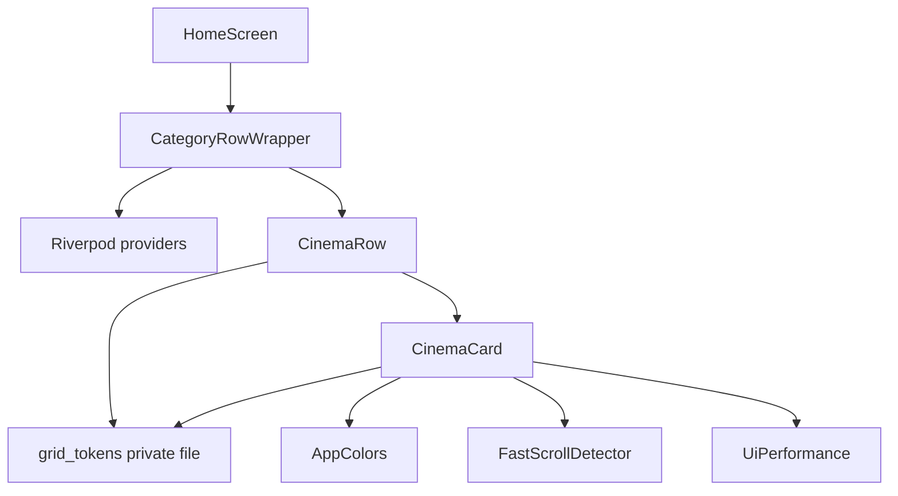
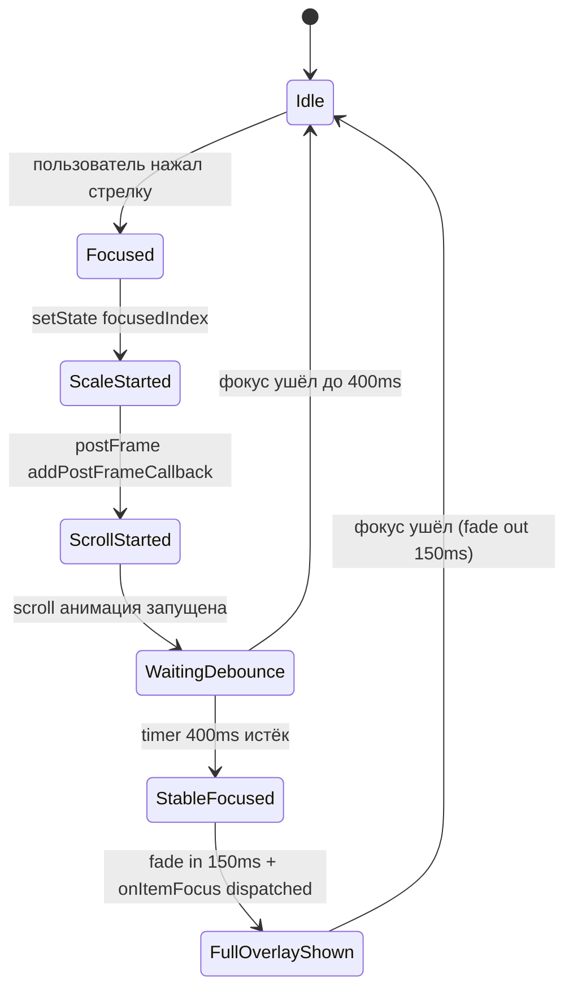
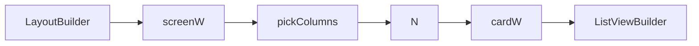

# Design Document — home-grid-optimization

## Overview

**Purpose**: Этот спек переводит главную сетку каналов на упрощённую модель карточки и ряда, оптимизированную под Android TV: фиксированная адаптивная ширина плиток, scale-only фокус без relayout, разделённое compact/full overlay, debounce 400 мс для тяжёлых побочных эффектов и Leanback-тайминги (150/250 мс).

**Users**: Пользователь Android TV-бокса, навигирующий пультом. Качество приёмки определяется субъективной плавностью на референсном устройстве.

**Impact**: Меняется визуальная и поведенческая модель двух widget-файлов (`cinema_row.dart`, `cinema_card.dart`); один callback-контракт `onItemFocus` адаптируется на стороне `home_screen.dart` (минимальная правка). Никаких новых зависимостей в `pubspec.yaml`. Никаких изменений в data-providers, моделях, плеере, HeroSection, BootOverlay.

### Goals
- Все плитки в видимом ряду одной ширины; число плиток выбирается адаптивно (3/4/5) по ширине экрана.
- Активная плитка визуально выделяется только через `Transform.scale(1.08)` + цветную рамку, без изменения allocated width и без relayout соседей.
- Compact overlay (постер + название канала + LIVE-индикатор) рендерится всегда; full overlay (рейтинг, возрастной, жанр, прогресс, год, название программы) — только у активной плитки, через fade-in 150 мс с задержкой debounce 400 мс.
- Тайминги анимаций: 150 мс для scale/border/opacity, 250 мс для leading-edge scroll.
- Псевдо-данные кэшируются один раз на инстанс карточки.
- Сохранены: `wrapAround` для `live-movies`, пагинация `onLoadMore`, шевроны в шапке ряда, integration с `FastScrollDetector`.

### Non-Goals
- Замена `Image.network` на `CachedNetworkImage` (отдельный спек, если потребуется).
- Добавление `RepaintBoundary` гигиены и переписывание прогресс-бара на `CustomPainter`.
- Удаление псевдо-данных как функциональности.
- Изменения в HeroSection, BootOverlay, preview-плеере.
- Изменения в data-providers (`categoryNotifierProvider`, `moviesNotifierProvider`, `featuredNowPlayingProvider`).

## Boundary Commitments

### This Spec Owns
- Внутренняя модель `cinema_row.dart`: фокус-стейт (`_focusedIndex`), скролл-логика (`_scrollFocusedTileToLeadingEdge`), debounce-таймер (`_focusStableTimer`), вычисление колонок (`_pickColumns`).
- Внутренняя модель `cinema_card.dart`: scale/border-анимация фокуса, разделение overlay на `_buildCompactOverlay` и `_buildFullOverlay`, кэш псевдо-данных через `late final`.
- Layout-токены ряда и карточки: число колонок, gap, horizontal padding, длительности и кривые анимаций. Коллоцируются в новом приватном файле `_grid_tokens.dart` для уменьшения шума в основных файлах.

### Out of Boundary
- Поведение `HeroSection` (потребитель `onItemFocus`).
- Поведение `HomeScreen` за пределами адаптации к новому контракту `onItemFocus` (если контракт меняется).
- Бэкенд-стороны: `cinema_categories`, провайдеры рядов, модели `NowPlayingItem`, `EpgProgram`, `CinemaCategory`.
- `FastScrollDetector` (потребляется, не меняется).
- `app_theme.dart` / `app_colors.dart` — берутся as-is.
- Логика boot-overlay в `HomeScreen` и прекеша изображений в `_runHomeBootstrap`.

### Allowed Dependencies
- Flutter SDK `material.dart`, `services.dart` (focus, keyboard).
- `flutter_riverpod` (для `CategoryRowWrapper`'а — уже используется).
- `flutter_screenutil` (`.w`, `.h`, `.r`, `.sp` — уже используется).
- `lib/core/playlist/models/now_playing.dart` — модель, read-only.
- `lib/core/playlist/models/epg_program.dart` — модель, read-only.
- `lib/core/theme/app_colors.dart` — токены цвета, read-only.
- `lib/core/ui/utils/fast_scroll_detector.dart` — read-only API.
- `lib/core/ui/ui_performance.dart` — `effectiveLowPowerUi(context)`, read-only.
- `lib/core/providers/providers.dart` — `categoryNotifierProvider`, `moviesNotifierProvider` (только для `CategoryRowWrapper`, который остаётся).

### Revalidation Triggers
- Изменение сигнатуры callback `onItemFocus` в `CinemaRow` (если меняется — проверить `home_screen.dart`).
- Изменение `NowPlayingItem` или `EpgProgram` (это **upstream**, не должно меняться в рамках этого спека; если поменяется в другом спеке — проверить compact/full overlay).
- Изменение поведения `FastScrollDetector` (singleton-API).
- Удаление или переименование цветовых токенов в `app_colors.dart`.

## Architecture

### Existing Architecture Analysis

Текущий код:
- `HomeScreen` (`features/home/home_screen.dart`) — `ConsumerStatefulWidget`, держит boot-overlay, hero, ListView с `CategoryRowWrapper`.
- `CategoryRowWrapper` (внутри `cinema_row.dart`) — `ConsumerStatefulWidget`, оборачивает `CinemaRow`, читает провайдеры, делает прекеш постеров на смену списка.
- `CinemaRow` (`cinema_row.dart`) — `StatefulWidget`, держит `ScrollController`, focus-state, рендерит шапку и горизонтальный `ListView.builder`.
- `CinemaCard` (`cinema_card.dart`) — `StatefulWidget`, отвечает за визуал плитки и retry-логику постера.

Это разделение здраво и сохраняется. Никакой ре-композиции компонентов: только меняется внутренняя модель в `CinemaRow` и `CinemaCard`.

### Architecture Pattern & Boundary Map



**Architecture Integration**:
- Selected pattern: stateful Flutter widgets с локальным state (Riverpod только в Wrapper'е). Не вводим новых паттернов.
- Domain/feature boundaries: `CinemaRow` владеет focus-state и scroll; `CinemaCard` владеет presentation; `_grid_tokens.dart` — токены без логики.
- Existing patterns preserved: `ConsumerStatefulWidget` в Wrapper, обычный `StatefulWidget` в presentation-виджетах, чтение тем из `AppColors`.
- New components rationale: `_grid_tokens.dart` — единое место для констант, чтобы не размазывать magic numbers по двум файлам.
- Steering compliance: проект не имеет steering-документов; ориентируемся на CLAUDE.md (cc-sdd workflow). Новых зависимостей нет — соответствует «без расширения pubspec без необходимости».

### Technology Stack

| Layer | Choice / Version | Role in Feature | Notes |
|-------|------------------|-----------------|-------|
| Frontend (Flutter) | Flutter SDK (текущая в проекте), Material widgets | Анимации, focus, layout | Никаких новых пакетов |
| State | flutter_riverpod (текущая) | Только в `CategoryRowWrapper` | Не меняется |
| Sizing | flutter_screenutil (текущая) | `.w`/`.h`/`.r`/`.sp` для adaptive | Не меняется |
| Animation | стандартные `AnimatedScale`, `AnimatedOpacity`, `AnimatedContainer`, `Curves.fastOutSlowIn`, `Curves.easeOutCubic` | Все эффекты фокуса и скролла | Без сторонних анимационных либ |

## File Structure Plan

### Directory Structure

```
lib/features/home/widgets/
├── cinema_row.dart           # MODIFIED: фикс. ширина плиток, focus-state, debounce, scroll
├── cinema_card.dart          # MODIFIED: compact/full overlay, scale-only фокус, кэш псевдо
├── _grid_tokens.dart         # NEW: layout-токены (колонки, gap, padding, длительности, кривые)
├── content_row.dart          # UNCHANGED
└── hero_section.dart         # UNCHANGED (потребитель onItemFocus)

lib/features/home/
└── home_screen.dart          # MINIMALLY MODIFIED: адаптация к контракту onItemFocus, если он меняется
```

### Modified Files

- `lib/features/home/widgets/cinema_row.dart` — Удаляется дуальный `narrowW`/`fullW`, логика `_hoveredCol`/`_focusedCol`/`_lastActiveCol` сжимается в `_focusedIndex`. Вводится `_focusStableTimer` (debounce 400 мс) и метод `_dispatchStableFocus`. `_scrollFocusedCardToLeadingEdge` упрощается. Шапка ряда (заголовок, индикатор, счётчик, чевроны) сохраняется.
- `lib/features/home/widgets/cinema_card.dart` — Удаляется `AnimatedContainer` для width. `AnimatedScale` остаётся, длительность 200 → 150 мс. `boxShadow` blur=50 → удаляется (заменяется яркой рамкой 3px) или существенно ослабляется (8). `_buildOverlay` разделяется на `_buildCompactOverlay` (всегда) и `_buildFullOverlay` (под `AnimatedOpacity`). `_pseudoRating`/`_pseudoAgeRating`/`_genreEmoji` → `late final` поля.
- `lib/features/home/home_screen.dart` — Минимальная правка: `_onHoveredItemChanged` уже имеет свой debounce (200 мс) на clear, его сохраняем; контракт `onItemFocus(NowPlayingItem?)` сохраняется (добавится только семантика — call происходит после debounce 400 мс на стороне ряда). Проверить нет ли других assumptions о мгновенности.

### New Files

- `lib/features/home/widgets/_grid_tokens.dart` — Приватный (подчёркивание префикс) файл с константами и pure-функциями. Содержит:
  - `int pickColumns(double screenW)` — функция выбора числа колонок.
  - `class GridTokens` — статические геттеры для длительностей (`focusAnimationMs`, `fadeMs`, `scrollMs`, `debounceMs`), кривых (`focusCurve`, `scrollCurve`), gap, horizontal padding, focus scale.
  - **Не содержит**: бизнес-логики, ссылок на виджеты, ссылок на runtime context. Чистые константы и арифметика.

## System Flows

### Focus change flow внутри ряда



**Ключевые решения** (не очевидные из диаграммы):
- `setState` для `_focusedIndex` происходит **синхронно** в `onFocusChange` — scale анимируется немедленно.
- `Scrollable.animateTo` тоже запускается немедленно (через `addPostFrameCallback` для корректного измерения), длительность 250 мс.
- `_focusStableTimer` стартует **в тот же момент**, что и scale, но если фокус уйдёт раньше 400 мс, таймер отменяется и full overlay никогда не показывается.
- `onItemFocus(item)` dispatching отложен внутрь debounced ветки — Hero не моргает на пролетающих плитках.

### Adaptive column count flow



`cardW = (screenW - 2 * GridTokens.horizontalPadding - (N - 1) * GridTokens.gap) / N`. Считается один раз на ребилд `CinemaRow.build`, применяется ко всем плиткам.

## Requirements Traceability

| Requirement | Summary | Components | Interfaces | Flows |
|-------------|---------|------------|------------|-------|
| 1.1, 1.2, 1.3 | 3/4/5 плиток по ширине экрана | `_grid_tokens.dart`, `CinemaRow` | `pickColumns(double): int` | Adaptive column flow |
| 1.4, 1.5, 1.6 | Одинаковая ширина, фикс. левый край | `CinemaRow` | `_buildTile(index, cardW)` | — |
| 2.1, 2.2, 2.3 | Левое выравнивание активной | `CinemaRow` | `_scrollFocusedTileToLeadingEdge(index)` | Focus change flow |
| 2.4, 2.5 | Не скроллить назад, не выходить за край | `CinemaRow` | `_scrollFocusedTileToLeadingEdge` clamp | — |
| 3.1, 3.2, 3.4 | Scale-only фокус, 150 мс | `CinemaCard` | `AnimatedScale duration` | — |
| 3.3 | Цветная рамка | `CinemaCard` | `border` в `AnimatedContainer` | — |
| 3.5 | Без heavy blur | `CinemaCard` | `boxShadow` пересмотрен | — |
| 3.6 | Соседи не двигаются | `CinemaRow`, `CinemaCard` | фикс. `cardW` | — |
| 4.1, 4.2 | Debounce 400 мс | `CinemaRow` | `_focusStableTimer`, `_dispatchStableFocus` | Focus change flow |
| 4.3 | Scale мгновенно | `CinemaCard` | `AnimatedScale` запускается синхронно | Focus change flow |
| 4.4, 4.5 | FastScrollDetector | `CinemaCard` | `context.isFastScrolling` | — |
| 5.1, 5.2, 5.3, 5.4, 5.5 | Compact overlay | `CinemaCard` | `_buildCompactOverlay()` | — |
| 6.1, 6.2, 6.3, 6.4 | Full overlay по фокусу | `CinemaCard` | `_buildFullOverlay()`, `AnimatedOpacity` | Focus change flow |
| 7.1, 7.2, 7.3, 7.4, 7.5, 7.6 | Тайминги | `_grid_tokens.dart` | `GridTokens.*Ms`, `*Curve` | — |
| 8.1 | wrapAround | `CinemaRow` | `widget.wrapAround` сохраняется | — |
| 8.2 | Пагинация | `CinemaRow` | существующая `_onScroll` + onFocus prefetch | — |
| 8.3 | Заголовок ряда | `CinemaRow` | существующая шапка | — |
| 8.4 | Шевроны | `CinemaRow`, `_ChevronButton` | существующие | — |
| 8.5 | Подсветка заголовка активного ряда | `CinemaRow` | существующий `_isFocusedRow` | — |
| 9.1–9.5 | Производительность | All | — | — (тестируется ручной приёмкой) |
| 10.1 | SELECT/ENTER | `CinemaRow` | существующий `onKeyEvent` | — |
| 10.2 | Конец ряда не выходит | `CinemaRow` | существующий `arrowRight handled` | — |
| 10.3 | Вертикальная навигация | Flutter focus traversal | `FocusTraversalGroup` (уже есть) | — |
| 10.4 | ESC/BACK не съедается | `CinemaRow` | `KeyEventResult.ignored` для ESC/BACK | — |
| 10.5 | onItemFocus callback | `CinemaRow` | `_dispatchStableFocus` | Focus change flow |
| 11.1, 11.2 | Loading placeholder | `_CinemaRowLoadingPlaceholder` (существует) | силуэты обновить под новую ширину | — |
| 11.3 | Пустой ряд скрыт | `CinemaRow` | `if (items.isEmpty) return SizedBox.shrink()` (есть) | — |
| 11.4 | Ошибка ряда | `CategoryRowWrapper` | существующее branchless rendering | — |
| 11.5 | Append без сдвига | `CinemaRow` | стабильные `ValueKey` (есть) | — |

## Components and Interfaces

### Summary

| Component | Domain/Layer | Intent | Req Coverage | Key Dependencies | Contracts |
|-----------|--------------|--------|--------------|------------------|-----------|
| `_grid_tokens.dart` (`GridTokens`, `pickColumns`) | UI tokens | Pure константы и арифметика | 1, 7 | flutter_screenutil (P2 — только типы) | State (constants) |
| `CinemaRow` | UI / behavior | Модель ряда: focus, scroll, debounce | 1.4–1.6, 2, 3.6, 4, 8, 10, 11 | `CinemaCard`, `_grid_tokens` (P0); `FastScrollDetector` (P1) | State |
| `CinemaCard` | UI / presentation | Визуал плитки: scale, compact/full, постер | 3, 5, 6, 7 | `_grid_tokens`, `AppColors`, `UiPerformance`, `FastScrollDetector` (P0) | State |
| `CategoryRowWrapper` | UI / data adapter | Riverpod-обёртка над `CinemaRow` | unchanged | Providers (P0) | State |
| `_CinemaRowLoadingPlaceholder` | UI / placeholder | Skeleton при загрузке | 11.1, 11.2 | `_grid_tokens` (P1) | — |

### UI Tokens

#### `_grid_tokens.dart`

| Field | Detail |
|-------|--------|
| Intent | Хранилище layout-констант и `pickColumns`. Без зависимости от runtime context. |
| Requirements | 1.1, 1.2, 1.3, 7.1–7.6 |

**Responsibilities & Constraints**
- Pure — никаких side effects, никаких ссылок на BuildContext (кроме функций, которые принимают `screenW: double`).
- Все длительности в миллисекундах через `Duration`.
- Pre-computed где возможно (`const Duration`).

**Dependencies**
- Inbound: `CinemaRow`, `CinemaCard`, `_CinemaRowLoadingPlaceholder` — потребители (P0).
- Outbound: нет.
- External: Flutter `Curves`, `Duration` (стандарт).

**Contracts**: State (constants).

##### Public API (Dart-style)

```dart
int pickColumns(double screenW);
// Контракт:
//   screenW < 1280 → 3
//   1280 ≤ screenW < 2560 → 4
//   screenW ≥ 2560 → 5

class GridTokens {
  static const Duration focusAnimation = Duration(milliseconds: 150);
  static const Duration scrollAnimation = Duration(milliseconds: 250);
  static const Duration overlayFade = Duration(milliseconds: 150);
  static const Duration focusStableDebounce = Duration(milliseconds: 400);

  static const Curve focusCurve = Curves.easeOutCubic;
  static const Curve scrollCurve = Curves.fastOutSlowIn;
  static const Curve overlayCurve = Curves.easeOut;

  static const double focusedScale = 1.08;
  static const double focusBorderWidth = 3.0;

  static const double gapDp = 16;            // используется как 16.w
  static const double horizontalPaddingDp = 48; // используется как 48.w
  static const double rowVerticalGapDp = 20;
}
```

- Preconditions: `screenW > 0`.
- Postconditions: `pickColumns` возвращает `3`, `4` или `5`.
- Invariants: значения констант неизменны в рантайме.

**Implementation Notes**
- Integration: `GridTokens.gapDp` умножается на `.w` в потребителях, не здесь, чтобы файл не зависел от `flutter_screenutil`.
- Validation: юнит-тест `pickColumns_boundary_values_test.dart` — проверка точек 0, 1279, 1280, 2559, 2560.
- Risks: если в будущем понадобится 4K профиль с 6 колонками — ветвь добавляется в `pickColumns` без изменения остального кода.

### UI / Behavior

#### `CinemaRow`

| Field | Detail |
|-------|--------|
| Intent | Управляет фокус-стейтом, скроллом и пагинацией ряда. |
| Requirements | 1.4–1.6, 2.1–2.5, 3.6, 4.1–4.5, 8.1–8.5, 10.1–10.5, 11.5 |

**Responsibilities & Constraints**
- Один источник истины для фокуса — `_focusedIndex` (int, `-1` если не сфокусирован).
- Скролл считается арифметически по фиксированной `_cardW` и `GridTokens.gapDp.w`.
- Debounce-таймер `_focusStableTimer` стартует на каждый focus-change; перезапускается при смене.
- Не управляет визуалом плитки — отдаёт `isFocused` в `CinemaCard`.

**Dependencies**
- Inbound: `CategoryRowWrapper` (P0), `HomeScreen` (через wrapper, P0).
- Outbound: `CinemaCard` (P0), `_grid_tokens` (P0), `FastScrollDetector` (P1).
- External: `flutter_screenutil`, Flutter `material.dart`, `services.dart` для key events.

**Contracts**: State.

##### State Management

State model:
```
_focusedIndex: int           // -1 если фокус вне ряда; иначе индекс плитки
_focusStableTimer: Timer?    // 400 мс debounce; null если не запущен или сработал
_scrollController: ScrollController
```

- Persistence: в memory, переживает скролл, не переживает rebuild с новым ключом.
- Consistency: `_focusedIndex` обновляется только в `onFocusChange`. `_focusStableTimer` отменяется в `dispose` и при каждом новом `setState(_focusedIndex)`.
- Concurrency: `setState` всегда из main isolate. Нет race-conditions.

##### Public Widget Contract (без изменений в API)

```dart
class CinemaRow extends StatefulWidget {
  final String title;
  final List<NowPlayingItem> items;
  final void Function(NowPlayingItem item) onItemTap;
  final void Function(NowPlayingItem? item)? onItemFocus;  // вызывается ПОСЛЕ debounce
  final double? availableHeight;
  final VoidCallback? onLoadMore;
  final bool wrapAround;
}
```

**Семантическое изменение** контракта:
- До: `onItemFocus(item)` вызывался синхронно в момент focus-change.
- После: `onItemFocus(item)` вызывается через `GridTokens.focusStableDebounce` (400 мс) после стабильного фокуса. `onItemFocus(null)` вызывается синхронно при потере фокуса (как раньше).

##### Internal Methods

```dart
double _cardWidthFor(double screenW) {
  final n = pickColumns(screenW);
  final gap = GridTokens.gapDp * /* screenutil scale */;
  final pad = GridTokens.horizontalPaddingDp * /* screenutil scale */;
  return (screenW - 2 * pad - (n - 1) * gap) / n;
}

void _onTileFocusChanged(int index, bool hasFocus);
void _scrollFocusedTileToLeadingEdge(int index);
void _scheduleStableFocus(int index);
void _cancelStableFocus();
void _dispatchStableFocus(NowPlayingItem item);  // вызывает widget.onItemFocus
```

- Preconditions для `_scrollFocusedTileToLeadingEdge`: `_scrollController.hasClients`, `0 ≤ index < items.length`.
- Postconditions: `_scrollController.offset == clamp(index * (cardW + gap), 0, maxScrollExtent)` после анимации.
- Invariants: `_focusStableTimer` либо `null`, либо относится к **текущему** `_focusedIndex`.

**Implementation Notes**
- Integration: focus уходит в `CinemaCard`, `CinemaCard` сообщает обратно через `Focus.onFocusChange`. Семантика как сейчас, только новый dispatch-pipeline.
- Validation: ручная проверка debounce — удерживая стрелку вправо, full overlay не должен мерцать на пролетающих плитках.
- Risks: если debounce 400 мс окажется длинным/коротким — параметр в `_grid_tokens.dart`, легко тюнить.

### UI / Presentation

#### `CinemaCard`

| Field | Detail |
|-------|--------|
| Intent | Визуал плитки. Compact overlay всегда, full overlay только при `isFocused`. |
| Requirements | 3.1–3.6, 5.1–5.5, 6.1–6.4, 7.1, 7.2, 7.4, 7.6 |

**Responsibilities & Constraints**
- Один публичный input: `isFocused` (bool). Не знает о debounce, только о текущем фокус-стейте.
- Не меняет `cardWidth` — это вход.
- Scale-анимация мгновенна; full overlay скрыт под `AnimatedOpacity(opacity: isFocused ? 1 : 0)`.
- Псевдо-данные кэшируются через `late final`.

**Dependencies**
- Inbound: `CinemaRow` (P0).
- Outbound: `_grid_tokens` (P0), `AppColors` (P0), `UiPerformance.effectiveLowPowerUi` (P1), `FastScrollDetector` (P1).
- External: Flutter, `flutter_screenutil`.

**Contracts**: State.

##### Public Widget Contract

```dart
class CinemaCard extends StatefulWidget {
  final NowPlayingItem item;
  final bool isFocused;
  final VoidCallback? onTap;
  final double cardWidth;       // обязательный, не nullable после рефакторинга
  final double cardHeight;      // обязательный
  // Удалено: expanded, posterWidth (больше не нужны)
}
```

##### Internal Structure

```dart
class _CinemaCardState extends State<CinemaCard> {
  late final String _ratingCached = _computeRating();
  late final String _ageRatingCached = _computeAgeRating();
  late final String _genreEmojiCached = _computeGenreEmoji();
  bool _thumbFailed = false;
  int _thumbRetryCount = 0;

  Widget build(BuildContext context) {
    return GestureDetector(
      onTap: widget.onTap,
      child: AnimatedScale(
        duration: isFastScroll ? Duration.zero : GridTokens.focusAnimation,
        curve: GridTokens.focusCurve,
        scale: widget.isFocused ? GridTokens.focusedScale : 1.0,
        alignment: Alignment.bottomCenter,
        child: AnimatedContainer(
          // только border меняется, НЕ width
          duration: GridTokens.focusAnimation,
          width: widget.cardWidth,
          height: widget.cardHeight,
          decoration: _decorationFor(widget.isFocused, isLowPower),
          child: ClipRRect(
            borderRadius: ...,
            child: Stack(fit: StackFit.expand, children: [
              _buildPoster(),
              _buildGradient(),
              _buildCompactOverlay(),         // всегда
              _buildFullOverlayWithFade(),    // AnimatedOpacity wrapper
            ]),
          ),
        ),
      ),
    );
  }

  Widget _buildCompactOverlay();   // постер не закрывает; bottom строка с каналом + LIVE
  Widget _buildFullOverlay();      // как сейчас весь _buildOverlay, без compact-части
  Widget _buildFullOverlayWithFade() => AnimatedOpacity(
    opacity: widget.isFocused ? 1.0 : 0.0,
    duration: GridTokens.overlayFade,
    curve: GridTokens.overlayCurve,
    child: _buildFullOverlay(),
  );
}
```

- Preconditions: `cardWidth > 0`, `cardHeight > 0`.
- Postconditions: при `isFocused == true` через `GridTokens.focusAnimation` мс scale достигает `GridTokens.focusedScale`; через `GridTokens.overlayFade` мс full overlay полностью видим.
- Invariants: `_buildCompactOverlay` всегда виден; `_buildFullOverlay` поверх через AnimatedOpacity.

**Implementation Notes**
- Integration: новые `_buildCompactOverlay` и `_buildFullOverlay` строятся из существующих helper'ов (`_liveBadge`, `_ratingBadge`, `_buildAgeAndGenre`, `_buildProgressSection`, `_buildBottomInfo`, `_buildChannelIcon`). Не переписываем helper'ы — только перекомпоновываем.
- Validation: визуальное сравнение compact и focused state на референсном TV.
- Risks: чтобы не было сдвига названия канала между compact и full, оба должны рендерить его в одинаковом bottom-padding. Используем общий компонент `_BottomChannelLine` или коллокацию через одинаковый layout.

### UI / Presentation (placeholder)

#### `_CinemaRowLoadingPlaceholder`

Существующий, нуждается в правке: число силуэтов меняется с фиксированных `7` на `pickColumns(MediaQuery.sizeOf(context).width)`. Ширина каждого силуэта — `_cardWidthFor(screenW)`. Логика рисования рамок без изменений.

## Data Models

Не применимо — этот спек не вводит новых моделей и не меняет существующие. Все используемые типы (`NowPlayingItem`, `EpgProgram`, `CinemaCategory`) — read-only inputs из upstream-кода.

## Error Handling

### Error Strategy

Этот спек — visual/behavior рефакторинг. Ошибки на уровне ряда — **состояния данных**, обрабатываются `CategoryRowWrapper` (уже есть): isLoading → placeholder, hasError && empty → текст ошибки, иначе → `CinemaRow`. На уровне плитки — постеры могут не загружаться, обработка через существующую `_retryThumbnail` логику, без изменений.

### Error Categories and Responses

- **Image load failure**: существующая retry-логика (3, 5, 10, 15, 30, 60 секунд, до 6 попыток) — сохраняется как есть.
- **Empty row после загрузки**: `if (items.isEmpty) return SizedBox.shrink()` — поведение Req 11.3, есть в коде.
- **Loading state**: `_CinemaRowLoadingPlaceholder` — обновляется под новую модель ширины, но логика та же.

### Monitoring

Не применимо — без backend-телеметрии. Self-verification на TV.

## Testing Strategy

### Unit Tests

- `pickColumns_boundary_values_test.dart` — `pickColumns(0)` и `pickColumns(1279)` → 3, `pickColumns(1280)` и `pickColumns(2559)` → 4, `pickColumns(2560)` и `pickColumns(3840)` → 5. (Покрывает Req 1.1, 1.2, 1.3.)
- `cardWidthFor_test.dart` — для типовых `screenW` (1280, 1920, 2560) `_cardWidthFor` возвращает положительное число и сумма всех `cardW + (n-1)*gap + 2*pad == screenW`. (Покрывает Req 1.4.)

### Integration Tests (widget-tests)

- `cinema_row_focus_alignment_test.dart` — `CinemaRow` с 10 элементами; программно ставится фокус на index 5; через `pump()` >= 250 мс `_scrollController.offset` равен `5 * (cardW + gap)` (с допуском). (Req 2.1, 2.2.)
- `cinema_card_compact_full_test.dart` — `CinemaCard(isFocused: false)` не содержит виджет с заголовком программы; `isFocused: true` после `pump(150ms)` содержит. (Req 5.3, 6.1.)
- `cinema_row_debounce_test.dart` — программный `tab` фокус on→off в течение 100 мс не вызывает `onItemFocus(non-null)`. (Req 4.1, 4.2.)

### Manual / E2E Tests on Reference Device

Запускаются `flutter run` через ADB на референсный TV (`192.168.100.8:5555`). Проверка по чек-листу:
1. **Плавность**: удерживая стрелку вправо, скролл ряда визуально плавный, без stutter. (Req 9.1.)
2. **Левый край**: первая плитка в ряду всегда на одном горизонтальном смещении. (Req 1.6.)
3. **Соседи не двигаются**: при переключении фокуса плитки не «прыгают». (Req 3.6.)
4. **Mercание убрано**: быстрый скролл не вызывает мигания бейджей. (Req 4.1, 4.2.)
5. **Полный overlay**: при остановке на плитке через ~400 мс появляются все бейджи. (Req 6.1.)
6. **wrapAround**: ряд «Фильмы в эфире» зацикливается. (Req 8.1.)
7. **Пагинация**: при скролле к концу некоторого «Концерты» подгружается ещё. (Req 8.2.)
8. **SELECT/ENTER**: открывает канал. (Req 10.1.)
9. **Конец ряда**: на последней плитке стрелка вправо не уводит фокус и не моргает. (Req 10.2.)

### Performance Tests

Не автоматизируем. Приёмка — субъективная плавность на референсном устройстве (Req 9.5).

## Performance & Scalability

Целевые метрики (наблюдаемые):
- Кадр focus-change укладывается в 16.7 мс (60 fps) на референсном TV-боксе. Если бокс 30 fps — 33.3 мс.
- Никакой постоянной перерисовки в idle-state (Req 9.4).

Достигается:
- Удалением `boxShadow.blurRadius=50` (главная экономия).
- Удалением `AnimatedContainer.width` анимации (нет relayout-каскада).
- Уменьшением числа Widget'ов в неактивной плитке (~3 вместо ~11).
- Сохранением `cacheExtent: 1500.w` и `addRepaintBoundaries: true` (уже есть).

Если на референсном TV всё ещё не плавно — открываем отдельный спек на CachedNetworkImage + RepaintBoundary гигиену + CustomPainter (это вне границы текущего спека).

## Migration Strategy

Не применимо — это in-place рефакторинг без миграции данных. Старый код заменяется новым в одном PR. Откат — через git revert.
