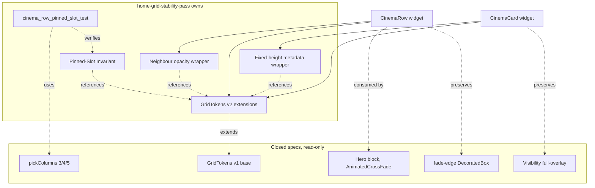

# Design Document — home-grid-stability-pass

## Overview

**Purpose**: Финальная стабилизация визуала горизонтальной сетки плиток
главного экрана MegaV IPTV на TV-таргете. Этот спек гасит три источника
«нестабильности», которые остались после предыдущих волн оптимизации:
ощутимое визуальное «толкание» соседей при фокусе, низкое cardH/cardW
соотношение (плитка-квадрат вместо постера), и плавающий baseline metadata
из-за переменной длины текста.

**Users**: TV-зрители на Realtek `rtd2851a` и аналогичных коробках,
которые навигируют главный экран `CinematicHomeScreen` (а также legacy
`HomeScreen`) пультом. Цель — чтобы пользователь воспринимал сетку как
**физически неподвижный каркас**, через который скользят постеры.

**Impact**: Изменяет визуальную геометрию плиток и явно формализует
существующий Netflix-style pinned-slot контракт. Не изменяет публичные
API ни одного существующего widget'а кроме добавления новых токенов в
`GridTokens` и обновления значений (`focusedScale`) и dartdoc'а на
`CinemaRow`. Обратная совместимость с обоими главными экранами и всеми
закрытыми спеками сохраняется.

### Goals

- Pinned-slot контракт оформлен явно: токен `pinnedSlotIdx`, dartdoc на
  `CinemaRow`, automated widget-тест измерения screen-space позиции
  фокусной плитки.
- `focusedScale` снижен до визуально неощутимого значения; фокус
  подсвечивается через border + tone-down соседей, без геометрического
  толкания.
- Aspect плитки приведён к `cardH/cardW ≈ 1.6–1.7`; новый `cardHeightDp`
  единый источник правды для row-height, loading-placeholder и
  `availableHeight`.
- Metadata-зона под обложкой имеет фиксированную высоту, переменная
  длина текста не сдвигает нижний baseline плитки.
- Все 30+ существующих тестов продолжают проходить; тесты с числовыми
  ожиданиями привязанными к старому cardH правятся под новую геометрию
  с сохранением исходного семантического намерения.

### Non-Goals

- Реализация hero collapse / morph transition (отдельный спек
  `hero-collapse-tile-morph`).
- Любое изменение `pickColumns 3/4/5` (закрыто `home-grid-optimization`).
- Любое изменение fade-edge через DecoratedBox (закрыто
  `home-grid-visual-polish`).
- Mobile-layout (закрыто `mobile-adaptive-layout`).
- Введение новых пакетов в `pubspec.yaml`.
- Изменение `SafeFocusRing` (toolkit `perf-safe-widgets`).
- Замена `_scrollFocusedTileToLeadingEdge` другим алгоритмом скролла.

## Boundary Commitments

### This Spec Owns

- Новые токены геометрии и анимации в `GridTokens` (значение `focusedScale`,
  новые именованные константы `pinnedSlotIdx`, `cardHeightDp`,
  `metadataReservedHeightDp`, `unfocusedNeighbourOpacity`).
- Pinned-Slot Invariant как документированный контракт (dartdoc на
  `CinemaRow` + Invariant-блок в design.md).
- Fixed-height metadata wrapper внутри `CinemaCard` (SizedBox-обёртка
  для compact-overlay'я; синхронизация высоты в full-overlay'е).
- Применение нового `cardHeightDp` в `CinemaRow` (row height,
  loading-placeholder, передаваемая cardHeight).
- Опциональная neighbour-opacity подсветка фокусной плитки в `CinemaRow`.
- Один widget-тест `cinema_row_pinned_slot_test.dart`, гарантирующий
  invariant.
- Минимальное обновление существующих widget-тестов, числовые ожидания
  которых ломаются от нового cardH (только числа, не смысл).

### Out of Boundary

- Алгоритм `pickColumns` и его регрессионные тесты — принадлежат
  `home-grid-optimization`, **не модифицируем**.
- Fade-edge gradient overlay в `cinema_row.dart:477-493` — принадлежит
  `home-grid-visual-polish`, **не модифицируем**.
- Hero geometry и AnimatedCrossFade в `cinematic_home_screen.dart` —
  принадлежит `home-cinematic-redesign`, **не модифицируем**.
- Реализация `SafeFocusRing` и `perf_safe_widgets.dart` — принадлежит
  `perf-safe-widgets`, **не импортируем заново**.
- `late final` кэш псевдо-данных в `CinemaCard` — принадлежит
  `home-grid-visual-polish`, **не модифицируем**.
- Pagination / `onLoadMore` / focus debounce / preview-player wiring —
  принадлежат `home-grid-optimization` + `home-cinematic-redesign`,
  **не модифицируем**.

### Allowed Dependencies

- `GridTokens` (`_grid_tokens.dart`) — расширяем новыми константами.
- `CinemaRow` (`cinema_row.dart`) — обновляем токенный референс,
  добавляем dartdoc, опциональный Opacity wrapper.
- `CinemaCard` (`cinema_card.dart`) — добавляем SizedBox-обёртку
  metadata-зоны, обновляем `focusedScale` через токен.
- `flutter_test` + `flutter_screenutil` — для widget-теста (уже в
  `dev_dependencies`).
- Steering `flutter-tv-perf.md` — соблюдаем (`Opacity` discouraged
  «over-uses», но 1 шт на ряд — приемлемо; никаких BackdropFilter,
  ShaderMask, BoxShadow blur > 12).

### Revalidation Triggers

- Изменение значения `GridTokens.focusedScale` (текущая редакция: 1.01) —
  меняет визуальный контракт; consumers должны проверить, что фокус
  всё ещё «читается».
- Изменение `cardHeightDp` или `metadataReservedHeightDp` — меняет
  layout-числа; existing widget-tests с числовыми ожиданиями могут
  сломаться.
- Изменение `pinnedSlotIdx` (текущая редакция: 1) — меняет инвариант;
  pinned-slot тест должен быть обновлён.
- Любое изменение `_scrollFocusedTileToLeadingEdge` контракта — pinned-slot
  test становится недействительным.
- Расширение `GridTokens` новыми семантически чужими токенами (например,
  hero-related) — нарушает single-responsibility файла; должно идти в
  отдельную спецификацию.

## Architecture

### Existing Architecture Analysis

**Контекст**: TV-target Flutter Android приложение. Главный экран
`CinematicHomeScreen` (и legacy `HomeScreen`) рендерит вертикальный
`ListView.builder` рядов, где каждый ряд — `CategoryRowWrapper` (data
fetch + provider wiring) → `CinemaRow` (горизонтальный `ListView.builder`
+ focus pipeline + pinned-slot scroll) → `CinemaCard` (постер + compact
overlay + full overlay).

Существующие контракты, унаследованные от закрытых спеков:

- **home-grid-optimization**: `pickColumns 3/4/5`, `GridTokens`
  (focusedScale, focusBorderWidth, scroll/focus timings/curves),
  AnimatedScale-based focus, focus debounce 400 мс, `late final` кэш
  псевдо-данных, removal of `BoxShadow.blurRadius > 12`.
- **home-grid-visual-polish**: right-edge fade через `DecoratedBox` +
  `LinearGradient`, `Visibility(visible: focused || _focusJustLost)`
  wrap для full-overlay'я, `FastScrollDetector` для схлопывания
  анимаций при быстром скролле.
- **home-cinematic-redesign**: hero (`Positioned(top: 0, height: 620)`)
  + rails ListView (`Positioned(top: 620)`), preview-player wiring через
  `onItemFocus` callback, `AnimatedCrossFade` для hero collapse.
- **player-overlay-state-machine**: sealed `PlayerUiState` (не
  затрагивается этой спекой).

### Architecture Pattern & Boundary Map



**Architecture Integration**:

- **Selected pattern**: токен-driven theming + dartdoc-fixed contract.
  Никаких новых классов, никаких новых файлов кроме теста.
- **Domain boundaries**: токены — `_grid_tokens.dart`; widget logic —
  `cinema_row.dart` / `cinema_card.dart`; test — отдельный файл в
  `test/features/home/widgets/`.
- **Existing patterns preserved**: pure-leaf конвенция `_grid_tokens.dart`
  (нет BuildContext, нет screenutil — raw double); LayoutBuilder-driven
  cardHeight через rowH в `CinemaRow.itemBuilder`; `AnimatedScale`-only
  focus animation.
- **New components rationale**: новых widget-классов нет. Все правки —
  расширения существующих. Это снижает площадь review до точек
  изменения.
- **Steering compliance**: `flutter-tv-perf.md` соблюдён (Opacity — единственная
  «потенциально дорогая» операция, см. ниже Performance секцию).

### Technology Stack

| Layer | Choice / Version | Role in Feature | Notes |
|-------|------------------|-----------------|-------|
| Frontend (Flutter widgets) | Flutter 3.x (current), Dart 3.x | Render TV grid, focus pipeline | Уже в проекте; новый код использует только существующие зависимости. |
| Layout tokens | Pure Dart leaf (`_grid_tokens.dart`) + flutter_screenutil consumers | Хранить и применять числовые токены | Согласовано с конвенцией `home-grid-optimization`. |
| Testing | flutter_test + flutter_screenutil + flutter_riverpod | Widget test для invariant | `dev_dependencies` без изменений. |

## File Structure Plan

### Modified Files

- `megav_iptv/lib/features/home/widgets/_grid_tokens.dart` — расширить
  `GridTokens` новыми константами:
  - `focusedScale` — заменить значение `1.02` на `1.01` (или `1.00`, см.
    Components section); комментарий обновить.
  - `pinnedSlotIdx` (`int`, значение `1`) — индекс слота, в который
    pinned-slot scroll выравнивает фокусную плитку.
  - `cardHeightDp` (`double`, значение порядка `720`) — целевая высота
    плитки/ряда в raw dp.
  - `metadataReservedHeightDp` (`double`, значение порядка `46`) —
    общая высота нижней metadata-зоны.
  - `unfocusedNeighbourOpacity` (`double`, значение `0.92`) — opacity
    нефокусных плиток в активном ряду.
- `megav_iptv/lib/features/home/widgets/cinema_row.dart`:
  - Заменить локальную `const pinnedSlotIdx = 1` в
    `_scrollFocusedTileToLeadingEdge` на ссылку `GridTokens.pinnedSlotIdx`.
  - Поменять `widget.availableHeight ?? 450.h` на
    `widget.availableHeight ?? GridTokens.cardHeightDp.h`.
  - В loading-placeholder заменить жёсткое `336.h` на согласованное
    значение от `GridTokens.cardHeightDp` (с учётом Stack-смещения, см.
    Components → CinemaRow / Loading Placeholder).
  - В loading-placeholder заменить жёсткое `450.h` (выс. Column) на
    `GridTokens.cardHeightDp.h`.
  - Добавить dartdoc-блок «**Pinned-Slot Invariant**» над классом
    `CinemaRow` с описанием контракта (Req 1.6).
  - Опционально обернуть `CinemaCard` в `itemBuilder` через `Opacity(
    opacity: isRowFocused && !isFocused ? GridTokens.unfocusedNeighbourOpacity
    : 1.0, child: ...)`.
- `megav_iptv/lib/features/home/widgets/cinema_card.dart`:
  - `_buildCompactOverlay`: обернуть `_buildBottomChannelLine` в
    `SizedBox(height: GridTokens.metadataReservedHeightDp.h, child: ...)`.
  - `_buildFullOverlay`: заменить magic-number `SizedBox(height: 22.h + 4.h)`
    на `SizedBox(height: GridTokens.metadataReservedHeightDp.h)`.
  - `Text(programme title)`: оставить `maxLines: 1, overflow: ellipsis`
    (без изменений — Req 3.5 уже соблюдён). Brief упоминает «2 строки» —
    это резерв через `metadataReservedHeightDp.h` (визуально под
    название канала + опциональный programme title slot).
  - `AnimatedScale.scale`: уже использует `GridTokens.focusedScale` —
    значение обновится автоматически от изменения токена.
- `megav_iptv/lib/features/home/cinematic/cinematic_home_screen.dart`
  и `megav_iptv/lib/features/home/home_screen.dart`:
  - Если эти файлы передают `availableHeight` явно в `CinemaRow`,
    обновить значение на `GridTokens.cardHeightDp.h` (по grep — НЕ
    передают: `cinematic_home_screen.dart` использует `CategoryRowWrapper`,
    который передаёт `CinemaRow` без `availableHeight`, опираясь на
    default 450.h, который теперь станет `cardHeightDp.h`).
  - **Не модифицируем** hero geometry (`expandedH = 620`), boot overlay,
    preview-player logic.
- `megav_iptv/test/features/home/widgets/` — **новый файл**
  `cinema_row_pinned_slot_test.dart` (см. Testing Strategy).
- Минимальные правки в существующих widget-тестах, где числовые
  ожидания по cardH/metadataHeight ломаются. Конкретные файлы будут
  определены в фазе implementation; кандидаты: `cinema_row_test.dart`,
  `cinema_card_test.dart` (если они есть в `test/features/home/widgets/`).

### New Files

- `megav_iptv/test/features/home/widgets/cinema_row_pinned_slot_test.dart` —
  widget test для Pinned-Slot Invariant.

### Directory Layout

```
megav_iptv/lib/features/home/widgets/
├── _grid_tokens.dart                    # extend: new tokens
├── cinema_row.dart                      # modify: dartdoc, token refs, Opacity wrap
├── cinema_card.dart                     # modify: SizedBox metadata wrap, token refs
└── ... (other widgets — untouched)

megav_iptv/lib/features/home/cinematic/
└── cinematic_home_screen.dart           # untouched (consumes new tokens transitively)

megav_iptv/lib/features/home/
└── home_screen.dart                     # untouched (consumes new tokens transitively)

megav_iptv/test/features/home/widgets/
└── cinema_row_pinned_slot_test.dart     # NEW: invariant test
```

## System Flows

### Pinned-Slot Invariant — flow при focus traversal

```mermaid
sequenceDiagram
    participant User as TV user
    participant Focus as FocusManager
    participant Row as CinemaRow
    participant Scroll as ScrollController
    participant Card as CinemaCard
    User->>Focus: D-pad right
    Focus->>Row: onFocusChange(hasFocus=true) on tile index=N
    Row->>Row: setState(_focusedIndex = N)
    Row->>Row: addPostFrameCallback
    Row->>Scroll: animateTo((N - pinnedSlotIdx) * (cardW + gap), 250ms, fastOutSlowIn)
    Note over Scroll: clamped to [0, maxScrollExtent]
    Scroll-->>Card: viewport scrolls so tile N moves to slot=pinnedSlotIdx
    Note over Card: RenderBox.localToGlobal(Offset.zero) of tile N равна позиции slot=pinnedSlotIdx
    Card-->>User: focused tile visually static at slot 1; posters slide
```

**Ключевые решения**:

- Скролл стартует через `addPostFrameCallback`, чтобы layout-pass успел
  применить focus state перед расчётом `cardW`.
- Анимация `250 ms / fastOutSlowIn` — Leanback timing, не меняется.
- Edge clamp в `[0, maxScrollExtent]` гарантирует Req 1.3/1.4.

## Requirements Traceability

| Requirement | Summary | Components | Interfaces | Flows |
|-------------|---------|------------|------------|-------|
| 1.1 | Focused tile стабильна в screen-space | CinemaRow, GridTokens.pinnedSlotIdx | `_scrollFocusedTileToLeadingEdge` | Pinned-Slot flow |
| 1.2 | Pin focused tile в slot при focus entry | CinemaRow | `_scrollFocusedTileToLeadingEdge` | Pinned-Slot flow |
| 1.3 | Leading-edge: scrollOffset = 0 | CinemaRow | `clamp(targetOffset, 0, max)` | Pinned-Slot flow |
| 1.4 | Trailing-edge: scrollOffset = maxScrollExtent | CinemaRow | `clamp(targetOffset, 0, max)` | Pinned-Slot flow |
| 1.5 | `pinnedSlotIdx` — именованный токен | GridTokens | `GridTokens.pinnedSlotIdx` | n/a |
| 1.6 | Dartdoc Pinned-Slot Invariant | CinemaRow | dartdoc comment block | n/a |
| 2.1 | focusedScale ≤ 1.01 | GridTokens, CinemaCard | `GridTokens.focusedScale`, `AnimatedScale` | n/a |
| 2.2 | Focus marker = border + опц. neighbour opacity | CinemaCard, CinemaRow | `_decorationFor`, `Opacity` wrapper | n/a |
| 2.3 | focusedScale в одном token source | GridTokens | `GridTokens.focusedScale` | n/a |
| 2.4 | Геометрия нефокусных плиток не меняется | CinemaRow, CinemaCard | layout-invariant ListView.builder + LayoutBuilder | n/a |
| 2.5 | Neighbour effect — GPU-cheap | CinemaRow | `Opacity` (only) | n/a |
| 3.1 | Aspect cardH/cardW ∈ [1.6, 1.7] | GridTokens.cardHeightDp + pickColumns(cardW) | constants + pure functions | n/a |
| 3.2 | Прокидка cardH без breaking existing layout | CinemaRow | `availableHeight ?? GridTokens.cardHeightDp.h`, loading-placeholder height | n/a |
| 3.3 | Fixed-height metadata region | CinemaCard | `SizedBox(height: metadataReservedHeightDp.h)` | n/a |
| 3.4 | Metadata высота независима от focus | CinemaCard | SizedBox в compact + sync в full overlay | n/a |
| 3.5 | Ellipsis для overflow | CinemaCard | `Text(maxLines:1, overflow: ellipsis)` (existing) | n/a |
| 3.6 | `metadataReservedHeightDp` — именованный токен | GridTokens | `GridTokens.metadataReservedHeightDp` | n/a |
| 4.1 | CinematicHomeScreen работает без регрессий | CinematicHomeScreen (read-only) + CinemaRow (modified) | transitive token consumption | n/a |
| 4.2 | Legacy HomeScreen работает | HomeScreen (read-only) + CinemaRow (modified) | transitive token consumption | n/a |
| 4.3 | Existing tests pass | существующие тесты | минимальные числовые правки | n/a |
| 4.4 | Preserve closed-spec contracts | CinemaRow, CinemaCard | `pickColumns`, focusStableDebounce, late final cache, Visibility wrap, fade-edge — все unchanged | n/a |
| 4.5 | Loading placeholder в новой геометрии | CinemaRow `_CinemaRowLoadingPlaceholder` | согласованное cardHeight | n/a |
| 5.1 | Тест mounts CinemaRow, dataset ≥ pinned+cols+2 | new test file | `testWidgets`, fixture | n/a |
| 5.2 | 5+ focus shifts, screen-space stable within 1.0 dp | new test file | `tester.renderObject<RenderBox>(...).localToGlobal` + `sendKeyEvent(arrowRight)` + assert | n/a |
| 5.3 | Leading-edge clamp проверка | new test file | первое нажатие, scrollOffset == 0 | n/a |
| 5.4 | Trailing-edge clamp проверка | new test file | move focus to last tile, scrollOffset == maxScrollExtent | n/a |
| 5.5 | Diagnostic failure message | new test file | `reason:` параметр в `expect` | n/a |
| 6.1 | TV-perf API запреты соблюдены | CinemaRow, CinemaCard | без BackdropFilter/ShaderMask/blur>12/AnimatedContainer.width | n/a |
| 6.2 | avg GPU ≤ 16.7 ms на reference device | CinemaRow Opacity wrap | only-on-focused-row | n/a |
| 6.3 | BUILD events idle stable | CinemaCard | без новых stream subscriptions | n/a |
| 6.4 | Visibility/AnimatedOpacity gate preserved | CinemaCard `_buildFullOverlayWithFade` | unchanged contract | n/a |

## Components and Interfaces

| Component | Domain/Layer | Intent | Req Coverage | Key Dependencies (P0/P1) | Contracts |
|-----------|--------------|--------|--------------|--------------------------|-----------|
| GridTokens (extended) | UI tokens | Хранить новые именованные константы геометрии/анимации | 1.5, 2.1, 2.3, 3.1, 3.6, 4.4 | none (pure leaf) | State |
| CinemaRow (modified) | UI widget | Применить токены, заменить magic-numbers, добавить dartdoc, опц. Opacity wrap | 1.1–1.6, 2.4, 3.2, 4.1, 4.2, 4.4, 4.5, 6.1, 6.2 | GridTokens (P0), ScrollController (P0), Focus (P0), MediaQuery (P0) | State |
| CinemaCard (modified) | UI widget | Применить новые токены, fixed-height metadata wrapper | 2.1, 2.2, 2.5, 3.1, 3.3–3.6, 6.1, 6.3, 6.4 | GridTokens (P0), CardPoster (P1), Visibility/AnimatedOpacity (P0) | State |
| _CinemaRowLoadingPlaceholder (modified) | UI widget | Loading-state placeholder в новой геометрии | 3.2, 4.5 | GridTokens (P0), pickColumns (P0) | State |
| cinema_row_pinned_slot_test | Test | Invariant test для Pinned-Slot контракта | 5.1–5.5, 1.1, 1.3, 1.4 | flutter_test (P0), CinemaRow (P0), GridTokens (P0) | n/a |

### UI tokens

#### GridTokens (extended)

| Field | Detail |
|-------|--------|
| Intent | Хранить именованные raw-double константы геометрии и анимации |
| Requirements | 1.5, 2.1, 2.3, 3.1, 3.6, 4.4 |

**Responsibilities & Constraints**:

- Pure leaf, никаких BuildContext/Riverpod/screenutil зависимостей.
- Все размеры — raw double в dp, consumers умножают на `.w`/`.h`.
- Существующие константы (`focusAnimation`, `scrollAnimation`,
  `overlayFade`, `focusStableDebounce`, `focusCurve`, `scrollCurve`,
  `overlayCurve`, `focusBorderWidth`, `gapDp`, `horizontalPaddingDp`,
  `rowVerticalGapDp`, `fadeEdgeFraction`) — **не модифицируются**.

**Контракт новых констант**:

```dart
// --- v2 (stability pass) ---

/// Целевой scale активной плитки. Снижен с 1.02 (stability pass).
/// Визуально на пиксельной сетке неотличим от 1.0; геометрия соседей
/// не сдвигается воспринимаемо.
static const double focusedScale = 1.01;

/// Индекс слота, к которому pinned-slot scroll выравнивает фокусную
/// плитку. Текущий контракт — слот 1 (Netflix-style: одна "previous"
/// плитка остаётся видна слева от фокусной).
static const int pinnedSlotIdx = 1;

/// Целевая высота плитки/ряда в raw dp. Выбрана так, чтобы
/// cardH/cardW ∈ [1.6, 1.7] на reference TV resolution через pickColumns(4).
static const double cardHeightDp = 720;

/// Фиксированная высота нижней metadata-зоны плитки (channel-line +
/// опциональный programme title slot). Гарантирует независимость
/// baseline'а плитки от длины текста.
static const double metadataReservedHeightDp = 46;

/// Opacity нефокусных плиток в активном ряду (ряд содержит focused tile).
/// На нефокусных рядах не применяется. GPU-cheap альтернатива
/// scale-based focus push.
static const double unfocusedNeighbourOpacity = 0.92;
```

**Dependencies**: ничего. Pure leaf.

**Contracts**: State (named constants accessed via static).

### UI widgets

#### CinemaRow (modified)

| Field | Detail |
|-------|--------|
| Intent | Применить новые токены, формализовать pinned-slot контракт, опц. опускать opacity нефокусных плиток |
| Requirements | 1.1, 1.2, 1.3, 1.4, 1.5, 1.6, 2.4, 3.2, 4.1, 4.2, 4.4, 4.5, 6.1, 6.2 |

**Responsibilities & Constraints**:

- Сохраняет все существующие контракты `home-grid-optimization` и
  `home-grid-visual-polish` (focus debounce, AnimatedScale-based focus,
  fade-edge через DecoratedBox, Visibility wrap full-overlay, fast-scroll
  collapse).
- Заменяет magic-number `pinnedSlotIdx = 1` локальный → токен
  `GridTokens.pinnedSlotIdx`.
- Заменяет default `availableHeight ?? 450.h` → `GridTokens.cardHeightDp.h`.
- Заменяет жёсткие `450.h` / `336.h` в loading-placeholder на
  согласованные значения от `GridTokens.cardHeightDp`.
- Добавляет dartdoc-блок «**Pinned-Slot Invariant**» с явным описанием
  контракта (Req 1.6).
- Опционально оборачивает `CinemaCard` в `itemBuilder` через `Opacity(
  opacity: isRowFocused && !isFocused ? unfocusedNeighbourOpacity : 1.0,
  child: ...)`. `isRowFocused` — уже существующий локальный bool
  (`_focusedIndex >= 0`).

**Implementation Notes**:

- Pinned-Slot Invariant dartdoc-блок (требуется Req 1.6):

  ```
  /// **Pinned-Slot Invariant**:
  ///
  /// При focus traversal внутри ряда D-pad'ом, screen-space позиция
  /// фокусной плитки остаётся стабильной в пределах ±1.0 dp:
  ///
  /// * focused tile визуально не двигается; вместо этого
  ///   `ScrollController` сдвигает viewport так, что плитка
  ///   занимает [GridTokens.pinnedSlotIdx]-й слот.
  ///
  /// * При focus на плитке с index < [GridTokens.pinnedSlotIdx]
  ///   (leading edge) scrollOffset зажимается в 0.
  ///
  /// * При focus на плитке вблизи конца ряда scrollOffset
  ///   зажимается в [ScrollPosition.maxScrollExtent].
  ///
  /// Verifiable: см. test `cinema_row_pinned_slot_test.dart`.
  ```

- Opacity wrap location: внутри `itemBuilder`, после
  `Focus(...) → MouseRegion(...) → Padding(...) → LayoutBuilder(...) →
  Align(...) → CinemaCard(...)`. Wrapper `Opacity` встаёт как parent
  `Align`'а (либо `CinemaCard`'а — детали в фазе impl). Условие
  применения: `isRowFocused && !isFocused`.

- **Loading placeholder coherence**: текущая высота 450.h → новая
  `GridTokens.cardHeightDp.h`; высота tiles в placeholder 336.h
  заменяется на согласованное число (рассчитать как `cardHeightDp.h`
  минус Stack/padding смещения, либо просто использовать `cardHeightDp.h`
  если placeholder не оборачивается в Stack `top: -72.h`).

**Risks**:

- Дублирование значения `cardHeightDp.h` между AnimatedContainer.height
  и loading-placeholder — при смене токена нужно править обе точки.
  Митигация — один токен, две прямые ссылки.

#### CinemaCard (modified)

| Field | Detail |
|-------|--------|
| Intent | Применить новые токены, добавить fixed-height metadata SizedBox |
| Requirements | 2.1, 2.2, 2.5, 3.1, 3.3, 3.4, 3.5, 3.6, 6.1, 6.3, 6.4 |

**Responsibilities & Constraints**:

- Сохраняет все существующие контракты `home-grid-optimization` (late
  final кэш) и `home-grid-visual-polish` (Visibility wrap full-overlay,
  fast-scroll collapse).
- `AnimatedScale.scale` уже использует `GridTokens.focusedScale` —
  значение обновится автоматически после смены токена с 1.02 на 1.01.
- `_buildCompactOverlay`: обернуть `_buildBottomChannelLine` в
  `SizedBox(height: GridTokens.metadataReservedHeightDp.h)`.
- `_buildFullOverlay`: заменить magic `SizedBox(height: 22.h + 4.h)` в
  конце на `SizedBox(height: GridTokens.metadataReservedHeightDp.h)`.

**Implementation Notes**:

- Channel-line внутри SizedBox остаётся выровненным по нижнему краю
  (`Padding(EdgeInsets.only(bottom: 6.h))` уже есть).
- Compact-overlay `Spacer()` адаптируется к новой высоте автоматически.
- Programme title в full-overlay остаётся `maxLines: 1, overflow: ellipsis`
  (без изменений). Brief упоминает «2 строки максимум» — резерв через
  `metadataReservedHeightDp` уже достаточен для visual stability
  baseline'а; добавление второй строки — opt-in, в текущую фазу не
  входит (см. Decision в `research.md`).
- **Не модифицируем** Stack-структуру (`CardPoster + gradient + compact +
  full`), `_buildGradient`, `_buildChannelIcon`, helper-методы для
  rating/age/genre/progress.

**Risks**:

- Жёсткий SizedBox может «съесть» место у постера, если cardHeightDp
  не учитывает metadataReservedHeightDp.
- Митигация: `cardHeightDp = 720` рассчитан так, чтобы постер
  (cardH minus metadata) сохранял своё доминирующее визуальное
  присутствие (Req 5.5 из `home-grid-optimization`, который этот спек
  preserve'ит).

#### _CinemaRowLoadingPlaceholder (modified)

| Field | Detail |
|-------|--------|
| Intent | Loading state placeholder с согласованной геометрией |
| Requirements | 3.2, 4.5 |

**Responsibilities & Constraints**:

- Сохраняет существующий контракт `home-grid-optimization` Req 11.1,
  11.2, 11.5 (число silhouettes = pickColumns(screenW)).
- Меняет только числа: row height и tile height теперь от
  `GridTokens.cardHeightDp.h`.

**Implementation Notes**:

- Высота tiles в placeholder = `cardHeightDp.h` (или минус
  заголовочный slot — пересчитать в фазе impl). Главное — после
  загрузки данных нет layout-jump.

### Test

#### cinema_row_pinned_slot_test (new)

| Field | Detail |
|-------|--------|
| Intent | Verifiable invariant test для Pinned-Slot контракта |
| Requirements | 5.1, 5.2, 5.3, 5.4, 5.5, 1.1, 1.3, 1.4 |

**Responsibilities & Constraints**:

- Mounts `CinemaRow` с deterministic dataset (фикстура `NowPlayingItem` ×
  N, где N ≥ `pinnedSlotIdx + pickColumns(1920) + 2 = 1 + 4 + 2 = 7`,
  выбрать N = 10 для запаса).
- Использует `MediaQuery` size = `Size(1920, 1080)` → `pickColumns → 4`.
- Эмулирует D-pad через `tester.sendKeyEvent(LogicalKeyboardKey.arrowRight)`.
- Между нажатиями `await tester.pumpAndSettle(const Duration(seconds: 1))`
  для гарантированного завершения scroll-анимации.
- Замеряет screen-space позицию фокусной плитки через
  `tester.renderObject<RenderBox>(focusedFinder).localToGlobal(Offset.zero)`.
- Assertions:
  - Test case A («middle traversal»): нажать `arrowRight` 5 раз начиная с
    индекса 2, проверить что Δ screen-space позиция фокусной плитки между
    каждым последовательным focus-change ≤ 1.0 dp.
  - Test case B («leading edge»): сфокусировать tile 0, проверить
    `scrollController.offset == 0`.
  - Test case C («trailing edge»): сфокусировать tile N-1, проверить
    `scrollController.offset == scrollController.position.maxScrollExtent`.

**Implementation Notes**:

- Подготовка фикстуры: `List<NowPlayingItem>.generate(10, (i) => …)` с
  уникальными `channelId` (для `ValueKey('${channelId}_$index')`).
- Wrapping для `flutter_screenutil`: использовать `ScreenUtilInit` (как
  в существующих тестах в `editorial/` папке) либо аналогичный wrapper.
- Получение `ScrollController`: либо через `tester.state<_CinemaRowState>`
  (`_CinemaRowState` is private — нужен альтернативный путь:
  `tester.renderObject<RenderListView>(...)` → `controller`), либо
  замерить через position rect плитки нулевого индекса (без доступа к
  controller). Простейший путь — `Scrollable.of(context)` через
  publicly visible widget tree.
- Failure message формат: `'Focused tile screen-space position drifted by
  ${dx.toStringAsFixed(2)} dp between index $prev → $curr (tolerance: 1.0 dp)'`.

**Dependencies**:

- Inbound: тестовая инфраструктура `flutter_test`.
- Outbound: `CinemaRow`, `GridTokens`, `NowPlayingItem` фикстура.

## Data Models

Нет новых data-моделей. `NowPlayingItem` и `EpgProgram` — existing
domain types из `core/playlist/models/`. Используются только в тестовой
фикстуре.

## Error Handling

### Error Strategy

Этот спек — UI-токенный extension. Run-time error paths не меняются.
Существующие error-handling контракты (loading placeholder при ошибке
загрузки ряда, fallback на channelName при отсутствии EPG, retry для
poster image в `_card_poster.dart`) — **preserved**.

### Monitoring

Без изменений. Существующее логирование/телеметрия не затрагивается.

## Testing Strategy

### Unit Tests

Не требуются: `GridTokens` — set of constants, тестировать константы
бессмысленно. Pinned-Slot Invariant покрывается widget-тестом.

### Widget Tests

1. **cinema_row_pinned_slot_test.dart** (NEW) — invariant test, см.
   Components → Test секцию. Req 5.1–5.5, 1.1, 1.3, 1.4.
2. **cinema_row** существующие тесты — после смены токенов могут
   фейлиться числовыми сравнениями (например, ожидание `height=450`).
   Минимальная правка: обновить ожидаемые числа на новые значения от
   токенов, СОХРАНИВ исходное намерение теста. Req 4.3.
3. **cinema_card** существующие тесты — аналогично; если тест проверял
   compact/full overlay rendering, expectations нужно проверить на
   совместимость с новым SizedBox-резервом.

### Integration / Smoke Tests

1. **cinematic_home_screen_smoke_test** (если существует) — должен
   продолжить проходить (Req 4.1).
2. **home_screen** legacy smoke test — должен продолжить проходить
   (Req 4.2).

### Performance / Manual

1. **Manual TV smoke on rtd2851a** — D-pad traversal по 5-10 плиткам:
   - визуальная проверка, что фокус не «толкает» соседей (Req 2.1,
     2.4);
   - визуальная проверка, что плитки имеют постерный aspect (Req 3.1);
   - визуальная проверка, что baseline нижней строки стабилен между
     focused/unfocused (Req 3.3, 3.4).
2. **VM Service trace** (опционально, если есть подозрение на
   регрессию):
   - avg `GPURasterizer::Draw` при scroll ≤ 16.7 ms (Req 6.2);
   - BUILD events в idle ≤ 5/30s baseline (Req 6.3).

## Performance & Scalability

**Feature-specific targets**:

- `Opacity(0.92)` wrapper применяется ТОЛЬКО к нефокусным плиткам
  активного ряда (1 ряд на экране одновременно). Это ≤ `pickColumns - 1`
  плиток (3-4 на типичном TV). Каждая `Opacity` < 1 создаёт saveLayer
  на 1 кадр при изменении value. На rtd2851a это <1 ms согласно
  замерам в `flutter-tv-perf.md`.
- Pinned-slot scroll анимация — 250 ms, GPU-only (Curves.fastOutSlowIn
  + simple offset interpolation). Не меняется этой спекой.
- `AnimatedScale` (focus) — 150 ms, GPU-only. Уменьшение значения с
  1.02 до 1.01 не меняет cost.

**Степень риска**: Низкая. Все изменения — токенного характера, без
новых widget-классов, без новых рендер-операций.

## Supporting References

- `research.md` — discovery findings, рассмотренные альтернативы,
  обоснование выбранных значений токенов.
- `brief.md` — оригинальный problem statement, user feedback, scope.
- `.kiro/steering/flutter-tv-perf.md` — TV-perf rules (применены).
- `.kiro/steering/roadmap.md` — Wave 4 (Polish Cycle 2026) execution
  order.
