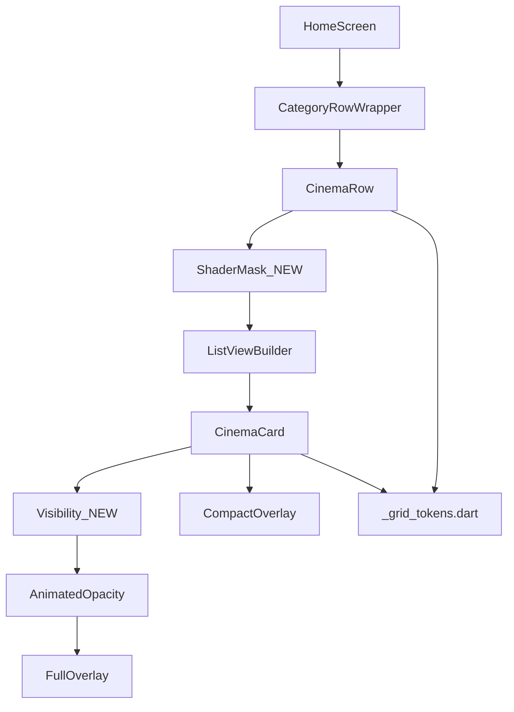
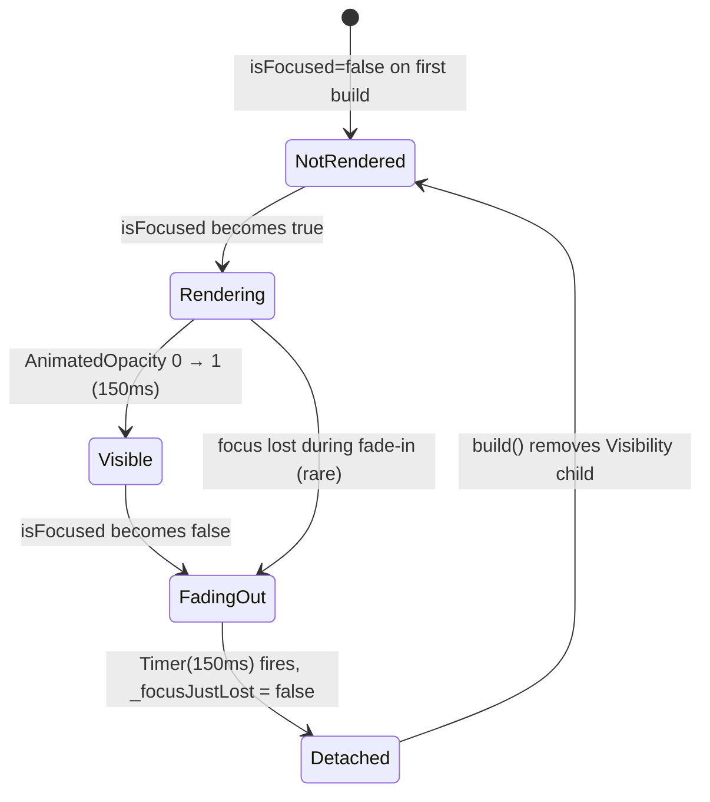

# Design Document — home-grid-visual-polish

## Overview

**Purpose**: Этот спек добавляет визуальный fade-edge на правом крае ряда (а-ля Netflix Leanback `lb_browse_rows_fading_edge`), отключает билд невидимого `_buildFullOverlay` у нефокусированных карточек через `Visibility` обёртку поверх существующего `AnimatedOpacity`, и косметически правит bottom-padding compact-строки. Никаких изменений публичного API виджетов.

**Users**: Оператор Android TV-бокса. Качество приёмки — визуальное сравнение `baseline_*.png` ↔ `after_*.png`.

**Impact**: Меняются три файла (`cinema_row.dart`, `cinema_card.dart`, `_grid_tokens.dart`). Не меняются: data-providers, models, plugins, hero, boot, player. Никаких изменений в `pubspec.yaml`. Все 17 существующих тестов остаются зелёными.

### Goals
- Fade-out gradient на правом ~5% ширины ряда через `ShaderMask`.
- Не билдить `_buildFullOverlay` для неактивных карточек (выигрыш ~3–5 мс на кадре скролла, по консервативной оценке).
- Bottom-padding компактной строки канала ≥ 6 logical px.
- Avg GPU frame time на TV-боксе при скролле ≤ 16.7 мс (или зафиксировать остаточный долг).
- 17/17 существующих тестов продолжают проходить; добавляются 2 новых теста для нового поведения.

### Non-Goals
- `RepaintBoundary` хирургия, `CustomPainter` для прогресс-бара, `CachedNetworkImage` — отложены в отдельный спек, если потребуется.
- Изменения данных, провайдеров, моделей.
- Срезание постера на macOS-сборке (не воспроизводится на TV).
- Hero, BootOverlay, плеер, EPG, sidebar.

## Boundary Commitments

### This Spec Owns
- ShaderMask-обёртка вокруг горизонтального `ListView.builder` в `cinema_row.dart`.
- `Visibility` обёртка над существующим `_buildFullOverlayWithFade()` в `cinema_card.dart`, с локальным State-флагом `_recentlyFocused` для удержания дерева во время fade-out.
- Новая константа `GridTokens.fadeEdgeFraction` в `_grid_tokens.dart`.
- Косметическая правка bottom-padding в `_buildBottomChannelLine` (или эквиваленте) в `cinema_card.dart`.
- Новые тесты: (a) присутствие `ShaderMask` в дереве `CinemaRow`, (b) отсутствие виджета `_buildFullOverlay` (ловится через ключи `Key('rating-badge')` и т.п.) при `isFocused == false` и спокойном состоянии (не fade-out).

### Out of Boundary
- Поведение HeroSection, BootOverlay.
- Логика плеера и его OSD.
- Любые изменения в `_grid_tokens.dart` за пределами добавления одной константы.
- Любые изменения публичных API виджетов `CinemaRow`/`CinemaCard`.
- `FastScrollDetector` (используется, не модифицируется).
- `app_colors.dart` (используется, не модифицируется).
- Боковое меню, EPG, плеер.

### Allowed Dependencies
- Flutter SDK material/animation (включая `ShaderMask`, `LinearGradient`, `BlendMode.dstOut`, `Visibility`).
- `flutter_riverpod` (только в `CategoryRowWrapper`, не меняется).
- `flutter_screenutil` (`.w` для размеров).
- `_grid_tokens.dart` (расширяется одной константой).
- `lib/core/ui/utils/fast_scroll_detector.dart` (read-only).
- `lib/core/theme/app_colors.dart` (read-only).

### Revalidation Triggers
- Изменение публичного API `CinemaCard` (`isFocused`, `cardWidth`, `cardHeight`) — ломает потребителя `CinemaRow` и тесты.
- Изменение поведения `_buildFullOverlay` — ломает widget-тест `cinema_card_overlay_test.dart`.
- Изменение `pickColumns` или формулы `_gridLayoutFor` — ломает scroll-тест и unit-тесты.
- Изменение константы `GridTokens.overlayFade` — ломает синхронизацию `Visibility`-удержания во время fade-out.

## Architecture

### Existing Architecture Analysis

`home-grid-optimization` (закрыт e78e84c) уже даёт чёткую модель:
- `_grid_tokens.dart` — pure-токены.
- `cinema_card.dart` — presentation, со split на compact + AnimatedOpacity full overlay.
- `cinema_row.dart` — behavior + scroll + focus.
- `home_screen.dart` — shell.

Этот спек **не** перестраивает структуру — добавляет один внешний слой к ряду (ShaderMask) и один внутренний слой к карточке (Visibility над AnimatedOpacity).

### Architecture Pattern & Boundary Map



**Architecture Integration**:
- Selected pattern: minimally-invasive wrapping. Не вводим новых компонентов или классов, только декорируем существующие виджеты.
- Domain/feature boundaries: те же что и в закрытом спеке.
- Existing patterns preserved: `late final` кэш, `AnimatedScale`/`AnimatedOpacity`, focus-pipeline.
- New components rationale: ShaderMask и Visibility — это стандартные Flutter-виджеты, не новые компоненты.
- Steering compliance: проект без steering-документов; следуем конвенции «без новых зависимостей».

### Technology Stack

| Layer | Choice / Version | Role in Feature | Notes |
|-------|------------------|-----------------|-------|
| Frontend (Flutter) | Flutter SDK (текущая в проекте) | `ShaderMask`, `Visibility`, `LinearGradient` — стандартные виджеты | Никаких новых пакетов |

## File Structure Plan

### Directory Structure

```
lib/features/home/widgets/
├── _grid_tokens.dart    # MODIFIED: + 1 const (fadeEdgeFraction)
├── cinema_row.dart      # MODIFIED: ShaderMask wrap around ListView.builder
└── cinema_card.dart     # MODIFIED: Visibility wrap around AnimatedOpacity full overlay; bottom-padding bump

test/features/home/widgets/
├── cinema_row_fade_edge_test.dart        # NEW: ShaderMask present in tree
└── cinema_card_offstage_full_test.dart   # NEW: full overlay subtree absent when isFocused=false
```

### Modified Files

- `lib/features/home/widgets/_grid_tokens.dart` — добавляется `static const double fadeEdgeFraction = 0.05;` в `class GridTokens`. Никаких других изменений.
- `lib/features/home/widgets/cinema_row.dart` — горизонтальный `ListView.builder` оборачивается в `ShaderMask` с `BlendMode.dstOut` и `LinearGradient(begin: centerLeft, end: centerRight, stops: [0, 1 - fadeEdgeFraction, 1], colors: [transparent, transparent, opaque-mask])`. Все остальные виджеты (header, FocusTraversalGroup, Positioned-72.h trick, Cache settings) сохраняются.
- `lib/features/home/widgets/cinema_card.dart` — `_buildFullOverlayWithFade()` оборачивается во внешний `Visibility(visible: _shouldRenderFullOverlay, child: ...)`. State-метод `bool get _shouldRenderFullOverlay` возвращает `widget.isFocused || _focusJustLost`. Поле `bool _focusJustLost = false` ставится в `true` при потере фокуса (детектируется через `didUpdateWidget`), сбрасывается через `Timer(GridTokens.overlayFade)` чтобы fade-out успел отыграть.
- `lib/features/home/widgets/cinema_card.dart` — в `_buildBottomChannelLine` (или эквиваленте) увеличивается bottom-padding с текущего значения до `>= 6.h` (если меньше).

### New Files

- `test/features/home/widgets/cinema_row_fade_edge_test.dart` — widget-тест: при пампе `CinemaRow` в дереве находится `ShaderMask` с правильно сконфигурированным `LinearGradient` (правый край имеет stop ≈ `1 - fadeEdgeFraction`).
- `test/features/home/widgets/cinema_card_offstage_full_test.dart` — widget-тест: при `isFocused: false` все Keys `rating-badge/age-rating/genre-emoji/programme-title/progress-section` **отсутствуют** в дереве (не только faded). При `isFocused: true` они присутствуют. После переключения `false → true → false` и пампа `Duration(milliseconds: GridTokens.overlayFade.inMilliseconds + 50)` — снова отсутствуют (fade-out отыграл).

## System Flows

### Visibility lifecycle для full overlay



**Ключевые решения**:
- `_focusJustLost` отвечает только за удержание дерева во время fade-out. После таймера дерево исчезает целиком (Visibility слой не поддерживает дерево).
- На активной плитке `_shouldRenderFullOverlay == true` все 150 мс fade-in + всё время удержания фокуса + 150 мс fade-out.

### Fade-edge ShaderMask

`ShaderMask` рендерится поверх ListView.builder с `BlendMode.dstOut`: чёрная (opaque) часть маски ВЫРЕЗАЕТ из ListView (делает прозрачным), прозрачная часть оставляет ListView видимым. Поэтому градиент: `[transparent, transparent, opaque-mask]` со stops `[0, 1 - fadeEdgeFraction, 1]` — это сохранит ListView видимым на основной части и постепенно сделает прозрачным последние 5%.

## Requirements Traceability

| Requirement | Summary | Components | Interfaces | Flows |
|-------------|---------|------------|------------|-------|
| 1.1, 1.2, 1.3, 1.4, 1.5 | Fade-edge правого края | `cinema_row.dart` (ShaderMask), `_grid_tokens.dart` (fadeEdgeFraction) | `ShaderMask + LinearGradient + BlendMode.dstOut` | Fade-edge flow |
| 2.1, 2.2, 2.3 | Visibility full overlay | `cinema_card.dart` | `Visibility(visible: _shouldRenderFullOverlay)` + `_focusJustLost` Timer | Visibility lifecycle |
| 2.4 | Compact preserved | `cinema_card.dart` (compact unchanged) | — | — |
| 3.1, 3.2, 3.3 | Bottom padding ≥ 6.h | `cinema_card.dart` (`_buildBottomChannelLine`) | EdgeInsets bottom param | — |
| 4.1, 4.2 | Avg/max frame time | All (через комбинированный эффект) | Operator visual check на TV | — |
| 4.3 | Document residual gap | Operator decision | — | — |
| 4.4 | No idle redraws | `cinema_card.dart` (Visibility прекращает full-overlay rebuilds в idle) | — | — |
| 5.1, 5.2, 5.3 | Regression safety | All | Public widget API unchanged; existing tests preserved | — |
| 6.1, 6.2, 6.3 | After snapshots | Operator deliverable | ADB `screencap -p` | — |

## Components and Interfaces

### Summary

| Component | Domain/Layer | Intent | Req Coverage | Key Dependencies | Contracts |
|-----------|--------------|--------|--------------|------------------|-----------|
| `_grid_tokens.dart` (extended) | UI tokens | + `fadeEdgeFraction` константа | 1.2 | none | State (constants) |
| `CinemaRow` (modified) | UI / behavior | + ShaderMask fade-edge | 1.1, 1.3, 1.4, 1.5 | `_grid_tokens.dart` | State |
| `CinemaCard` (modified) | UI / presentation | + Visibility wrap, + bottom padding | 2.1–2.4, 3.1–3.3, 4.4 | `_grid_tokens.dart` | State |

### `_grid_tokens.dart` (modification only)

```dart
class GridTokens {
  // ... existing constants unchanged ...

  /// Доля ширины ряда, занимаемая правым fade-edge gradient.
  /// 0.05 = 5%, что соответствует Netflix/Leanback `lb_browse_rows_fading_edge`.
  static const double fadeEdgeFraction = 0.05;
}
```

### `CinemaRow` (modification only)

Изменение в методе `build` — горизонтальный `ListView.builder` оборачивается в `ShaderMask`:

```dart
// Pseudo-code shape:
ShaderMask(
  shaderCallback: (Rect bounds) {
    return LinearGradient(
      begin: Alignment.centerLeft,
      end: Alignment.centerRight,
      stops: const [0.0, 1.0 - GridTokens.fadeEdgeFraction, 1.0],
      colors: const [
        Colors.transparent,        // visible region
        Colors.transparent,        // visible region до fade
        Colors.black,              // opaque mask = вырезается через dstOut
      ],
    ).createShader(bounds);
  },
  blendMode: BlendMode.dstOut,
  child: ListView.builder(...), // existing ListView unchanged
)
```

Все остальные части `_CinemaRowState` (header, focus, scroll, debounce, MouseRegion no-op, FocusTraversalGroup, Positioned -72.h, ValueKey, addAutomaticKeepAlives, addRepaintBoundaries, cacheExtent) остаются нетронутыми.

### `CinemaCard` (modification only)

Изменения в `_CinemaCardState`:

```dart
class _CinemaCardState extends State<CinemaCard> {
  // ... existing fields ...

  bool _focusJustLost = false;
  Timer? _focusLossTimer;

  bool get _shouldRenderFullOverlay => widget.isFocused || _focusJustLost;

  @override
  void didUpdateWidget(CinemaCard oldWidget) {
    super.didUpdateWidget(oldWidget);
    if (oldWidget.isFocused && !widget.isFocused) {
      _focusJustLost = true;
      _focusLossTimer?.cancel();
      _focusLossTimer = Timer(GridTokens.overlayFade + const Duration(milliseconds: 16), () {
        if (mounted) setState(() => _focusJustLost = false);
      });
    } else if (widget.isFocused) {
      _focusLossTimer?.cancel();
      _focusJustLost = false;
    }
  }

  @override
  void dispose() {
    _focusLossTimer?.cancel();
    super.dispose();
  }

  // _buildFullOverlayWithFade now wraps in Visibility:
  Widget _buildFullOverlayWithFade() {
    return Visibility(
      visible: _shouldRenderFullOverlay,
      maintainState: false,
      maintainSize: false,
      maintainAnimation: false,
      child: IgnorePointer(
        child: AnimatedOpacity(
          opacity: widget.isFocused ? 1.0 : 0.0,
          duration: isFastScroll ? Duration.zero : GridTokens.overlayFade,
          curve: GridTokens.overlayCurve,
          child: _buildFullOverlay(),
        ),
      ),
    );
  }
}
```

И в `_buildBottomChannelLine` (или эквиваленте — точное имя метода в текущей реализации может отличаться, найти в коде):

- Найти место рендеринга `widget.item.channelName` в compact части.
- Если text находится в `Padding(padding: EdgeInsets.only(bottom: <значение>))`, увеличить bottom до `>= 6.h`.
- Если padding отсутствует — добавить `Padding(padding: EdgeInsets.only(bottom: 6.h), child: ...)`.

## Data Models

Не применимо. Никаких новых моделей или изменений существующих.

## Error Handling

Не применимо. Этот спек — visual/perf полиш существующего корректно работающего кода. Никаких новых error paths не вводится.

## Testing Strategy

### Unit Tests

Не применимо для этого спека (нет новой чистой логики).

### Widget Tests

- `cinema_row_fade_edge_test.dart`:
  - Pump `CinemaRow` с минимальным набором items.
  - Find `ShaderMask` в дереве — должен быть ровно 1.
  - Verify shader-обёртка применена к ListView (через `find.descendant(of: find.byType(ShaderMask), matching: find.byType(ListView))`).

- `cinema_card_offstage_full_test.dart`:
  - Test 1: pump `isFocused: false` → assert `find.byKey(Key('rating-badge'))` returns NOTHING (`findsNothing`). Same for другие 4 ключа full overlay.
  - Test 2: pump `isFocused: true`, `pump(200ms)` → assert все 5 ключей found.
  - Test 3 (fade-out удержание): pump `isFocused: true`, `pump(200ms)`, switch to `isFocused: false`, immediately assert ключи всё ещё in tree (Visibility держит); `pump(GridTokens.overlayFade + 50ms)` → assert ключи `findsNothing` (Visibility отпустил).

### Performance Tests

Manual operator check via `flutter run --profile -d 192.168.100.8:5555` + performance overlay (P key). Сравнение `baseline_perf_overlay.png` vs `after_perf_overlay.png`.

### Regression Tests

Все 17 существующих тестов должны продолжать проходить **без модификаций**:
- 11 тестов в `grid_tokens_test.dart`
- 2 теста в `cinema_card_overlay_test.dart`
- 2 теста в `cinema_row_debounce_test.dart`
- 1 тест в `cinema_row_scroll_test.dart`
- 1 baseline тест в `widget_test.dart`

Если хотя бы один регрессирует — стоп, debug, fix без компромиссов.

## Performance & Scalability

Целевые метрики (наблюдаемые на референсном TV):
- avg GPU frame time during scroll ≤ 16.7 мс (был 20.3 мс).
- max GPU frame time during scroll ≤ 25 мс (был 34.2 мс).
- idle frame time: плоский график (никаких постоянных перерисовок).

Достигается:
- Visibility-обёрткой над `_buildFullOverlay` — экономит ~3-5 мс на кадре скролла за счёт того, что 5 неактивных карточек больше НЕ строят полное дерево из 7-9 декорированных контейнеров.
- ShaderMask — нейтрален или стоит < 1 мс (single GPU pass), компенсирует визуальную ценность.

Если после реализации avg остаётся > 16.7 мс — это **не блокер закрытия** (Req 4.3), но требует отдельного спека (Подход 3 из предыдущего: CachedNetworkImage, RepaintBoundary, CustomPainter).

## Migration Strategy

Не применимо — in-place полиш без миграции данных. Откат через git revert.
