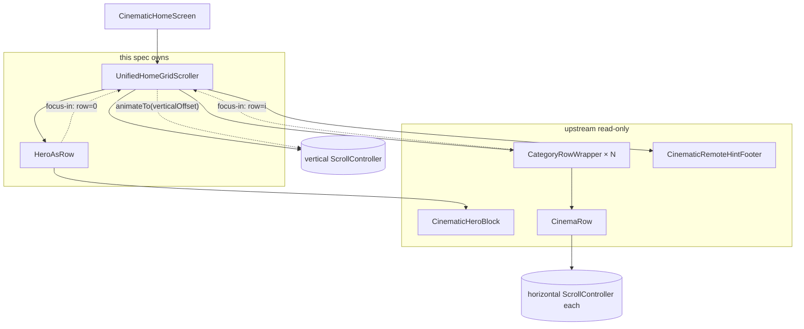
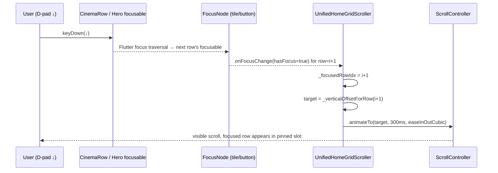
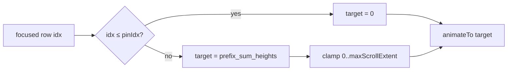
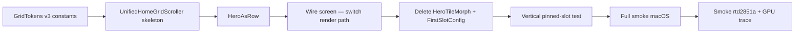

# Design Document — home-unified-grid-scroll

## Overview

**Назначение**: Заменить текущую `Stack(Positioned(hero) + Positioned(ListView rails))`-структуру cinematic-главного экрана на единый вертикальный `ListView`, где hero является row-0, а cinema-rows — row-1..row-N. Поверх этого ListView применяется Vertical Pinned-Slot Invariant — вертикальный аналог уже работающего горизонтального инварианта из `CinemaRow`. Hero перестаёт быть отдельной layout-секцией и более не сворачивается в плитку.

**Пользователи**: Оператор Android TV-бокса `rtd2851a` через D-pad на пульте; разработчик в `flutter run -d macos` через клавиатуру (parity).

**Эффект**: Убирает компромиссы текущей реализации — два независимых scroll-вьюера, `HeroTileMorph` (363 строки geometry/opacity morph) и `FirstSlotConfig` slot-0 override в `CinemaRow`. Делает поведение фокуса предсказуемым по обеим осям через один и тот же контракт `Pinned-Slot Invariant`.

### Goals

- Hero — row-0 единого `ListView`; rails — row-1..row-N того же `ListView`.
- Vertical Pinned-Slot Invariant: focused row screen-space Y стабильна (Δ ≤ 1.0 dp) при middle-traversal, с leading- и trailing-edge clamps.
- D-pad ↑/↓ — анимирует только `ScrollPosition.pixels` (≤ 300 ms, `easeInOutCubic`); никаких morph-/height-/width-анимаций layout.
- D-pad ←/→ — наследует существующий горизонтальный pinned slot внутри `CinemaRow` без изменений.
- Удалить `HeroTileMorph` и `FirstSlotConfig`-механизм в `CinemaRow`.
- TV-perf compliance согласно `flutter-tv-perf.md`: avg GPURasterizer::Draw ≤ 16.7 ms на `rtd2851a` при активном D-pad-скролле.
- Покрыть Vertical Pinned-Slot Invariant widget-тестом по аналогии с `cinema_row_pinned_slot_test.dart`.

### Non-Goals

- Менять horizontal pinned slot, `pickColumns`, `cardHeightDp`, `gapDp`, `horizontalPaddingDp` — read-only из upstream спек.
- Менять content rails (`CinemaRow`, `CinemaCard`, `CategoryRowWrapper`) — переиспользуется.
- Менять hero content (`CinematicHeroContent`, `CinematicHeroBlock`) — переиспользуется как row-0 child.
- Менять data providers (`featuredNowPlayingProvider`, `cinemaCategoriesProvider`, `moviesNotifierProvider`, `categoryNotifierProvider`).
- Менять legacy `/home`, плеер, EPG, search, mobile, settings.
- Менять boot overlay, status bar, hover-preview логику (адаптируется в части передачи фокуса, не в части механики).
- Добавлять новые palettes / theming.

## Boundary Commitments

### This Spec Owns

- Единый вертикальный scroll-механизм cinematic-главного экрана (компонент `UnifiedHomeGridScroller`).
- Vertical Pinned-Slot Invariant: формальный контракт и его реализация (clamping математика `verticalTargetOffset = (focusedRowIdx - GridTokens.verticalPinnedSlotIdx) * rowStrideDp`).
- Размещение hero как row-0 внутри ListView (обёртка `HeroAsRow` над существующим `CinematicHeroBlock`).
- Вертикальные `GridTokens` константы: `verticalPinnedSlotIdx`, `rowStrideDp`, `heroRowHeightDp`, `verticalScrollAnimation`, `verticalScrollCurve`.
- Решение по cross-row focus traversal (передача `verticalSlotIdx → CinemaRow`-у при переходе фокуса между рядами).
- Удаление obsolete-кода: `hero_tile_morph.dart`, `hero_tile_morph_test.dart`, `FirstSlotConfig`-параметр у `CinemaRow` и связанные ветки кода.
- Widget-тест Vertical Pinned-Slot Invariant.

### Out of Boundary

- Содержимое hero (текст, кнопки, backdrop image, carousel rotation) — read-only из `home-cinematic-redesign`.
- Содержимое плиток (`CinemaCard`) — read-only из `home-grid-optimization`.
- Горизонтальный pinned slot и его тесты — read-only из `home-grid-stability-pass`.
- Hover-preview (`PlayerManager`, 7-секундный preview timer) — переиспользуется без изменений в поведении.
- Boot overlay и status bar — переиспользуется без изменений.
- Legacy `HomeScreen`, плеер, EPG, search, mobile.

### Allowed Dependencies

- Upstream: `home-grid-stability-pass` (горизонтальный invariant, `GridTokens` v2 константы), `home-grid-optimization` (`pickColumns`, базовые `GridTokens`), `home-cinematic-redesign` (`CinematicHeroBlock`, `CinematicHeroContent`, `CinematicRemoteHintFooter`).
- Shared: `perf_safe_widgets` (`SafeBackdrop`, `SafePill`, `combinedHeroGradient`, `kSafeShadowBlurMax`) — используется внутри `CinematicHeroBlock` и потому транзитивно тут.
- Riverpod providers: `featuredNowPlayingProvider`, `cinemaCategoriesProvider`, `moviesNotifierProvider`, `categoryNotifierProvider`, `playerManagerProvider`, `apiClientProvider`, `baseUrlProvider`.

### Revalidation Triggers

- Изменение `GridTokens.pinnedSlotIdx` (горизонтальный) — потребует переоценки симметрии vertical аналога.
- Изменение `GridTokens.cardHeightDp` или появление per-row variable heights — текущая модель `rowStrideDp` константа; variable heights потребуют переоценки clamping математики.
- Изменение API `CinemaRow` (особенно сигнатура focus-callbacks) — vertical scroller подписывается на focus events внутри row для переключения row.
- Изменение поведения focus traversal (`WidgetOrderTraversalPolicy`) — vertical scroller полагается на детерминированный порядок «row-0 → row-1 → ...».
- Появление новых "row-like" блоков на главном экране (e.g. nested categories, full-bleed promo banners) — потребует расширения row-type discrimination в `UnifiedHomeGridScroller`.

## Architecture

### Existing Architecture Analysis

Текущая структура (`cinematic_home_screen.dart:380-538`):

```
Scaffold(body: Stack(
  Focus(FocusTraversalGroup(Stack(
    Positioned(top: 0, height: 620, child: Focus(
      child: HeroTileMorph(
        expandedChild: CinematicHeroBlock(...),
        collapsedCover: backdropImage,
        collapsedCaption: ...,
      )
    )),
    Positioned(top: 620, child: ListView.builder(
      itemCount: categories.length + 1,
      itemBuilder: (ctx, rowIdx) => CategoryRowWrapper(category, ...)
    ))
  ))),
  if (_showBootOverlay) Positioned.fill(child: HomeBootOverlay(...))
))
```

Проблемы текущей реализации:

- **Двойная scroll-структура**: hero и rails имеют независимые координатные системы; невозможно обеспечить «hero уезжает наверх как обычная row» без отдельной morph-анимации.
- **`HeroTileMorph` (363 строки)**: компромисс — пытается имитировать «hero как row-0» через geometry+opacity morph за 300 ms, но визуально остаётся отдельной секцией.
- **`FirstSlotConfig` в `CinemaRow`**: slot-0 override в `CinemaRow` нужен только для hero collapse → tile path. После удаления `HeroTileMorph` теряет смысл.
- **Сложная focus-логика hero**: `Focus(skipTraversal: true, onFocusChange)` слушает focus subtree hero, чтобы триггерить collapse/expand. После унификации этот механизм избыточен.

Целевая структура:

```
Scaffold(body: Stack(
  Focus(FocusTraversalGroup(
    UnifiedHomeGridScroller(
      heroBuilder: (ctx) => HeroAsRow(child: CinematicHeroBlock(...)),
      rows: [...categories],
      rowBuilder: (ctx, category) => CategoryRowWrapper(category, ...),
      footer: const CinematicRemoteHintFooter(),
      verticalPinnedSlotIdx: GridTokens.verticalPinnedSlotIdx, // 1
    )
  )),
  if (_showBootOverlay) Positioned.fill(child: HomeBootOverlay(...))
))
```

### Архитектурный паттерн

**Паттерн**: Single Scroll Container + Pinned-Slot Invariant — тот же контракт что у `CinemaRow` на горизонтальной оси, применённый к вертикальной оси через родительский `ScrollController`.

**Вертикальная математика clamping**:

```
rowStrideDp = heroRowHeightDp (если row-0 в build tree) + cardHeightDp * (focusedRowIdx)
              ИЛИ упрощённый случай (rowStrideDp constant) ниже.
```

Поскольку hero имеет другую высоту (`heroRowHeightDp ≈ 600 dp`) чем cinema rows (`cardHeightDp = 720 dp`), `rowStrideDp` **не** константа. Это отличает вертикальный invariant от горизонтального (где все плитки равной ширины). Vertical clamping считается через **prefix sums** высот рядов:

```dart
double _verticalOffsetForRow(int focusedIdx) {
  // sum of row heights for rows [0, focusedIdx - verticalPinnedSlotIdx)
  final pinIdx = GridTokens.verticalPinnedSlotIdx; // = 1
  if (focusedIdx <= pinIdx) return 0.0; // leading-edge clamp
  var offset = 0.0;
  for (var i = 0; i < focusedIdx - pinIdx; i++) {
    offset += _rowHeightAt(i); // hero=600dp, others=720dp
  }
  return offset.clamp(0.0, _scrollController.position.maxScrollExtent);
}
```

Поскольку всего 2 типа row (hero и cinema-row), prefix sum вычисляется в O(1):

```dart
double _verticalOffsetForRow(int focusedIdx) {
  final pinIdx = GridTokens.verticalPinnedSlotIdx;
  if (focusedIdx <= pinIdx) return 0.0;
  // rows [0, focusedIdx - pinIdx): row-0 = hero, rows [1, ...) = cinema rows
  final visibleAbove = focusedIdx - pinIdx;
  double offset = 0.0;
  if (visibleAbove >= 1) offset += GridTokens.heroRowHeightDp.h; // row-0
  if (visibleAbove >= 2) offset += (visibleAbove - 1) * GridTokens.rowStrideDp.h;
  return offset.clamp(0.0, _scrollController.position.maxScrollExtent);
}
```

**Focus dispatch**: `UnifiedHomeGridScroller` слушает focus events двух типов:

1. **Hero focus-in** (focused row = 0): срабатывает когда `heroWatchFocusNode` (или любой focusable в hero subtree) получает фокус.
2. **Row focus-in** (focused row = `i`, где `i ≥ 1`): срабатывает когда любая плитка в `CinemaRow` получает фокус.

При каждом focus event `_focusedRowIdx` обновляется и через `addPostFrameCallback` вызывается `_animateToFocusedRow()`, который выполняет `_scrollController.animateTo(_verticalOffsetForRow(_focusedRowIdx), duration: 300ms, curve: easeInOutCubic)`.

### Architecture Pattern & Boundary Map



**Boundary разделение**:
- `UnifiedHomeGridScroller` владеет родительским `ScrollController`, vertical clamping математикой, focus dispatch row-level.
- `HeroAsRow` — лёгкая обёртка, фиксирующая высоту hero как row-0 (`heroRowHeightDp`) и проксирующая focus-callback.
- `CinemaRow` остаётся источником истины для горизонтального scroll-механизма; vertical scroller только подписывается на его focus events.

### Технологический стек

| Layer | Choice / Version | Role in Feature | Notes |
|-------|------------------|-----------------|-------|
| UI Framework | Flutter (stable channel, как в проекте) | Виджет-дерево, фокусная система, Scroll | Без новых зависимостей |
| State Management | Riverpod (`flutter_riverpod`) | Те же providers что и сейчас | Без изменений в данных |
| Sizing | `flutter_screenutil` | `.w/.h/.sp/.r` для рендера | Константы в `_grid_tokens.dart` без screenutil |
| Animation Curve | `Curves.easeInOutCubic` (`flutter/animation.dart`) | Вертикальный scroll-easing | TV-perf safe |
| Focus | `Focus`, `FocusTraversalGroup`, `WidgetOrderTraversalPolicy` | D-pad navigation parity | Уже используется в проекте |

## File Structure Plan

### Directory Structure

```
megav_iptv/lib/features/home/
├── cinematic/
│   ├── cinematic_home_screen.dart        # MODIFY — упрощается
│   ├── unified_home_grid_scroller.dart   # NEW — vertical pinned scroller
│   ├── hero_as_row.dart                  # NEW — hero как row-0
│   ├── hero_tile_morph.dart              # DELETE
│   ├── cinematic_hero_block.dart         # unchanged (read-only)
│   ├── cinematic_hero_content.dart       # unchanged (read-only)
│   ├── cinematic_remote_hint_footer.dart # unchanged (read-only)
│   └── ... (остальные cinematic_* — read-only)
└── widgets/
    ├── _grid_tokens.dart                  # MODIFY — добавить vertical константы
    ├── cinema_row.dart                    # MODIFY — убрать FirstSlotConfig param + slot-0 override branch
    └── ... (остальные — read-only)

megav_iptv/test/features/home/
├── cinematic/
│   ├── unified_home_grid_scroller_test.dart  # NEW — vertical pinned-slot test
│   └── hero_tile_morph_test.dart             # DELETE
└── widgets/
    └── cinema_row_pinned_slot_test.dart  # unchanged (read-only)
```

### Новые файлы

- `lib/features/home/cinematic/unified_home_grid_scroller.dart`
  Единый виджет с родительским вертикальным `ListView.builder` + `ScrollController`. Принимает `heroBuilder`, список категорий и `rowBuilder`. Слушает focus events от всех children через `Focus(skipTraversal: true, onFocusChange)`-обёртки вокруг каждой row, рассчитывает focused row index, анимирует scrollOffset. Не превышает 600 строк (pre-commit limit).
- `lib/features/home/cinematic/hero_as_row.dart`
  Тонкая обёртка `SizedBox(height: heroRowHeightDp.h, child: CinematicHeroBlock(...))`. Существует чтобы:
  - Зафиксировать высоту hero как row-0 на уровне layout (`UnifiedHomeGridScroller` использует её при расчёте `_verticalOffsetForRow`).
  - Изолировать focus-event для row-0 в один widget node.
- `test/features/home/cinematic/unified_home_grid_scroller_test.dart`
  Три теста по аналогии с `cinema_row_pinned_slot_test.dart`:
  1. Middle-traversal vertical invariant (Δ ≤ 1.0 dp).
  2. Leading-edge clamp (row=0 или row=1 → scrollOffset=0).
  3. Trailing-edge clamp (focused = last row → scrollOffset=maxScrollExtent ±1.0 dp).

### Изменённые файлы

- `lib/features/home/cinematic/cinematic_home_screen.dart`
  - Убрать `Stack(Positioned(hero) + Positioned(ListView))` структуру (строки 405–536).
  - Заменить на `UnifiedHomeGridScroller(heroBuilder, rowBuilder, footer)`.
  - Убрать локальный `_heroFocused` state и `Focus(skipTraversal:true, onFocusChange)` логику (carousel start/stop теперь триггерится по focus row-0 callback, который пробрасывает `UnifiedHomeGridScroller`).
  - Сохранить boot overlay, status bar clock, hover preview, carousel state, `_heroWatchFocusNode`.
  - Импорт `hero_tile_morph.dart` удалить.
- `lib/features/home/widgets/_grid_tokens.dart`
  - Добавить:
    ```dart
    static const int verticalPinnedSlotIdx = 1;
    static const double heroRowHeightDp = 600;       // как было expandedH
    static const double rowStrideDp = cardHeightDp;  // = 720
    static const Duration verticalScrollAnimation = Duration(milliseconds: 300);
    static const Curve verticalScrollCurve = Curves.easeInOutCubic;
    ```
- `lib/features/home/widgets/cinema_row.dart`
  - Удалить параметр `firstSlot` из конструктора `CinemaRow` и `CategoryRowWrapper`.
  - Удалить ветку `if (index == 0 && widget.firstSlot != null)` в `itemBuilder` (строки 434–438).
  - Удалить `_onFirstSlotFocusChange` + `addListener/removeListener` для `firstSlot.focusNode`.
  - Удалить импорт `hero_tile_morph.dart show FirstSlotConfig`.

### Удалённые файлы

- `lib/features/home/cinematic/hero_tile_morph.dart` (363 строки)
- `test/features/home/cinematic/hero_tile_morph_test.dart` (если существует — по brief.md он есть)

## System Flows

### D-pad ↓ flow (vertical scroll)



### Leading-edge / trailing-edge clamp



## Requirements Traceability

| Requirement | Summary | Components | Interfaces | Flows |
|-------------|---------|------------|------------|-------|
| 1.1, 1.2, 1.3, 1.4, 1.5 | Unified vertical grid | `UnifiedHomeGridScroller`, `HeroAsRow` | row builder API | D-pad ↓ flow |
| 2.1, 2.2, 2.3, 2.4, 2.5 | Vertical Pinned-Slot Invariant | `UnifiedHomeGridScroller` | `_verticalOffsetForRow`, `_animateToFocusedRow` | Clamp flow |
| 3.1, 3.2, 3.3, 3.4, 3.5, 3.6, 3.7 | D-pad ↑/↓ | `UnifiedHomeGridScroller` | focus dispatch, animateTo | D-pad ↓ flow |
| 4.1, 4.2, 4.3, 4.4, 4.5 | D-pad ←/→ | `CinemaRow` (existing) | unchanged | — |
| 5.1, 5.2, 5.3, 5.4, 5.5, 5.6, 5.7 | Hero as row-0 | `HeroAsRow`, `CinematicHomeScreen` | hero focus callback | D-pad ↓ flow |
| 6.1, 6.2, 6.3, 6.4 | Remove HeroTileMorph | (deletion) | — | — |
| 7.1, 7.2, 7.3, 7.4, 7.5, 7.6 | TV-perf compliance | `UnifiedHomeGridScroller` | scroll-only animation | — |
| 8.1, 8.2, 8.3 | macOS desktop parity | `UnifiedHomeGridScroller`, focus policy | — | — |
| 9.1, 9.2, 9.3, 9.4, 9.5 | Vertical pinned-slot test | `unified_home_grid_scroller_test.dart` | widget tester harness | — |
| 10.1, 10.2, 10.3, 10.4, 10.5 | Providers + focus policy | `CinematicHomeScreen` | unchanged provider API | — |
| 11.1, 11.2, 11.3, 11.4 | Boot overlay + status bar | `CinematicHomeScreen` | unchanged | — |

## Components and Interfaces

| Component | Domain/Layer | Intent | Req Coverage | Key Dependencies (P0/P1) | Contracts |
|-----------|--------------|--------|--------------|--------------------------|-----------|
| UnifiedHomeGridScroller | UI / cinematic-home | Единый вертикальный scroll-механизм с pinned-slot invariant | 1, 2, 3, 7, 8, 9 | `ScrollController` (P0), `GridTokens` (P0), `CinemaRow` focus events (P0) | Service, State |
| HeroAsRow | UI / cinematic-home | Hero как row-0 единого ListView (фикс высоты + focus channel) | 1.3, 5.1, 5.3 | `CinematicHeroBlock` (P0) | Service |
| GridTokens (extended) | Tokens | Константы vertical pinned-slot invariant | 1, 2, 3.3, 3.4 | `flutter/animation.dart` (P0) | State |
| CinemaRow (modified) | UI / home-widgets | Убрать `firstSlot` slot-0 override (стало не нужно) | 4, 6.1, 6.2 | unchanged | unchanged |
| CinematicHomeScreen (modified) | UI / cinematic-home | Композиция: boot overlay + UnifiedHomeGridScroller; carousel/preview/clock state | 5, 10, 11 | Riverpod providers (P0) | State |

### UnifiedHomeGridScroller

| Field | Detail |
|-------|--------|
| Intent | Один вертикальный `ListView` для hero+rails; vertical pinned slot, focus-driven scrollOffset |
| Requirements | 1.1, 1.2, 1.3, 1.5, 2.1, 2.2, 2.3, 2.4, 2.5, 3.1, 3.2, 3.3, 3.4, 3.5, 3.6, 3.7, 7.1, 7.2, 7.3, 7.4, 7.5, 7.6, 8.1, 8.2, 8.3, 9.1, 9.2, 9.3 |
| Owner / Reviewers | feature/home — этот спек |

**Responsibilities & Constraints**

- Владеет родительским вертикальным `ScrollController` единственного `ListView.builder`.
- Вычисляет `_focusedRowIdx` из focus events children (hero и rails).
- Вычисляет `_verticalOffsetForRow(idx)` через prefix sum высот рядов (hero высота ≠ row высота).
- Триггерит `animateTo(target, 300ms, easeInOutCubic)` через `addPostFrameCallback` после focus change.
- Гарантирует:
  - leading-edge clamp при `idx ≤ verticalPinnedSlotIdx`.
  - trailing-edge clamp при последних `(visibleRowsCount - verticalPinnedSlotIdx)` рядах.
  - Не запускает второй конкурирующий vertical animation (новая `animateTo` отменяет предыдущую через стандартный `ScrollController` semantic).
- Не использует `BackdropFilter`, `ShaderMask`, `BoxShadow.blurRadius > 12`, `AnimatedContainer.height/width`.
- Использует `cacheExtent ≥ 1500.h`, `addRepaintBoundaries: true`, `clipBehavior: Clip.none`.
- Не превышает 600 строк (pre-commit hook); если стремится — декомпозировать (`_VerticalPinnedScrollMixin` в отдельный файл).

**Dependencies**
- Inbound: `CinematicHomeScreen` (P0)
- Outbound: `HeroAsRow` (P0), `CategoryRowWrapper` (P0), `CinematicRemoteHintFooter` (P1)
- External: Flutter `ScrollController`, `ListView.builder` (P0)

**Contracts**: Service [x] / API [ ] / Event [ ] / Batch [ ] / State [x]

##### Service Interface (упрощённо)

```dart
class UnifiedHomeGridScroller extends StatefulWidget {
  const UnifiedHomeGridScroller({
    super.key,
    required this.heroBuilder,
    required this.categories,
    required this.rowBuilder,
    this.footer,
    this.heroFocusNode, // прокинуть _heroWatchFocusNode для row-0 detection
    this.onHeroFocusChanged, // callback в parent для carousel start/stop
  });

  final Widget Function(BuildContext context) heroBuilder;
  final List<CinemaCategory> categories;
  final Widget Function(BuildContext context, CinemaCategory cat) rowBuilder;
  final Widget? footer;
  final FocusNode? heroFocusNode;
  final ValueChanged<bool>? onHeroFocusChanged;
}
```

- Preconditions: `categories.isNotEmpty` (если empty — показывается только hero, что валидно).
- Postconditions: focused row screen-space Y соответствует `_verticalOffsetForRow(_focusedRowIdx)` ± 1.0 dp.
- Invariants: при любом `_focusedRowIdx`, `_scrollController.offset` лежит в `[0, maxScrollExtent]` и удовлетворяет Vertical Pinned-Slot Invariant.

##### State Management

- State model: `_focusedRowIdx` (int, default 0), `_scrollController` (single), `_isAnimating` (bool optional для re-entry guard).
- Persistence: in-memory only; при rebuild`CinematicHomeScreen` восстанавливается через `automaticKeepAlive` соседних rails.
- Concurrency: focus events идут синхронно из Flutter focus system; `addPostFrameCallback` сериализует animation triggers.

**Implementation Notes**

- Integration: подписаться на focus events двумя способами:
  1. На `heroFocusNode` (или каждый focusable в hero subtree через `Focus(skipTraversal:true)`-обёртку вокруг row-0) — для определения focused row = 0.
  2. На focus event каждого `CategoryRowWrapper` — обернуть его в `Focus(skipTraversal:true, onFocusChange)` где `onFocusChange(true)` устанавливает `_focusedRowIdx = i+1` (i — индекс категории).
- Validation: при focus change на новый row index, проверять `idx != _focusedRowIdx` чтобы избежать лишних animateTo.
- Risks:
  - Если focused row подменяется быстро (rapid D-pad), animateTo триггерится последовательно — Flutter `ScrollController.animateTo` правильно отменяет предыдущую анимацию.
  - Если data ещё не загружена (`categories.isEmpty`), focus застрянет на hero — ожидаемое поведение, ведь boot overlay скрывает grid.

### HeroAsRow

| Field | Detail |
|-------|--------|
| Intent | Лёгкая обёртка над `CinematicHeroBlock`, фиксирующая высоту hero как row-0 и предоставляющая focus-callback channel для `UnifiedHomeGridScroller` |
| Requirements | 1.3, 5.1, 5.3, 5.5 |

**Responsibilities & Constraints**

- Render: `SizedBox(height: GridTokens.heroRowHeightDp.h, child: CinematicHeroBlock(...))`.
- Передавать `heroWatchFocusNode` дальше в `CinematicHeroBlock` без изменений.
- Не управлять focus state; это делает `UnifiedHomeGridScroller` через wrapper `Focus(skipTraversal:true, onFocusChange)`.

**Dependencies**
- Inbound: `UnifiedHomeGridScroller` (P0)
- Outbound: `CinematicHeroBlock` (P0)

**Contracts**: Service [x] (один build-метод)

```dart
class HeroAsRow extends StatelessWidget {
  const HeroAsRow({super.key, required this.child});
  final Widget child;

  @override
  Widget build(BuildContext context) =>
      SizedBox(height: GridTokens.heroRowHeightDp.h, child: child);
}
```

### GridTokens (extended)

| Field | Detail |
|-------|--------|
| Intent | Расширить v2 константы вертикальной осью |
| Requirements | 1, 2, 3.3, 3.4 |

**Новые константы**

```dart
// Vertical Pinned-Slot Invariant (см. dartdoc у UnifiedHomeGridScroller)
static const int verticalPinnedSlotIdx = 1;

// Высота hero как row-0 — соответствует expanded hero (было 620 в screen-коде).
// Снижено до 600 dp для целочисленного rowStride математики и совпадает
// с фактической высотой, которую CinematicHeroBlock рендерит сейчас (620
// в Stack-варианте; 600 — округление для row-0 чтобы оставить 20 dp gap
// между hero и row-1 через rowVerticalGapDp).
static const double heroRowHeightDp = 600;

// Базовый шаг между обычными rails в вертикальном direction (= cardHeightDp).
static const double rowStrideDp = cardHeightDp;

// Vertical scroll animation — 300 ms easeInOutCubic.
static const Duration verticalScrollAnimation = Duration(milliseconds: 300);
static const Curve verticalScrollCurve = Curves.easeInOutCubic;
```

**Constraints**

- Файл остаётся pure (`flutter/animation.dart` only).
- Все константы — `const double` / `const int` / `const Duration` / `const Curve`.
- Не использовать `flutter_screenutil` внутри файла; потребители умножают на `.h` на use-site.

### CinemaRow (modified)

| Field | Detail |
|-------|--------|
| Intent | Убрать slot-0 override (`firstSlot` параметр + branch в itemBuilder) — теперь hero отдельный row, не slot-0 |
| Requirements | 4, 6.1, 6.2 |

**Изменения**

- Удалить параметр `FirstSlotConfig? firstSlot` из конструктора `CinemaRow` и `CategoryRowWrapper`.
- Удалить ветку `if (index == 0 && widget.firstSlot != null) { return Padding(...child: widget.firstSlot!.child); }` в `_CinemaRowState.build → ListView.builder.itemBuilder` (строки 434–438 текущего файла).
- Удалить `_onFirstSlotFocusChange` метод и `addListener/removeListener` для `firstSlot?.focusNode` в `initState/didUpdateWidget/dispose` (строки 202–246).
- Удалить импорт `import '../cinematic/hero_tile_morph.dart' show FirstSlotConfig;`.

**Что не меняется**

- Горизонтальный pinned slot (`_scrollFocusedTileToLeadingEdge`).
- Focus debounce 400 ms.
- Fade-edge gradient.
- `cacheExtent: 1500.w`, `addAutomaticKeepAlives: true`.
- `WidgetOrderTraversalPolicy`.

### CinematicHomeScreen (modified)

| Field | Detail |
|-------|--------|
| Intent | Упроститься: убрать `Stack(Positioned)+ListView` структуру; делегировать grid `UnifiedHomeGridScroller`-у; оставить boot overlay, status bar, hover preview, carousel state |
| Requirements | 5, 10, 11 |

**Что удаляется**

- Локальный `_heroFocused` bool и `Focus(skipTraversal:true, onFocusChange)` обёртка над hero `Positioned` блоком (строки 425–500).
- `Stack(Positioned(hero) + Positioned(ListView))` структура (строки 405–536).
- Импорт `hero_tile_morph.dart`.
- Импорт `cinematic_compact_hero.dart` (был нужен только для `kCompactHeroHeight` в morph fallback).

**Что остаётся**

- `featuredNowPlayingProvider`, `cinemaCategoriesProvider`, `moviesNotifierProvider`, `categoryNotifierProvider` data flow.
- Hover preview логика (`_onHoveredItemChanged`, `_startPreview`, `_stopPreview`).
- Carousel state (`_carouselIndex`, `_carouselTimer`, `_restartCarousel`).
- Boot overlay (`_showBootOverlay`, `_bootFadeOut`, `_runHomeBootstrap`, `_onBootRetryConnect`).
- Status bar clock (`_clockTime`, `_clockTimer`).
- ESC/BACK handler для preview-player.
- `_heroWatchFocusNode` (передаётся в `UnifiedHomeGridScroller` через `heroFocusNode`).

**Что добавляется**

- Callback `onHeroFocusChanged(focused)` от `UnifiedHomeGridScroller` → запускает/останавливает carousel (заменяет старый `Focus.onFocusChange` слушатель hero subtree).

**Implementation Notes**

- File size: после упрощения должен сократиться с 560 до ~350 строк (хорошо ниже 600-line limit).
- Carousel start/stop теперь триггерится callback'ом `onHeroFocusChanged` — семантика та же что была у `Focus(skipTraversal:true).onFocusChange`, но реализована централизованно в `UnifiedHomeGridScroller`.

## Data Models

(не требуется — feature чисто UI/layout, существующие модели `NowPlayingItem`, `CinemaCategory`, `Channel` переиспользуются без изменений)

## Error Handling

### Error Strategy

В новом scroller-е критических error-points нет — это чистый UI компонент. Возможные edge cases:

- **Пустой список categories** (`categories.isEmpty`): `UnifiedHomeGridScroller` рендерит только hero как row-0; focus traversal остаётся на hero buttons. Это валидное состояние во время boot.
- **`maxScrollExtent == 0`** (контента меньше viewport): `_verticalOffsetForRow` возвращает 0 для всех idx; нет визуального движения; D-pad ↓ с последнего ряда — no-op.
- **Focus теряется без recipient** (e.g. data invalidated): `_focusedRowIdx` сохраняет последнее значение; при повторном focus event пересчитывается. Если `_focusedRowIdx` оказался > newRowsCount-1 — clamping `idx.clamp(0, rowsCount-1)` в `_animateToFocusedRow`.

### Monitoring

- В debug builds — `assert(_focusedRowIdx >= 0 && _focusedRowIdx < rowsCount)` после каждого focus event.
- На release — silent clamp, no-op если index invalid.

## Testing Strategy

### Unit Tests

1. **`GridTokens` vertical constants existence**: проверить, что `verticalPinnedSlotIdx`, `heroRowHeightDp`, `rowStrideDp`, `verticalScrollAnimation`, `verticalScrollCurve` определены и имеют ожидаемые значения (purely pure — Dart-only test).

### Widget Tests (Vertical Pinned-Slot Invariant — Req 9)

Файл: `test/features/home/cinematic/unified_home_grid_scroller_test.dart` (по аналогии с `cinema_row_pinned_slot_test.dart`).

1. **Middle-traversal vertical invariant** (Req 9.1):
   - Setup: harness c 8 рядами (hero + 7 cinema rows), surface 1920×1080.
   - Action: пройти фокус row 0 → 1 → 2 → 3 → 4 → 5; при каждом переходе сделать `pumpAndSettle(1s)`.
   - Assert: screen-space Y focused row после перехода `i → i+1` отличается от предыдущего шага не более чем на 1.0 dp для i ≥ verticalPinnedSlotIdx.
2. **Leading-edge clamp** (Req 9.2):
   - Setup: то же harness.
   - Action: установить фокус на row 0 (hero), затем на row 1; `pumpAndSettle`.
   - Assert: вертикальный `scrollOffset == 0.0` в обоих случаях.
3. **Trailing-edge clamp** (Req 9.3):
   - Setup: то же harness, 8 рядов.
   - Action: пройти фокус по всем рядам последовательно до last row; `pumpAndSettle`.
   - Assert: вертикальный `scrollOffset` отличается от `maxScrollExtent` не более чем на 1.0 dp.
4. **Horizontal invariant не регрессирует** (Req 9.4): убедиться что существующий `cinema_row_pinned_slot_test.dart` остаётся зелёным после удаления `FirstSlotConfig`-параметра (запускается отдельно — это smoke).

### Integration / Regression

- **Полный home-test suite остаётся зелёным** (Req 9.5): после удаления `hero_tile_morph.dart` и его тестов, общее число home-тестов должно уменьшиться ровно на количество тестов внутри `hero_tile_morph_test.dart` (не больше). Документируется в commit message.
- **`CinematicHomeScreen` smoke**: добавить или сохранить простой widget-test, что экран строится без exceptions, hero доступен как row-0, первая cinema row рендерится.

### Manual smoke (macOS + rtd2851a)

- `flutter run -d macos`: проверить D-pad ↑/↓ (стрелки) — фокус закреплён в pinned slot, scroll плавный, ≤ 300 ms; ←/→ — горизонтальный pinned slot работает как раньше; ESC/BACK — закрывает preview.
- `flutter run -d <rtd2851a>` (если доступен): подтвердить 60 fps через `getVMTimeline` (avg `GPURasterizer::Draw` ≤ 16.7 ms при активном D-pad sweep).

## Performance & Scalability

### Целевые метрики (Req 7.4)

- **avg `GPURasterizer::Draw` ≤ 16.7 ms** на rtd2851a при активном D-pad-скролле ↑/↓.
- **p95 `GPURasterizer::Draw` ≤ 25 ms**.
- **idle BUILD events** ≤ 5 за 30 секунд.

### TV-perf Compliance

- **Анимируется только `ScrollPosition.pixels`** — это GPU-cheap (Skia/Impeller обрабатывает scroll как pure paint offset, без relayout).
- **No saveLayer/blur**:
  - Hero `SafeBackdrop` уже использует `combinedHeroGradient` (1 ms steady) — переиспользуется как есть.
  - Нет нового `BackdropFilter` / `ShaderMask` / `ImageFilter.blur` в scroller-е.
- **No layout-property animations**:
  - Hero не имеет `AnimatedContainer.height/width` morph (`HeroTileMorph` удаляется).
  - Размер hero фиксирован: `SizedBox(height: heroRowHeightDp.h)`.
- **Изоляция перерисовок**:
  - `cacheExtent: 1500.h` (вертикальный) — соседние ряды держатся в виджет-дереве.
  - `addAutomaticKeepAlives: true` + `addRepaintBoundaries: true` — каждый ряд имеет независимый RepaintBoundary, scroll не вызывает rebuild соседей.
  - `clipBehavior: Clip.none` — scale-эффекты focused tile не клипаются.
- **`BoxShadow.blurRadius ≤ 12`** во всех новых widgets (`UnifiedHomeGridScroller`, `HeroAsRow` не добавляют shadows вовсе).
- **Stream isolation**: `featuredNowPlayingProvider` уже изолирован Riverpod в parent screen; новый scroller не подписывается на стримы напрямую.

### Сравнение с текущей реализацией

| Метрика | Текущая (Stack + HeroTileMorph) | Целевая (UnifiedHomeGridScroller) |
|---------|---------------------------------|-----------------------------------|
| Scroll-controllers (vertical) | 2 (hero `AnimationController` + rails ListView) | 1 (родительский ListView) |
| Hero size animation | 300 ms morph geometry+opacity | none (фиксированный height, анимируется scroll offset) |
| Файл `cinematic_home_screen.dart` | 560 строк | ~350 строк (предполагаемо) |
| Файл `hero_tile_morph.dart` | 363 строк | удалён |
| Render path saveLayer | hero morph AnimatedOpacity (saveLayer) при collapse | нет saveLayer (нет hero collapse) |

Ожидаемая измеримая прибыль: устранение saveLayer при hero-row transition (текущая `AnimatedOpacity` в `HeroTileMorph` ≈ 1–3 ms на TV-Mali) + один scroll-controller вместо двух (упрощённый layout pass).

## Migration Strategy

Поскольку это TV-feature, не data-migration, миграция — это последовательность шагов разработчика:



Каждый шаг — atomic (одна задача в `tasks.md`), компилируется и проходит существующие тесты (кроме `hero_tile_morph_test.dart`, который удаляется в шаге E вместе с виджетом).

## Supporting References

- `flutter-tv-perf.md` — TV-perf правила, метрики, эталонные значения.
- `home-grid-stability-pass/design.md` — горизонтальный Pinned-Slot Invariant контракт (берётся за основу для вертикальной симметрии).
- `cinema_row.dart:108–152` — dartdoc формального горизонтального контракта (адаптируется на вертикальную ось в dartdoc нового `UnifiedHomeGridScroller`).
- `cinema_row_pinned_slot_test.dart` — образец harness и assertion стиля для нового vertical-теста.
