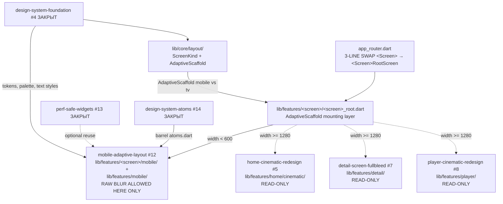

# Design Document — mobile-adaptive-layout

## Overview

`mobile-adaptive-layout` добавляет mobile-варианты трёх адаптивных экранов (home / detail / player) и floating glass bottom tabbar, **не модифицируя TV widget trees**. Mobile и TV сосуществуют через тонкий breakpoint switch (`AdaptiveScaffold` на основе `ScreenKind` enum, derived from `MediaQuery.sizeOf(context).width`). Каждый screen получает root-обёртку (`<Screen>RootScreen`) которая принимает решение mobile vs TV — TV widget tree остаётся zero-modification.

Спек — **единственный** в проекте, которому позволено использовать raw `BackdropFilter` / `ImageFilter.blur` / `ShaderMask`. Граница разрешения строго локализована: blur допустим **только** в файлах под `lib/core/layout/`, `lib/features/<screen>/mobile/` и `lib/features/mobile/`. Все TV-target специй (#5/#7/#8) и закрытые специй продолжают соблюдать `flutter-tv-perf.md`.

### Goals

- 3 mobile screens (home / detail / player) live + 0 modifications в TV widget trees.
- Glass tabbar с raw `BackdropFilter(blur 28px)` живёт без регрессии TV-path.
- Single source of truth для breakpoint detection: `ScreenKind` enum + `AdaptiveScaffold`.
- All 94+ existing tests pass (включая cinematic / detail-fullbleed / player-cinematic тесты Wave 3).
- Boundary check: `grep -rE "BackdropFilter|ImageFilter\.blur|ShaderMask" lib/` показывает hits ТОЛЬКО в mobile directories (Req 11.4).

### Non-Goals

- Переписать TV-cinematic / TV-detail / TV-player widgets (Wave 3, NOT modifying).
- Менять foundation specs (#4, #13, #14).
- Менять closed specs (`home-grid-*`, `player-overlay-*`).
- iOS/macOS-specific features (haptics, share-sheet, native widgets).
- tvOS / Apple TV.
- Native player engines, API/data layer.

## Boundary Commitments

### This Spec Owns

- `lib/core/layout/` (NEW DIR):
  - `screen_kind.dart` (enum + `screenKindOf` + `screenKindProvider`).
  - `adaptive_scaffold.dart` (`AdaptiveScaffold` widget).
- `lib/features/home/mobile/` (NEW DIR):
  - `home_mobile_screen.dart`.
  - `widgets/m_top_bar.dart`, `widgets/m_hero_card.dart`, `widgets/m_stacked_rail.dart`.
- `lib/features/home/home_root.dart` (NEW — owns `AdaptiveScaffold` for home; replaces TV file in router; TV widget tree untouched).
- `lib/features/detail/mobile/` (NEW DIR):
  - `detail_mobile_screen.dart`.
- `lib/features/detail/detail_root.dart` (NEW — owns `AdaptiveScaffold` for detail).
- `lib/features/player/mobile/` (NEW DIR):
  - `player_mobile_screen.dart`.
  - `widgets/m_player_controls.dart`, `widgets/m_swipe_hint.dart`.
- `lib/features/player/player_root.dart` (NEW — owns `AdaptiveScaffold` for player).
- `lib/features/mobile/` (NEW DIR — shared mobile-only atoms):
  - `widgets/m_tab_bar.dart`.
  - `widgets/m_icon_btn.dart`.
  - `widgets/m_live_dot.dart`.
  - `state/active_mobile_tab_provider.dart` (Riverpod state for active tab).
- `test/core/layout/` + `test/features/<screen>/mobile/` + `test/features/mobile/` (NEW DIRS).
- `lib/app_router.dart` (or equivalent — ONE-LINE per screen swap from `<Screen>` to `<Screen>RootScreen` — three lines total).

### Out of Boundary

- `lib/features/home/cinematic/*` — read-only (Wave 3 #5).
- `lib/features/home/widgets/*` — read-only (closed specs).
- `lib/features/home/home_screen.dart` — read-only (legacy).
- TV detail widget trees in `lib/features/detail/` (outside `mobile/` and `detail_root.dart`) — read-only (Wave 3 #7).
- TV player widget trees in `lib/features/player/` (outside `mobile/` and `player_root.dart`) — read-only (Wave 3 #8).
- `lib/core/theme/*`, `lib/core/perf/*`, `lib/core/ui/atoms/*` — read-only foundation.
- `lib/core/player/*`, `lib/core/api/*`, `lib/core/playlist/*`, `lib/core/epg/*` — read-only data layer.
- Sealed `PlayerUiState` — read-only.
- `pubspec.yaml` — NO new packages (Req 12.4).

### Allowed Dependencies

- Upstream: `package:flutter/material.dart`, `package:flutter/services.dart` (haptic feedback OK on mobile), `package:flutter_riverpod/flutter_riverpod.dart`, `package:flutter_screenutil/flutter_screenutil.dart`.
- Upstream: `package:megav_iptv/core/theme/...` (AppPalette, AppRadius, AppColors proxy, MegaVTextStyles, themeProvider).
- Upstream: `package:megav_iptv/core/perf/perf_safe_widgets.dart` (atoms reuse safe primitives where convenient — but mobile may bypass via raw `BackdropFilter` per Req 11).
- Upstream: `package:megav_iptv/core/ui/atoms/atoms.dart` (Brand, Chip, GenreTabs, MMLogo, MvButton, MvIconButton, Poster, RemoteHint, SectionTitle, StatusBar — though mobile uses few of these directly; primarily `Poster`, `Chip`, `Brand`).
- Upstream: existing data providers (`categoryNotifierProvider`, `moviesNotifierProvider`, sealed `PlayerUiState` provider).
- Upstream: TV root entries (`HomeMobileScreen` is sibling — TV is consumed by `<Screen>RootScreen` AS A WIDGET, not modified).

### Revalidation Triggers

- Any breakpoint change in `pickColumns` (closed) — mobile path is independent and does NOT depend on `pickColumns`, but the regression test from #5 still asserts TV breakpoints.
- Any new atom in `design-system-atoms` — mobile may want to switch over.
- Any modification of `AdaptiveScaffold` API — all `<Screen>RootScreen` files revalidate.
- Any change to TV root entries (`CinematicHomeScreen`, etc.) — `<Screen>RootScreen` consumer revalidates.

## Architecture

### Existing Architecture Analysis

The codebase already has:
- TV cinematic home (`lib/features/home/cinematic/cinematic_home_screen.dart`) — consumed read-only as TV path.
- TV detail screen — consumed read-only.
- TV player screen + sealed `PlayerUiState` — consumed read-only.
- `MediaQuery.sizeOf` is used in `pickColumns 3/4/5` — closed-spec; mobile path is independent of that function.

This spec adds a thin mounting layer (`AdaptiveScaffold` + `<Screen>RootScreen`) that decides mobile vs TV and constructs the appropriate widget tree. TV trees are imported and constructed exactly as-is.

### Architecture Pattern & Boundary Map



**Pattern**: thin breakpoint-switching layer + parallel mobile widget trees. TV trees are zero-touch, consumed as widgets via import.
**Domain boundary**: mobile path is strictly contained in 4 directories (`lib/core/layout/`, `lib/features/<screen>/mobile/` × 3, `lib/features/mobile/`). The boundary is enforced by directory-scoped grep (Req 11.4).

### Technology Stack

| Layer | Choice | Role | Notes |
|---|---|---|---|
| UI primitives | Flutter widgets via atoms barrel + raw `BackdropFilter` (mobile only) | Mobile widgets, glass effects | Mobile path freed from TV-perf rule. |
| Theming | `AppPalette`, `MegaVTextStyles` (#4) | Color / typography | Read via `Theme.of(context)` and `AppColors.X`. |
| Perf primitives | `RepaintBoundary` (always), `BackdropFilter` (mobile only) | Animations, blur | `RepaintBoundary` is platform-agnostic. |
| Atoms | `Poster`, `Chip`, `MvButton`, `Brand`, `MMLogo` (#14) | Composition | Mobile reuses where natural; mobile-specific atoms (`MTopBar`, `MHeroCard`, etc.) defined in `lib/features/mobile/widgets/`. |
| Riverpod | `flutter_riverpod` | `screenKindProvider`, `activeMobileTabProvider`, existing data providers | One new provider for active tab. |
| Routing | `go_router` (existing) | Each screen route maps to `<Screen>RootScreen` (NEW), which internally chooses mobile or TV widget tree. | Three-line swap in `app_router.dart`. |
| Animations | `AnimationController`, `AnimatedOpacity`, `AnimatedScale` | Pulse, swipe hint | All wrapped in `RepaintBoundary` per Req 11.3. |
| Testing | `flutter_test`, `WidgetTester` | Widget + smoke + breakpoint switch | No new test packages. |
| Gestures | `GestureDetector(onHorizontalDragEnd)` for player swipe | Channel switch | Standard Flutter API. |

## File Structure Plan

### New files

```
megav_iptv/
├─ lib/
│  ├─ core/
│  │  └─ layout/                                              [NEW DIR]
│  │     ├─ screen_kind.dart                                  [NEW] ScreenKind enum + screenKindOf + screenKindProvider (Req 1)
│  │     └─ adaptive_scaffold.dart                            [NEW] AdaptiveScaffold (Req 1, 6)
│  └─ features/
│     ├─ home/
│     │  ├─ home_root.dart                                    [NEW] HomeRootScreen — AdaptiveScaffold mount (Req 6.2)
│     │  └─ mobile/                                           [NEW DIR]
│     │     ├─ home_mobile_screen.dart                        [NEW] HomeMobileScreen (Req 2)
│     │     └─ widgets/
│     │        ├─ m_top_bar.dart                              [NEW] MTopBar (Req 2.2, 7.1)
│     │        ├─ m_hero_card.dart                            [NEW] MHeroCard (Req 2.4, 7.3)
│     │        └─ m_stacked_rail.dart                         [NEW] MStackedRail (Req 2.5, 7.4)
│     ├─ detail/
│     │  ├─ detail_root.dart                                  [NEW] DetailRootScreen — AdaptiveScaffold mount (Req 6.3)
│     │  └─ mobile/                                           [NEW DIR]
│     │     └─ detail_mobile_screen.dart                      [NEW] DetailMobileScreen (Req 3)
│     ├─ player/
│     │  ├─ player_root.dart                                  [NEW] PlayerRootScreen — AdaptiveScaffold mount (Req 6.4)
│     │  └─ mobile/                                           [NEW DIR]
│     │     ├─ player_mobile_screen.dart                      [NEW] PlayerMobileScreen (Req 4)
│     │     └─ widgets/
│     │        ├─ m_player_controls.dart                      [NEW] MPlayerControls (Req 4.2, 7.5)
│     │        └─ m_swipe_hint.dart                           [NEW] MSwipeHint (Req 4.4, 7.6)
│     └─ mobile/                                              [NEW DIR — shared mobile atoms]
│        ├─ state/
│        │  └─ active_mobile_tab_provider.dart                [NEW] activeMobileTabProvider (Req 5.3)
│        └─ widgets/
│           ├─ m_tab_bar.dart                                 [NEW] MTabBar (Req 5)
│           ├─ m_icon_btn.dart                                [NEW] MIconBtn (Req 7.2)
│           └─ m_live_dot.dart                                [NEW] MLiveDot (Req 4.5, 7.7)
└─ test/
   ├─ core/
   │  └─ layout/                                              [NEW DIR]
   │     ├─ screen_kind_test.dart                             [NEW] Req 10.2, 10.4
   │     └─ adaptive_scaffold_test.dart                       [NEW] Req 10.2
   ├─ features/
   │  ├─ home/
   │  │  └─ mobile/                                           [NEW DIR]
   │  │     ├─ home_mobile_screen_smoke_test.dart             [NEW] Req 10.3
   │  │     ├─ m_top_bar_test.dart                            [NEW] Req 10.1
   │  │     ├─ m_hero_card_test.dart                          [NEW] Req 10.1
   │  │     └─ m_stacked_rail_test.dart                       [NEW] Req 10.1
   │  ├─ detail/
   │  │  └─ mobile/
   │  │     └─ detail_mobile_screen_smoke_test.dart           [NEW] Req 10.3
   │  ├─ player/
   │  │  └─ mobile/
   │  │     ├─ player_mobile_screen_smoke_test.dart           [NEW] Req 10.3
   │  │     ├─ m_player_controls_test.dart                    [NEW] Req 10.1
   │  │     └─ m_swipe_hint_test.dart                         [NEW] Req 10.1
   │  └─ mobile/
   │     ├─ m_tab_bar_test.dart                               [NEW] Req 10.1
   │     ├─ m_icon_btn_test.dart                              [NEW] Req 10.1
   │     └─ m_live_dot_test.dart                              [NEW] Req 10.1
```

Total: 17 new lib files + 12 new test files.

### Modified files

```
megav_iptv/
└─ lib/
   └─ app_router.dart                                         [MODIFIED — 3 LINES]
      Three route entries swap their target widget from
      <Screen> → <Screen>RootScreen (one line per screen).
```

If `app_router.dart` does not exist as such (router lives elsewhere — `main.dart` or feature-local), implementer applies the same 3-line swap in the equivalent file. Implementer documents the chosen file in commit message.

NOT modified: any file under `lib/features/home/cinematic/`, `lib/features/home/widgets/`, `lib/features/home/home_screen.dart`, TV detail widgets (outside `detail_root.dart`), TV player widgets (outside `player_root.dart`), any file under `lib/core/` other than `lib/core/layout/`, `pubspec.yaml`, any test under closed-spec or Wave 3 ownership.

## Components and Interfaces

### 1. `ScreenKind` + `screenKindOf` + `screenKindProvider`

```dart
enum ScreenKind { mobile, tablet, tv }

ScreenKind screenKindOf(BuildContext context) {
  final w = MediaQuery.sizeOf(context).width;
  if (w < 600) return ScreenKind.mobile;
  if (w < 1280) return ScreenKind.tablet;
  return ScreenKind.tv;
}

// Optional Riverpod accessor for non-widget code paths (tests, services).
final screenKindProvider = Provider.autoDispose<ScreenKind>((ref) {
  // Default to TV; widget code reads via screenKindOf(context).
  // In tests, override via ProviderScope.
  return ScreenKind.tv;
});
```

- Single file `lib/core/layout/screen_kind.dart`.
- Pure function — no global state, no platform-channel reads (Req 1.5, 1.6).

### 2. `AdaptiveScaffold`

```dart
class AdaptiveScaffold extends StatelessWidget {
  const AdaptiveScaffold({super.key, required this.mobile, required this.tv, this.tablet});
  final WidgetBuilder mobile;
  final WidgetBuilder tv;
  final WidgetBuilder? tablet;

  @override
  Widget build(BuildContext context) {
    switch (screenKindOf(context)) {
      case ScreenKind.mobile:
        return mobile(context);
      case ScreenKind.tablet:
        return (tablet ?? tv)(context);
      case ScreenKind.tv:
        return tv(context);
    }
  }
}
```

- Single file `lib/core/layout/adaptive_scaffold.dart`.
- Pure switch on `screenKindOf` — no animation, no transition (transitions are owned by go_router).

### 3. `<Screen>RootScreen` (HomeRootScreen / DetailRootScreen / PlayerRootScreen)

```dart
class HomeRootScreen extends StatelessWidget {
  const HomeRootScreen({super.key});
  @override
  Widget build(BuildContext context) => AdaptiveScaffold(
    mobile: (_) => const HomeMobileScreen(),
    tv:     (_) => const CinematicHomeScreen(), // TV widget — imported, NOT modified
  );
}
```

- One file per screen: `lib/features/home/home_root.dart`, `lib/features/detail/detail_root.dart`, `lib/features/player/player_root.dart`.
- `app_router.dart` registers `HomeRootScreen` instead of `CinematicHomeScreen` directly — three-line swap total (Req 6.5).

### 4. `HomeMobileScreen`

```dart
class HomeMobileScreen extends ConsumerWidget {
  const HomeMobileScreen({super.key});
}
```

- Composes vertically:
  1. `MediaQuery.viewPaddingOf(context).top` reservation (status bar).
  2. `MTopBar` (city / temp / time + brand).
  3. `MHeroCard` (380-px portrait hero + paginator).
  4. N × `MStackedRail` (vertical-scroll single-column rails).
  5. `MTabBar` floating at bottom (`Stack` over a `ListView`).
- Wraps scrollable in `ListView` with `cacheExtent: 1500` (still recommended, even on mobile).
- Mounts root `Key('home-mobile-root')`.

### 5. `DetailMobileScreen`

```dart
class DetailMobileScreen extends ConsumerWidget {
  const DetailMobileScreen({super.key, required this.itemId});
  final String itemId;
}
```

- Single-column: poster (full-width) → title → meta (year/duration/rating row) → action row (Play / Add / Share `MIconBtn`s) → description.
- Uses `MegaVTextStyles` scaled-down: title `headline` (≤ 22 px), body `body` (16 px), meta `metaMono` (14 px).
- Back-arrow at top-left via `MIconBtn(icon: Icons.arrow_back_ios)`.
- May use raw `BackdropFilter` on a poster→content transition gradient if needed.
- Mounts root `Key('detail-mobile-root')`.

### 6. `PlayerMobileScreen`

```dart
class PlayerMobileScreen extends ConsumerStatefulWidget {
  const PlayerMobileScreen({super.key, required this.channelId});
  final String channelId;
  @override
  ConsumerState<PlayerMobileScreen> createState() => _PlayerMobileScreenState();
}
```

- Stack:
  - Bottom layer: video surface (consumes `playerUiStateProvider` read-only).
  - `GestureDetector(onHorizontalDragEnd:)` covering the video surface — left swipe → next channel via existing player API; right swipe → previous channel.
  - `MPlayerControls` anchored at bottom with raw `BackdropFilter(blur 28px)` glass effect (Req 11).
  - `MSwipeHint` overlay shown until first swipe; `RepaintBoundary` wraps its pulse animation.
  - `MLiveDot` positioned top-left over the video surface, `RepaintBoundary` wrapping pulse.
- Reads `playerUiStateProvider` (sealed type) — does NOT mutate.
- Mounts root `Key('player-mobile-root')`.

### 7. `MTabBar` (floating glass tabbar)

```dart
class MTabBar extends ConsumerWidget {
  const MTabBar({super.key});
}
```

- 5 tabs: Home / TV / Search / Guide / Profile, each `MIconBtn` + label `Text`.
- Active index from `activeMobileTabProvider`.
- Background: `BackdropFilter(filter: ImageFilter.blur(sigmaX: 28, sigmaY: 28), child: ColoredBox(color: theme.surface1.withValues(alpha: 0.6)))` (Req 5.4 — RAW blur permitted).
- Border-radius via `AppRadius.lg` rounded top corners + bottom inset for `MediaQuery.viewPaddingOf(context).bottom` safe area.
- Mounts root `Key('m-tab-bar')`.

### 8. Mobile widgets — `MTopBar`, `MIconBtn`, `MHeroCard`, `MStackedRail`, `MPlayerControls`, `MSwipeHint`, `MLiveDot`

Each is a thin `StatelessWidget` (or `ConsumerWidget` where state needed). Public APIs are documented per Req 7. Pulse animations (`MLiveDot`, `MSwipeHint`) wrap their `AnimationController` in `RepaintBoundary` per Req 11.3.

### 9. `activeMobileTabProvider`

```dart
final activeMobileTabProvider = StateProvider<int>((ref) => 0); // 0 = Home
```

- Single file `lib/features/mobile/state/active_mobile_tab_provider.dart`.
- Mobile-only — TV path never reads this provider.

## Data Models

No new data models. The mobile module reuses:
- `NowPlayingItem` from `lib/core/playlist/models/now_playing.dart`.
- `Channel` from `lib/core/playlist/models/channel.dart`.
- `Movie` (or equivalent) from existing providers.
- `PlayerUiState` sealed type — read-only consumption.

## Error Handling

- `HomeMobileScreen`: if data providers return empty / error, render empty placeholder rails — never crash.
- `DetailMobileScreen`: if `itemId` unresolved, render skeleton-style placeholder with retry button.
- `PlayerMobileScreen`: mirrors TV player error states — shown via the same `PlayerUiState` consumer; on stream-error, show centered `Text` over a dimmed video surface.
- `MTabBar`: if `activeMobileTabProvider` value is out of range, default to 0 (Home).
- `AdaptiveScaffold`: defensive — if `MediaQuery` is somehow unavailable (extreme edge case in tests), fall back to TV widget.

## Performance Considerations

- **Mobile path is freed from TV-perf rule** (Req 11) — `BackdropFilter`, `ImageFilter.blur`, `ShaderMask` permitted in `lib/core/layout/`, `lib/features/<screen>/mobile/`, `lib/features/mobile/`.
- **Animations always wrapped in `RepaintBoundary`** (Req 11.3) — `MLiveDot.pulse`, `MSwipeHint.pulse`, any glass shimmer.
- **`ListView` perf flags retained**: `cacheExtent: 1500`, `addAutomaticKeepAlives: true`, `addRepaintBoundaries: true`, `clipBehavior: Clip.none` — these help on mobile too.
- **Glass tabbar single saveLayer per frame** — modern mobile GPUs handle this cheaply (per brief.md performance constraints).
- **Pulse animation uses `AnimationController` with `lowerBound`/`upperBound`** via `Tween` rather than rebuilding the widget tree.
- **TV path performance unchanged** — TV widget trees are NOT modified, so all TV-perf budgets (`GPURasterizer::Draw ≤ 16.7 ms` on rtd2851a) remain intact.

## Testing Strategy

| Layer | Tool | Scope |
|---|---|---|
| Widget tests | `flutter_test` `WidgetTester` | Each new mobile widget (Req 7) — pumped with mock providers; asserts Key presence + atom usage + no exceptions. |
| Smoke tests | `flutter_test` | `HomeMobileScreen`, `DetailMobileScreen`, `PlayerMobileScreen` pumped under `MediaQuery(size: Size(390, 844))` (iPhone 16 Pro frame); two frames; asserts no exception, asserts presence of all root Keys. |
| Breakpoint switch | `flutter_test` | `AdaptiveScaffold` test pumps under width 390 — asserts mobile child renders, TV child does NOT; pumps under width 1920 — asserts TV child renders, mobile does NOT (Req 10.2). |
| TV regression | `flutter_test` | Existing TV smoke tests for cinematic / detail-fullbleed / player-cinematic continue passing (no modification — they pump the TV widget directly, which is still importable). |
| Static check | `flutter analyze` | All new mobile dirs clean (Req 12.2). |
| Boundary grep | shell / CI | `grep -rE "BackdropFilter|ImageFilter\.blur|ShaderMask" lib/` returns hits ONLY in `lib/core/layout/`, `lib/features/home/mobile/`, `lib/features/detail/mobile/`, `lib/features/player/mobile/`, `lib/features/mobile/` (Req 11.4, 12.3). |
| Full suite | `flutter test` | Prior baseline (94 + tests added by Wave 3) + new mobile tests all green (Req 10.5). |

## Migration / Rollout

- **Stage 0**: scaffold `lib/core/layout/` (`ScreenKind` + `AdaptiveScaffold`) + tests. Verify smoke green. No mobile screens yet.
- **Stage 1**: scaffold `<Screen>RootScreen` files for home/detail/player. Each one returns `AdaptiveScaffold(mobile: <stub>, tv: <existing TV widget>)`. Router 3-line swap. Run TV regression — TV behaviour unchanged.
- **Stage 2**: implement `HomeMobileScreen` + `MTopBar` + `MHeroCard` + `MStackedRail` + tests.
- **Stage 3**: implement `DetailMobileScreen` + tests.
- **Stage 4**: implement `PlayerMobileScreen` + `MPlayerControls` + `MSwipeHint` + `MLiveDot` + tests.
- **Stage 5**: implement `MTabBar` + `MIconBtn` + `activeMobileTabProvider` + tests.
- **Stage 6**: final regression — full `flutter test`, boundary grep, manual smoke on Android phone (Pixel 6 / iPhone 14) + manual TV smoke on rtd2851a (TV path must look identical to before).

## Traceability — Requirement → Component

| Req # | Requirement summary | Owning component(s) | Notes |
|---|---|---|---|
| 1 | Breakpoint detector — `ScreenKind` + `AdaptiveScaffold` | `screen_kind.dart`, `adaptive_scaffold.dart` | Pure function + thin widget. |
| 2 | Home mobile variant — single-column scroll | `HomeMobileScreen`, `MTopBar`, `MHeroCard`, `MStackedRail` | Reuses data providers. |
| 3 | Detail mobile — full-screen sheet | `DetailMobileScreen` | Compact fonts, single-column. |
| 4 | Player mobile — vertical-first + swipe | `PlayerMobileScreen`, `MPlayerControls`, `MSwipeHint`, `MLiveDot` | Sealed `PlayerUiState` read-only. |
| 5 | Bottom tabbar — floating glass nav | `MTabBar`, `activeMobileTabProvider` | Raw `BackdropFilter` permitted. |
| 6 | Adaptive screen entry — minimal touch on TV | `<Screen>RootScreen` × 3 + `app_router.dart` 3-line swap | TV widgets imported, not modified. |
| 7 | Mobile widgets set | `MTopBar`, `MIconBtn`, `MHeroCard`, `MStackedRail`, `MPlayerControls`, `MSwipeHint`, `MLiveDot` | Reusable mobile primitives. |
| 8 | Reuse atoms and theme tokens | All mobile widgets via `atoms.dart` barrel | No theme override. |
| 9 | Backward compat — TV path untouched | Cross-cutting | Enforced by directory boundaries + grep. |
| 10 | Test coverage — mobile + TV regression | All `test/features/<screen>/mobile/` + `test/core/layout/` + `test/features/mobile/` | ≥ 7 widget tests + 3 smoke tests + breakpoint switch tests. |
| 11 | Mobile-specific perf relaxation | Cross-cutting — boundary enforced by grep | RAW blur ALLOWED only in mobile dirs. |
| 12 | Testability + observable hooks | Keys on every component + grep checks + analyze clean | CI-checkable. |

## Open Decisions Deferred to Implementation

- **Tablet behaviour**: design defaults `tablet → tv` (TV-grid feels right at 600-1280 width on landscape tablets). Implementer may add a `tablet` builder later as a follow-up issue if user requests.
- **TabBar persistence across screens**: design assumes `MTabBar` is rendered inside each mobile screen (not at root level) — simpler. If user requests cross-screen persistence, follow-up issue.
- **Active tab → route navigation**: `activeMobileTabProvider` value updates trigger `go_router.go(...)` via a `ref.listen` in a wrapper widget. Implementer chooses the wrapper location.
- **Player swipe sensitivity**: defaults to `velocity > 500 px/s OR distance > 50 px` — implementer tunes based on manual testing.
- **Mobile haptic feedback**: out of scope per Req on iOS-specific features; basic `HapticFeedback.lightImpact()` on tab tap is platform-agnostic and OPTIONAL.
- **Status-bar reservation** in `HomeMobileScreen`: uses `MediaQuery.viewPaddingOf(context).top` directly; if the design system later exposes a `StatusBar` atom variant for mobile, switch.
