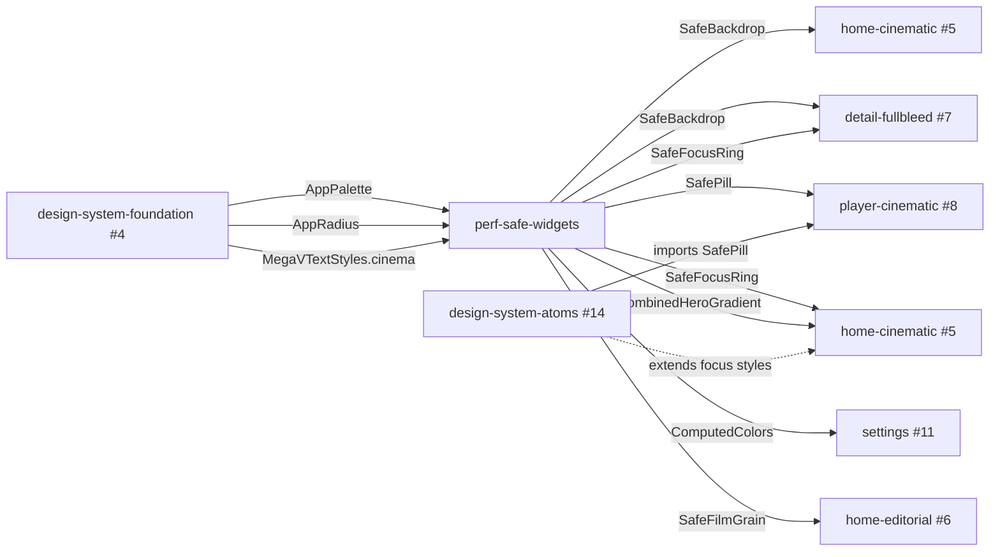

# Design Document — perf-safe-widgets

## Overview

`perf-safe-widgets` shipping foundation для всех downstream screen-redesign спеков (#5-#12). Это **infrastructure-spec без user-visible поведения**: вводит 4 переиспользуемых widget'а + 1 baked PNG asset + pre-mixed Color factory + augmentation steering doc. Каждый компонент — direct safe replacement для конкретного CSS-приёма из handoff bundle, который нарушает rules `flutter-tv-perf.md`. Закрытые специй (`home-grid-*`, `player-overlay-state-machine`) **не модифицируются**; новые widgets живут в новой leaf-директории `lib/core/perf/` и вызываются только новыми/редизайн-screens.

### Goals

- Предоставить 4 готовых safe-widgets (`SafeBackdrop`, `SafePill`, `SafeFocusRing`, `SafeFilmGrain`) с zero-runtime-saveLayer гарантией.
- Дать `combinedHeroGradient(palette)` factory для замены 3 stacked gradients одним проходом.
- Дать `ComputedColors.from(palette)` фабрику pre-mixed colors (CSS `color-mix(oklab)` equivalent).
- Гарантировать backward-compat: 53/53 существующих тестов продолжают зелёные.
- Augment `flutter-tv-perf.md` секцией «Design handoff conflicts → safe replacements» как single source of truth.

### Non-Goals

- Применение safe widgets к screen-widget'ам (это собственность screen-redesign спеков).
- Mobile-specific полностью: на mobile `BackdropFilter` приемлем — раздел просто документирует, что safe widgets — TV-target. Mobile screens (#12) не обязаны использовать `SafePill` если код-путь TV-only.
- Server-side imgproxy интеграция (опция (b) для `SafeBackdrop` brief.md) — потенциальная enhancement в отдельный спек.
- Native player engines, providers, models, API.
- Модификации closed специй.

## Boundary Commitments

### This Spec Owns

- Файлы `lib/core/perf/perf_safe_widgets.dart` (new — 4 widgets + 1 helper factory).
- Файл `lib/core/theme/computed_colors.dart` (new — `ComputedColors` class with palette-derived mixed colors).
- Asset `megav_iptv/assets/grain_overlay.png` (new — 1024×1024 baked noise+overlay PNG).
- Modifications to `megav_iptv/pubspec.yaml` to register the new asset under `flutter.assets:`.
- Modifications to `megav_iptv/lib/core/theme/megav_text_styles.dart` — adjust display-style `Shadow.blurRadius` to ≤ 12 (Req 7).
- Augmentation of `.kiro/steering/flutter-tv-perf.md` with new section «Design handoff conflicts → safe replacements» (Req 8).
- Test files: `test/core/perf/perf_safe_widgets_test.dart` and `test/core/theme/computed_colors_test.dart`.

### Out of Boundary

- Любые changes в `lib/features/`, `lib/core/player/`, `lib/core/api/`, `lib/core/playlist/`, `lib/core/epg/`.
- Изменения в `lib/core/theme/app_palette.dart`, `app_palettes.dart`, `app_colors.dart`, `app_radius.dart`, `theme_provider.dart`, `app_theme.dart`. Foundation готов и используется как dependency only.
- Mobile-specific theming (`lib/features/<x>/mobile/*` если существует — read-only).
- Применение safe widgets к existing UI surface — это owner downstream screen-spec'ов.

### Allowed Dependencies

- Upstream: `lib/core/theme/app_palette.dart` (read AppPalette type).
- Upstream: `lib/core/theme/app_palettes.dart` (read AppPaletteName for fallback only — NOT for state).
- Upstream: `lib/core/theme/app_colors.dart` (read static getters for backward-compat call-sites if needed).
- Flutter SDK: `flutter/widgets.dart`, `flutter/material.dart`, `dart:ui`, `dart:async` (для Future в SafeBackdrop), `dart:typed_data`.
- No new pubspec packages.

### Revalidation Triggers

- Any change to `AppPalette` field shape (rename / add / remove tokens) — would require `combinedHeroGradient` and `ComputedColors` to re-derive their token-mapping.
- Any new perf-rule added to `flutter-tv-perf.md` — could invalidate one of the safe widgets if its technique is later flagged.
- Adding `BackdropFilter` to `flutter-tv-perf.md` allow-list (mobile path) — would require explicit guard documentation.
- Any future `lib/core/perf/` subdirectory addition — must extend the existing `kSafe*` constants and conform to «no saveLayer in build» invariant.

## Architecture

### Existing Architecture Analysis

The codebase has three closed perf-spec lineage commits demonstrating the pattern:

- **`home-grid-optimization`** introduced `_grid_tokens.dart` — pure-token leaf file with no runtime context. Widget consumers multiply tokens by `.w / .h` at use-site. Same pattern adopted for `lib/core/perf/`.
- **`home-grid-visual-polish`** swapped `ShaderMask` for `Stack + Positioned + DecoratedBox(LinearGradient)` overlay (`cinema_row.dart:468-475`). Same pattern reused conceptually in `combinedHeroGradient` and `SafeFocusRing`.
- **`player-overlay-state-machine`** isolated `_LoadingErrorIndicator` via `RepaintBoundary` + `const` ctor. Same isolation pattern applied to `SafeBackdrop` (StatefulWidget under `RepaintBoundary` so async re-render не ребилдит parent).

Foundation `design-system-foundation` provides `AppPalette` with all 17 tokens — every safe widget reads from this single source.

### Architecture Pattern & Boundary Map



**Selected pattern**: leaf-package + plain widgets, no global state. Each widget is independently testable via `pumpWidget`.

**Domain/feature boundaries**: `lib/core/perf/` is a NEW leaf — no existing siblings. Touches `lib/core/theme/megav_text_styles.dart` minimally (Req 7 shadow blur reduction) and adds `lib/core/theme/computed_colors.dart` adjacent to existing theme files.

**Steering compliance**: every widget passes the steering rules at construction time:
- `SafeBackdrop`: pre-renders blur once, no `BackdropFilter` in `build`.
- `SafePill`: opaque tint, no `BackdropFilter`.
- `SafeFocusRing`: `BoxShadow(blurRadius: 0)`, never > 12.
- `SafeFilmGrain`: `Opacity` over `Image.asset`, no `BlendMode` other than default `srcOver`.
- `combinedHeroGradient`: single `Gradient`, single render pass.

### Technology Stack

| Layer | Choice / Version | Role | Notes |
|-------|------------------|------|-------|
| Frontend (UI primitives) | Flutter 3.x widgets | All 4 safe widgets | Pure SDK; no third-party UI library. |
| Theming integration | `lib/core/theme/app_palette.dart` (in repo) | Color sourcing | Foundation already shipped via #4. |
| Image processing (offscreen) | `dart:ui` `ImageFilter`, `PictureRecorder` | Pre-render blur for `SafeBackdrop` | Used once per artwork change, not per frame. |
| Asset pipeline | Flutter `flutter.assets:` | Bundle `grain_overlay.png` | Updates `pubspec.yaml`. |
| Color math | `Color.lerp` (Flutter SDK) | Approximate `color-mix(oklab)` | Linear-RGB lerp; gamma-incorrect but adequate for 4-15% tints. |

Rationale: zero new dependencies preserves the «no new packages» constraint (Req 9.4) and keeps bundle size and supply-chain surface minimal.

## File Structure Plan

### New files

```
megav_iptv/
├─ assets/
│  └─ grain_overlay.png             [NEW] Baked 1024×1024 PNG, ~30-40kb after pngquant
├─ lib/
│  └─ core/
│     ├─ perf/
│     │  └─ perf_safe_widgets.dart  [NEW] 4 widgets + combinedHeroGradient + kSafeShadowBlurMax
│     └─ theme/
│        └─ computed_colors.dart    [NEW] ComputedColors.from(AppPalette)
└─ test/
   └─ core/
      ├─ perf/
      │  └─ perf_safe_widgets_test.dart   [NEW] 6+ tests (per Req 11)
      └─ theme/
         └─ computed_colors_test.dart      [NEW] 2-3 tests
```

### Modified files

```
megav_iptv/
├─ pubspec.yaml                      [MODIFIED] Add `assets/grain_overlay.png` under flutter.assets
├─ lib/
│  └─ core/
│     └─ theme/
│        └─ megav_text_styles.dart   [MODIFIED] Replace any Shadow(blurRadius > 12) with ≤ 8
└─ .kiro/
   └─ steering/
      └─ flutter-tv-perf.md         [MODIFIED] Add «Design handoff conflicts → safe replacements» section
```

Total: 5 new files + 3 modified files.

## Components and Interfaces

### 1. `SafeBackdrop` widget

```dart
class SafeBackdrop extends StatefulWidget {
  const SafeBackdrop({
    super.key,
    required this.imageProvider,
    required this.fallbackBackground,
    this.blurSigma = 40,
    this.semanticLabel,
  });

  final ImageProvider? imageProvider;
  final Color fallbackBackground;
  final double blurSigma;
  final String? semanticLabel;

  @override
  State<SafeBackdrop> createState() => _SafeBackdropState();
}

class _SafeBackdropState extends State<SafeBackdrop> {
  ui.Image? _blurredImage;
  Object? _activeKey;
  bool _renderInFlight = false;

  @override
  void didChangeDependencies() {
    super.didChangeDependencies();
    _maybeRebuildBlur();
  }

  @override
  void didUpdateWidget(SafeBackdrop old) {
    super.didUpdateWidget(old);
    if (old.imageProvider != widget.imageProvider ||
        old.blurSigma != widget.blurSigma) {
      _maybeRebuildBlur();
    }
  }

  Future<void> _maybeRebuildBlur() async {
    if (_renderInFlight) return;
    final provider = widget.imageProvider;
    if (provider == null) return;
    _renderInFlight = true;
    try {
      final key = await provider.obtainKey(ImageConfiguration.empty);
      if (key == _activeKey) return;
      // Resolve image, draw to PictureRecorder with ImageFilter.blur applied,
      // convert to ui.Image, store in _blurredImage. setState to trigger paint.
      // Implementation detail handled in implementer task.
    } finally {
      _renderInFlight = false;
    }
  }

  @override
  Widget build(BuildContext context) {
    return RepaintBoundary(
      child: ColoredBox(
        color: widget.fallbackBackground,
        child: _blurredImage == null
            ? const SizedBox.expand()
            : RawImage(image: _blurredImage, fit: BoxFit.cover),
      ),
    );
  }
}
```

**Public contract**:
- Required: `imageProvider` (nullable — null = fallback only), `fallbackBackground` (Color shown until/if blur ready).
- Optional: `blurSigma` (default 40), `semanticLabel`.
- Behavior: pre-renders blurred image once per `imageProvider` change; reuses cached `ui.Image` for all subsequent frames.

**Why StatefulWidget**: pre-render is async; cached `ui.Image` is local state.

**Maps to Req**: 1.1, 1.2, 1.3, 1.4, 1.5, 1.6.

### 2. `SafePill` widget

```dart
class SafePill extends StatelessWidget {
  const SafePill({
    super.key,
    required this.child,
    this.tint,
    this.alpha = 0.85,
    this.borderRadius,
    this.padding = const EdgeInsets.symmetric(horizontal: 12, vertical: 6),
  });

  final Widget child;
  final Color? tint;            // defaults to AppColors.surface from active palette
  final double alpha;           // 0.7–1.0 recommended
  final BorderRadius? borderRadius;  // defaults to AppRadius.brSm
  final EdgeInsets padding;

  @override
  Widget build(BuildContext context) {
    final base = tint ?? AppColors.surface;
    final filled = Color.fromRGBO(base.red, base.green, base.blue, alpha);
    return Container(
      padding: padding,
      decoration: BoxDecoration(
        color: filled,
        borderRadius: borderRadius ?? AppRadius.brSm,
      ),
      child: child,
    );
  }
}
```

**Public contract**: `child` required, all other params optional with palette-aware defaults.

**Behavior**: opaque RGBA fill, no `BackdropFilter`, no per-frame blur. Renders identically across frames.

**Why Stateless**: pure presentation, zero internal state.

**Maps to Req**: 2.1, 2.2, 2.3, 2.4, 2.5.

### 3. `SafeFocusRing` widget

```dart
class SafeFocusRing extends StatelessWidget {
  const SafeFocusRing({
    super.key,
    required this.child,
    this.isFocused = false,
    this.ringColor,           // defaults to AppColors.primary (= accent)
    this.gap = 3.0,           // logical px between child and ring
    this.thickness = 3.0,     // ring thickness
    this.duration = const Duration(milliseconds: 150),  // Leanback default
  });

  final Widget child;
  final bool isFocused;
  final Color? ringColor;
  final double gap;
  final double thickness;
  final Duration duration;

  @override
  Widget build(BuildContext context) {
    final color = ringColor ?? AppColors.primary;
    return AnimatedContainer(
      duration: duration,
      curve: Curves.fastOutSlowIn,
      decoration: BoxDecoration(
        boxShadow: isFocused
            ? [
                BoxShadow(
                  color: color,
                  spreadRadius: gap + thickness,
                  blurRadius: 0,
                ),
                BoxShadow(
                  color: AppColors.background,  // inner gap (creates outline-offset effect)
                  spreadRadius: gap,
                  blurRadius: 0,
                ),
              ]
            : const [],
      ),
      child: child,
    );
  }
}
```

**Public contract**: `child` + `isFocused` required, all others have palette-aware defaults.

**Behavior**: When `isFocused=true`, two stacked solid `BoxShadow` create the outline-offset effect: inner shadow uses background color (the gap), outer shadow uses ring color (the actual ring). Both have `blurRadius: 0`. When unfocused, no shadows.

**150ms transition**: matches Leanback `lb_card_activated_animation_duration`. `AnimatedContainer` interpolates between focused/unfocused decorations; GPU composites without sibling relayout.

**Why Stateless**: focus state owned by parent (FocusableActionDetector or Riverpod focus tracker). This widget just renders.

**Maps to Req**: 3.1, 3.2, 3.3, 3.4, 3.5, 3.6, 3.7.

### 4. `SafeFilmGrain` widget

```dart
class SafeFilmGrain extends StatelessWidget {
  const SafeFilmGrain({
    super.key,
    required this.child,
    this.opacity = 0.08,
    this.assetPath = 'assets/grain_overlay.png',
  });

  final Widget child;
  final double opacity;       // 0.04-0.12 recommended; clamped on construction
  final String assetPath;

  @override
  Widget build(BuildContext context) {
    final clamped = opacity.clamp(0.0, 0.20);
    return Stack(
      fit: StackFit.passthrough,
      children: [
        child,
        Positioned.fill(
          child: IgnorePointer(
            child: Opacity(
              opacity: clamped,
              child: Image.asset(
                assetPath,
                fit: BoxFit.cover,
                repeat: ImageRepeat.repeat,
                errorBuilder: (_, __, ___) => const SizedBox.shrink(),
              ),
            ),
          ),
        ),
      ],
    );
  }
}
```

**Public contract**: `child` required, opacity clamped to [0, 0.20].

**Behavior**: places `Image.asset` over child with `Opacity`. `Image.asset` caches decoded bitmap in Flutter's image cache automatically — no per-frame decode. `BlendMode.srcOver` (default).

**Doc-comment**: «Apply ONLY to static layers (boot overlay, hero backdrop). NEVER on scrolling content».

**`errorBuilder`**: if asset missing, render nothing (graceful degradation, no crash).

**Maps to Req**: 4.1, 4.2, 4.3, 4.4, 4.5, 4.6.

### 5. `combinedHeroGradient(palette)` factory

```dart
RadialGradient combinedHeroGradient(AppPalette palette) {
  // Single radial gradient combining vignette (centered) + bottom shade
  // (off-center toward bottomCenter). Uses palette.background tint as
  // outer color so the gradient blends seamlessly into adjacent surface.
  return RadialGradient(
    center: Alignment.bottomCenter,
    radius: 1.4,
    stops: const [0.0, 0.45, 0.85, 1.0],
    colors: [
      palette.background,                                       // bottom-anchor solid
      palette.background.withValues(alpha: 0.85),               // mid-shade
      palette.background.withValues(alpha: 0.40),               // mid-vignette
      palette.background.withValues(alpha: 0.0),                // edge transparent
    ],
  );
}
```

**Public contract**: takes `AppPalette`, returns `RadialGradient`.

**Behavior**: encodes vignette + bottom-shade into one gradient. Caller wraps in `DecoratedBox` or `Container.decoration: BoxDecoration(gradient: combinedHeroGradient(p))`.

**Side-fade**: dropped per research synthesis. Caller relies on natural padding + matching bg color.

**Maps to Req**: 5.1, 5.2, 5.3, 5.4, 5.5.

### 6. `ComputedColors.from(palette)` factory

```dart
class ComputedColors {
  ComputedColors._({
    required this.textTintAccent,
    required this.accentTintText,
    required this.surfaceTintAccent,
  });

  final Color textTintAccent;        // text 92% + accent 8%
  final Color accentTintText;        // accent 92% + text 8%
  final Color surfaceTintAccent;     // surface1 92% + accent 8%

  factory ComputedColors.from(AppPalette p) {
    return ComputedColors._(
      textTintAccent: Color.lerp(p.text, p.accent, 0.08)!,
      accentTintText: Color.lerp(p.accent, p.text, 0.08)!,
      surfaceTintAccent: Color.lerp(p.surface1, p.accent, 0.08)!,
    );
  }
}
```

**Public contract**: factory takes `AppPalette`, returns deterministic `ComputedColors`.

**Behavior**: linear-RGB lerp for 8% tint approximation. Different palettes → different mixed colors.

**Maps to Req**: 6.1, 6.2, 6.3, 6.4, 6.5.

### 7. `kSafeShadowBlurMax` constant

```dart
/// Maximum BoxShadow / Shadow blurRadius safe on TV-Mali (rtd2851a).
/// Anything beyond this triggers per-frame gaussian re-rasterize.
const double kSafeShadowBlurMax = 12.0;
```

Exposed at top of `perf_safe_widgets.dart`. Maps to Req 7.3.

### 8. `MegaVTextStyles` shadow audit (existing file modification)

Open `lib/core/theme/megav_text_styles.dart` and grep for `blurRadius`. If any `Shadow(blurRadius: > 12)` exists in display styles, reduce to 8. After this spec, no display style holds `blurRadius > 12`. Maps to Req 7.1, 7.2.

### 9. Steering doc augmentation

Append new section to `.kiro/steering/flutter-tv-perf.md`:

```markdown
## Design handoff conflicts → safe replacements

This section tracks the 7 conflicts identified in design-handoff intake (issue #13). Every conflict has a safe Flutter replacement implemented in `lib/core/perf/perf_safe_widgets.dart`. Downstream screen-specs MUST import these instead of CSS-translation.

| # | CSS source                              | Safe Flutter API                         | Cost (TV-Mali) |
|---|-----------------------------------------|------------------------------------------|----------------|
| 1 | `mix-blend-mode: overlay` + SVG noise   | `SafeFilmGrain` (baked PNG + Opacity)    | ~0.5 ms once   |
| 2 | `filter: blur(40px)` per frame          | `SafeBackdrop` (pre-rendered cached)     | ~0 ms steady   |
| 3 | `backdrop-filter: blur` over video      | `SafePill` (opaque tint)                 | 0 ms (no blur) |
| 4 | 3 stacked gradients over hero           | `combinedHeroGradient(palette)`          | ~1 ms          |
| 5 | `outline-offset: 3px`                   | `SafeFocusRing` (BoxShadow spread)       | ~0.3 ms        |
| 6 | `color-mix(in oklab, ...)`              | `ComputedColors.from(palette)`           | 0 ms (compile) |
| 7 | `text-shadow blur 18px`                 | `Shadow(blurRadius: 8)` + `kSafeShadowBlurMax` constant | <1 ms |

All 7 replacements are mandatory for TV target. Mobile screens (#12) MAY use raw CSS-equivalents where Mali is not the bottleneck.
```

Maps to Req 8.1, 8.2, 8.3, 8.4.

## Data Models

This spec is presentation-only — no data models. Public types:

- `SafeBackdrop`, `SafePill`, `SafeFocusRing`, `SafeFilmGrain` (widgets — `flutter/widgets.dart` types).
- `ComputedColors` (immutable value class with 3 `Color` fields).
- `combinedHeroGradient` returns Flutter SDK `RadialGradient`.
- `kSafeShadowBlurMax` is `const double`.

## Error Handling

| Failure mode                                | Component       | Behavior                                                         |
|---------------------------------------------|-----------------|------------------------------------------------------------------|
| `imageProvider` resolution fails            | `SafeBackdrop`  | Render `fallbackBackground` solid fill; no crash, no log spam.   |
| Asset `grain_overlay.png` missing           | `SafeFilmGrain` | `errorBuilder: (_, _, _) => SizedBox.shrink()`; child still rendered. |
| `opacity` out of range                      | `SafeFilmGrain` | Clamped to [0, 0.20] on construction; no exception.              |
| Palette becomes null (impossible per types) | All             | Compile error — types enforce non-null.                          |

## Testing Strategy

Per Req 11, derive tests from acceptance criteria:

### Unit tests (`test/core/perf/perf_safe_widgets_test.dart`)

| ID  | Test                                                           | Maps to Req |
|-----|----------------------------------------------------------------|-------------|
| T-1 | `SafeBackdrop` build does not call `BackdropFilter` (grep / source-introspection) | 1.5, 1.6, 11.1 |
| T-2 | `SafeBackdrop` renders fallback background when `imageProvider` is null | 1.4         |
| T-3 | `SafePill` build does not spawn saveLayer (visual layer count) | 2.2, 11.2   |
| T-4 | `SafeFocusRing` toggles between focused / unfocused decoration; transition completes within 150 ms | 3.3, 3.6, 11.3 |
| T-5 | `SafeFocusRing` shadow blurRadius is 0                         | 3.7         |
| T-6 | `SafeFilmGrain` uses default `BlendMode.srcOver` only          | 4.3         |
| T-7 | `SafeFilmGrain` opacity clamps out-of-range input              | 4.3         |
| T-8 | `combinedHeroGradient(palette)` returns `RadialGradient` whose colors derive from palette | 5.1, 5.4, 11.5 |
| T-9 | `kSafeShadowBlurMax == 12.0`                                   | 7.3         |

### Unit tests (`test/core/theme/computed_colors_test.dart`)

| ID   | Test                                                          | Maps to Req |
|------|---------------------------------------------------------------|-------------|
| T-10 | `ComputedColors.from(palette)` returns 3 distinct Color values | 6.1, 6.5    |
| T-11 | Different palettes produce different mixed colors (NoirCobalt vs CrimsonReel) | 6.4, 11.6 |
| T-12 | Mix ratios are deterministic (same input → same output)       | 6.3         |

### Regression tests

| Check                                                            | Method                                  |
|------------------------------------------------------------------|-----------------------------------------|
| All 53 existing tests still pass                                 | `flutter test`                          |
| `flutter analyze` returns 0 errors                               | mechanical                              |
| `lib/core/theme/megav_text_styles.dart` has no `blurRadius > 12` | `grep -E 'blurRadius:\s*([2-9][0-9]+|1[3-9])' megav_iptv/lib/core/theme/megav_text_styles.dart` should be empty |

### Performance (manual / out-of-band)

Documented in `perf_safe_widgets.dart` doc-comment but NOT enforced as test (TV-bench is op-time):

- BUILD ≤ 5 events / 30s when `SafeBackdrop` source stable.
- Avg `GPURasterizer::Draw` ≤ 16.7 ms during scroll over `SafeFocusRing`-wrapped grid.
- `SafeFilmGrain` GPU contribution ≤ 1 ms.

Operator runs `flutter run --profile -d <device>` + VM Service `getVMTimeline` per `flutter-tv-perf.md` measurement protocol when convenient. Spec ships without TV-bench gating because automated tests on host cannot reproduce TV-Mali characteristics.

## Requirements Traceability Matrix

| Requirement | Component / File covering it                                                |
|-------------|------------------------------------------------------------------------------|
| 1.1, 1.2, 1.3, 1.4, 1.5, 1.6 | `SafeBackdrop` in `perf_safe_widgets.dart`                       |
| 2.1, 2.2, 2.3, 2.4, 2.5      | `SafePill`                                                       |
| 3.1, 3.2, 3.3, 3.4, 3.5, 3.6, 3.7 | `SafeFocusRing`                                            |
| 4.1, 4.2, 4.3, 4.4, 4.5, 4.6 | `SafeFilmGrain` + `assets/grain_overlay.png`                    |
| 5.1, 5.2, 5.3, 5.4, 5.5      | `combinedHeroGradient(palette)`                                 |
| 6.1, 6.2, 6.3, 6.4, 6.5      | `ComputedColors` in `lib/core/theme/computed_colors.dart`        |
| 7.1, 7.2                     | Modification of `lib/core/theme/megav_text_styles.dart`         |
| 7.3                          | `kSafeShadowBlurMax` constant                                   |
| 8.1, 8.2, 8.3, 8.4           | Modification of `.kiro/steering/flutter-tv-perf.md`             |
| 9.1, 9.2, 9.3, 9.4           | Boundary commitments + 53/53 regression check + no pubspec deps |
| 10.1                         | All widget construction (no `BackdropFilter` / no `blur > 12`)  |
| 10.2, 10.3, 10.4             | Manual perf bench (operator) — documented in widget doc-comment |
| 10.5                         | Doc-comment in `perf_safe_widgets.dart`                         |
| 11.1, 11.2, 11.3, 11.4, 11.5, 11.6 | Test files                                                |

All 11 requirements covered by at least one component or test.

## Risks and Mitigations

| Risk | Impact | Mitigation |
|------|--------|------------|
| `SafeBackdrop` first-render flicker (200-400ms solid fill while async blur) | Brief visual jank on hero-load | Documented in widget doc-comment; consumers can pre-warm via dispatcher in their controller |
| `Color.lerp` linear-RGB diverges from CSS oklab at high saturations | Visual mismatch with mockup at heavy tints | API limited to 4-15% tint ratios; documented limitation. If needed, downstream spec can introduce true OKLab math as enhancement |
| Asset bundle grows by 30-40kb (PNG) | App size +0.04% | Acceptable; document `pngquant` step; treat as one-time cost |
| Downstream specs forget to use safe widgets | Re-introduces perf regressions | Steering augmentation makes the table discoverable; `validate-impl` template can grep for raw `BackdropFilter` outside `lib/core/perf/` |
| Existing `lib/features/home/widgets/channel_card.dart:320` has `blurRadius: 20` (closed spec) | Already-known violation, but closed | Out of boundary — flagged in `Implementation Notes`; future home-cinematic-redesign (#5) MUST use SafeFocusRing instead |

## Supporting References

- Brief: `.kiro/specs/perf-safe-widgets/brief.md`
- Research log: `.kiro/specs/perf-safe-widgets/research.md`
- Steering source: `.kiro/steering/flutter-tv-perf.md`
- GitHub issue: https://github.com/Romaxa55/MegaV-IPTV/issues/13
- Closed perf-spec precedents: `.kiro/specs/home-grid-optimization/`, `.kiro/specs/home-grid-visual-polish/`, `.kiro/specs/player-overlay-state-machine/`
- Foundation upstream: `.kiro/specs/design-system-foundation/`
- Handoff bundle CSS: `.kiro/design/megav-iptv-handoff/project/themes.css`, `styles.css`
