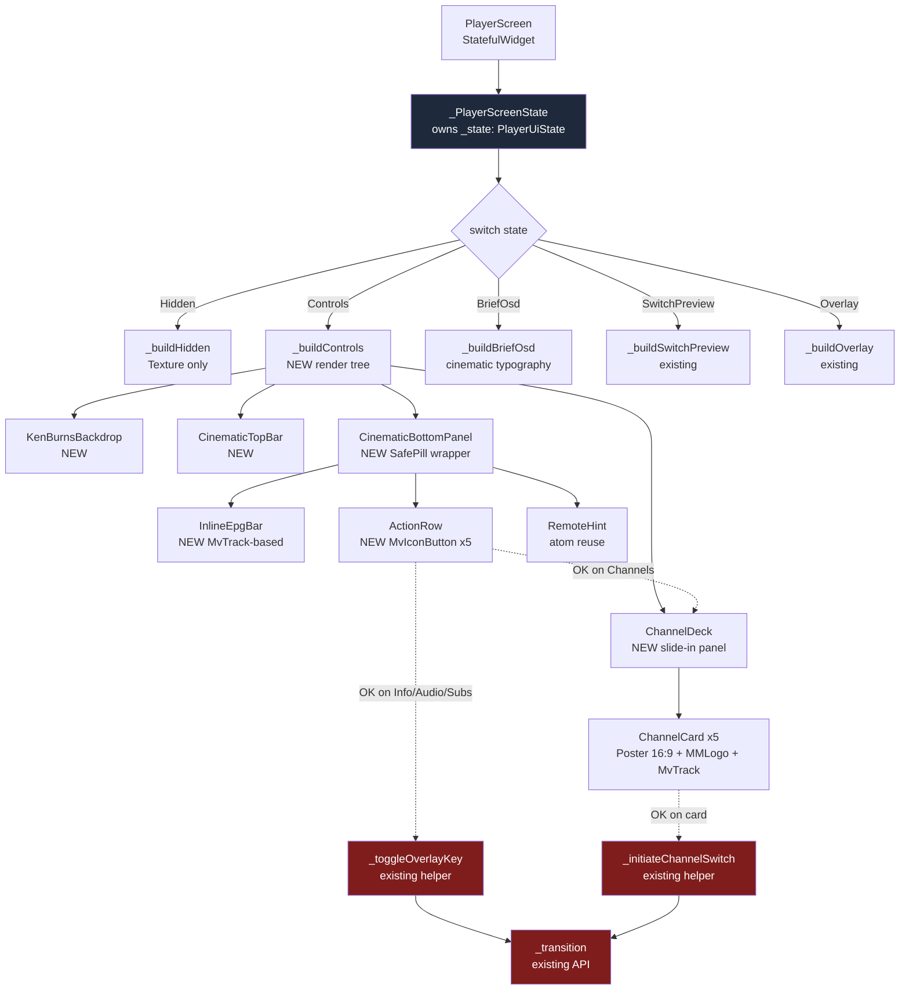

# Design — player-cinematic-redesign

## Overview

`player-cinematic-redesign` переписывает **только рендер** в режиме `ControlsState` для `lib/features/player/player_screen.dart`. Sealed `PlayerUiState` из закрытого спека `player-overlay-state-machine` **является read-only owner'ом**: новый код только читает текущее состояние через `switch`-exhaustiveness и выбирает render tree, но не добавляет/не модифицирует state-варианты, не трогает `_transition()`, не вводит новых таймеров.

Дизайн вводит **5 новых widget-файлов** под `lib/features/player/cinematic/` (изолированный subfolder, чтобы не путать с существующими overlay-виджетами в `lib/features/player/widgets/`) и расширяет render тело `_buildControls()`. Весь rendering построен на foundation-атомах (`MvTrack`, `MvIconButton`, `Poster`, `Brand`, `Chip`, `RemoteHint`, `MMLogo`) и perf-safe виджетах (`SafePill`, `SafeFocusRing`).

Performance цель: avg `GPURasterizer::Draw ≤ 16.7 ms` на rtd2851a при `ControlsState` idle и при channel-deck slide-in. Все 7 «design handoff conflicts» из `flutter-tv-perf.md` уже имеют safe replacements — этот спек обязан использовать их без отклонений.

## Boundary Commitments

### Read-only invariants (CRITICAL)

| Identifier | Owner spec | Action allowed |
|------------|-----------|----------------|
| `sealed class PlayerUiState` | `player-overlay-state-machine` | `switch (state)` exhaustively |
| `HiddenState`, `ControlsState`, `BriefOsdState`, `SwitchPreviewState`, `OverlayState` | `player-overlay-state-machine` | read fields, not mutate |
| `_transition(PlayerUiState)` | `player-overlay-state-machine` | call only via existing wrappers (`_toggleOverlayKey`, `_initiateChannelSwitch`) |
| `_stateExpiryTimer` | `player-overlay-state-machine` | not touch |
| `_quickSwitchInFlight` | `player-overlay-state-machine` | not touch |
| `lib/core/player/*` | n/a (native engines) | read-only |
| `lib/core/api/*`, `lib/core/epg/*` | n/a (data layer) | read-only |
| `megav_iptv/test/**` | various closed specs | not modify |

### Mutation surface (what this spec touches)

| File | Action |
|------|--------|
| `lib/features/player/player_screen.dart` | modify body of `_buildControls()` (and only this helper); no signature changes; no new fields in `_PlayerScreenState`. |
| `lib/features/player/cinematic/cinematic_top_bar.dart` | NEW |
| `lib/features/player/cinematic/cinematic_bottom_panel.dart` | NEW |
| `lib/features/player/cinematic/inline_epg_bar.dart` | NEW |
| `lib/features/player/cinematic/channel_deck.dart` | NEW |
| `lib/features/player/cinematic/ken_burns_backdrop.dart` | NEW |
| `megav_iptv/test/features/player/cinematic/*_test.dart` | NEW (widget/golden tests) |

### Foundation API contracts (used, not modified)

- **`design-system-foundation`** (closed): `paletteProvider`, `MegaVTextStyles`, `AppRadius`, `combinedHeroGradient`.
- **`perf-safe-widgets`** (closed): `SafePill`, `SafeFocusRing`, `SafeBackdrop`, `SafeFilmGrain`, `ComputedColors.from(palette)`, `kSafeShadowBlurMax`.
- **`design-system-atoms`** (closed): `MvTrack`, `MvIconButton`, `RemoteHint`, `Brand`, `Chip`, `Poster`, `MMLogo`, `MvKey`, `StatusBar`.
- **Import discipline**: Files importing both `package:flutter/material.dart` and the atoms barrel MUST use `import 'package:flutter/material.dart' hide Chip;` to avoid shadow with Material's `Chip` widget.
- **`player-overlay-state-machine`** (closed): `PlayerUiState` and all 5 variants — read-only.

## Architecture

### High-level structure



Красные узлы — read-only API из закрытого `player-overlay-state-machine`. Новый код взаимодействует с ними только через вызовы существующих helper-методов.

### File Structure Plan

```
megav_iptv/lib/features/player/
├── player_screen.dart                 (MODIFIED — _buildControls() body only)
├── widgets/                            (existing — NOT touched in this spec)
│   ├── channels_sidebar.dart           (legacy overlay path; kept for OverlayState.channels)
│   ├── epg_overlay.dart
│   ├── info_overlay.dart
│   ├── player_bottom_info.dart         (DEPRECATED by this spec but not deleted)
│   ├── player_overlay.dart
│   └── similar_overlay.dart
└── cinematic/                          (NEW directory)
    ├── cinematic_top_bar.dart
    ├── cinematic_bottom_panel.dart
    ├── inline_epg_bar.dart
    ├── channel_deck.dart
    └── ken_burns_backdrop.dart

megav_iptv/test/features/player/
└── cinematic/                          (NEW)
    ├── cinematic_top_bar_test.dart
    ├── inline_epg_bar_test.dart
    ├── channel_deck_test.dart
    └── ken_burns_backdrop_test.dart
```

## Components and Interfaces

### Component 1: `CinematicTopBar`

**Path**: `lib/features/player/cinematic/cinematic_top_bar.dart`

**Purpose**: Render top OSD при `ControlsState` — back + brand + LIVE + program title + bitrate.

**Interface**:

```dart
class CinematicTopBar extends ConsumerWidget {
  const CinematicTopBar({
    super.key,
    required this.channelName,
    required this.programTitle,
    required this.bitrateLabel,    // null → hide badge
    required this.onBack,
    required this.focusNode,
  });

  final String channelName;
  final String programTitle;
  final String? bitrateLabel;       // e.g. "1080p · 4.2 Mbps"
  final VoidCallback onBack;
  final FocusNode focusNode;
}
```

**Render**:
- Row: `MvIconButton(icon: arrow_back, onPressed: onBack, focusNode: focusNode)` → `Brand(channelName)` → `Chip(label: 'LIVE', variant: ChipVariant.live)` → `Expanded(Text(programTitle, style: MegaVTextStyles.titleM, maxLines: 1, overflow: ellipsis))` → `Chip(label: bitrateLabel)` if not null.
- Padding: horizontal 24, top 16 (use `.w` / `.h`).
- Visibility: parent `_buildControls()` rebuilds tree only when state == `ControlsState`; widget itself is `const`-friendly.

**Boundary**: pure presentation; no `_transition` calls. `onBack` wired by parent to existing `Navigator.maybePop`.

### Component 2: `InlineEpgBar`

**Path**: `lib/features/player/cinematic/inline_epg_bar.dart`

**Purpose**: Inline progress strip showing start / now / end + live progress fill.

**Interface**:

```dart
class InlineEpgBar extends ConsumerWidget {
  const InlineEpgBar({
    super.key,
    required this.startAt,
    required this.endAt,
    required this.programTitle,
  });

  final DateTime? startAt;
  final DateTime? endAt;
  final String? programTitle;
}
```

**Render**:
- Internal `_TickStrip extends StatefulWidget` with `Ticker` (1Hz) wrapped in `RepaintBoundary` so parent `ControlsState` render не ребилдится.
- Row: `Text(formatTime(startAt))` (left) → `Expanded(MvTrack(value: progress))` → `Text(formatTime(endAt))` (right).
- Above bar: `Center(Text(programTitle ?? 'Программа не загружена', style: MegaVTextStyles.bodyS))`.
- If `startAt == null || endAt == null` → `MvTrack(value: 0)`.

**Perf invariant**: `_TickStrip` uses `Ticker` not `StreamBuilder` directly inside parent. Parent `_buildControls()` does not subscribe to time stream.

### Component 3: `CinematicBottomPanel`

**Path**: `lib/features/player/cinematic/cinematic_bottom_panel.dart`

**Purpose**: Glass-panel wrapper hosting `InlineEpgBar` + `ActionRow` + `RemoteHint`.

**Interface**:

```dart
class CinematicBottomPanel extends ConsumerWidget {
  const CinematicBottomPanel({
    super.key,
    required this.programTitle,
    required this.epgStart,
    required this.epgEnd,
    required this.actionFocusScope,
    required this.onPlayPause,
    required this.onAudio,
    required this.onSubs,
    required this.onInfo,
    required this.onChannelsToggle,
    required this.isPlaying,
    required this.hintMode,        // enum: actions / deck
  });
  ...
}
```

**Render**:
- Outer `SafePill(borderRadius: AppRadius.l, padding: EdgeInsets.symmetric(h: 24, v: 16))`.
- Column:
  1. `InlineEpgBar(...)`.
  2. `_ActionRow(focusScope: actionFocusScope, onPlayPause, onAudio, onSubs, onInfo, onChannelsToggle, isPlaying)` — `Row` of `MvIconButton`s with `SafeFocusRing` per button.
  3. `RemoteHint(mode: hintMode)` — atom reuse.

**Perf**: `SafePill` is opaque tint (perf rule #3 from `flutter-tv-perf.md`), zero blur. No `BackdropFilter`.

**Boundary**: Action callbacks point to wrappers in `_PlayerScreenState`:
- `onPlayPause` → existing `_togglePlayPause()` (read from state machine spec).
- `onAudio / onSubs / onInfo` → existing `_toggleOverlayKey(OverlayKey.x)`.
- `onChannelsToggle` → focus-only mutation (move FocusNode to deck), NOT a `_transition`.

### Component 4: `ChannelDeck`

**Path**: `lib/features/player/cinematic/channel_deck.dart`

**Purpose**: Right-side slide-in deck with 5 channel cards.

**Interface**:

```dart
class ChannelDeck extends ConsumerStatefulWidget {
  const ChannelDeck({
    super.key,
    required this.isOpen,
    required this.channels,         // List<Channel>, length expected = 5..N
    required this.onChannelSelected, // (Channel) → void
    required this.focusScope,
  });
  ...
}
```

**Render**:
- Outer `AnimatedSlide(offset: isOpen ? Offset.zero : const Offset(1, 0), duration: 250ms, curve: Curves.fastOutSlowIn)`.
- Wrapped in `Visibility(visible: isOpen || _justClosed, maintainState: false)` for unmount-fade.
- Inner `ListView.builder` (vertical scroll) with `cacheExtent: 1500`, `addAutomaticKeepAlives: true`, `addRepaintBoundaries: true`, `clipBehavior: Clip.none`.
- Each `_ChannelCard`:
  - `AnimatedScale(scale: isFocused ? 1.05 : 1.0, alignment: Alignment.center)`.
  - `SafeFocusRing(visible: isFocused)`.
  - Column: `Poster(aspectRatio: 16/9, imageUrl)` → Row: `MMLogo` + `Text(programTitle, style: titleS)` → `Text(remainingTime, style: bodyS)` → `MvTrack(value: progress)`.
  - `Focus(onKey: ...)` — pressing Enter/OK → `widget.onChannelSelected(channel)`.

**Boundary**: `onChannelSelected` is wired by parent to existing `_initiateChannelSwitch(targetChannel)` from `player-overlay-state-machine`. NEW spec does not implement channel-switch logic.

**Perf**: Slide is `Transform.translate` (GPU-only). Card focus is `AnimatedScale` (GPU-only), not `AnimatedContainer.width`.

### Component 5: `KenBurnsBackdrop`

**Path**: `lib/features/player/cinematic/ken_burns_backdrop.dart`

**Purpose**: Slow-zoom over fallback image when video Texture not active.

**Interface**:

```dart
class KenBurnsBackdrop extends StatefulWidget {
  const KenBurnsBackdrop({
    super.key,
    required this.imageProvider,
    required this.active,           // false → stop animation, drop subtree
  });
  ...
}
```

**Render**:
- `_KenBurnsBackdropState` owns `AnimationController(duration: 30s, vsync: this)..repeat(reverse: true)`.
- `AnimatedBuilder(animation: ctrl, builder: (_, child) => Transform.scale(scale: 1.0 + 0.05 * ctrl.value, child: Image(image: imageProvider, fit: BoxFit.cover)))`.
- Wrapped in `Visibility(visible: active, maintainState: false)` so when `active = false`, subtree is dropped.
- `dispose()` cancels controller. `didUpdateWidget` toggles `ctrl.repeat()` / `ctrl.stop()` based on `active`.

**Perf invariant**: No `Opacity`, no `BackdropFilter`, no `ShaderMask`. Pure `Transform.scale` is GPU-only and cheap on Mali.

### Modified: `PlayerScreen._buildControls()`

**File**: `lib/features/player/player_screen.dart`

**Mutation scope**: only the body of `_buildControls()` (or its private helpers within `_PlayerScreenState`).

**New render tree** (pseudo-Dart). **Important architectural note**: closed spec `player-overlay-state-machine` defines `ControlsState` minimally (hideAt only). View-data (channelName, programTitle, EPG times, bitrate, isPlaying, fallbackImage, hasActiveTexture, adjacentChannels) is **read from existing providers**, NOT from state — keeps state machine clean and avoids modifying it (Req 10).

```dart
Widget _buildControls(BuildContext context, ControlsState state) {
  final palette = ref.watch(paletteProvider);

  // View-data from providers (NOT from ControlsState — state machine read-only):
  final channel = ref.watch(currentChannelProvider);
  final program = ref.watch(currentProgramProvider);
  final adjacents = ref.watch(adjacentChannelsProvider);
  final bitrateLabel = ref.watch(playerBitrateLabelProvider);
  final isPlaying = ref.watch(isPlayingProvider);
  final hasActiveTexture = ref.watch(hasActiveTextureProvider);
  final fallbackImage = channel?.fallbackImage; // ImageProvider or null

  return Stack(children: [
    // Layer 0: video Texture (existing)
    const _VideoLayer(),
    // Layer 1: ken-burns fallback when no video
    KenBurnsBackdrop(
      imageProvider: fallbackImage,
      active: !hasActiveTexture,
    ),
    // Layer 2: const isolated stream consumers (existing _LoadingErrorIndicator)
    const _LoadingErrorIndicator(),
    // Layer 3: top bar
    Align(
      alignment: Alignment.topCenter,
      child: CinematicTopBar(
        channelName: channel?.name ?? '',
        programTitle: program?.title ?? '',
        bitrateLabel: bitrateLabel,
        onBack: _onBack,
        focusNode: _topBarFocus,
      ),
    ),
    // Layer 4: bottom glass panel
    Align(
      alignment: Alignment.bottomCenter,
      child: CinematicBottomPanel(
        programTitle: program?.title ?? '',
        epgStart: program?.start,
        epgEnd: program?.end,
        actionFocusScope: _actionFocusScope,
        onPlayPause: _togglePlayPause,            // existing
        onAudio: () => _toggleOverlayKey(OverlayKey.audio),
        onSubs: () => _toggleOverlayKey(OverlayKey.subs),
        onInfo: () => _toggleOverlayKey(OverlayKey.info),
        onChannelsToggle: () => _channelDeckFocus.requestFocus(),
        isPlaying: isPlaying,
        hintMode: _resolveHintMode(),
      ),
    ),
    // Layer 5: channel deck (slide-in)
    Align(
      alignment: Alignment.centerRight,
      child: ChannelDeck(
        isOpen: _isDeckFocused(),
        channels: adjacents,                       // from provider, not state
        onChannelSelected: _initiateChannelSwitch, // existing
        focusScope: _channelDeckFocus,
      ),
    ),
  ]);
}
```

**Required providers** (must be verified to exist in `lib/core/providers/providers.dart` or be added by Task 0.2 with backward-compat verification): `currentChannelProvider`, `currentProgramProvider`, `adjacentChannelsProvider`, `playerBitrateLabelProvider`, `isPlayingProvider`, `hasActiveTextureProvider`. If a provider doesn't exist, it's added as a derived/computed provider over existing player state — this is allowed via Req 12 (foundation reuse) but is OUT of player-overlay-state-machine boundary.

**Existing identifiers used (read-only)**: `_togglePlayPause`, `_toggleOverlayKey`, `_initiateChannelSwitch`, `_onBack`, `_LoadingErrorIndicator` (already const, already wrapped in `RepaintBoundary` per closed spec).

**New private fields in `_PlayerScreenState`** (allowed, not state-machine fields):
- `final FocusNode _topBarFocus`
- `final FocusScopeNode _actionFocusScope`
- `final FocusScopeNode _channelDeckFocus`
- `bool _isDeckFocused()` getter that reads `_channelDeckFocus.hasFocus`

These are **focus management**, not state-machine extensions. They must be `dispose()`'d in existing `dispose()` method.

## Data Models

This spec does **not** define new data models. It reads existing `Channel`, `EpgProgram`, `PlayerStateSnapshot` types from `lib/core/{playlist,epg,player}/`.

**Closed spec invariant**: `player-overlay-state-machine` defines `ControlsState` minimally — typically `ControlsState({required DateTime hideAt})`. This spec does NOT extend `ControlsState` with new fields (Req 10). View-data is sourced from Riverpod providers instead:

| Provider needed | Source | Status |
|---|---|---|
| `currentChannelProvider` | `lib/core/providers/providers.dart` (or playlist layer) | Verify exists; if not, add as derived getter |
| `currentProgramProvider` | EPG layer | Verify exists; consumed read-only |
| `adjacentChannelsProvider` | playlist/navigation layer | Verify exists; if not, add as derived (current ± N) |
| `playerBitrateLabelProvider` | player state layer | Verify exists; consumed read-only |
| `isPlayingProvider` | player state layer | Verify exists; consumed read-only |
| `hasActiveTextureProvider` | player state layer | Verify exists; consumed read-only |

**Task 0.2** in `tasks.md` (added during cross-spec review fix) is responsible for grep-verifying which of these providers exist and adding the missing ones as DERIVED providers over existing state — never as new state. If provider exists with different name, alias rather than rename. Closed `player-overlay-state-machine` is NOT modified.

## Error Handling

| Scenario | Handling |
|----------|----------|
| EPG data missing | `InlineEpgBar` shows placeholder text; `MvTrack.value = 0`. |
| Channel logo image fails to load | `MMLogo` atom shows fallback letter glyph (existing atom behaviour). |
| `adjacentChannelsProvider` returns empty list | `ChannelDeck` shows empty state placeholder; deck focus traversal short-circuits to action row. |
| Ken-burns image asset missing | `KenBurnsBackdrop` falls back to solid color from `ComputedColors.bg`. |
| Animation controller leaks | `dispose()` strictly cancels; widget test #4 (Req 13.4) covers this. |

## Testing Strategy

### Unit / widget tests (new)

| Test | File | Verifies |
|------|------|----------|
| `cinematic_top_bar_test` | `cinematic_top_bar_test.dart` | bitrate hidden when null; ellipsis on long titles; back tap fires callback. |
| `inline_epg_bar_test` | `inline_epg_bar_test.dart` | progress = (now-start)/(end-start); placeholder when null; ticker disposal. |
| `channel_deck_test` | `channel_deck_test.dart` | OK on card → onChannelSelected fired with right Channel; ←  → returns focus to action row; cacheExtent + clip settings present. |
| `ken_burns_backdrop_test` | `ken_burns_backdrop_test.dart` | controller stops on active=false; dispose cancels controller. |

### Regression

- Run full `flutter test` from `megav_iptv/` after refactor — all 30+ existing tests must pass without modification.
- Check `transitionForTest` API is intact (used by player-overlay-state-machine tests).

### Performance

- `getVMTimeline` snapshot on rtd2851a in `ControlsState` idle and during channel-deck slide-in.
- Compare against baseline `player-overlay-state-machine/snapshots/baseline_player_open_trace.json` (avg 12.2 ms).
- Acceptance: avg `GPURasterizer::Draw ≤ 16.7 ms`, BUILD events ≤ 5 / 30s idle.

## Traceability matrix

| Req # | Component(s) | Test |
|-------|--------------|------|
| 1 | `CinematicTopBar` | `cinematic_top_bar_test` |
| 2 | `InlineEpgBar` | `inline_epg_bar_test` |
| 3 | `CinematicBottomPanel` (SafePill) | `cinematic_bottom_panel_test` (covered via golden) |
| 4 | `_ActionRow` inside `CinematicBottomPanel` | golden + tap test |
| 5 | `ChannelDeck` | `channel_deck_test` |
| 6 | `_buildBriefOsd` (existing helper, typography swap) | covered by existing brief OSD tests + visual golden |
| 7 | `KenBurnsBackdrop` | `ken_burns_backdrop_test` |
| 8 | `RemoteHint` reuse in `CinematicBottomPanel` | covered in panel golden |
| 9 | All components | VM Service trace measurement task |
| 10 | (invariant) | reviewer subagent (kiro-review) checks `git diff` for state-machine identifiers |
| 11 | (invariant) | regression task: full `flutter test` |
| 12 | All components | static check task (grep for hardcoded colors / shadow blurs) |
| 13 | All new components | individual widget tests |
| 14 | `_actionFocusScope`, `_channelDeckFocus`, `_topBarFocus` | `channel_deck_test` + `cinematic_top_bar_test` |

## Decision log

| Decision | Rationale |
|----------|-----------|
| New folder `lib/features/player/cinematic/` instead of inlining into `widgets/` | Visual separation from legacy overlay widgets; signal that this is the new render path. Legacy `widgets/` kept untouched for backward compat with `OverlayState` modes. |
| `AnimatedSlide` for deck slide-in instead of `SlideTransition` controller | Simpler API; same GPU-only `Transform.translate` under the hood. |
| Channel deck reuses existing `_initiateChannelSwitch` not new mutation path | Hard boundary requirement: no new state-machine entry points. |
| Focus management via separate `FocusScopeNode`s, not new state variant | Boundary: `PlayerUiState` is read-only. Focus is a UI concern owned by `_PlayerScreenState`. |
| `KenBurnsBackdrop` is its own widget, not inlined | Easier to disable controller via `Visibility`; testable in isolation; reuse possible for future loading screens. |
| `_buildBriefOsd()` typography upgrade is in-place edit, not new file | Brief OSD is small; pulling out to a separate file would split the state-machine render tree without value. |
| Skip `BackdropFilter` everywhere | Steering rule (`flutter-tv-perf.md`); replacement is `SafePill` opaque tint. |
| Ken-burns scale 1.0 → 1.05 over 30s | Standard cinematic ken-burns; subtle enough to not distract; `0.05/30s = 0.0017/s` — imperceptible per-frame work. |
