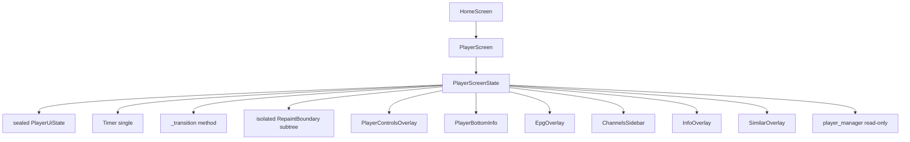
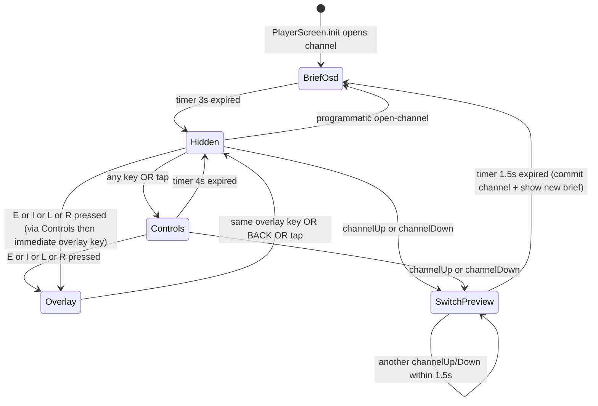

# Design Document — player-overlay-state-machine

## Overview

**Purpose**: Заменить 5 разрозненных state-полей и 3 независимых таймера в `_PlayerScreenState` единственным sealed `PlayerUiState` + одним `_stateExpiryTimer`. Все изменения видимости проходят через одну точку `_transition(PlayerUiState)`. Loading/error индикатор выносится в отдельный sub-widget с `RepaintBoundary`. Цель — детерминированное поведение overlay'ев и прекращение избыточных ребилдов.

**Users**: Оператор Android TV-бокса (rtd2851a). Качество приёмки — субъективная плавность поведения overlay'ев + объективное снижение BUILD-events с ~50/30s до ≤5/30s по VM Service trace.

**Impact**: Меняется только `lib/features/player/player_screen.dart` (372 строки, после рефакторинга ~280–340 строк) и добавляются тесты в `test/features/player/`. Никаких изменений в native player engines, в overlay-виджетах, в Riverpod-провайдерах, в моделях или pubspec.

### Goals

- Один sealed `PlayerUiState` (5 вариантов) — единственный источник истины для UI-видимости.
- Один `Timer? _stateExpiryTimer` — заменяет три независимых таймера.
- Один метод `_transition(PlayerUiState)` — единственная точка мутации видимости.
- Атомарность: cancel + setState + schedule в одном теле без awaited операций между ними.
- Безопасный quick-switch: первая инструкция отменяет предыдущий switch.
- Loading/error индикатор в отдельном `_LoadingErrorIndicator` с `RepaintBoundary`.
- BUILD-events `_PlayerScreenState.build()` в idle ≤ 5 за 30 sec на референсном TV.
- Все 21 существующих теста проходят без изменений; добавляются ~9 новых (4 unit + 3 integration + 2 регрессии).

### Non-Goals

- Native player engines (`media3_engine`, `media_kit_engine`, `native_video_player_engine`, `player_engine`, `player_manager`, `decoder_config`).
- Внутренности 6 overlay-виджетов.
- HDR / DRM / 4K / зелёные полосы / network buffering.
- Дизайн / визуальное оформление overlay'ев.
- Замена `flutter_riverpod` или `go_router`.
- Изменения в `pubspec.yaml`.

## Boundary Commitments

### This Spec Owns

- Внутренняя state-модель `_PlayerScreenState` в `lib/features/player/player_screen.dart`.
- Новый sealed `PlayerUiState` (приватный для файла) + его варианты.
- Метод `_transition(PlayerUiState newState)` — единственная точка мутации.
- Поле `Timer? _stateExpiryTimer` — заменяет `_hideTimer`/`_osdTimer`/`_switchTimer`.
- Внутренний sub-widget `_LoadingErrorIndicator` с `RepaintBoundary`.
- Quick-switch race-fix: `_quickSwitch()` отменяет предыдущий switchPreview до асинхронных операций.
- Юнит-тесты transition-таблицы в `test/features/player/player_ui_state_test.dart`.
- Widget-тесты основных сценариев в `test/features/player/player_screen_overlay_test.dart`.

### Out of Boundary

- `lib/core/player/*` — все файлы, native engines, decoder config, player_manager.
- 6 overlay-виджетов в `lib/features/player/widgets/` — публичные API сохраняются, тела не правятся.
- Riverpod-провайдеры (`currentChannelProvider`, `currentChannelIndexProvider`, `apiClientProvider`, `decoderConfigProvider`).
- Модели каналов, EPG.
- Сетка на главном экране (закрытые спеки).
- HDR / DRM / 4K / network.
- Дизайн-токены / цвета / шрифты.

### Allowed Dependencies

- Flutter SDK material/widgets/services (Focus, GestureDetector, Stack, AnimatedSwitcher).
- `flutter_riverpod` (только read через `ref.read`/`ref.watch` — не меняется).
- `flutter_screenutil` (`.w`, `.h`, `.sp` — как везде).
- `go_router` (`context.pop()` — без изменений).
- `lib/core/player/player_engine.dart` — read-only `PlayerState` enum.
- `lib/core/player/player_manager.dart` — read-only API: `initialize()`, `playChannel()`, `stop()`, `activeEngine`, `media3Engine`, `currentUrl`, `stateStream`.
- `lib/core/playlist/models/channel.dart` — read-only `Channel`.
- `lib/core/api/api_client.dart` — read-only `getBestStreamUrl`, `getChannels`.
- 6 overlay-виджетов из `widgets/` — потребляются через их публичные API.
- `widgets/player_overlay.dart` — экспортирует `PlayerOverlayMode` enum, остаётся.

### Revalidation Triggers

- Изменение публичного API `PlayerScreen` (constructor, route, top-level Scaffold) — ломает `home_screen.dart` open-channel flow.
- Изменение `PlayerOverlayMode` enum — затронет 6 overlay-виджетов.
- Изменение `_playerManager.stateStream` контракта — ломает `_LoadingErrorIndicator`.
- Изменение поведения `_playerManager.activeEngine.buildVideoWidget()` — out of boundary.

## Architecture

### Existing Architecture Analysis

`_PlayerScreenState` (372 строки) сейчас:

```
state fields:
  _showControls    : bool          (auto-hide via _hideTimer)
  _showBriefOSD    : bool          (auto-hide via _osdTimer)
  _overlay         : PlayerOverlayMode
  _switchPreview   : Channel?      (commit via _switchTimer)
  _openedViaMedia3 : bool          (set once at open, immutable after)

timers:
  _hideTimer    : 4s, hides _showControls (only if _overlay == none)
  _osdTimer     : 3s, hides _showBriefOSD
  _switchTimer  : 1.5s, commits switchPreview as new channel

mutators:
  _resetHideTimer()       — setState _showControls = true + new _hideTimer
  _showBriefOSDFor()      — setState _showBriefOSD = true + new _osdTimer
  _toggleOverlay(mode)    — setState _overlay flip + _resetHideTimer
  _quickSwitch(delta)     — async fetch + setState _switchPreview + new _switchTimer
  build's GestureDetector — setState _overlay = none OR _resetHideTimer
  _handleKeyEvent         — _resetHideTimer + various transitions
```

Build-тело `Stack` использует **3 разных условия отрисовки**:
- Controls: `if (_showControls && channel != null)` — строка 240.
- BottomInfo: `if ((_showControls || _showBriefOSD || _switchPreview != null) && _overlay == none && (_switchPreview ?? channel) != null)` — строки 252-254.
- Каждый из 4 модальных overlays: `if (_overlay == ...mode && channel != null)` — строки 267, 275, 283, 287.

После рефакторинга — единственный `switch (_uiState)`.

### Architecture Pattern & Boundary Map



Поток: внешний event (key, tap, timer) → `_transition(newState)` → cancel old timer → setState → schedule new timer → build dispatches via single switch over `_uiState`.

### Architecture Integration

- **Pattern**: classic state-machine с явным sealed-type. Без библиотек.
- **Domain boundaries**: `_PlayerScreenState` — orchestrator UI. Native player — отдельный domain (read-only). Overlay-widgets — presentation, не trogаются.
- **Existing patterns preserved**: `Focus` + `onKeyEvent`, `GestureDetector`, `StreamBuilder` (внутри isolated indicator), Riverpod `ref.read`/`ref.watch`.
- **New components rationale**:
  - `PlayerUiState` — закрывает Req 1.5 (compile-time guarantee).
  - `_LoadingErrorIndicator` — закрывает Req 5.4 (≤5 builds/30s).
- **Steering compliance**: проект без steering-документов; следуем `CLAUDE.md` (kiro-driven, минимум зависимостей).

### Technology Stack

| Layer | Choice / Version | Role | Notes |
|-------|------------------|------|-------|
| Flutter widgets | стандартные `Focus`, `Stack`, `GestureDetector`, `RepaintBoundary`, `AnimatedSwitcher` | UI скелет | Никаких новых пакетов |
| Sealed types | Dart 3 sealed class | `PlayerUiState` | SDK ^3.11.0, sealed уже доступны |
| State management | стандартный `setState` (как сейчас) | `_PlayerScreenState` | Riverpod только для read-only watch |
| Timers | стандартный `dart:async Timer` | `_stateExpiryTimer` | Уже есть `dart:async` импорт |

## File Structure Plan

### Directory Structure

```
lib/features/player/
├── player_screen.dart                # MODIFIED
└── widgets/                          # UNCHANGED
    ├── player_overlay.dart           # exports PlayerOverlayMode enum (read-only)
    ├── player_bottom_info.dart       # UNCHANGED
    ├── epg_overlay.dart              # UNCHANGED
    ├── channels_sidebar.dart         # UNCHANGED
    ├── info_overlay.dart             # UNCHANGED
    └── similar_overlay.dart          # UNCHANGED

test/features/player/                 # NEW directory
├── player_ui_state_test.dart         # NEW: unit tests on transition table
└── player_screen_overlay_test.dart   # NEW: 3 widget integration scenarios
```

### Modified Files

- `lib/features/player/player_screen.dart` — рефакторинг state-машины. До: 372 строки, 5 state-полей, 3 timer-поля, 4 mutator-метода. После: ~280–340 строк, 1 sealed-type + 1 state-поле, 1 timer-поле, 1 mutator-метод (`_transition`), 1 isolated sub-widget.

### New Files

- `test/features/player/player_ui_state_test.dart` — pure-Dart unit tests transition-таблицы. Не требует Flutter test bindings.
- `test/features/player/player_screen_overlay_test.dart` — widget tests на 3 интеграционных сценария (open → controls auto-hide; quick-switch ⬆ → preview → channel changed; press E → EPG visible).

## System Flows

### State machine diagram



### Transition flow

```mermaid
sequenceDiagram
    participant User
    participant KeyHandler as PlayerScreen.handleKeyEvent
    participant Transition as _transition
    participant Timer as _stateExpiryTimer
    participant Build as build()
    User->>KeyHandler: press E
    KeyHandler->>Transition: _transition(OverlayState(epg))
    Transition->>Timer: cancel previous (if any)
    Transition->>Build: setState (_uiState = OverlayState(epg))
    Note over Transition: no expiry for OverlayState — no new timer
    Build->>User: EPG overlay visible
    User->>KeyHandler: press E again
    KeyHandler->>Transition: _transition(HiddenState())
    Transition->>Timer: cancel (none active)
    Transition->>Build: setState (_uiState = HiddenState())
    Build->>User: no UI overlay; only video
```

**Ключевые решения**:

- В `_transition()` cancel **первая** инструкция, **до** setState. Это гарантирует что старый timer не сработает между cancel и его перезапуском.
- `setState` body содержит ТОЛЬКО присваивание `_uiState`. Schedule нового timer'а — **внутри того же setState body, после присваивания**, через `Timer(...)`. Никаких `await` между cancel/setState/schedule.
- Quick-switch — единственный сложный случай: внутри метода идут async-операции (fetch channels). Решение: **отделить часть «определение target channel» (async) от «применение state» (sync)**. Async часть вне `_transition()`. По завершении async — один `_transition(SwitchPreviewState(...))`. При повторном нажатии до завершения async — на старте `_quickSwitch()` отменяется предыдущий timer + ставится `_switchInFlight = true`/`false` guard.

## Requirements Traceability

| Requirement | Summary | Components | Interfaces | Flows |
|-------------|---------|------------|------------|-------|
| 1.1, 1.2, 1.3, 1.4, 1.5 | Sealed `PlayerUiState` единый source of truth | `_PlayerScreenState`, `PlayerUiState` sealed | `_uiState` field; `switch (_uiState)` in `build` | State diagram |
| 2.1, 2.2, 2.4, 2.5 | Один таймер expiry, cancel-before-schedule, не запускается без expiry, отменяется в dispose | `_PlayerScreenState`, `_transition` | `_stateExpiryTimer`, `_transition()` | Transition flow |
| 2.3 | Auto-transition по timer-expiry | `_PlayerScreenState`, `_transition` | Timer callback → `_transition(HiddenState())` | State diagram |
| 3.1, 3.2 | Single mutation point + atomic body | `_PlayerScreenState`, `_transition` | private `_transition(newState)` | Transition flow |
| 3.3, 3.4, 3.5 | Quick-switch race-fix | `_PlayerScreenState`, `_quickSwitch` | atomic guard at function entry | — |
| 4.1 | Open → BriefOsd 3s → Hidden | `_PlayerScreenState._init` | calls `_transition(BriefOsdState(...))` | State diagram |
| 4.2 | Hidden + key → Controls 4s → Hidden | `_handleKeyEvent` | calls `_transition(ControlsState(...))` | State diagram |
| 4.3, 4.4 | Overlay-toggle keys (E/I/L/R) | `_handleKeyEvent` | `_transition(OverlayState(mode))` or `HiddenState()` | State diagram |
| 4.5, 4.6 | BACK/ESC behavior | `_handleKeyEvent` | overlay → Hidden + handled; otherwise ignored | State diagram |
| 4.7 | Quick-switch (chUp/Down) | `_handleKeyEvent`, `_quickSwitch` | `_transition(SwitchPreviewState(...))` | State diagram |
| 4.8, 4.9 | Tap behavior | `GestureDetector.onTap` | overlay → Hidden; otherwise → Controls | — |
| 5.1, 5.2, 5.3 | Isolated `_LoadingErrorIndicator` with RepaintBoundary | `_LoadingErrorIndicator` (NEW sub-widget) | `RepaintBoundary > StreamBuilder<PlayerState>` | — |
| 5.4 | ≤5 builds/30s on idle | All | Operator-driven VM Service trace | — |
| 6.1 | Test access to `_transition` | `_PlayerScreenState`, `@visibleForTesting` annotation | exposes test-only API | — |
| 6.2 | Unit tests on transition table | `test/features/player/player_ui_state_test.dart` | pure-Dart tests | — |
| 6.3 | Widget tests on 3 scenarios | `test/features/player/player_screen_overlay_test.dart` | flutter_test integration | — |
| 6.4 | All 21 existing tests still pass | All | regression check | — |
| 7.1–7.5 | Compatibility (route, ctor, video widget, keys, system UI, focus) | `_PlayerScreenState` | preserved | — |
| 8.1–8.4 | Performance budget | All | VM Service trace + operator | — |

## Components and Interfaces

### Summary

| Component | Domain/Layer | Intent | Req Coverage | Key Dependencies | Contracts |
|-----------|--------------|--------|--------------|------------------|-----------|
| `PlayerUiState` (sealed) | UI state model | Единый source of truth для видимости UI поверх видео | 1.1–1.5 | `Channel`, `PlayerOverlayMode` (P0) | State (sealed types) |
| `_PlayerScreenState` | UI / orchestration | Mounts video, dispatches transitions, builds Stack | 1, 2, 3, 4, 5, 6, 7 | `PlayerManager`, providers, overlay-widgets (P0) | State |
| `_transition(PlayerUiState)` | UI / state-mutator | Атомарная точка изменения видимости | 2.1, 2.2, 3.1, 3.2 | `_stateExpiryTimer`, setState | Service (private) |
| `_LoadingErrorIndicator` | UI / presentation | Isolated StreamBuilder + RepaintBoundary | 5.1–5.4 | `_playerManager.stateStream` | State (sub-widget) |

### UI State Model

#### `PlayerUiState` (sealed)

| Field | Detail |
|-------|--------|
| Intent | Единственный источник истины для видимости UI поверх видео в плеере. |
| Requirements | 1.1, 1.2, 1.3, 1.4, 1.5, 4.1–4.9 |

**Responsibilities & Constraints**

- Pure data: ни ссылок на BuildContext, ни на Timer, ни на async-операций.
- Каждый вариант несёт ровно те поля, что нужны для render.
- Sealed → Dart обеспечивает exhaustive switch в `build`.

**Dependencies**

- Inbound: `_PlayerScreenState` через `_uiState` (P0).
- Outbound: `Channel` (read-only model), `PlayerOverlayMode` (read-only enum).
- External: нет.

**Contracts**: State (sealed types).

##### Public API (Dart)

```dart
sealed class PlayerUiState {
  const PlayerUiState();
}

/// UI скрыт, видно только видео.
class HiddenState extends PlayerUiState {
  const HiddenState();
}

/// Полные controls overlay'и (back-button, OSD bar). Авто-скрытие через 4с.
class ControlsState extends PlayerUiState {
  /// Когда таймер expiry должен сработать.
  final DateTime hideAt;
  const ControlsState({required this.hideAt});
}

/// Краткий OSD при открытии канала или quick-switch commit. Авто-скрытие через 3с.
class BriefOsdState extends PlayerUiState {
  final DateTime hideAt;
  const BriefOsdState({required this.hideAt});
}

/// Preview следующего/предыдущего канала перед фактическим переключением.
/// Через 1.5с фиксируется как текущий канал.
class SwitchPreviewState extends PlayerUiState {
  final Channel previewChannel;
  final DateTime commitAt;
  const SwitchPreviewState({
    required this.previewChannel,
    required this.commitAt,
  });
}

/// Полный модальный overlay (EPG, Channels, Info, Similar). Без авто-скрытия.
class OverlayState extends PlayerUiState {
  final PlayerOverlayMode mode;
  const OverlayState({required this.mode});
}
```

- Preconditions: `hideAt` / `commitAt` — будущая или прошлая `DateTime`; render корректен в обоих случаях.
- Postconditions: значения immutable.
- Invariants: ни один `setState` не может присвоить `_uiState` значение, не входящее в один из 5 вариантов (compile-time через sealed).

**Implementation Notes**

- Integration: `_uiState` — приватное поле в `_PlayerScreenState`. Доступ только через `_transition()`.
- Validation: exhaustive switch в `build()` Dart-компилятор проверит автоматически.
- Risks: добавление нового варианта (например, `SettingsOverlayState`) требует обновления switch — это **fail at compile**, что и нужно.

### UI / Orchestration

#### `_PlayerScreenState`

| Field | Detail |
|-------|--------|
| Intent | Mount video, маршрутизация key/tap-events, build Stack видео+overlay'ев. |
| Requirements | 1, 2, 3, 4, 5, 6, 7 (все) |

**Responsibilities & Constraints**

- Один источник истины: `PlayerUiState _uiState = const HiddenState()` (хотя сразу после `_init()` будет `BriefOsdState`).
- Один timer: `Timer? _stateExpiryTimer`.
- Все мутации `_uiState` — только через `_transition(newState)`.
- В `build()` — один `switch (_uiState)`, exhaustive.
- Public widget API сохраняется (Req 7.1).

**Dependencies**

- Inbound: `home_screen.dart` (через `go_router` push `/player`).
- Outbound: `_LoadingErrorIndicator` (P0); 6 overlay-widgets (P0); `PlayerManager` (P0).
- External: Riverpod providers (P0, read-only), `dart:async Timer` (P0).

**Contracts**: State.

##### State Management

State model:
```
_uiState           : PlayerUiState  // initial: HiddenState
_stateExpiryTimer  : Timer?         // null when no expiry pending
_playerManager     : PlayerManager  // injected via ref.read
_playerFocusNode   : FocusNode      // unchanged
_openedViaMedia3   : bool           // unchanged (set once at init)
_quickSwitchInFlight : bool         // NEW: guards _quickSwitch() re-entry
```

- Persistence: in-memory, lifetime = State.
- Consistency: `_uiState` → updated only inside `_transition()`. `_stateExpiryTimer` → cancelled before any `_transition` body.
- Concurrency: всё main-isolate, single thread. Async fetch в `_quickSwitch` защищён `_quickSwitchInFlight` флагом.

##### Internal API

```dart
@visibleForTesting
void transitionForTest(PlayerUiState newState) => _transition(newState);

void _transition(PlayerUiState newState) {
  _stateExpiryTimer?.cancel();
  _stateExpiryTimer = null;
  setState(() {
    _uiState = newState;
  });
  // schedule new expiry only for states that have one
  final expiryMs = switch (newState) {
    HiddenState() => null,
    OverlayState() => null,
    ControlsState s => s.hideAt.difference(DateTime.now()).inMilliseconds,
    BriefOsdState s => s.hideAt.difference(DateTime.now()).inMilliseconds,
    SwitchPreviewState s => s.commitAt.difference(DateTime.now()).inMilliseconds,
  };
  if (expiryMs != null && expiryMs > 0) {
    _stateExpiryTimer = Timer(Duration(milliseconds: expiryMs), _onExpiry);
  }
}

void _onExpiry() {
  if (!mounted) return;
  switch (_uiState) {
    case HiddenState():
    case OverlayState():
      // no-op (these have no expiry)
      break;
    case ControlsState():
    case BriefOsdState():
      _transition(const HiddenState());
      break;
    case SwitchPreviewState s:
      _commitSwitchPreview(s.previewChannel);
      break;
  }
}

Future<void> _commitSwitchPreview(Channel next) async {
  ref.read(currentChannelIndexProvider.notifier).state = /* computed */ 0;
  ref.read(currentChannelProvider.notifier).state = next;
  await _openChannel(next);
  // _openChannel will call _transition(BriefOsdState(...))
}
```

- Preconditions для `_transition`: вызывается с main-isolate.
- Postconditions: `_uiState == newState`; `_stateExpiryTimer` либо `null` (для HiddenState/OverlayState), либо относится к `newState`.
- Invariants: в любой момент `_stateExpiryTimer` либо `null`, либо относится **только** к текущему `_uiState`.

##### Build composition

```dart
@override
Widget build(BuildContext context) {
  final channel = ref.watch(currentChannelProvider);
  // ... media3 early-return unchanged ...

  return Scaffold(
    backgroundColor: Colors.black,
    body: Focus(
      focusNode: _playerFocusNode,
      autofocus: true,
      onKeyEvent: _handleKeyEvent,
      child: GestureDetector(
        onTap: _onTap,
        child: Stack(
          fit: StackFit.expand,
          children: [
            if (_playerManager.activeEngine != null)
              _playerManager.activeEngine!.buildVideoWidget(fit: BoxFit.contain),
            const _LoadingErrorIndicator(),  // isolated, RepaintBoundary
            ..._buildOverlayLayer(channel),  // exhaustive switch on _uiState
          ],
        ),
      ),
    ),
  );
}

List<Widget> _buildOverlayLayer(Channel? channel) {
  if (channel == null) return const [];
  return switch (_uiState) {
    HiddenState() => const [],
    ControlsState() => [
      PlayerControlsOverlay(
        onBack: () => context.pop(),
        activeOverlay: PlayerOverlayMode.none,
        onToggleOverlay: _toggleOverlayKey,
      ),
      Positioned(
        left: 0, right: 0, bottom: 0,
        child: PlayerBottomInfo(channel: channel, isSwitching: false),
      ),
    ],
    BriefOsdState() => [
      Positioned(
        left: 0, right: 0, bottom: 0,
        child: PlayerBottomInfo(channel: channel, isSwitching: false),
      ),
    ],
    SwitchPreviewState s => [
      Positioned(
        left: 0, right: 0, bottom: 0,
        child: PlayerBottomInfo(channel: s.previewChannel, isSwitching: true),
      ),
    ],
    OverlayState s => [
      _buildModalOverlay(s.mode, channel),
    ],
  };
}

Widget _buildModalOverlay(PlayerOverlayMode mode, Channel channel) {
  return switch (mode) {
    PlayerOverlayMode.epg => EpgOverlay(channelName: channel.name, channelId: channel.id, onClose: _hideOverlay),
    PlayerOverlayMode.channels => ChannelsSidebar(currentChannel: channel, onSelectChannel: _selectChannel, onClose: _hideOverlay),
    PlayerOverlayMode.info => InfoOverlay(channel: channel, onClose: _hideOverlay),
    PlayerOverlayMode.similar => SimilarOverlay(currentChannel: channel, onSelectChannel: _selectChannel, onClose: _hideOverlay),
    PlayerOverlayMode.none => const SizedBox.shrink(),
  };
}

void _hideOverlay() => _transition(const HiddenState());
```

**Implementation Notes**

- Integration: existing `_handleKeyEvent` упрощается — каждая ветка вызывает один `_transition(...)` вместо 2-3 setStates.
- Validation: exhaustive switch ловит compile-time любые забытые состояния.
- Risks: PlayerOverlayMode.none — формально вариант, но в нашем sealed-state ему соответствует HiddenState. Внутри `_buildModalOverlay` — defensive `SizedBox.shrink()` на случай если кто-то передаст `OverlayState(none)` (не должен, но `switch` exhaustive требует ветку).

### UI / Presentation (sub-widget)

#### `_LoadingErrorIndicator`

| Field | Detail |
|-------|--------|
| Intent | Изолированная подписка на `_playerManager.stateStream`; ребилды не выходят за RepaintBoundary. |
| Requirements | 5.1, 5.2, 5.3, 5.4 |

**Responsibilities & Constraints**

- Stateless или StatefulWidget — на усмотрение реализующего, но `RepaintBoundary` обязателен.
- Подписывается на `playerManagerProvider.stateStream` через `Consumer` или прямой `StreamBuilder` (выбор: проще через `Consumer<PlayerManager>` + `StreamBuilder<PlayerState>`).
- Рендерит:
  - `state == loading` → `Center(child: CircularProgressIndicator(...))`.
  - `state == error` → `Center(Column(Icon, Text "Playback error. Retrying..."))`.
  - иначе → `SizedBox.shrink()`.

**Dependencies**

- Inbound: `_PlayerScreenState.build` (P0).
- Outbound: `playerManagerProvider` (P0), `AppColors` (P1).

**Contracts**: State.

##### Public API

```dart
class _LoadingErrorIndicator extends ConsumerWidget {
  const _LoadingErrorIndicator();

  @override
  Widget build(BuildContext context, WidgetRef ref) {
    final manager = ref.watch(playerManagerProvider);
    return RepaintBoundary(
      child: StreamBuilder<PlayerState>(
        stream: manager.stateStream,
        builder: (context, snap) {
          final state = snap.data ?? PlayerState.idle;
          return switch (state) {
            PlayerState.loading => const Center(child: CircularProgressIndicator(color: AppColors.primary)),
            PlayerState.error => /* error column */,
            _ => const SizedBox.shrink(),
          };
        },
      ),
    );
  }
}
```

**Implementation Notes**

- Integration: вставляется в Stack `_PlayerScreenState.build` после видео-виджета и до overlay layer.
- Validation: widget-test pump'ит state changes и проверяет что `_PlayerScreenState.build` не ребилдится (через side-effect counter).
- Risks: если `manager.stateStream` начнёт дёргать чаще чем раз в кадр — RepaintBoundary всё равно изолирует, но UI thread может страдать. Сейчас baseline ~1.5/sec, безопасно.

## Data Models

Не применимо — все используемые типы (`Channel`, `EpgProgram`, `NowPlayingItem`, `PlayerState`, `PlayerOverlayMode`) уже существуют и не меняются.

## Error Handling

### Error Strategy

Этот спек — рефакторинг state-машины. Существующие error paths сохраняются:
- Network/stream errors → `PlayerState.error` → `_LoadingErrorIndicator` показывает retry-сообщение.
- `currentChannelProvider == null` → пустой overlay-layer (не пытаемся рендерить overlay'и без канала).
- `getBestStreamUrl` returns null → `_openChannel` early return; `_uiState` остаётся в текущем (новый канал не открывается).
- `_quickSwitch` API failure → catch swallowed (как сейчас); `_quickSwitchInFlight` сбрасывается в `finally`.

### Error Categories and Responses

- **Async fetch errors в `_quickSwitch`**: existing behavior — caught and silenced. `_quickSwitchInFlight` сбрасывается в finally (новое: гарантирует что повторный quick-switch возможен после ошибки).
- **`_openChannel` failure**: existing — silently early-return. State не меняется.

### Monitoring

Не применимо — UI рефакторинг, без бэкенд-телеметрии.

## Testing Strategy

### Unit Tests (`player_ui_state_test.dart`)

Pure Dart, не требует Flutter test bindings:

- `HiddenState()` is constructable.
- `ControlsState(hideAt: ...).hideAt` round-trips.
- `BriefOsdState`, `SwitchPreviewState`, `OverlayState` — same.
- exhaustive switch на каждом варианте возвращает не-null значение (smoke test that switch covers).

(Эти тесты тривиальны, но фиксируют что sealed-class работает как ожидается; тесты transition-логики — в widget-test'ах, потому что требуют timer-управления.)

### Widget Tests (`player_screen_overlay_test.dart`)

Используют `tester.binding.setSurfaceSize` + `ScreenUtilInit` + Riverpod `ProviderScope` с overrides для `playerManagerProvider`, `currentChannelProvider`, `apiClientProvider`.

3 интеграционных сценария:

1. **Open → controls auto-hide**:
   - Pump `PlayerScreen` with `currentChannelProvider` overridden to non-null.
   - Initially expects `_uiState` is `BriefOsdState` (after `_init`).
   - Pump `Duration(seconds: 4)`.
   - Asserts: `find.byType(PlayerBottomInfo)` → `findsNothing` after expiry.

2. **Quick-switch ⬆ → preview → channel changed**:
   - Pump with current channel, mock `apiClient.getChannels` returning 3 channels.
   - Send `LogicalKeyboardKey.arrowUp` event.
   - Pump 100ms — expects `SwitchPreviewState` rendering preview channel.
   - Pump 1500ms — expects channel committed (verify provider state changed) and `BriefOsdState` shown.

3. **Press E → EPG visible**:
   - Pump with current channel.
   - Send `LogicalKeyboardKey.keyE` event.
   - Pump 50ms.
   - Asserts: `find.byType(EpgOverlay)` → `findsOneWidget`.
   - Send `LogicalKeyboardKey.keyE` again → asserts EpgOverlay disappears.

### Performance Tests

Manual operator check via VM Service trace:
- Open `PlayerScreen` on TV.
- Wait 5 sec warmup.
- Trigger `clearVMTimeline`, wait 30 sec idle (no input).
- `getVMTimeline`, count `BUILD` events on `_PlayerScreenState` (filtered by tid + Frame).
- Expected: ≤ 5 events in 30 sec.

### Regression Tests

Все 21 существующих теста должны продолжать проходить **без модификаций**. После рефакторинга `flutter test` в корне проекта возвращает exit 0.

## Performance & Scalability

Целевые метрики:

- **BUILD-events** в `_PlayerScreenState.build` в idle ≤ 5 за 30 сек (сейчас ~50). Достигается через `_LoadingErrorIndicator` с RepaintBoundary, который изолирует stream-builder ребилды.
- **GPU avg ≤ 16.7 ms/frame** — сохраняется (сейчас avg 12.2, запас есть).
- **Quick-switch latency**: key press → preview visible ≤ 100 ms (Req 8.2).
- **Overlay toggle latency**: key press → overlay visible ≤ 200 ms (Req 8.3).

## Migration Strategy

In-place рефакторинг. Никаких миграций данных. Rollback — через git revert одного коммита.

Стратегия импорта:
1. Сначала добавляется `sealed PlayerUiState` (без удаления старых полей) — компилируется.
2. Затем заменяются `_showControls`/`_showBriefOSD`/`_overlay`/`_switchPreview` на `_uiState` атомарным коммитом.
3. Затем добавляется `_LoadingErrorIndicator` + RepaintBoundary.
4. Затем добавляются widget-тесты.

Каждый коммит — атомарный, проходит `flutter analyze` и `flutter test`.
