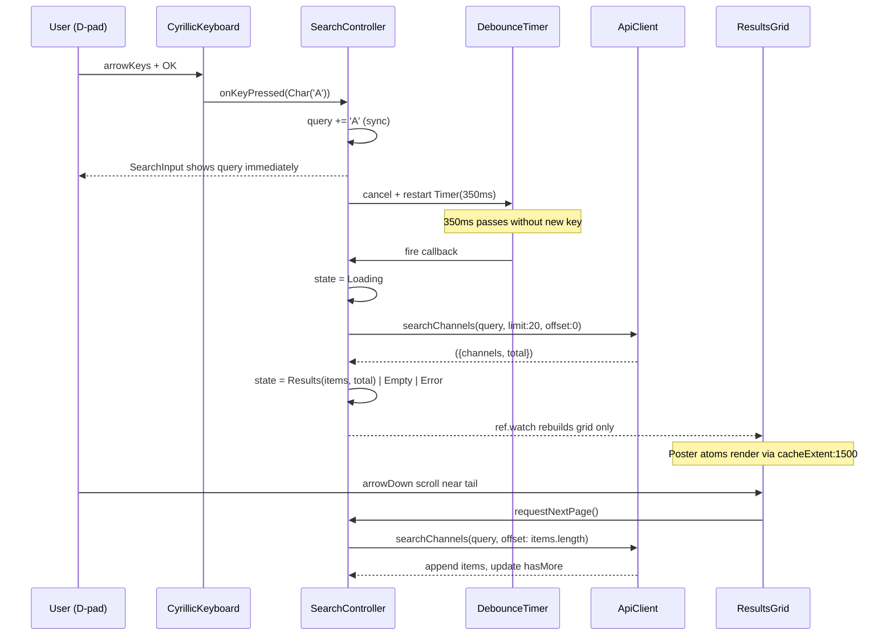

# Design Document — search-screen

## Overview

`search-screen` создаёт net-new TV-grade поиск под `lib/features/search/` плюс минимально расширяет `lib/core/api/api_client.dart` одним методом `searchChannels`. Архитектура — sealed-state-driven Riverpod-controller + pure-presentation widgets, использующие foundation/atoms через barrel. Производительность compliant с `flutter-tv-perf.md`: blinking caret в `RepaintBoundary`, debounce 350 ms, focus через `Transform.scale`, никаких `BackdropFilter`/`ShaderMask`/`blurRadius > 12`.

### Goals

- Net-new `/search` route с 6×6 кириллической D-pad-клавиатурой.
- Search-input с blinking caret через `AnimationController` + `RepaintBoundary`.
- Sealed `SearchUiState` + Riverpod `StateNotifier` с debounce 350 ms и `_inFlight` guard.
- Lazy-load пагинация (initial 20, +20 при scroll).
- Расширение `ApiClient` ровно одним методом `searchChannels` без касания других.
- Search-affordance в home-screen header.
- Все 65 закрытых тестов остаются зелёными.

### Non-Goals

- Voice search (out of project scope per roadmap).
- Search by genre / category / fuzzy ranking.
- Backend index changes; новые HTTP-endpoint'ы.
- Search-suggestions (prefix API).
- Mobile adaptation (#12 owner).
- Изменение `pickColumns 3/4/5` (закрыт `home-grid-optimization`).
- Изменение `PlayerUiState` (`player-overlay-state-machine`).
- Новые atoms — только потребление существующих.

## Boundary Commitments

### This Spec Owns

- `lib/features/search/search_screen.dart` (NEW).
- `lib/features/search/widgets/cyrillic_keyboard.dart` (NEW).
- `lib/features/search/widgets/search_input.dart` (NEW).
- `lib/features/search/widgets/search_results_grid.dart` (NEW).
- `lib/features/search/widgets/search_state.dart` (NEW — sealed type + provider).
- `lib/features/search/state/search_controller.dart` (NEW — Riverpod StateNotifier).
- `lib/features/search/widgets/keyboard_layouts.dart` (NEW — pure-data RU/EN matrices).
- `lib/features/search/widgets/keyboard_key.dart` (NEW — sealed `KeyboardKey` + `KeyboardLocale` enum).
- `test/features/search/` directory (NEW — widget + unit tests).
- One-line additions to `lib/app.dart` (route entry).
- One-line additions in home-screen header (search-affordance icon button).
- Single new public method `searchChannels` in `lib/core/api/api_client.dart`.

### Out of Boundary

- `lib/core/playlist/`, `lib/core/epg/`, `lib/core/player/` — read-only.
- `lib/core/theme/`, `lib/core/perf/`, `lib/core/ui/atoms/` — read-only foundation deps.
- `lib/features/home/widgets/_card_poster.dart`, `_grid_tokens.dart` — closed specs, NOT modified.
- `lib/features/player/`, `lib/features/settings/` — not touched.
- `pubspec.yaml` — NO new packages.
- All other methods of `ApiClient` — sigratures and bodies preserved verbatim.

### Allowed Dependencies

- Upstream: `lib/core/theme/*` (AppPalette, AppRadius, AppColors, MegaVTextStyles).
- Upstream: `lib/core/perf/perf_safe_widgets.dart` (SafePill, SafeFocusRing, SafeBackdrop).
- Upstream: `lib/core/ui/atoms/atoms.dart` (Poster, Chip, MvButton, MvIconButton, SectionTitle, RemoteHint, MvKey).
- Upstream: `lib/core/api/api_client.dart` (consume + extend).
- Upstream: `lib/core/playlist/models/channel.dart` (read-only data model).
- Riverpod (`flutter_riverpod`) — already in `pubspec.yaml`.
- `go_router` — already in `pubspec.yaml`.

### Revalidation Triggers

- Any token added/removed in `AppPalette` consumed by search → revalidate.
- Any `Channel` model field rename → revalidate `searchChannels` parser.
- Any new atom variant (e.g. `Chip.recentQuery`) → consider switching `RecentQueriesList` to use it.
- Backend `/api/channels?search=` contract change → revalidate `searchChannels` parser; update unit test.

## Architecture

### Existing Architecture Analysis

The codebase has clear precedents for this design:
- `lib/features/player/` — sealed `PlayerUiState` driven by `_transition()` mutation (closed `player-overlay-state-machine`).
- `lib/features/home/` — Riverpod-driven screen with adaptive grid via `pickColumns`.
- `lib/core/api/api_client.dart` — already supports search via `getChannels(search: ...)` parameter; `searchChannels` is a thin specialization.

This spec adopts the same conventions: sealed UI state, Riverpod for async, atoms for presentation, perf-safe primitives where applicable.

### Architecture Pattern & Boundary Map

```mermaid
graph LR
  Foundation[design-system-foundation #4 ЗАКРЫТ]
  PerfSafe[perf-safe-widgets #13 ЗАКРЫТ]
  Atoms[design-system-atoms #14 ЗАКРЫТ]
  Api[lib/core/api/api_client.dart]
  Search[search-screen #10]

  Foundation -->|AppPalette/AppRadius/MegaVTextStyles| Search
  PerfSafe -->|SafeFocusRing/SafePill| Search
  Atoms -->|Poster/Chip/MvButton/SectionTitle/RemoteHint/MvKey| Search
  Search -->|adds: searchChannels()| Api
  Search -.read.-> Channel[playlist/models/channel.dart]

  Home[home-cinematic-redesign #5] -.search-affordance icon.-> Search
```

**Pattern**: Riverpod-driven feature module with sealed UI state and pure-presentation child widgets.
**Domain boundary**: `lib/features/search/` is the new leaf. `api_client.dart` gains exactly one method without touching others.

### Search query flow



### Technology Stack

| Layer | Choice | Role | Notes |
|---|---|---|---|
| State | Riverpod `StateNotifier<SearchUiState>` | Single mutation point with `_transition` | Mirrors player-overlay pattern. |
| Routing | `go_router` `GoRoute` | New `/search` entry | Existing routes untouched. |
| HTTP | `package:http` via existing `ApiClient` | Search query | One new method only. |
| Animation | `AnimationController` (1 Hz) | Caret blink | Wrapped in `RepaintBoundary`. |
| Focus model | `FocusNode` per cell + manual `(focusRow,focusCol)` | D-pad nav | No `Shortcuts`/`Actions` wiring beyond what `Focus.onKeyEvent` provides. |
| Scaling | `Transform.scale(1.05)` on focused cell | GPU-only focus visual | No relayout. |
| Atoms | `Poster`, `Chip`, `MvButton`, `MvIconButton`, `SectionTitle`, `RemoteHint`, `MvKey` | Presentation | Via barrel. |
| Theming | `AppPalette` + `MegaVTextStyles` | Colour & typography | Read-only. |

## File Structure Plan

### New files

```
megav_iptv/
├─ lib/
│  └─ features/
│     └─ search/
│        ├─ search_screen.dart                  [NEW] /search root, ConsumerWidget, 2-col layout
│        ├─ state/
│        │  └─ search_controller.dart           [NEW] StateNotifier + debounce + paging + _inFlight guard
│        └─ widgets/
│           ├─ cyrillic_keyboard.dart           [NEW] 6×6 grid + utility row + D-pad nav
│           ├─ keyboard_layouts.dart            [NEW] pure const matrices RU/EN
│           ├─ keyboard_key.dart                [NEW] sealed KeyboardKey + KeyboardLocale enum
│           ├─ search_input.dart                [NEW] query + blinking caret (RepaintBoundary)
│           ├─ search_results_grid.dart         [NEW] state-driven grid renderer
│           └─ search_state.dart                [NEW] sealed SearchUiState + provider exports
└─ test/
   └─ features/
      └─ search/
         ├─ cyrillic_keyboard_test.dart         [NEW] D-pad nav + OK callbacks
         ├─ search_input_test.dart              [NEW] caret blink + RepaintBoundary present
         ├─ search_controller_test.dart         [NEW] debounce + _inFlight + paging + reset
         ├─ search_results_grid_test.dart       [NEW] all 5 SearchUiState variants render
         └─ api_client_search_test.dart         [NEW] searchChannels parsing + getChannels parity
```

Total: 9 new lib files + 5 new test files.

### Modified files

```
megav_iptv/
└─ lib/
   ├─ app.dart                              [MODIFIED] +1 GoRoute('/search') entry
   ├─ core/
   │  └─ api/
   │     └─ api_client.dart                 [MODIFIED] +1 method searchChannels(...)
   └─ features/
      └─ home/
         └─ widgets/
            └─ <existing-header>.dart       [MODIFIED] +1 search-affordance icon button → push('/search')
```

Total: 3 modified files (single-line / single-method additions only; no other edits).

NOT modified: every other file under `lib/`, `pubspec.yaml`, theming files, atoms, perf-safe-widgets, closed-spec ownership areas.

## Components and Interfaces

### 1. `SearchScreen` (`lib/features/search/search_screen.dart`)

```dart
class SearchScreen extends ConsumerWidget {
  const SearchScreen({super.key});

  @override
  Widget build(BuildContext context, WidgetRef ref) {
    final state = ref.watch(searchControllerProvider);
    final query = ref.watch(searchControllerProvider.select((s) => s.query));
    return Scaffold(
      backgroundColor: Theme.of(context).colorScheme.surface,
      body: SafeArea(
        child: Row(
          crossAxisAlignment: CrossAxisAlignment.stretch,
          children: [
            // Left pane: 360 logical px
            SizedBox(
              width: 360,
              child: _LeftPane(),  // SearchInput + CyrillicKeyboard + RecentQueries
            ),
            // Right pane: results
            const Expanded(child: SearchResultsGrid()),
          ],
        ),
      ),
    );
  }
}
```

- `ConsumerWidget` (NOT `ConsumerStatefulWidget`) — no local state, all state in controller (Req 10.5).
- Two-pane layout: left 360 px (keyboard + input + recent queries), right `Expanded` (results).
- Maps to Req 1.1, 1.2, 10.5.

### 2. `SearchController` (`lib/features/search/state/search_controller.dart`)

```dart
class SearchController extends StateNotifier<SearchUiState> {
  SearchController(this._api) : super(const SearchUiState.idle());

  final ApiClient _api;
  Timer? _debounce;
  bool _inFlight = false;
  String _query = '';
  int _offset = 0;
  int _total = 0;
  List<Channel> _items = const [];

  String get query => _query;

  void onKeyPressed(KeyboardKey key) {
    switch (key) {
      case Char(:final glyph):     _query += glyph;
      case Space():                 _query += ' ';
      case Backspace() when _query.isNotEmpty:
                                   _query = _query.substring(0, _query.length - 1);
      case Backspace():            return;
      case LocaleToggle():         return; // handled by widget
    }
    _scheduleSearch();
  }

  void _scheduleSearch() {
    _debounce?.cancel();
    if (_query.isEmpty) {
      _transition(const SearchUiState.idle());
      return;
    }
    _debounce = Timer(const Duration(milliseconds: 350), _runSearch);
  }

  Future<void> _runSearch() async {
    if (_inFlight) return;
    _inFlight = true;
    _transition(SearchUiState.loading(_query));
    try {
      final res = await _api.searchChannels(query: _query, limit: 20, offset: 0);
      _items = res.channels;
      _total = res.total;
      _offset = res.channels.length;
      if (res.channels.isEmpty) {
        _transition(SearchUiState.empty(_query));
      } else {
        _transition(SearchUiState.results(items: _items, total: _total, query: _query, hasMore: _offset < _total));
      }
    } catch (e) {
      _transition(SearchUiState.error(message: e.toString(), lastQuery: _query));
    } finally {
      _inFlight = false;
    }
  }

  Future<void> requestNextPage() async {
    if (_inFlight) return;
    if (_offset >= _total) return;
    _inFlight = true;
    try {
      final res = await _api.searchChannels(query: _query, limit: 20, offset: _offset);
      _items = [..._items, ...res.channels];
      _offset = _items.length;
      _transition(SearchUiState.results(items: _items, total: _total, query: _query, hasMore: _offset < _total));
    } catch (_) {
      // keep current items; surface transient indicator via state extension if needed
    } finally {
      _inFlight = false;
    }
  }

  void _transition(SearchUiState next) {
    if (!mounted) return;
    state = next;
  }

  @override
  void dispose() {
    _debounce?.cancel();
    super.dispose();
  }
}

final searchControllerProvider =
    StateNotifierProvider.autoDispose<SearchController, SearchUiState>(
  (ref) => SearchController(ref.watch(apiClientProvider)),
);
```

- Single mutation point `_transition`.
- Debounce via `Timer(350ms)`.
- Re-entry guard `_inFlight`.
- Pagination via `requestNextPage`.
- Maps to Req 5.1–5.6, 7.1–7.5, 10.1–10.5.

### 3. `CyrillicKeyboard` (`lib/features/search/widgets/cyrillic_keyboard.dart`)

```dart
class CyrillicKeyboard extends StatefulWidget {
  const CyrillicKeyboard({
    super.key,
    required this.onKeyPressed,
    required this.onExitRight,
    this.locale = KeyboardLocale.ru,
    @visibleForTesting this.initialFocus = (0, 0),
  });

  final void Function(KeyboardKey) onKeyPressed;
  final VoidCallback onExitRight; // parent transfers focus to results
  final KeyboardLocale locale;
  final (int, int) initialFocus;

  @override
  State<CyrillicKeyboard> createState() => _CyrillicKeyboardState();
}
```

- 6×6 grid built from `keyboardLayout(locale)` matrix.
- Each cell wrapped in `Focus(onKeyEvent: ...)` consuming `LogicalKeyboardKey.arrow*` + `LogicalKeyboardKey.select`.
- Focused cell visual: `Transform.scale(1.05)` + `SafeFocusRing` (per Req 3.10, 9.4).
- `arrowRight` on `focusCol == 5` calls `widget.onExitRight()` instead of clamping (Req 3.7).
- `arrowLeft` on `focusCol == 0` is a no-op (Req 3.5).
- Utility row: row 5 columns 3..5 are `Space`/`Backspace`/`LocaleToggle`.
- Maps to Req 2.1–2.6, 3.1–3.10, 9.4.

### 4. `KeyboardKey` sealed type (`lib/features/search/widgets/keyboard_key.dart`)

```dart
enum KeyboardLocale { ru, en }

sealed class KeyboardKey {
  const KeyboardKey();
}
final class Char extends KeyboardKey {
  const Char(this.glyph);
  final String glyph;
}
final class Space extends KeyboardKey { const Space(); }
final class Backspace extends KeyboardKey { const Backspace(); }
final class LocaleToggle extends KeyboardKey { const LocaleToggle(); }
```

- Sealed → exhaustive switch in controller (Req 5.1, 10.4).

### 5. `keyboardLayouts.dart`

```dart
const List<List<String>> kKeyboardRu = [
  ['А','Б','В','Г','Д','Е'],
  ['Ё','Ж','З','И','Й','К'],
  ['Л','М','Н','О','П','Р'],
  ['С','Т','У','Ф','Х','Ц'],
  ['Ч','Ш','Щ','Ъ','Ы','Ь'],
  ['Э','Ю','Я','SP','BS','LT'], // SP/BS/LT — utility sentinels
];
const List<List<String>> kKeyboardEn = [/* A..Z + utility */];
List<List<String>> keyboardLayout(KeyboardLocale loc) =>
    loc == KeyboardLocale.ru ? kKeyboardRu : kKeyboardEn;
```

Pure-const data. Maps to Req 2.1, 2.2.

### 6. `SearchInput` (`lib/features/search/widgets/search_input.dart`)

```dart
class SearchInput extends StatefulWidget {
  const SearchInput({super.key, required this.query, this.placeholder = 'Найти что-то стоящее'});
  final String query;
  final String placeholder;
  @override State<SearchInput> createState() => _SearchInputState();
}

class _SearchInputState extends State<SearchInput> with SingleTickerProviderStateMixin {
  late final AnimationController _caret;
  @override void initState() {
    super.initState();
    _caret = AnimationController(vsync: this, duration: const Duration(milliseconds: 1000))..repeat(reverse: true);
  }
  @override void dispose() { _caret.dispose(); super.dispose(); }
  @override Widget build(BuildContext context) {
    final hasQuery = widget.query.isNotEmpty;
    return Row(children: [
      Expanded(
        child: Text(hasQuery ? widget.query : widget.placeholder,
          style: Theme.of(context).megavText.displayLarge.copyWith(
            color: hasQuery ? AppColors.text : AppColors.textDim,
          ),
        ),
      ),
      RepaintBoundary(  // ← Req 4.3, 9.3
        child: FadeTransition(
          opacity: Tween(begin: 1.0, end: 0.2).animate(_caret),
          child: Container(width: 3, height: 36, color: AppColors.accent),
        ),
      ),
    ]);
  }
}
```

- `RepaintBoundary` around the FadeTransition ensures parent does not rebuild on each tick.
- Maps to Req 4.1–4.5, 9.3.

### 7. `SearchResultsGrid` (`lib/features/search/widgets/search_results_grid.dart`)

```dart
class SearchResultsGrid extends ConsumerWidget {
  const SearchResultsGrid({super.key});

  @override
  Widget build(BuildContext context, WidgetRef ref) {
    final state = ref.watch(searchControllerProvider);
    return switch (state) {
      Idle()     => const _IdleHint(),
      Loading()  => const _LoadingOverlay(),
      Empty(:final query) => _EmptyMessage(query: query),
      Error(:final message) => _ErrorRetry(message: message),
      Results(:final items, :final hasMore) => _ResultsGridView(items: items, hasMore: hasMore),
    };
  }
}

class _ResultsGridView extends ConsumerWidget {
  const _ResultsGridView({required this.items, required this.hasMore});
  final List<Channel> items;
  final bool hasMore;

  @override
  Widget build(BuildContext context, WidgetRef ref) {
    final w = MediaQuery.of(context).size.width;
    final cols = pickColumnsClamped(w);
    return GridView.builder(
      cacheExtent: 1500,
      addAutomaticKeepAlives: true,
      addRepaintBoundaries: true,
      gridDelegate: SliverGridDelegateWithFixedCrossAxisCount(crossAxisCount: cols, ...),
      itemCount: items.length,
      itemBuilder: (ctx, i) {
        if (hasMore && i == items.length - 1) {
          ref.read(searchControllerProvider.notifier).requestNextPage();
        }
        return Poster(image: NetworkImage(...), title: items[i].name);
      },
    );
  }
}

int pickColumnsClamped(double w) {
  final base = pickColumns(w); // existing helper from home-grid-optimization
  return base.clamp(2, 4);     // right pane is narrower than full screen
}
```

- Exhaustive `switch` on sealed `SearchUiState` (Req 10.4).
- `Poster` atom from barrel (Req 11.1).
- Pagination triggered when last item builds (Req 7.2).
- Performance attributes per Req 6.8, 9.5.

### 8. `SearchUiState` (`lib/features/search/widgets/search_state.dart`)

```dart
sealed class SearchUiState {
  const SearchUiState();
  String get query;

  const factory SearchUiState.idle() = Idle;
  const factory SearchUiState.loading(String query) = Loading;
  const factory SearchUiState.empty(String query) = Empty;
  const factory SearchUiState.error({required String message, required String lastQuery}) = Error;
  const factory SearchUiState.results({
    required List<Channel> items,
    required int total,
    required String query,
    required bool hasMore,
  }) = Results;
}

final class Idle extends SearchUiState { const Idle(); @override String get query => ''; }
final class Loading extends SearchUiState { const Loading(this.query); @override final String query; }
final class Empty extends SearchUiState { const Empty(this.query); @override final String query; }
final class Error extends SearchUiState {
  const Error({required this.message, required this.lastQuery});
  final String message; final String lastQuery;
  @override String get query => lastQuery;
}
final class Results extends SearchUiState {
  const Results({required this.items, required this.total, required this.query, required this.hasMore});
  final List<Channel> items; final int total; @override final String query; final bool hasMore;
}
```

- Sealed → compile-time exhaustive switch (Req 10.1, 10.4).

### 9. `ApiClient.searchChannels` (`lib/core/api/api_client.dart`)

```dart
// ADDED — single new method appended to existing class.
// Existing methods (getCategories, getChannels, getFeaturedChannels, getNowPlaying, ...,
// _enrichThumbnail, dispose) UNCHANGED — backward-compat per Req 8.3, 8.4.
Future<({List<Channel> channels, int total})> searchChannels({
  required String query,
  int limit = 20,
  int offset = 0,
}) async {
  final params = <String, String>{
    'search': query,
    'limit': limit.toString(),
    'offset': offset.toString(),
  };
  final uri = Uri.parse('$baseUrl/api/channels').replace(queryParameters: params);
  final response = await _client.get(uri);
  if (response.statusCode == 200) {
    final data = jsonDecode(response.body) as Map<String, dynamic>;
    final List<dynamic> channelsJson = data['channels'] ?? [];
    final total = data['total'] as int? ?? 0;
    return (channels: channelsJson.map((j) => Channel.fromJson(j)).toList(), total: total);
  }
  throw Exception('Failed to search channels');
}
```

- Reuses existing `/api/channels?search=...` contract (no new endpoint).
- Mirrors `getChannels` parsing pattern.
- Does NOT touch any other method or field.
- Maps to Req 8.1–8.6.

### 10. Router & home-screen one-line additions

**`lib/app.dart`** — append exactly one `GoRoute` to existing list:
```dart
GoRoute(path: '/search', builder: (_, __) => const SearchScreen()),
```
Maps to Req 1.1, 1.2.

**Home-screen header** — add `MvIconButton` (mag-glass icon) inside existing header `Row`:
```dart
MvIconButton(icon: Icons.search, onPressed: () => context.push('/search'))
```
Maps to Req 1.3, 1.4.

## Data Models

This spec defines no new data models. It consumes:
- `lib/core/playlist/models/channel.dart` — `Channel` for results.

## Error Handling

| Source | Behaviour |
|---|---|
| `searchChannels` non-200 | Throws `Exception('Failed to search channels')`. Controller catches → `SearchUiState.error(message, lastQuery)`. UI shows `MvButton.ghost` «Повторить» that re-runs `_runSearch`. |
| `searchChannels` network exception (no response) | Same path — caught by `try/catch` in `_runSearch`. |
| Pagination failure | Items already rendered remain; transient error indicator (footer chip) in `Results.hasMore`-tail. State NOT replaced with `Error` (Req 7.5). |
| Backspace on empty query | No-op (Req 5 `Backspace()` guard). |
| `arrowLeft` on `focusCol==0` | No-op — event not consumed by keyboard widget; parent decides (currently no-op since left-of-keyboard is screen edge). |
| `arrowRight` on `focusCol==5` | Calls `widget.onExitRight()`; parent transfers focus to results pane (Req 3.7). |
| `query.length < 1` | Controller transitions to `Idle` and cancels pending Timer (Req 5.4). |

## Testing Strategy

- **Unit** (`search_controller_test.dart`):
  - Two synchronous `onKeyPressed(Char('А'))` + `Char('Б'))` within 100 ms → assert exactly 1 `searchChannels` call after 350 ms (debounce).
  - `onKeyPressed(Backspace())` on empty `_query` → no API call, state stays `Idle`.
  - Successful response → state transitions to `Results(items, total)`.
  - Empty response → state transitions to `Empty(query)`.
  - Exception → state transitions to `Error(message, lastQuery)`.
  - `requestNextPage` on `hasMore=true` appends items; on `hasMore=false` is no-op.
  - `_inFlight` guard: while one call awaiting, second `requestNextPage` returns immediately.

- **Unit** (`api_client_search_test.dart`):
  - Mock `http.Client` returning `{"channels":[...], "total": 42}` → assert parsed shape.
  - Mock returning 500 → assert throws `Exception('Failed to search channels')`.
  - **Regression**: call `getChannels(search: 'q')` against same mock → assert it still works unchanged (Req 8.7).

- **Widget** (`cyrillic_keyboard_test.dart`):
  - Pump with `initialFocus: (0,0)`, send `arrowDown` → verify focus moves to `(1,0)`.
  - Pump with `initialFocus: (5,0)`, send `arrowDown` → verify focus stays `(5,0)` (clamp).
  - Pump with `initialFocus: (0,5)`, send `arrowRight` → verify `onExitRight` callback invoked.
  - Pump with `initialFocus: (0,0)`, send `select` (OK) → verify `onKeyPressed(Char('А'))` invoked.
  - Pump with `initialFocus: (5,3)`, send `select` → verify `onKeyPressed(Space())` invoked.

- **Widget** (`search_input_test.dart`):
  - Pump with `query: ''` → assert placeholder rendered.
  - Pump with `query: 'тест'` → assert query rendered, caret `RepaintBoundary` present in widget tree.

- **Widget** (`search_results_grid_test.dart`):
  - Stub controller in each of 5 states → assert correct child renders for each.
  - Verify `GridView.builder` has `cacheExtent: 1500`, `addAutomaticKeepAlives: true`, `addRepaintBoundaries: true`.

- **Regression**: `flutter test` runs all 65 pre-existing tests + new tests — all green (Req 12.8).
- **Static**: `grep -rn "BackdropFilter\|ShaderMask" lib/features/search/` → 0 hits; `grep -rEn "blurRadius:\s*([2-9][0-9]+|1[3-9])" lib/features/search/` → 0 hits (Req 9.1, 9.2).
- **Analyzer**: `flutter analyze` clean on all new + modified files (Req 12.7).

## Performance Budget Confirmation

- `BackdropFilter` / `ShaderMask` / `ImageFilter.blur` — 0 in `lib/features/search/` (Req 9.1).
- `BoxShadow.blurRadius > 12` — 0 (Req 9.2). Focus visuals via `SafeFocusRing` (BoxShadow spread, blur ≤ 12).
- Caret animation isolated in `RepaintBoundary` (Req 9.3).
- Focus visuals via `Transform.scale` (Req 9.4).
- Grid uses `cacheExtent: 1500`, `addAutomaticKeepAlives: true`, `addRepaintBoundaries: true` (Req 9.5).
- Debounce 350 ms in `[250, 400]` band (Req 9.6).
- `SearchScreen` `build` driven by `ref.watch(searchControllerProvider.select(...))` so per-keypress sync `query` updates only rebuild `SearchInput`, not the whole screen (Req 9.7, 10.5).

## Traceability Matrix

| Requirement | Component(s) |
|---|---|
| Req 1 (route + affordance) | `app.dart` GoRoute, home-header `MvIconButton`, `SearchScreen` |
| Req 2 (6×6 cyrillic layout) | `cyrillic_keyboard.dart`, `keyboard_layouts.dart`, `keyboard_key.dart` |
| Req 3 (D-pad nav) | `cyrillic_keyboard.dart` `Focus.onKeyEvent` handlers |
| Req 4 (search input + caret) | `search_input.dart` |
| Req 5 (debounced controller) | `search_controller.dart` `_scheduleSearch` + `Timer(350ms)` |
| Req 6 (results states) | `search_results_grid.dart` exhaustive switch + `Poster` atom |
| Req 7 (pagination) | `search_controller.dart` `requestNextPage`, results-grid tail-trigger |
| Req 8 (API extension) | `api_client.dart` new `searchChannels` method |
| Req 9 (perf compliance) | All files; enforced by grep tasks 4.x |
| Req 10 (sealed UI state) | `search_state.dart` sealed type, `_transition` mutation point |
| Req 11 (atom reuse) | `Poster`/`Chip`/`MvButton`/`MvIconButton`/`SectionTitle`/`RemoteHint`/`MvKey` via barrel |
| Req 12 (testability) | 5 test files + `@visibleForTesting` `initialFocus`, injectable `ApiClient` |
