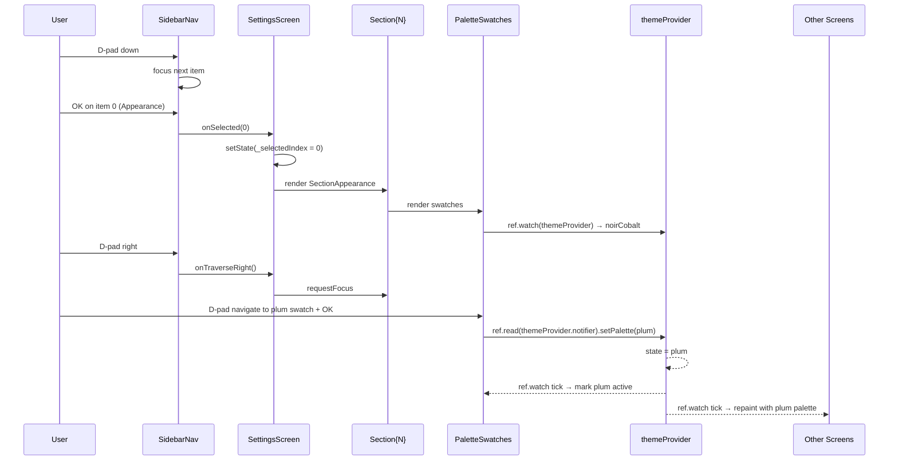
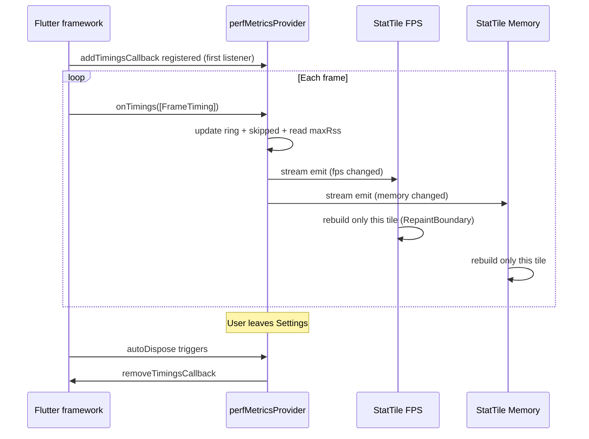

# Design Document — settings-redesign

## Overview

**Purpose**: Переписать `lib/features/settings/settings_screen.dart` (текущий 150-строчный плоский `ListView` с 2 опциями) в полноразмерный sidebar-driven shell с **6 секциями**, согласно дизайн-handoff (`settings-v2.jsx`). Главная функциональная цель — **видимый UI палитро-переключателя**, который вызывает `ref.read(themeProvider.notifier).setPalette(name)` из foundation #4: пользователь выбирает swatch → весь app перекрашивается в новую палитру через единый `themeProvider`.

Дополнительные задачи: открыть доступ к `decoderConfigProvider` (decoder mode/buffer/ABR/passthrough) через кастомные toggles/pickers; добавить **live performance metrics** (FPS / память / skipped frames / buffer) на правую панель Performance-секции через новый `perfMetricsProvider` (Riverpod auto-dispose); формализовать D-pad навигацию sidebar↔body через `FocusTraversalGroup`.

**Users**:
- Конечный пользователь TV-бокса (rtd2851a) — переключает палитру/decoder/buffer пультом, видит live FPS.
- Operator/тестер — диагностирует перформанс live-метриками без VM Service.
- Поддерживатели — дополняют font-pairs, decoder modes, palettes — вся UI extension-ready.

**Impact**: Меняется только `lib/features/settings/`. Закрытые foundation-специй (#4, #13, #14) НЕ трогаются. `lib/core/perf/perf_metrics_provider.dart` добавляется как новый файл (boundary `lib/core/perf/` уже существует, perf_safe_widgets.dart живёт там же — единый perf-namespace). Никаких новых пакетов в `pubspec.yaml`.

### Goals

- Sidebar shell: `Row` с 300dp слева + flexible scroll body справа.
- 6 секций в фиксированном порядке: Appearance / Player / Network / Performance / About / Reset.
- Палитро-переключатель — 6 swatches, активный помечен `SafeFocusRing`, выбор вызывает `themeProvider.notifier.setPalette`.
- Font-pair picker — extension-ready заглушка для одного `font-cinema`.
- Live perf-метрики — `perfMetricsProvider` (auto-dispose), 4-tile `PerfHero`, `RepaintBoundary` per-tile.
- Кастомные `MvToggle` (44×24 pill, accent glow) и `MvPicker` (option pills).
- D-pad: `FocusTraversalGroup` sidebar, `LogicalKeyboardKey.arrowRight` → передача фокуса в body.
- Backward-compat: route `/settings` неизменен, public widget `SettingsScreen` неизменен.
- Все правила `flutter-tv-perf.md` соблюдены (no `BackdropFilter`, no `ShaderMask`, `blurRadius ≤ 12`, Leanback timings).
- Тесты: ≥ 8 новых (6 sections × widget + perf provider unit + golden swatches).

### Non-Goals

- Account/subscription backend — заглушка «Не выполнен вход».
- Модификация `themeProvider` — read-only consumer.
- Реальная persistence для `decoderConfigProvider` — отдельный спек.
- Расширение количества font-pairs — UI ready, foundation владеет данными.
- Routing/router изменения — `/settings` уже есть.
- Mobile-adaptive — issue #12.
- Native player engines (`lib/core/player/` за пределами `decoder_config.dart`).
- VM Service / Devtools интеграция — `perfMetricsProvider` использует только public Flutter SDK API.

## Boundary Commitments

### This Spec Owns

NEW (`lib/features/settings/`):
- `settings_screen.dart` (REWRITE) — sidebar shell, владеет `selectedSectionIndex` state + body switcher.
- `widgets/sidebar_nav.dart` — 6-item vertical nav, `FocusTraversalGroup`, D-pad right → body focus.
- `widgets/section_appearance.dart` — owns palette swatch grid + font-pair picker.
- `widgets/section_player.dart` — decoder/buffer pickers + ABR/passthrough toggles.
- `widgets/section_network.dart` — base URL editor + cache reset.
- `widgets/section_performance.dart` — `PerfHero` + 3 toggles.
- `widgets/section_about.dart` — version/device info + legal stubs.
- `widgets/section_reset.dart` — confirm dialog + reset action.
- `widgets/palette_swatches.dart` — 6 swatch widgets, calls `themeProvider.notifier.setPalette`.
- `widgets/font_pair_picker.dart` — disabled-state picker (single option).
- `widgets/perf_hero.dart` — 4-tile grid wrapper.
- `widgets/stat_tile.dart` — pure presentation tile.
- `widgets/mv_toggle.dart` — кастомный 44×24 pill toggle.
- `widgets/mv_picker.dart` — generic option pills row.

NEW (`lib/core/perf/`):
- `perf_metrics_provider.dart` — `StreamProvider`/`AsyncNotifier.autoDispose` с FPS/skipped/memory/buffer.

NEW (`test/features/settings/`):
- `settings_screen_test.dart` — sidebar nav + section switch.
- `section_appearance_test.dart` — swatch activation calls `setPalette`.
- `section_player_test.dart` — decoder/buffer picker writes `decoderConfigProvider`.
- `mv_toggle_test.dart` — animation 200ms, focus ring, accent glow.
- `palette_swatches_golden_test.dart` — golden grid render.
- `test/core/perf/perf_metrics_provider_test.dart` — auto-dispose contract.

### Out of Boundary

- `lib/core/theme/*` — closed by #4. Read-only.
- `lib/core/ui/atoms/*` — closed by #14. Read-only via barrel.
- `lib/core/perf/perf_safe_widgets.dart` — closed by #13. Read-only.
- `lib/core/player/decoder_config.dart` — read enums + write provider only; нет рефакторинга.
- `lib/core/api/*`, `lib/core/playlist/*`, `lib/core/epg/*` — read-only.
- Closed-spec файлы `home-grid-*`, `player-overlay-*` — не трогаются.
- Routing — `/settings` route уже зарегистрирован, не модифицируем.

### Allowed Dependencies

- Flutter SDK `material`, `widgets`, `services`, `scheduler` (для `WidgetsBinding`).
- `flutter_riverpod`.
- `flutter_screenutil`.
- `dart:io` (для `Platform`, `ProcessInfo.maxRss`).
- `dart:async` (Timer для debounce).
- `google_fonts` через `MegaVTextStyles` (transitively).
- Никаких новых пакетов.

### Revalidation Triggers

- Изменение `AppPaletteName` enum (добавление 7-й палитры) — затрагивает swatch grid (но не ломает: code итерирует `AppPaletteName.values`).
- Изменение `DecoderMode` / `BufferMode` enums — picker автоматически отразит, но labels могут потребовать локализации.
- Добавление новых font-pairs в `MegaVTextStyles` — `FontPairPicker` должен enumerated их без модификации.
- Изменение API `themeProvider.notifier.setPalette` — единственный consumer, тут же сломает.
- Удаление `kSafeShadowBlurMax` из `perf_safe_widgets.dart` — затрагивает `MvToggle.boxShadow`.

## Architecture

### Existing Architecture Analysis

Текущее `lib/features/settings/settings_screen.dart`:
- 150 строк, плоский `ListView` с двумя опциями (Backend Server URL, Player Engine toggle).
- Использует `ConsumerStatefulWidget` + `flutter_screenutil` + `AppBar` со `Settings` заголовком.
- Hardcoded `AppColors.X` references (через закрытый proxy, после foundation #4 это уже работает через `themeProvider`).
- Нет sidebar, нет focus tree, нет perf metrics, нет custom toggles.

Существующие потребители (consumers `themeProvider`):
- `app_theme.dart` (foundation #4) — единственный текущий consumer, вызывает `ref.watch(themeProvider).palette` для построения `ThemeData`.
- После settings-redesign добавится `palette_swatches.dart` как **второй** consumer (read) + первый writer.

`decoderConfigProvider` (`lib/core/providers/providers.dart` или аналогичный) — существующий `StateNotifier<DecoderConfig>`, читается в текущем settings_screen и в `lib/core/player/*`.

`baseUrlProvider`, `categoriesProvider` — существующие providers.

Атомарные потребители (после settings-redesign):
- `MvButton`, `MvIconButton`, `Chip`, `SectionTitle`, `RemoteHint` — все через barrel.

### Architecture Pattern & Boundary Map

```mermaid
graph TB
    subgraph "lib/features/settings/ (THIS SPEC)"
        Screen[settings_screen.dart\nSidebar shell]
        Nav[sidebar_nav.dart\nFocusTraversalGroup]
        Sec1[section_appearance.dart]
        Sec2[section_player.dart]
        Sec3[section_network.dart]
        Sec4[section_performance.dart]
        Sec5[section_about.dart]
        Sec6[section_reset.dart]
        Sw[palette_swatches.dart]
        Fp[font_pair_picker.dart]
        PH[perf_hero.dart]
        ST[stat_tile.dart]
        Tog[mv_toggle.dart]
        Pic[mv_picker.dart]

        Screen --> Nav
        Screen --> Sec1
        Screen --> Sec2
        Screen --> Sec3
        Screen --> Sec4
        Screen --> Sec5
        Screen --> Sec6
        Sec1 --> Sw
        Sec1 --> Fp
        Sec2 --> Pic
        Sec2 --> Tog
        Sec4 --> PH
        Sec4 --> Tog
        PH --> ST
    end

    subgraph "lib/core/perf/ (NEW provider here)"
        PM[perf_metrics_provider.dart\nStreamProvider.autoDispose]
        PSW[perf_safe_widgets.dart\n#13 closed]
    end

    subgraph "lib/core/theme/ (#4 CLOSED)"
        TP[themeProvider\nNotifier&lt;AppPaletteName&gt;]
        TN[ThemeNotifier.setPalette]
        Pal[AppPalette / AppPalettes]
        Rad[AppRadius]
        TS[MegaVTextStyles]
    end

    subgraph "lib/core/ui/atoms/ (#14 CLOSED)"
        MvBtn[MvButton]
        MvIcn[MvIconButton]
        ChAtom[Chip]
        SecTtl[SectionTitle]
        Rh[RemoteHint]
    end

    subgraph "lib/core/player/ (READ-ONLY)"
        DC[decoderConfigProvider\nStateNotifier&lt;DecoderConfig&gt;]
        DM[DecoderMode enum]
        BM[BufferMode enum]
    end

    subgraph "lib/core/providers/ (READ-ONLY)"
        BU[baseUrlProvider]
        CAT[categoriesProvider]
    end

    Sw -- ref.read.notifier.setPalette --> TN
    Sw -. ref.watch .-> TP
    Tog -- uses kSafeShadowBlurMax --> PSW
    Tog -- uses palette.accent --> Pal
    Tog -- focus visual --> PSW
    Pic -- composes --> MvBtn
    Sec2 -- ref.watch / ref.read --> DC
    Sec2 -- enum values --> DM
    Sec2 -- enum values --> BM
    Sec3 -- ref.read.state= / invalidate --> BU
    Sec3 -- invalidate --> CAT
    Sec4 -- ref.watch --> PM
    PH --> ST
    ST -- ref.watch (autoDispose) --> PM

    classDef closed stroke:#888,stroke-dasharray: 4 4
    class TP,TN,Pal,Rad,TS,MvBtn,MvIcn,ChAtom,SecTtl,Rh,PSW closed
```

**Architecture Integration**:
- Selected pattern: **section-per-file** sidebar shell + Riverpod **read-only consumers** (за исключением `setPalette`/`decoderConfigProvider.state=`/`baseUrlProvider.state=`).
- Domain boundaries: каждая section-файл владеет ровно одной UI-областью; никакая section не импортирует другую напрямую (если нужен shared widget — он в `widgets/`).
- Existing patterns preserved: `ConsumerWidget` / `ConsumerStatefulWidget` стиль; `flutter_screenutil` `.w/.h/.sp/.r`; barrel imports.
- New components rationale:
  - `MvToggle`/`MvPicker` — формализуют дизайн-handoff toggles/pickers, используют atoms (`MvButton`) композиционно вместо дублирования.
  - `perfMetricsProvider` — изолирует timings-callback subscription в auto-dispose Riverpod провайдер, гарантирует что live-FPS не подписан когда Settings закрыт.
  - `PaletteSwatches` — **единственный** writer `themeProvider`; остальные screens только читают.

### File Structure Plan

```
lib/
├── core/
│   └── perf/
│       ├── perf_safe_widgets.dart        # closed (#13)
│       └── perf_metrics_provider.dart    # NEW (this spec)
└── features/
    └── settings/
        ├── settings_screen.dart           # REWRITE (this spec)
        └── widgets/                        # NEW dir (this spec)
            ├── sidebar_nav.dart
            ├── section_appearance.dart
            ├── section_player.dart
            ├── section_network.dart
            ├── section_performance.dart
            ├── section_about.dart
            ├── section_reset.dart
            ├── palette_swatches.dart
            ├── font_pair_picker.dart
            ├── perf_hero.dart
            ├── stat_tile.dart
            ├── mv_toggle.dart
            └── mv_picker.dart

test/
├── core/
│   └── perf/
│       └── perf_metrics_provider_test.dart   # NEW
└── features/
    └── settings/
        ├── settings_screen_test.dart          # NEW
        ├── section_appearance_test.dart       # NEW
        ├── section_player_test.dart           # NEW
        ├── mv_toggle_test.dart                # NEW
        └── palette_swatches_golden_test.dart  # NEW
```

## Components

### Component 1: `SettingsScreen` (REWRITE)

**Responsibility**: Sidebar shell, владеет selected-section state, маршрутизирует body content по индексу.

**Public API**:
```dart
class SettingsScreen extends ConsumerStatefulWidget {
  const SettingsScreen({super.key});
  @override
  ConsumerState<SettingsScreen> createState() => _SettingsScreenState();
}
```

**Internal state**:
- `int _selectedIndex = 0;` (0=Appearance, 1=Player, 2=Network, 3=Performance, 4=About, 5=Reset).
- `final FocusNode _bodyFocusNode = FocusNode();` — для D-pad right передачи фокуса.

**Build skeleton**:
```dart
Scaffold(
  body: Stack(children: [
    DecoratedBox(decoration: BoxDecoration(color: palette.background)),
    const SafeFilmGrain(),
    Row(children: [
      SidebarNav(
        selectedIndex: _selectedIndex,
        onSelected: (i) => setState(() => _selectedIndex = i),
        onTraverseRight: () => _bodyFocusNode.requestFocus(),
      ),
      Expanded(
        child: Focus(
          focusNode: _bodyFocusNode,
          child: AnimatedSwitcher(
            duration: 250.ms,  // Leanback rows anim
            child: _bodyForIndex(_selectedIndex),
          ),
        ),
      ),
    ]),
  ]),
)
```

**Why this design**: `AnimatedSwitcher` на body даёт mild fade при section switch (Leanback 250ms — Req 12.4); `Stack` с `SafeFilmGrain` поверх `DecoratedBox` — единственный safe способ применить grain без `BackdropFilter`.

### Component 2: `SidebarNav`

**Responsibility**: Вертикальный список 6 section-имён с D-pad focus.

**Public API**:
```dart
class SidebarNav extends StatelessWidget {
  const SidebarNav({
    super.key,
    required this.selectedIndex,
    required this.onSelected,
    required this.onTraverseRight,
  });
  final int selectedIndex;
  final ValueChanged<int> onSelected;
  final VoidCallback onTraverseRight;
}
```

**Implementation strategy**:
- Width: `300.w`, padding `EdgeInsets.symmetric(vertical: 32.h, horizontal: 16.w)`.
- Header: `Brand(size: 28, showWordmark: true)` + `SectionTitle('Настройки')`.
- Items: `Column(children: List.generate(6, (i) => _SidebarItem(...)))` обёрнут в `FocusTraversalGroup` (Req 2.6).
- `_SidebarItem`: `Focus` wrapper c `FocusNode`, при `hasFocus=true` рисует `SafeFocusRing`; при `i == selectedIndex` рисует accent left-bar (`Container(width: 3.w, color: palette.accent)`).
- `Shortcuts` + `Actions` mapping: `LogicalKeyboardKey.arrowRight` → `onTraverseRight()`.

**Why**: `SafeFocusRing` (foundation #13) гарантирует zero-blur focus visual; left-bar — pure `DecoratedBox` (zero saveLayer); `FocusTraversalGroup` keeps D-pad up/down inside until explicit right.

### Component 3: `SectionAppearance` + `PaletteSwatches` + `FontPairPicker`

**Responsibility**: UI для смены палитры (writer `themeProvider`) и font-pair (extension-ready заглушка).

**`PaletteSwatches`**:
```dart
class PaletteSwatches extends ConsumerWidget {
  const PaletteSwatches({super.key});

  @override
  Widget build(BuildContext context, WidgetRef ref) {
    final active = ref.watch(themeProvider);
    return GridView.count(
      shrinkWrap: true,
      physics: const NeverScrollableScrollPhysics(),
      crossAxisCount: 3,
      mainAxisSpacing: 16.h,
      crossAxisSpacing: 16.w,
      childAspectRatio: 1.4,
      children: AppPaletteName.values
          .map((name) => RepaintBoundary(
                child: _Swatch(
                  name: name,
                  isActive: name == active,
                  onTap: () => ref
                      .read(themeProvider.notifier)
                      .setPalette(name),
                ),
              ))
          .toList(growable: false),
    );
  }
}
```

`_Swatch`: `Focus` + `InkWell`/`GestureDetector` → отрисовывает 3-bar palette preview (background / accent / accentGlow) + label (palette name). При `isActive: true` обрамляется `SafeFocusRing(color: palette.accent)`.

**Why**: `RepaintBoundary` per swatch (Req 3.2) — изолирует репаинт когда меняется только active visual; `setPalette` вызывается **только** в `onTap` (Req 3.4, 3.5 — никогда в build).

**`FontPairPicker`**:
```dart
class FontPairPicker extends ConsumerWidget {
  const FontPairPicker({super.key});

  @override
  Widget build(BuildContext context, WidgetRef ref) {
    // MegaVTextStyles экспортирует список доступных font-pairs;
    // currently — single 'font-cinema'.
    const pairs = ['font-cinema'];
    return MvPicker<String>(
      options: pairs,
      value: pairs.first,
      labelOf: (s) => s == 'font-cinema' ? 'Cinematic' : s,
      onChanged: (_) {},   // disabled — single option (Req 4.3)
      enabled: pairs.length > 1,
      disabledHint: 'Доступна только Cinematic',
    );
  }
}
```

### Component 4: `SectionPlayer`

**Responsibility**: Decoder mode picker + Buffer mode picker + ABR/Passthrough toggles, all wired to `decoderConfigProvider`.

**Build sketch**:
```dart
final config = ref.watch(decoderConfigProvider);
return Column(children: [
  SectionTitle('Режим декодера'),
  MvPicker<DecoderMode>(
    options: DecoderMode.values,
    value: config.decoderMode,
    labelOf: (m) => m.label,
    onChanged: (m) => ref.read(decoderConfigProvider.notifier).state =
        config.copyWith(decoderMode: m),
  ),
  SectionTitle('Размер буфера'),
  MvPicker<BufferMode>(
    options: BufferMode.values,
    value: config.bufferMode,
    labelOf: (b) => '${b.label} · ${b.seconds}s',
    onChanged: (b) => ref.read(decoderConfigProvider.notifier).state =
        config.copyWith(bufferMode: b),
  ),
  // ABR + audioPassthrough: см. Req 5.5/5.6 — поля добавляются в copyWith.
  MvToggle(
    label: 'Adaptive Bitrate',
    value: config.abrEnabled ?? true,
    onChanged: (v) => ref.read(decoderConfigProvider.notifier).state =
        config.copyWith(abrEnabled: v),
  ),
  MvToggle(
    label: 'Audio Passthrough',
    value: config.audioPassthrough ?? false,
    onChanged: (v) => ref.read(decoderConfigProvider.notifier).state =
        config.copyWith(audioPassthrough: v),
  ),
]);
```

**Why**: read-once `config` снимок + точечные `copyWith` writes — никаких race-conditions.

### Component 5: `SectionPerformance` + `PerfHero` + `StatTile` + `perfMetricsProvider`

**Responsibility**: Live FPS / skipped / memory / buffer + 3 toggles.

**`perfMetricsProvider`** (`lib/core/perf/perf_metrics_provider.dart`):
```dart
class PerfMetrics {
  final double fps;            // rolling 60-frame avg
  final int skippedFrames;
  final int? memoryBytes;      // null if unavailable
  final double? bufferSeconds; // null if no DI source
  const PerfMetrics({...});
}

final perfMetricsProvider =
    StreamProvider.autoDispose<PerfMetrics>((ref) {
  final controller = StreamController<PerfMetrics>();
  final ring = ListQueue<Duration>(60);
  int skipped = 0;

  void onTimings(List<FrameTiming> timings) {
    for (final t in timings) {
      final total = t.totalSpan;
      ring.add(total);
      if (ring.length > 60) ring.removeFirst();
      if (total.inMicroseconds > 16700) skipped++;
    }
    final avg = ring.isEmpty ? 0.0 :
        ring.fold<int>(0, (s, d) => s + d.inMicroseconds) / ring.length;
    final fps = avg == 0 ? 0.0 : 1e6 / avg;
    final mem = _readMaxRss();   // dart:io Platform-guarded
    controller.add(PerfMetrics(
      fps: fps,
      skippedFrames: skipped,
      memoryBytes: mem,
      bufferSeconds: null,  // wire via override when player exposes source
    ));
  }

  WidgetsBinding.instance.addTimingsCallback(onTimings);
  ref.onDispose(() {
    WidgetsBinding.instance.removeTimingsCallback(onTimings);
    controller.close();
  });

  return controller.stream;
});

int? _readMaxRss() {
  try {
    return ProcessInfo.maxRss;
  } catch (_) {
    return null;
  }
}
```

**`PerfHero`** — `GridView.count(crossAxisCount: 2)` с 4 `StatTile`. Каждая tile — `const`-construct `_StatTileFps`, `_StatTileSkipped`, `_StatTileMemory`, `_StatTileBuffer`, обёрнутые в `RepaintBoundary` (Req 7.7 / 12.5). Каждая tile — `ConsumerWidget`, читает только нужное поле `perfMetricsProvider`:

```dart
class _StatTileFps extends ConsumerWidget {
  const _StatTileFps();
  @override
  Widget build(BuildContext context, WidgetRef ref) {
    final fps = ref.watch(
      perfMetricsProvider.select((async) => async.valueOrNull?.fps),
    );
    return RepaintBoundary(
      child: StatTile(
        label: 'GPU FPS',
        value: fps == null ? '—' : fps.toStringAsFixed(0),
        sub: '60 — цель',
        trend: _trendFor(fps),
      ),
    );
  }
}
```

**Why**: `Selector`-style `select((x) => x.field)` гарантирует rebuild **только** этой tile — не всей секции, и не parent-screen.

**Toggles in PerformanceSection**:
- Impeller engine — read/write `impellerEnabledProvider` (если ещё не существует — создаётся локально как `StateProvider<bool>`).
- Parallax effects — `parallaxEnabledProvider` локально.
- ABR — re-export Player section toggle; визуально дублируется, но writer single-source `decoderConfigProvider`.

### Component 6: `MvToggle`

**Responsibility**: Кастомный 44×24 pill toggle.

```dart
class MvToggle extends StatefulWidget {
  const MvToggle({
    super.key,
    required this.value,
    required this.onChanged,
    this.label,
    this.subText,
  });
  final bool value;
  final ValueChanged<bool> onChanged;
  final String? label;
  final String? subText;
  // ...
}
```

**Visual implementation**:
```dart
Focus(
  focusNode: _node,
  child: GestureDetector(
    onTap: () => widget.onChanged(!widget.value),
    child: SafeFocusRing(
      isFocused: _node.hasFocus,
      child: Container(
        width: 44, height: 24,
        decoration: BoxDecoration(
          color: widget.value ? palette.accent : palette.surface2,
          borderRadius: BorderRadius.circular(12),
          boxShadow: widget.value ? [
            BoxShadow(
              color: palette.accentGlow,
              blurRadius: kSafeShadowBlurMax,  // 12 — at the budget cap
              spreadRadius: 0,
            ),
          ] : null,
        ),
        child: AnimatedAlign(
          alignment: widget.value ? Alignment.centerRight : Alignment.centerLeft,
          duration: const Duration(milliseconds: 200),
          curve: Curves.easeInOut,
          child: Container(
            width: 18, height: 18,
            margin: const EdgeInsets.all(3),
            decoration: const BoxDecoration(
              color: Colors.white, shape: BoxShape.circle,
            ),
          ),
        ),
      ),
    ),
  ),
)
```

**Why this design**:
- `AnimatedAlign` (not `AnimatedContainer.width`) — GPU-only, no relayout (TV-perf rule).
- `boxShadow.blurRadius = kSafeShadowBlurMax` — at the documented cap, не превышает.
- `SafeFocusRing` reuse foundation #13.

### Component 7: `MvPicker<T>`

**Responsibility**: Generic option pills row.

```dart
class MvPicker<T> extends StatelessWidget {
  const MvPicker({
    super.key,
    required this.options,
    required this.value,
    required this.onChanged,
    required this.labelOf,
    this.enabled = true,
    this.disabledHint,
  });
  final List<T> options;
  final T value;
  final ValueChanged<T> onChanged;
  final String Function(T) labelOf;
  final bool enabled;
  final String? disabledHint;
}
```

Renders `Wrap(spacing: 8, children: [for opt → MvButton.ghost / .accent based on opt == value])`. Each button: `onPressed: enabled ? () => onChanged(opt) : null`.

**Why**: composition over duplication — все chip-визуалы реализованы через `MvButton` atom.

## Data Flow





## State Management

- `SettingsScreen._selectedIndex` — `int`, owned by `_SettingsScreenState`. Не утекает наружу (нет route argument).
- `themeProvider` (closed #4) — Riverpod `Notifier<AppPaletteName>`. Read+write.
- `decoderConfigProvider` — existing `StateProvider<DecoderConfig>`. Read+write.
- `baseUrlProvider` — existing `StateProvider<String>`. Read+write.
- `categoriesProvider` — existing `FutureProvider`. Read + invalidate.
- `perfMetricsProvider` — NEW `StreamProvider.autoDispose<PerfMetrics>`. Read-only consumer. Lifecycle: подписка живёт **только** пока есть mounted listener в Performance section; при выходе из Settings (или переключении на не-Performance секцию) — auto-dispose, callback снимается.
- `impellerEnabledProvider`, `parallaxEnabledProvider` — local `StateProvider<bool>` в `lib/features/settings/widgets/section_performance.dart` (или ближайшем shared file). Currently UI-only флаги; реальное переключение Impeller — отдельный спек.

**No global state added beyond `perfMetricsProvider`**.

## Performance Considerations

| Risk | Mitigation |
|------|------------|
| Live FPS stream rebuilds whole screen | `RepaintBoundary` per `StatTile` + `select((x) => x.field)` (Req 7.7, 12.5). |
| Sidebar focus animation lags | Use `Transform.scale` / `SafeFocusRing` only (Req 12.6). No `AnimatedContainer.width`. |
| Section switch jank | `AnimatedSwitcher(duration: 250ms)` Leanback timing (Req 12.4); body rebuild scoped to one section subtree. |
| Toggle thumb relayout | `AnimatedAlign` (GPU-only) — no width animation (Req 10.3, 12.6). |
| Palette switch flashes other screens | `themeProvider` already triggers rebuild via `ref.watch`; closed #4 spec doctored the `MaterialApp.theme` to use palette tokens — no extra glue needed. |
| `perfMetricsProvider` leaks subscription | `ref.onDispose(() { removeTimingsCallback(...) })` + `.autoDispose` (Req 7.8). Tested in `perf_metrics_provider_test.dart`. |
| Backdrop grain doubles draw cost | Single `SafeFilmGrain` over `DecoratedBox(palette.background)` — no `BackdropFilter` (Req 1.4, 12.1). |
| Reset confirm dialog blur | Use opaque `surface2` background for `AlertDialog`, no `BackdropFilter` (Req 12.1). |

## Testing Strategy

| Test | Type | What it asserts |
|------|------|-----------------|
| `settings_screen_test.dart` | widget | Sidebar renders 6 items; tapping item 2 switches body to `SectionNetwork`; D-pad right transfers focus to body. |
| `section_appearance_test.dart` | widget | Tapping a swatch calls `themeProvider.notifier.setPalette(name)` exactly once (verified via fake `ThemeNotifier`); active swatch reflects `ref.watch(themeProvider)`. |
| `section_player_test.dart` | widget | Picker write to `decoderConfigProvider` via `copyWith`; ABR toggle flips `abrEnabled` field. |
| `mv_toggle_test.dart` | widget | Thumb animates from left to right over 200ms; on-state `decoration.color == palette.accent`; focus ring renders when focused. |
| `palette_swatches_golden_test.dart` | golden | 6-swatch grid renders deterministically on `noirCobalt`. |
| `perf_metrics_provider_test.dart` | unit | `addTimingsCallback` registered on first listen; removed when last listener disposed; auto-dispose contract holds. |

All tests run via `flutter test`. Existing 65+ tests must remain green (Req 13.4).

## Migration & Rollback

- **Migration**: единственный entry-point — route `/settings`. Заменяем `SettingsScreen` body, никакой data migration не требуется (state живёт в Riverpod providers, не в SharedPreferences для большинства полей).
- **Rollback**: `git revert <commit>`. Закрытые foundation специй не затронуты, `themeProvider` имеет default fallback `noirCobalt` (foundation Req 1.5), `decoderConfigProvider` имеет `const DecoderConfig()` default. Безопасно.
- **Feature flag**: не требуется — экран уже существует, переписка локализована.

## Open Questions

1. **`abrEnabled` / `audioPassthrough` поля в `DecoderConfig`**: текущий `decoder_config.dart` их не имеет. Нужно ли расширить `DecoderConfig` в этом спеке? **Решение**: да, добавить как nullable Boolean fields (`bool? abrEnabled`, `bool? audioPassthrough`) с `copyWith` — это in-class change, не модификация другого файла; player engine layer пока их игнорирует (UI-only до соответствующего player-spec). Альтернатива — local `StateProvider<bool>` per toggle, но это разделит источники правды для одной фичи.
2. **`perfMetricsProvider.bufferSeconds`** — где брать? **Решение**: `provider.overrideWith` в `ProviderScope` root, когда player engine добавит `BufferProvider`. Сейчас — `null` → tile рисует «—».
3. **Font-pairs enumeration source**: `MegaVTextStyles` имеет ли публичный `static List<String> get availablePairs`? Если нет — добавить hard-coded `['font-cinema']` локально с TODO-комментом для следующего font-pair-spec.

## References

- Issue #11: https://github.com/Romaxa55/MegaV-IPTV/issues/11
- Brief: `.kiro/specs/settings-redesign/brief.md`
- Design handoff: `.kiro/design/megav-iptv-handoff/project/screens/settings-v2.jsx`
- Foundation #4 (closed): `.kiro/specs/design-system-foundation/`
- Perf #13 (closed): `.kiro/specs/perf-safe-widgets/`
- Atoms #14 (closed): `.kiro/specs/design-system-atoms/`
- Steering: `.kiro/steering/flutter-tv-perf.md`, `.kiro/steering/roadmap.md`
