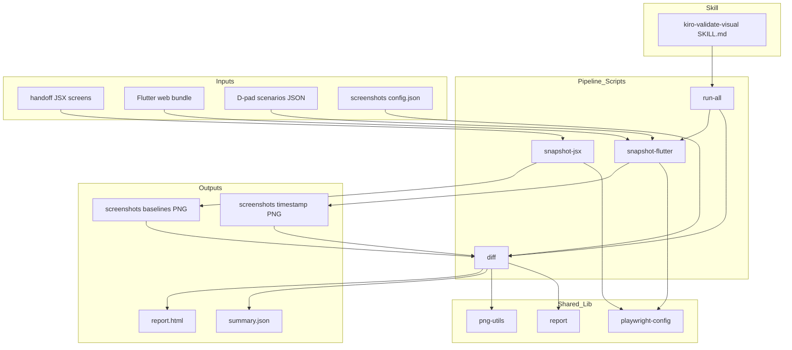
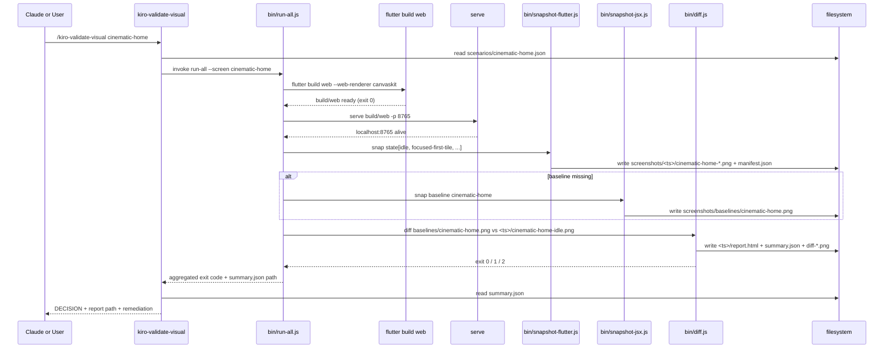

# Design Document — visual-feedback-pipeline

## Overview

**Purpose**: Спека вводит автоматизированный визуальный feedback-loop между Flutter web-сборкой MegaV IPTV и эталонными JSX-прототипами из `.kiro/design/megav-iptv-handoff/project/screens/`. Pipeline снимает скриншоты, сравнивает их попиксельно через pixelmatch, генерирует HTML-отчёт side-by-side и предоставляет новый skill `kiro-validate-visual` с вердиктом `GO` / `NO-GO` / `MANUAL_VERIFY_REQUIRED`.

**Users**: Claude в режиме `kiro-impl` (автоматический визуальный gate для UI-спеков), разработчик MegaV (ручной запуск через `/kiro-validate-visual <feature>`), reviewer-агенты в downstream-спеках (`home-grid-stability-pass`, `hero-collapse-tile-morph`).

**Impact**: Pipeline создаётся как изолированная инфраструктура. НЕ модифицирует UI-код, НЕ модифицирует существующие skills (`kiro-impl`, `kiro-validate-impl`). Добавляет новые директории `.kiro/scripts/visual-feedback/`, `.kiro/screenshots/`, `.claude/skills/kiro-validate-visual/`, `.kiro/steering/visual-feedback.md`, и одно автогенерируемое расширение `megav_iptv/web/` через `flutter create --platforms=web`.

### Goals

- Автоматизировать снятие 9 JSX baseline-эталонов через headless Chromium (Playwright).
- Автоматизировать снятие 5 ключевых D-pad состояний Flutter web-приложения для произвольного экрана.
- Предоставить настраиваемый pixel-diff с порогами PASS < 2%, FAIL > 5%, WARNING между.
- Предоставить HTML-отчёт `report.html` side-by-side и машиночитаемый `summary.json`.
- Предоставить новый skill `kiro-validate-visual`, возвращающий структурированный GO/NO-GO/MANUAL.
- Обеспечить детерминизм запусков (fixed viewport, CanvasKit, отключение анимаций).
- Документировать оговорку «web ≠ TV» в `.kiro/steering/visual-feedback.md`.

### Non-Goals

- Замена ручного TV-теста на Realtek `rtd2851a`. Pipeline проверяет только визуальное соответствие JSX-дизайну в web-окружении.
- Модификация существующих UI-компонентов или kiro-skills.
- GitHub Actions / CI hook — отложено в отдельный follow-up.
- Native iOS/Android snapshot.
- Video recording или анимационные diff.
- A/B сравнение разных палитр.
- Воспроизведение реальной TV-производительности (frame timing, GPU rasterizer cost).

## Boundary Commitments

### This Spec Owns

- Каталог `.kiro/scripts/visual-feedback/` (точки входа, общие библиотеки, scenarios, package.json, package-lock.json).
- Каталог `.kiro/screenshots/` (baselines, config.json, report-template.html, .gitignore).
- Файл `.kiro/steering/visual-feedback.md` (документация pipeline).
- Каталог `.claude/skills/kiro-validate-visual/` (SKILL.md).
- Автогенерируемое расширение `megav_iptv/web/` (через `flutter create --platforms=web`).
- Контракт `kiro-validate-visual` skill: входы (feature-name), выходы (DECISION + HTML report path + machine-readable summary).

### Out of Boundary

- `megav_iptv/lib/**` — UI-код. Pipeline только читает (через рендеринг web-сборки).
- `megav_iptv/test/**` — Dart-тесты. Pipeline их не модифицирует и не запускает.
- `.claude/skills/kiro-impl/`, `.claude/skills/kiro-validate-impl/`, и все остальные существующие `kiro-*` skills.
- `.kiro/design/megav-iptv-handoff/` — read-only artifact; pipeline только читает JSX-файлы оттуда.
- CI/CD конфигурация (GitHub Actions, .github/workflows/) — отложено.
- Pre-commit hooks, husky-конфиги, lint правила — pipeline их не вводит.
- Замена сценариев D-pad на реальные «пользовательские пути» (cinema-row scroll, deep-link navigation) — out-of-scope; pipeline фиксирует 5 статичных состояний.

### Allowed Dependencies

- **Node.js runtime** (LTS, ≥ 20.x) на dev-машине, где запускается pipeline. Не вводится в production-runtime приложения.
- **NPM-пакеты**: `playwright` (Apache 2.0), `pixelmatch` (MIT), `pngjs` (MIT), `serve` (MIT). Все совместимы между собой и не конфликтуют с проектной MIT-структурой.
- **Flutter SDK** в той же версии, что используется для нативной сборки. Pipeline не пинит version, опирается на `megav_iptv/pubspec.lock`.
- **JSX-прототипы**: только read-доступ к `.kiro/design/megav-iptv-handoff/project/screens/*.jsx` и `styles.css`.
- **Существующие kiro-skills**: pipeline-скрипты вызываются `kiro-validate-visual`, но НЕ зависят от внутренней реализации `kiro-impl`/`kiro-validate-impl`.

### Revalidation Triggers

- Любое изменение публичного контракта `kiro-validate-visual` (поля DECISION, формат summary.json, путь к report.html) → ре-чек downstream-спеков, которые будут парсить вывод.
- Изменение порогов по умолчанию (PASS/FAIL) → коммуникация в `.kiro/steering/visual-feedback.md`.
- Обновление мажорной версии Playwright или pixelmatch → проверка стабильности baseline-снимков.
- Изменение Flutter major version с потенциальным изменением CanvasKit рендеринга → пересъёмка baselines.
- Изменение состава D-pad сценариев или viewport-параметров (1920×1080) → ре-валидация всех baseline'ов.

## Architecture

### Existing Architecture Analysis

MegaV IPTV — Flutter app для Android TV. Web-target отсутствует, JSX-прототипы и kiro-skills уже есть. Pipeline вводится «снаружи» Flutter-приложения:

- **Закрытые специй** (`home-grid-optimization`, `home-grid-visual-polish`, `player-overlay-state-machine`, Wave 1-3) — read-only.
- **Существующие kiro-skills** (`kiro-impl`, `kiro-validate-impl`, `kiro-debug`, и т.д.) — read-only.
- **Design handoff** (`.kiro/design/megav-iptv-handoff/`) — read-only артефакт; источник JSX-эталонов.
- **Dependency direction**: pipeline-скрипты импортируют только локальную `lib/`, читают конфиг и JSON-сценарии. Skill `kiro-validate-visual` дёргает скрипты через Bash, не импортирует их.

### Architecture Pattern & Boundary Map



**Architecture Integration**:
- **Selected pattern**: Layered scripts с общей библиотекой. Каждый bin-скрипт — одна точка входа, общие утилиты в `lib/`.
- **Domain boundaries**: 4 точки входа (`snapshot-jsx`, `snapshot-flutter`, `diff`, `run-all`) непересекаются по ответственности. Skill — отдельный домен, общается со скриптами только через CLI.
- **Existing patterns preserved**: используем существующую структуру `.kiro/steering/` для документации; `.kiro/specs/` для самой спеки; `.claude/skills/` для kiro-skill — всё как у kiro-validate-impl.
- **Steering compliance**: pipeline не нарушает `flutter-tv-perf.md` (не правит UI); явно фиксирует «web ≠ TV» в новой steering-доке.

### Technology Stack

| Layer | Choice / Version | Role in Feature | Notes |
|-------|------------------|-----------------|-------|
| Headless browser | Playwright ≥ 1.46 (Apache 2.0) | Headless Chromium для рендера JSX и Flutter web | Включает встроенный keyboard emulation для D-pad |
| Pixel diff | pixelmatch ≥ 6.0 (MIT) | Попиксельное сравнение PNG, генерация diff-маски | Pure-JS, без native bindings |
| PNG I/O | pngjs ≥ 7 (MIT) | Чтение/запись PNG, потребляется pixelmatch | Transitively required |
| Static server | serve ≥ 14 (MIT) | Локальный HTTP-сервер для `build/web/` | Можно заменить на `python3 -m http.server`, но `serve` стандартизован |
| Frontend (Flutter) | Flutter SDK + CanvasKit renderer | Сборка web-бандла | Версия определяется существующим `pubspec.lock` |
| Skill layer | Markdown SKILL.md | Точка входа `/kiro-validate-visual` | По образцу `kiro-validate-impl/SKILL.md` |
| Runtime | Node.js ≥ 20 LTS | Запуск pipeline-скриптов | Не вводится в Flutter-runtime приложения |

## File Structure Plan

### Directory Structure

```
megav_iptv/
└── web/                                    # АВТОГЕНЕРАЦИЯ via flutter create --platforms=web
    ├── index.html                          # Конфигурируется на CanvasKit
    ├── manifest.json
    ├── favicon.png
    ├── flutter_bootstrap.js
    └── icons/
        ├── Icon-192.png
        ├── Icon-512.png
        ├── Icon-maskable-192.png
        └── Icon-maskable-512.png

.kiro/scripts/visual-feedback/              # NEW: pipeline корень
├── package.json                            # Deps: playwright, pixelmatch, pngjs, serve
├── package-lock.json                       # Lockfile
├── README.md                               # Quickstart для разработчика
├── bin/
│   ├── snapshot-jsx.js                     # CLI: рендерит 9 JSX-экранов → baselines
│   ├── snapshot-flutter.js                 # CLI: запускает D-pad сценарий, снимает 5 состояний
│   ├── diff.js                             # CLI: сравнивает current vs baseline, пишет report+summary
│   └── run-all.js                          # CLI: orchestrator (build web → snap flutter → diff)
├── lib/
│   ├── playwright-config.js                # Общий browser context: viewport, deviceScaleFactor, флаги
│   ├── png-utils.js                        # load/save PNG, размер-валидация
│   ├── report.js                           # Рендер report.html из шаблона + diff PNG embed
│   └── thresholds.js                       # Загрузка config.json с fallback 2%/5%
├── scenarios/
│   ├── cinematic-home.json                 # 5 состояний (idle, focused-first-tile, ...)
│   ├── detail.json                         # Только применимые состояния (без D-pad-rows)
│   ├── player.json
│   ├── epg.json
│   ├── search.json
│   ├── settings.json
│   ├── editorial-home.json
│   └── mobile.json
└── jsx-renderer/
    ├── index.html                          # Минимальный bootstrap для рендера React+JSX
    └── render-screen.js                    # Динамический импорт `screens/<name>.jsx` + ReactDOM render

.kiro/screenshots/                          # NEW
├── .gitignore                              # Игнорирует <timestamp>/
├── config.json                             # Пороги PASS/FAIL (commited)
├── report-template.html                    # Шаблон HTML-отчёта (commited)
└── baselines/                              # commited PNG
    ├── cinematic-home.png
    ├── editorial-home.png
    ├── detail.png
    ├── player.png
    ├── epg.png
    ├── search.png
    ├── settings.png
    └── mobile.png
                                            # <timestamp>/  — НЕ commited, генерируется в runtime
                                            # ├── *.png (current snapshots)
                                            # ├── manifest.json
                                            # ├── summary.json
                                            # └── report.html

.kiro/steering/
└── visual-feedback.md                      # NEW: документация pipeline + оговорка web ≠ TV

.claude/skills/kiro-validate-visual/        # NEW
└── SKILL.md                                # frontmatter + execution steps (по образцу kiro-validate-impl)
```

### Modified Files

- `megav_iptv/pubspec.yaml` — автоматическое добавление web-секции платформ при `flutter create --platforms=web`. Ручные правки UI-логики НЕ вносятся (Req 8.4).
- `megav_iptv/.gitignore` — может потребоваться добавить `build/web/` если ещё не покрыт паттерном `build/`. Проверяется в task 1.2.

> Принцип: каждый файл имеет одну ответственность. `lib/` содержит чистые утилиты, `bin/` — оркестрацию. Сценарии — данные, не код.

## System Flows

### End-to-End validation flow (выполнение `kiro-validate-visual <feature>`)



**Key flow decisions**:
- Skill вызывает `run-all.js` через Bash, не реимплементирует логику. Это сохраняет изоляцию: смена реализации скриптов не требует правки skill.
- Build + serve запускаются один раз на сессию snapshot; повторное обращение к diff не требует пересборки.
- Если baseline для экрана отсутствует, pipeline пытается сгенерировать его автоматически через `snapshot-jsx.js` (warning в логе, но не fail).
- Exit code orchestrator'а агрегирует: `0` если все `PASS`, `1` если хоть один `FAIL`, `2` если `WARNING` без `FAIL` (Req 4.5).

## Requirements Traceability

| Requirement | Summary | Components | Interfaces | Flows |
|-------------|---------|------------|------------|-------|
| 1.1 | `megav_iptv/web/` через `flutter create` | FlutterWebTarget | CLI: `flutter create --platforms=web` | End-to-end flow (build step) |
| 1.2 | CanvasKit renderer | FlutterWebTarget | `flutter build web --web-renderer canvaskit` | End-to-end flow |
| 1.3 | `flutter build web` → `build/web/` | RunAllOrchestrator | Bash: `flutter build web` | End-to-end flow |
| 1.4 | Локальный HTTP сервер | RunAllOrchestrator | `serve build/web -p 8765` | End-to-end flow |
| 1.5 | Non-zero exit при build error | RunAllOrchestrator | Process exit code | End-to-end flow |
| 2.1 | `snapshot:jsx` рендерит 9 экранов | SnapshotJSX | CLI: `node bin/snapshot-jsx.js` | End-to-end flow (баseline path) |
| 2.2 | Baseline → `baselines/<screen>.png` 1920×1080 | SnapshotJSX, PlaywrightConfig | FS write | End-to-end flow |
| 2.3 | Отключение CSS/animation для детерминизма | PlaywrightConfig | Chromium args | End-to-end flow |
| 2.4 | Пропуск отсутствующих JSX | SnapshotJSX | Warning в stdout | End-to-end flow |
| 2.5 | Baselines в git без LFS | FileStructurePlan | git tracking | — |
| 3.1 | Команда `snapshot-flutter --screen X` снимает 5 состояний | SnapshotFlutter | CLI args + scenarios JSON | End-to-end flow |
| 3.2 | D-pad emulation для каждого состояния | SnapshotFlutter, Scenarios | Playwright keyboard API | End-to-end flow |
| 3.3 | Snapshots → `<timestamp>/<screen>-<state>.png` | SnapshotFlutter, PngUtils | FS write | End-to-end flow |
| 3.4 | Отключение анимаций / wait strategy | PlaywrightConfig | Chromium args + waitForTimeout | End-to-end flow |
| 3.5 | Non-zero exit при отсутствии route | SnapshotFlutter | Process exit code | End-to-end flow |
| 3.6 | `manifest.json` со списком успешных пар | SnapshotFlutter | FS write | End-to-end flow |
| 4.1 | Diff через pixelmatch | DiffEngine, PngUtils | pixelmatch API | End-to-end flow |
| 4.2 | Классификация PASS/WARNING/FAIL | DiffEngine, Thresholds | Threshold compare | End-to-end flow |
| 4.3 | Пороги из `config.json` с fallback | Thresholds | FS read + defaults | End-to-end flow |
| 4.4 | HTML отчёт side-by-side | DiffEngine, ReportRenderer | FS write | End-to-end flow |
| 4.5 | Агрегированный exit code | RunAllOrchestrator | Process exit code | End-to-end flow |
| 4.6 | `summary.json` | DiffEngine | FS write | End-to-end flow |
| 5.1 | `kiro-validate-visual/SKILL.md` существует | ValidateVisualSkill | Markdown frontmatter | End-to-end flow |
| 5.2 | Skill оркестрирует build → snap → diff | ValidateVisualSkill | Bash: `node bin/run-all.js` | End-to-end flow |
| 5.3 | Структурированный отчёт DECISION/path/pairs | ValidateVisualSkill | Markdown output | End-to-end flow |
| 5.4 | NO-GO при FAIL + remediation | ValidateVisualSkill | Markdown output | End-to-end flow |
| 5.5 | MANUAL при отсутствии предпосылок | ValidateVisualSkill | Markdown output | End-to-end flow |
| 5.6 | Skill не модифицирует существующие skills | ValidateVisualSkill | FS isolation | — |
| 6.1 | Viewport 1920×1080 deviceScaleFactor 1 | PlaywrightConfig | browser.newContext | End-to-end flow |
| 6.2 | CanvasKit для Flutter web | FlutterWebTarget | --web-renderer canvaskit | End-to-end flow |
| 6.3 | Отключение анимаций + reduced-motion | PlaywrightConfig | Chromium args | End-to-end flow |
| 6.4 | Wait for layout/fonts ready | SnapshotFlutter, SnapshotJSX | waitForLoadState + waitForTimeout | End-to-end flow |
| 6.5 | Non-determinism warning | DiffEngine | summary.json field | End-to-end flow |
| 7.1 | `.kiro/steering/visual-feedback.md` существует | SteeringDoc | Markdown | — |
| 7.2 | Оговорка web ≠ TV | SteeringDoc | Markdown content | — |
| 7.3 | Описание форматов report/summary | SteeringDoc | Markdown content | — |
| 7.4 | Инструкция обновления baseline | SteeringDoc | Markdown content | — |
| 8.1 | Все артефакты в выделенных директориях | FileStructurePlan | FS layout | — |
| 8.2 | Pipeline не трогает `lib/features` etc. | BoundaryEnforcement | FS isolation | — |
| 8.3 | Pipeline не трогает существующие kiro-skills | BoundaryEnforcement | FS isolation | — |
| 8.4 | Pubspec/web правки только автогенерируемые | FlutterWebTarget | flutter create | End-to-end flow |
| 8.5 | `.gitignore` исключает `<timestamp>/` | FileStructurePlan | gitignore content | — |

## Components and Interfaces

| Component | Domain/Layer | Intent | Req Coverage | Key Dependencies | Contracts |
|-----------|--------------|--------|--------------|------------------|-----------|
| FlutterWebTarget | Frontend build | Сделать Flutter web доступным CanvasKit-таргетом | 1.1, 1.2, 1.3, 6.2, 8.4 | Flutter SDK (P0), megav_iptv (P0) | Build artifact |
| SnapshotJSX | Pipeline / Capture | Снимок 9 JSX-эталонов | 2.1, 2.2, 2.3, 2.4 | Playwright (P0), JSX screens (P0) | CLI |
| SnapshotFlutter | Pipeline / Capture | Снимок 5 D-pad состояний Flutter | 3.1, 3.2, 3.3, 3.4, 3.5, 3.6, 6.4 | Playwright (P0), Scenarios JSON (P0), Flutter web bundle (P0) | CLI + JSON manifest |
| DiffEngine | Pipeline / Compare | Pixel-by-pixel diff + классификация | 4.1, 4.2, 4.5, 4.6, 6.5 | pixelmatch (P0), pngjs (P0), Thresholds (P1) | CLI |
| Thresholds | Pipeline / Config | Загрузка config.json с fallback | 4.3 | FS (P2) | Pure function |
| ReportRenderer | Pipeline / Report | Рендер report.html из шаблона | 4.4 | FS (P2), HTML template (P1) | Pure function |
| PlaywrightConfig | Pipeline / Shared | Общий browser context | 6.1, 6.3 | Playwright (P0) | Shared lib |
| PngUtils | Pipeline / Shared | Load/save PNG, размер-валидация | — (supporting) | pngjs (P0) | Shared lib |
| RunAllOrchestrator | Pipeline / Orchestration | End-to-end: build → serve → snap → diff | 1.3, 1.4, 1.5, 4.5 | Все bin/ скрипты (P0), serve (P0) | CLI |
| ValidateVisualSkill | Skill | Markdown skill «glue» для kiro-tooling | 5.1, 5.2, 5.3, 5.4, 5.5, 5.6 | RunAllOrchestrator (P0) | Markdown frontmatter |
| SteeringDoc | Documentation | Документация pipeline | 7.1, 7.2, 7.3, 7.4 | — | Markdown content |
| FileStructurePlan / BoundaryEnforcement | Cross-cutting | Гарантирует изоляцию артефактов | 2.5, 8.1, 8.2, 8.3, 8.5 | — | Реализуется через FS layout, .gitignore |

### Pipeline / Capture

#### SnapshotJSX

| Field | Detail |
|-------|--------|
| Intent | Снять 9 baseline PNG из JSX-прототипов через headless Chromium |
| Requirements | 2.1, 2.2, 2.3, 2.4 |

**Responsibilities & Constraints**
- Запустить headless Chromium через `PlaywrightConfig`.
- Для каждого экрана: открыть `jsx-renderer/index.html?screen=<name>`, дождаться `document.fonts.ready`, снять PNG 1920×1080.
- Сохранить в `.kiro/screenshots/baselines/<screen>.png`.
- Если JSX-файл отсутствует — пропустить с warning в stdout.

**Dependencies**
- Inbound: `RunAllOrchestrator` — purpose: вызов при отсутствующем baseline (P0).
- Outbound: `PlaywrightConfig` — purpose: общий browser context (P0).
- External: Playwright (P0); JSX screens (P0).

**Contracts**: Service [ ] / API [ ] / Event [ ] / Batch [ ] / State [ ] / **CLI [x]**

##### CLI Contract
```
Usage: node bin/snapshot-jsx.js [--screen <name>] [--all]
Output: PNG files in .kiro/screenshots/baselines/<screen>.png
Exit codes:
  0 — все снимки успешны (или ожидаемо пропущены)
  1 — Playwright крашнулся / Chromium не запустился
  2 — JSX-rendering ошибка (синтаксис, missing import)
```

**Implementation Notes**
- Integration: вызывается из `run-all.js` только при отсутствующем baseline или вручную для регенерации.
- Validation: после записи PNG — проверка размера (`pngjs` декодирует и читает width/height); fail если ≠ 1920×1080.
- Risks: JSX-прототип может использовать React imports из CDN, требующих сети — добавляем `--offline=false` явно и кешируем.

#### SnapshotFlutter

| Field | Detail |
|-------|--------|
| Intent | Снять 5 D-pad состояний Flutter web для указанного экрана |
| Requirements | 3.1, 3.2, 3.3, 3.4, 3.5, 3.6, 6.4 |

**Responsibilities & Constraints**
- Прочитать `scenarios/<screen>.json` — массив `{ state: <name>, actions: [{ key, delayMs }] }`.
- Для каждого state: начать с фиксированной точки (route navigation), выполнить actions, снять PNG.
- Сохранить в `<timestamp>/<screen>-<state>.png`.
- Записать `manifest.json` с пар (screen, state, capturedAt).
- Если запрошенный route недоступен (404) — exit 1.

**Dependencies**
- Inbound: `RunAllOrchestrator` (P0).
- Outbound: `PlaywrightConfig` (P0), `PngUtils` (P1).
- External: Flutter web bundle на `localhost:8765` (P0), Scenarios JSON (P0).

**Contracts**: CLI [x]

##### CLI Contract
```
Usage: node bin/snapshot-flutter.js --screen <name> [--out-dir <ts>] [--port 8765]
Output:
  - <out-dir>/<screen>-<state>.png для каждого state из scenarios/<screen>.json
  - <out-dir>/manifest.json
Exit codes:
  0 — все state сняты успешно
  1 — route недоступен / Playwright крашнулся
  2 — JSON scenario invalid
```

##### Scenario JSON schema
```json
{
  "screen": "cinematic-home",
  "route": "/home",
  "states": [
    {
      "name": "idle",
      "actions": [{"wait": 1000}]
    },
    {
      "name": "focused-first-tile",
      "actions": [
        {"key": "ArrowDown", "delayMs": 200},
        {"wait": 500}
      ]
    }
  ]
}
```

**Implementation Notes**
- Integration: после `serve` поднимет порт, перед `diff`.
- Validation: проверка наличия scenarios/<screen>.json до запуска Playwright. Размер PNG.
- Risks: D-pad sequence чувствителен к структуре виджет-дерева; при крупных UI-изменениях сценарий может потерять смысл. Mitigation — обновление через downstream UI-спеки.

### Pipeline / Compare

#### DiffEngine

| Field | Detail |
|-------|--------|
| Intent | Сравнить current PNG с baseline, классифицировать, сгенерировать diff-mask |
| Requirements | 4.1, 4.2, 4.5, 4.6, 6.5 |

**Responsibilities & Constraints**
- Прочитать пары через манифест из `<timestamp>/manifest.json`.
- Для каждой пары: открыть baseline и current, вычислить `pixelmatch(...)` → count изменённых пикселей; дельта = `count / (w*h) * 100`.
- Классифицировать через `Thresholds`.
- Записать diff PNG (`diff-<screen>-<state>.png`) и `summary.json`.
- Передать в `ReportRenderer` для генерации `report.html`.
- Detect non-determinism: если предыдущий run по тому же screen дал 0%, а текущий — >0%, пометить `non_determinism: true` в summary.

**Dependencies**
- Inbound: `RunAllOrchestrator` (P0).
- Outbound: `Thresholds` (P1), `ReportRenderer` (P1), `PngUtils` (P1).
- External: pixelmatch (P0), pngjs (P0).

**Contracts**: CLI [x]

##### CLI Contract
```
Usage: node bin/diff.js --run-dir <ts> [--baseline-dir <path>]
Output:
  - <ts>/diff-<screen>-<state>.png
  - <ts>/summary.json
  - <ts>/report.html
Exit codes:
  0 — все пары PASS
  1 — хотя бы одна FAIL
  2 — есть WARNING без FAIL
```

##### summary.json schema
```json
{
  "feature": "cinematic-home",
  "ranAt": "2026-05-11T01:20:00Z",
  "thresholds": { "pass": 2.0, "fail": 5.0 },
  "pairs": [
    {
      "screen": "cinematic-home",
      "state": "idle",
      "baseline": "baselines/cinematic-home.png",
      "current": "20260511-012000/cinematic-home-idle.png",
      "diff": "20260511-012000/diff-cinematic-home-idle.png",
      "delta_percent": 0.42,
      "verdict": "PASS",
      "non_determinism": false
    }
  ],
  "aggregate_verdict": "PASS"
}
```

**Implementation Notes**
- Integration: финальный шаг pipeline. Skill читает `summary.json` для генерации структурированного ответа.
- Validation: проверка совпадения размеров PNG; если baseline и current разных размеров — fail с ясным сообщением.
- Risks: pixelmatch threshold per-pixel `0.1` может оказаться слишком мягким; параметр не настраивается извне в v1 — задаётся в коде. Follow-up: вынести в config.

### Pipeline / Orchestration

#### RunAllOrchestrator

| Field | Detail |
|-------|--------|
| Intent | End-to-end: build → serve → snapshot-flutter → diff |
| Requirements | 1.3, 1.4, 1.5, 4.5 |

**Responsibilities & Constraints**
- Запустить `flutter build web --web-renderer canvaskit`.
- Поднять `npx serve build/web -p 8765` как child process, дождаться `localhost:8765` reachable.
- Сгенерировать `<timestamp>` директорию.
- Если baseline для запрошенного screen отсутствует — вызвать `snapshot-jsx.js`.
- Вызвать `snapshot-flutter.js --screen <name> --out-dir <ts>`.
- Вызвать `diff.js --run-dir <ts>`.
- Агрегировать exit codes; вернуть макс из (0, 1, 2).
- Завершить serve child process в `finally`-блоке.

**Dependencies**
- Inbound: `ValidateVisualSkill` (P0).
- Outbound: `SnapshotJSX`, `SnapshotFlutter`, `DiffEngine` (все P0); `serve` (P0).

**Contracts**: CLI [x]

##### CLI Contract
```
Usage: node bin/run-all.js --screen <name> [--skip-build] [--baseline-only]
Output: aggregated stdout summary; <ts>/ directory with current snapshots and report
Exit codes:
  0 / 1 / 2 (агрегированный)
```

**Implementation Notes**
- Integration: единственная точка вызова из skill. Skill не дёргает sub-scripts напрямую.
- Validation: проверка наличия Flutter SDK (`flutter --version` exit 0), Node 20+ (`node --version`).
- Risks: child-process cleanup при ошибке. Mitigation — `process.on('exit')` + `try/finally` вокруг serve.

### Pipeline / Shared

#### PlaywrightConfig

| Field | Detail |
|-------|--------|
| Intent | Один источник истины для browser context |
| Requirements | 6.1, 6.3 |

**Responsibilities & Constraints**
- Экспортирует функцию `createBrowserContext()` возвращающую `{ browser, context, page }`.
- Параметры: `viewport: {width:1920,height:1080}`, `deviceScaleFactor: 1`, headless: true.
- Chromium args: `--force-prefers-reduced-motion`, `--disable-renderer-backgrounding`, `--disable-background-timer-throttling`.
- Закрытие через `closeBrowserContext()` в `finally`.

**Contracts**: Shared library [x]

##### Library Interface
```javascript
// lib/playwright-config.js
async function createBrowserContext(): Promise<{ browser, context, page }>
async function closeBrowserContext({ browser, context }): Promise<void>
```

**Implementation Notes**
- Integration: импортируется из `bin/snapshot-jsx.js` и `bin/snapshot-flutter.js`.
- Risks: апгрейд Playwright может сломать сигнатуру; pin major version в `package.json`.

### Skill

#### ValidateVisualSkill

| Field | Detail |
|-------|--------|
| Intent | Markdown «glue» делающий pipeline доступным через `/kiro-validate-visual <feature>` |
| Requirements | 5.1, 5.2, 5.3, 5.4, 5.5, 5.6 |

**Responsibilities & Constraints**
- Frontmatter: `name: kiro-validate-visual`, `description: ...`, `allowed-tools: Read, Bash`, `argument-hint: <feature-name>`.
- Execution steps по образцу `kiro-validate-impl/SKILL.md`:
  1. Detect target — feature name из аргументов.
  2. Gather context — прочитать `.kiro/specs/<feature>/spec.json` для language.
  3. Discover canonical commands — `node .kiro/scripts/visual-feedback/bin/run-all.js`.
  4. Execute pipeline через Bash.
  5. Parse `<ts>/summary.json` → структурированный отчёт.
  6. Возврат `DECISION` + remediation.
- НЕ модифицирует существующие skills.
- НЕ дёргает sub-scripts напрямую — только через `run-all.js`.

**Contracts**: Markdown skill [x]

##### Output Format
```
## Visual Validation Report
- DECISION: GO | NO-GO | MANUAL_VERIFY_REQUIRED
- HTML_REPORT: .kiro/screenshots/<ts>/report.html
- PAIRS:
  - cinematic-home / idle: PASS (0.4%)
  - cinematic-home / focused-first-tile: WARNING (3.2%)
  - ...
- AGGREGATE_VERDICT: PASS | WARNING | FAIL
- REMEDIATION: <if NO-GO>
```

**Implementation Notes**
- Integration: вызывается вручную (`/kiro-validate-visual home-grid-stability-pass`) или из `kiro-impl` reviewer-агента (downstream-спеки могут это сделать).
- Risks: skill зависит от структуры `summary.json`. Если изменится — re-validation trigger.

### Documentation

#### SteeringDoc

| Field | Detail |
|-------|--------|
| Intent | Документировать pipeline для разработчиков и downstream-агентов |
| Requirements | 7.1, 7.2, 7.3, 7.4 |

**Responsibilities & Constraints**
- Файл `.kiro/steering/visual-feedback.md` на русском.
- Содержит секции: Overview, Quickstart, Configuration, Limitations (web ≠ TV), Report format, Baseline regeneration.
- Явная фраза: «Pipeline проверяет визуальное соответствие layout/typography/colors относительно JSX-эталона и НЕ заменяет ручной smoke-тест на референсном Realtek `rtd2851a`».

**Contracts**: Markdown content [x]

## Error Handling

### Error Strategy

Pipeline следует fail-fast подходу на CLI-уровне; каждый bin-скрипт возвращает чёткий exit code. Skill интерпретирует exit codes как DECISION:

- exit 0 → DECISION: GO
- exit 1 (FAIL) → DECISION: NO-GO с remediation
- exit 2 (WARNING без FAIL) → DECISION: GO с пометкой «attention pairs», но не блокирующее
- Любой другой ненулевой / отсутствие summary.json → DECISION: MANUAL_VERIFY_REQUIRED

### Error Categories and Responses

- **Missing prerequisite** (Flutter SDK не установлен, Node < 20, Playwright browsers не скачаны): `MANUAL_VERIFY_REQUIRED` + указание команды установки.
- **Build error** (`flutter build web` exit != 0): `MANUAL_VERIFY_REQUIRED` + stderr output.
- **Snapshot error** (Playwright crash, route 404): `NO-GO` с указанием failed pair и причины.
- **Diff error** (мismatch размеров PNG, поврёждённый PNG): `NO-GO` с указанием pair.
- **Threshold WARNING без FAIL**: `GO` + список WARNING-пар в отчёте.

### Monitoring

- Все ошибки логируются в stdout/stderr; не сохраняются в отдельный файл (избегаем стейтфул-логирования для v1).
- `summary.json` — единственный машиночитаемый артефакт состояния.

## Testing Strategy

Поскольку pipeline — это набор скриптов, а не сервис, тестирование лёгкое и опирается на «golden run» end-to-end.

### Unit / Component-level (manual smoke)

- `lib/thresholds.js`: проверка fallback при отсутствии `config.json`, корректное чтение значений.
- `lib/playwright-config.js`: проверка через `node -e "require('./lib/playwright-config.js').createBrowserContext().then(({page}) => page.goto('about:blank')).then(...)"`.
- `lib/png-utils.js`: проверка размер-валидации на тестовом PNG неверного размера.

### Integration (golden run)

- **GR-1 (single screen happy path)**: `node bin/run-all.js --screen cinematic-home` на чистом checkout. Ожидание:
  - `flutter build web` завершается с exit 0.
  - `<ts>/cinematic-home-idle.png` создан, размер 1920×1080.
  - `<ts>/summary.json` валиден, содержит `aggregate_verdict`.
  - `<ts>/report.html` открывается в браузере без JS-ошибок.

- **GR-2 (determinism)**: Запустить `run-all` дважды подряд на неизменном коде. Ожидание:
  - Все пары `(screen, state)` дают одинаковую `delta_percent` (с допуском 0.05%).
  - Никаких `non_determinism: true` в `summary.json`.

- **GR-3 (FAIL injection)**: Внести намеренное визуальное искажение в JSX (изменить background-color в `styles.css`), запустить с `--baseline-only` для обновления, затем вернуть назад и сравнить. Ожидание:
  - exit code 1.
  - `summary.json.aggregate_verdict: "FAIL"`.
  - Skill возвращает `DECISION: NO-GO` с указанием конкретной пары.

- **GR-4 (missing JSX)**: Временно переименовать `cinematic-home.jsx` → проверить, что `snapshot-jsx.js` пропускает экран с warning.

- **GR-5 (skill end-to-end)**: Из Claude вызвать `/kiro-validate-visual cinematic-home`, проверить, что skill возвращает структурированный markdown с DECISION/HTML_REPORT/PAIRS.

### Boundary tests

- **BT-1 (UI-code isolation)**: После полного запуска pipeline `git status megav_iptv/lib/` показывает чистоту (только автогенерируемые `web/` и `pubspec.yaml`-расширение присутствуют).
- **BT-2 (skills isolation)**: `git status .claude/skills/kiro-impl/ .claude/skills/kiro-validate-impl/` показывает чистоту.

## Performance & Scalability

Не критично для pipeline. Целевые цифры:
- `flutter build web --web-renderer canvaskit` — 30-90 s cold, 5-15 s warm.
- Snapshot одного экрана с 5 состояниями — ≤ 15 s.
- Diff пары 1920×1080 — ≤ 500 ms.
- End-to-end один screen — ≤ 2 min cold.

Если кто-то в будущем будет валидировать все 9 экранов — это ~10-15 min cold; приемлемо для CI follow-up.

## Open Questions / Risks

- **OQ-1**: Стоит ли пинить версию Playwright и pixelmatch жёстко в `package-lock.json` или допускать caret? Решение: жёсткий pin для воспроизводимости baseline между разработчиками. Закладывается в task 2.1.
- **OQ-2**: Нужен ли `npm run baseline:update` отдельной командой? Решение: да, добавляем как `bin/snapshot-jsx.js --all --force` в task 6.3.
- **OQ-3**: `mobile-v2.jsx` и `cinematic-v2.jsx` — какие brать как baseline (v1 или v2)? Решение: использовать самые свежие версии (v2 где есть), задокументировано в `visual-feedback.md`.
